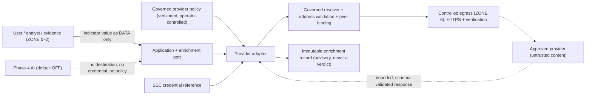

# ADR-0012 — Threat-intelligence adapter architecture and provider selection (outbound network / SSRF control)

| Field | Value |
|---|---|
| Status | **Accepted** — following independent P6-WP5 review (initial review REQUEST_CHANGES on governed-proxy final-hop assurance, MEDIUM-1, since closed; targeted re-review APPROVE). Remote CI + merge pending |
| Date | 2026-10-03 |
| Owner role | Security Architect / Integration Architect |
| Phase | Phase 6 — P6-WP5 external enrichment / threat-intelligence integration contract |
| Related | [INT-001](../docs/06-contracts/INT-001-external-enrichment-integration-contract.md), [GATE-023](../docs/00-program/GATE-023-phase-6-integration-contract.md), `contracts/integrations/external-enrichment-v1.json`, [DATA-001](../docs/06-contracts/DATA-001-data-domain-lifecycle-contract.md) §5.16/§20, [DATA-001-WP2](../docs/06-contracts/DATA-001-WP2-postgresql-persistence-contract.md) (`external_enrichment_result`, RM-09), [API-001](../docs/06-contracts/API-001-api-resource-protocol-contract.md) §22, [OAS-001](../docs/06-contracts/OAS-001-openapi-contract.md), [ADR-0007](ADR-0007-ai-authority-and-model-strategy.md), [ADR-0009](ADR-0009-identity-authentication-authorization.md), [ADR-0010](ADR-0010-evidence-storage-tamper-evidence.md), [ADR-0013](ADR-0013-rule-set-publication-version-distribution.md), [ADR-0016](ADR-0016-deployment-resilience-runtime-topology.md), [ADR-0017](ADR-0017-observability-operational-readiness.md), [ARCH-004](../docs/05-architecture/ARCH-004-security-trust-threat-model.md) §8/E10, FR-070/FR-071, ASM-002, ASM-005, OI-05, G-09, WP4 LOW-3 |
| Reversal cost | **Medium** — the adapter port and destination-policy model are cheap to keep provider-neutral, but relaxing the egress invariants later would require a new security review |

## 1. Context

TrustLens accepts URLs and domains as evidence. FR-070/FR-071 and DATA-001 §5.16 anticipate optional, advisory
external enrichment (reputation, allowlist, brand-domain lookups). ARCH-004 §8 fixed a deny-by-default controlled-egress
zone (ZONE 6) and §8.4 required that a submitted URL never becomes an unrestricted server-side fetch target, deferring
the adapter design to Phase 6 / ADR-0012. The Phase-5 review left **WP4 LOW-3** (DNS rebinding / resolve-time SSRF
TOCTOU) open and assigned to this ADR. DATA-001-WP2 already persists an advisory `external_enrichment_result` row that
is never consumed by a governed artifact (RM-09), and API-001 reserves `GET /evaluations/{id}/enrichments`
(`FUTURE_INT_001`).

The index reserved this identifier for "Threat-intelligence adapter architecture and provider selection". This ADR
keeps that topic. Its central decision is the outbound network trust boundary that any such adapter must satisfy;
provider *selection* is decided to be deferred and provider-neutral.

Binding constraints: Phase-3 is the sole decision authority (`ENGINE_VERSION = 1.0.0`); Phase-4 AI is optional,
default-OFF and non-authoritative (ADR-0007); ASM-005 (no paid threat-intelligence budget) is unconfirmed;
ASM-002 (single deployment) is UNCONFIRMED / PROVISIONAL; canonical CI is offline; no numeric limit is defined by any
accepted authority for timeouts, retries, redirect hops, response sizes, cache lifetimes or rate thresholds.

## 2. Decision

1. **Provider-specific governed adapters, provider-neutral contract.** External enrichment is performed only by
   adapters that implement INT-001 for one governed provider policy each. INT-001 names no vendor and selects no
   provider; selection is a later governed operator decision constrained by ASM-005.
2. **Indicator lookup only.** The only permitted capability is INDICATOR LOOKUP: sending a normalized indicator value
   (URL, hostname or registered domain, as already defined by the url-observation schema) as *data* to an approved
   provider operation. CONTENT RETRIEVAL is not permitted. TrustLens never connects to, resolves, downloads, follows
   redirects of, or executes a user-submitted URL.
3. **No generic network primitive.** There is no `fetch(url)`, `http_request(url)`, `download_url`, `proxy_request`,
   `open_url` or generic webhook fetch, for users, analysts, AI or adapters. Adapter operations are closed and
   predeclared.
4. **Deny-by-default egress; destinations are configuration authority.** A destination exists only in a versioned
   provider policy controlled by governed operator configuration. Destinations never come from end-user requests,
   evidence content, AI output, model tool calls, provider responses, or redirects that have not been revalidated.
5. **Resolve–validate–bind–verify.** Every connection resolves the approved hostname through a governed resolver,
   validates every answer on parsed IP semantics, rejects the lookup if any answer is denied or ambiguous, connects only
   to an address from that same validated decision, keeps SNI and certificate hostname verification on the original
   approved hostname, verifies the connected peer, and repeats this for each new connection and each redirect hop.
   Where a governed egress proxy is used, the same denied-destination policy must be enforced on the final hop with
   governed, verifiable evidence; without that evidence proxy egress is deployment-blocked (§8).
6. **HTTPS only**, with certificate and hostname verification, no bypass, no plaintext fallback, no downgrade.
7. **Provider output is an external assertion, never a TrustLens verdict.** It maps into technical outcomes
   (`FOUND`, `NOT_FOUND`, `UNAVAILABLE`, `POLICY_REJECTED`, `INVALID_RESPONSE`) and the existing url-observation
   assessment vocabulary. It cannot set a `DetectionResult`, classification, severity, risk, confidence or rule, and it
   is not consumed by a governed artifact under current contracts. `NOT_FOUND` and every failure are never safe.
8. **Historical replay never contacts a provider.** Re-analysis may create a new enrichment record under current
   policy; it never overwrites history.

The machine-readable encoding of every decision is `contracts/integrations/external-enrichment-v1.json`, validated
offline by `knowledge/validation/validate_integration_contract.py`.

## 3. Trust boundary

Everything left of the adapter supplies *data*. Only the governed policy supplies *destinations*. The provider is
inside the allowlist but outside the trust boundary for content: allowlisting a provider does not make its responses
trusted.

## 4. Threat model (summary)

INT-001 §29 carries the full analysis. The decisive threats and controls:

| Threat | Control |
|---|---|
| SSRF via submitted URL | Indicator lookup only; submitted URL is lookup data; no generic fetch |
| DNS rebinding / resolve-time TOCTOU (WP4 LOW-3) | Connect only to an address from the validated resolution decision; no uncontrolled second resolution; peer verified |
| Redirect to loopback / metadata / RFC1918 / unapproved host | Default do-not-follow; any followed hop is a new destination decision; allowlist + address revalidation |
| IPv6 / IPv4-mapped / alternate IP encodings | Parsed IP semantics; embedded IPv4 evaluated; IP literals rejected by default |
| Parser confusion (userinfo, suffix, encoded delimiters) | Canonicalization; userinfo rejected; exact host or governed subdomain rule; no substring match |
| Proxy bypass | Environment proxies ignored; governed proxy only with verified equivalent final-hop enforcement, otherwise deployment-blocked |
| Credential leakage | SEC references only; never in URL, contract, logs, audit, telemetry, API or AI |
| Oversized / decompression-bomb / poisoned responses | Finite wire/decoded bounds; bounded decompression; schema validation |
| Provider compromise / outage / rate limiting | Untrusted content; failures are `UNAVAILABLE`, never safe; bounded retry |
| Replay drift / stale cache | No refetch on replay; pinned policy; explicit freshness; stale never shown fresh |
| AI tool misuse | AI cannot select destinations, credentials or policy |

## 5. DNS rebinding / TOCTOU

"Resolve the hostname, check the IP, then let the HTTP client resolve again" is rejected: the second, uncontrolled
resolution can return a different (internal) address after validation. The required invariant, independent of any
Python HTTP library, is:

1. parse and canonicalize the governed provider destination;
2. resolve it through the governed resolver;
3. validate every resolved address on parsed IP semantics;
4. reject denied address space (and reject the whole lookup on any mixed or ambiguous answer set);
5. connect only to a validated address from that resolution decision;
6. present SNI and verify the certificate for the original approved hostname;
7. verify that the actually connected peer address is permitted;
8. repeat for each new connection (including retries);
9. repeat for every redirect target.

Validation and the actual connection target can therefore never be separated by an uncontrolled resolution. The
contract does not depend on DNS answer ordering and does not maintain a string blacklist such as "localhost": names are
denied by the address they reach.

## 6. Redirect handling

Provider redirects are not followed by default. A provider policy may opt into following redirects **within its own
allowlist**; each hop is then a new destination authorization that revalidates scheme, host, port, path scope, DNS
resolution, every resolved address and the connected peer. HTTPS → HTTP is rejected; a hop outside the provider
allowlist or into private/internal space is rejected (`POLICY_REJECTED`); credentials are never forwarded to a
different destination binding. The hop count is bounded by a **finite implementation-configured maximum — NOT YET
SPECIFIED** (owner: P6-WP6 / implementation security profile).

## 7. Destination allowlisting

A provider policy binds provider identity, scheme, host (exact or governed subdomain rule), port, path prefix or
provider operation, method, expected response media type, authentication-method reference, credential reference and
parser/schema version. Hostnames are canonicalized (case, single trailing dot, IDNA A-label, userinfo rejected,
explicit port match, bracketed IPv6 parsed as an IP literal, encoded delimiters rejected). Ambiguous or unparseable
destinations are rejected. IP-literal destinations are rejected unless a governed policy explicitly requires one; a
user can never select an IP destination. The denied address classes are loopback, RFC1918, link-local, multicast,
unspecified, reserved/non-routable (any address not globally reachable per the IANA special-purpose registries),
IPv6 unique-local, IPv6 link-local, and instance-metadata addresses. IPv4-mapped and other IPv4-embedding IPv6 forms are
**denied by default**; such a form is allowed only through an explicit governed policy **and** only when the embedded
IPv4 address is itself permitted — the embedded IPv4 is always evaluated against every IPv4 class. Unclassifiable
addresses are rejected.

## 8. Proxy policy

`HTTP_PROXY`, `HTTPS_PROXY`, `ALL_PROXY`, `NO_PROXY` (and lowercase forms) are never inherited automatically.
Configuring a proxy does **not** make it trusted. A governed enterprise egress proxy may be used **only** when all of
the following hold:

1. it is declared in governed configuration (never user, evidence, AI or provider input);
2. the adapter validates the final provider destination (scheme, host, port, path, method) before requesting a tunnel;
3. TLS remains end-to-end to the provider with certificate and hostname verification for the approved hostname;
4. **final-hop enforcement is REQUIRED_AND_VERIFIED**: governed, verifiable evidence shows that the proxy enforces the
   TrustLens denied-destination policy on the final network hop, with scope equivalent to the direct connector —
   loopback, RFC1918, link-local, multicast, unspecified, reserved, IPv6 unique-local and link-local, IPv4-mapped /
   IPv4-embedding IPv6 handling, instance-metadata rejection, local host aliases, rejection of mixed permitted/forbidden
   DNS answers, alias/CNAME resolution to forbidden destinations, and final connected-peer enforcement where applicable
   (the adapter cannot observe the proxy's own resolution, so this evidence replaces the adapter's own check);
5. the proxy never weakens DNS or redirect authorization;
6. proxy credentials are `SEC` references only.

**Deployment blocker.** If governed, verifiable evidence of equivalent final-hop enforcement is absent, proxy-based
enrichment **must not run**: proxy egress is `DEPLOYMENT_BLOCKED` and every proxy-based lookup is `POLICY_REJECTED`
(`PROXY_ENFORCEMENT_UNVERIFIED`). There is no fallback to trusting the proxy and no bypass of destination validation.
A proxy is never an SSRF escape hatch. The evidence process itself (what counts as verification and who signs it off)
is an implementation-time governance deliverable owned by P6-WP6.

## 9. Credential policy

Provider credentials live only in approved secret/key management (`SEC`, class `C7`) and are used by reference. They
never appear in contract JSON, provider policy records, URLs, enrichment records, audit events, logs, telemetry, API
responses or AI prompts. Rotation period: NOT YET SPECIFIED. An unavailable credential yields `UNAVAILABLE`.

## 10. Data minimization

Only the minimum normalized indicator value, an adapter-generated external correlation value and governed
authentication leave TrustLens. Raw message bodies, surrounding text, screenshots, documents, evidence bytes, full case
files, user identity, case notes, adjudication rationale, internal database identifiers and `DetectionResult`s are never
sent to a generic threat-intelligence provider in v1. URL userinfo and fragments are never sent; a query component is
sent only where the provider policy permits it. Any future need for raw evidence requires an explicit governed contract
change and privacy/security review.

## 11. Response validation

Provider responses are untrusted external input even from an allowlisted provider. Adapters validate HTTP status,
media type, decoded size, schema shape, required fields, enum values, timestamp format, provider identity and
parser/schema version; never deserialize arbitrary objects; never execute provider content; treat unknown enum values as
`INVALID_RESPONSE`. Wire and decoded sizes are finitely bounded and decompression aborts on the bound — the values are
NOT YET SPECIFIED (owner: P6-WP6 / Sponsor / implementation security profile). Connect, read and overall deadlines are
finite and NOT YET SPECIFIED.

## 12. Failure semantics

DNS, connection, TLS, timeout, provider 4xx/5xx, rate limiting, credential and provider unavailability map to
`UNAVAILABLE`; invalid content type, oversized or decompression-limited and schema-invalid responses map to
`INVALID_RESPONSE`; egress, redirect, destination-address and unverified-proxy (`PROXY_ENFORCEMENT_UNVERIFIED`)
refusals map to `POLICY_REJECTED`. None of these is
ever `CLEAN`, safe, legitimate, verified or `NO_SCAM_PATTERN`; reputation is `NOT_EVALUATED`. `NOT_FOUND` normalizes
only to `UNKNOWN`. Retries are bounded (count NOT YET SPECIFIED), only for lookups the policy declares retry-safe, honour
`Retry-After` only within that bound, and revalidate the destination on every attempt.

## 13. Replay semantics

Historical replay uses only the exact retained enrichment artifact and the provider-policy, adapter and parser identity
pinned to that evaluation. It never refetches, refreshes, replaces stale data, uses a newer provider response or the
latest provider policy, or substitutes AI. Missing material makes replay unavailable. Under current contracts no
enrichment is consumed by a governed artifact (RM-09), so replay of current results never needs enrichment material.
Re-analysis is a new evaluation that may perform a new lookup and records a new enrichment artifact.

## 14. Rejected alternatives

| Alternative | Reason rejected |
|---|---|
| Generic arbitrary URL fetcher | Turns user/evidence/AI input into network destinations — the SSRF primitive itself |
| Validate the hostname once, then let the HTTP client re-resolve independently | Classic rebinding/TOCTOU window (WP4 LOW-3) |
| Trust DNS answer ordering (use the first public answer) | Attacker controls ordering; mixed answers must reject the lookup |
| String blacklist for `localhost` / private targets | Bypassed by aliases, alternate encodings, IPv6 and DNS; validation must use parsed IP semantics |
| Allow redirects without revalidation | A provider (or a compromised provider) could redirect into internal or metadata space |
| Trust provider redirects because the original host was trusted | Trust is per destination decision, not inherited |
| Automatic environment proxy inheritance | Ambient configuration silently changes the egress path and bypasses policy |
| Send raw evidence to a generic reputation provider | Violates least-data and privacy boundaries; the lookup needs only the indicator |
| Provider result directly setting a TrustLens verdict | Bypasses the Phase-3 engine; providers are untrusted, non-authoritative sources |
| Live real-provider CI | Non-deterministic, needs secrets and network; canonical CI stays offline |
| Selecting a provider now | No budget authority (ASM-005); a provider-neutral contract keeps selection reversible |

## 15. Operational implications

Operators own provider policies (publication workflow: P6-WP6 / Phase-9). Egress denials are audited as
`EGRESS_DENIED`; enrichment requested/accepted, provider-policy selection and credential-reference failure need additive
WP2 audit vocabulary. Telemetry carries latency, outcome category, adapter health and circuit state only (ADR-0017),
never credentials, raw evidence or raw indicator values. Single-provider loss cannot stop the deterministic core
(FR-071, ARCH-004 §8.3).

## 16. Security limitations

This ADR and INT-001 are a **contract**. They prevent arbitrary outbound destination selection *by design* and require
destination validation, peer binding and redirect revalidation; they do not prove that any implementation is correct.
No connector exists, nothing has been network- or penetration-tested, and SSRF and DNS rebinding are not claimed
impossible. A governed proxy shifts final-hop address enforcement to the proxy, which is why proxy egress is
deployment-blocked until that enforcement is verified; the quality of that verification is itself an implementation
and governance risk. TLS authenticates the provider endpoint
under the Web PKI model; it does not make provider content true, and provider responses are not independently signed
unless a provider supplies and TrustLens verifies a signature (none is specified). An allowlisted provider may still be
compromised or wrong.

## 17. Consequences

- Positive: WP4 LOW-3 is addressed at contract level with a library-independent invariant; external enrichment cannot
  become a decision bypass or an SSRF primitive by design; provider selection stays reversible.
- Negative: a governed proxy cannot be used until its final-hop enforcement is verified; implementations must control
  resolution and connection explicitly (an off-the-shelf client's default resolve-and-connect is insufficient);
  redirects are not followed by default; additive WP2 columns and audit vocabulary are required before activation.
- No change to Phase-3, Phase-4, `ENGINE_VERSION`, API-001, OAS-001, DATA-001 or DATA-001-WP2.

## 18. Deferred implementation details

| Item | Owner |
|---|---|
| Connector implementation, resolver and peer-binding mechanism | P6-WP6 |
| Governed-proxy final-hop enforcement evidence process (only if a proxy is deployed) | P6-WP6 / deployment security review |
| Numeric timeouts, retries, backoff, redirect hops, wire/decoded bytes, circuit thresholds | P6-WP6 / Sponsor / implementation security profile |
| Cache lifetimes and freshness periods | Governed provider policy / P6-WP6 |
| Additive WP2 provenance columns and audit vocabulary | Additive DATA-001-WP2 revision / P6-WP6 |
| Provider policy publication workflow | P6-WP6 / Phase-9 |
| Provider selection | Sponsor (ASM-005) / governed operator |
| Activation of `listEvaluationEnrichments` | P6-WP6 with governed API-001/OAS-001 bookkeeping |
| Implementation security testing (SSRF / rebinding) | P6-WP6 / Phase-9 |
| Retention duration | OI-05 (OPEN) |

## 19. Relationship to INT-001

INT-001 is the normative integration contract; this ADR records the architectural decision and rejected
alternatives. INT-001 matrix J maps each decision above to its machine-contract field and matrix K to the validator
check that enforces it. G-09 remains OPEN; OI-05 remains OPEN; ASM-002 remains UNCONFIRMED / PROVISIONAL.
