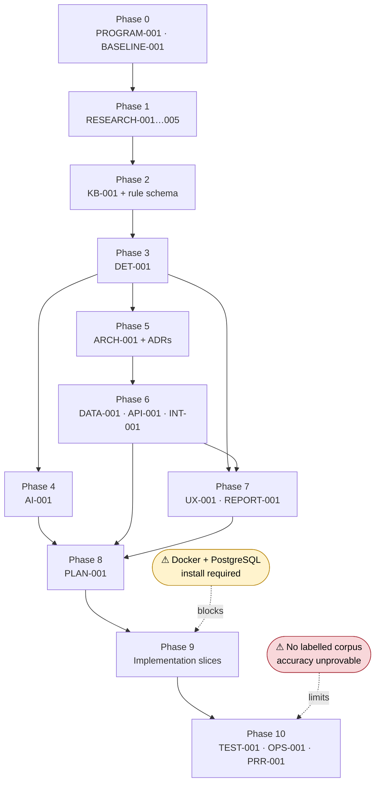

# PROGRAM-001 — TrustLens Program Charter

| Field | Value |
|---|---|
| Document ID | PROGRAM-001 |
| Version | 1.1 |
| Status | **Approved v1.1** — Phase 0 baseline, amended at the Phase 1 gate ([GATE-001](GATE-001-phase-1-assessment.md)) |
| Owner role | Technical Program Director / Chief Architect |
| Dependencies | Master Execution Prompt (authoritative); Phase One Research Foundation (secondary) |
| Feeds | BASELINE-001, RESEARCH-001…005, KB-001, DET-001, ARCH-001, PLAN-001 |
| Assumptions | See [Assumption Register](assumption-register.md) — **18 open assumptions** (ASM-016 closed as disproved at the Phase 1 gate), of which ASM-001 (no stakeholder access) is load-bearing |
| Decisions | See [Decision Log](decision-log.md) — DEC-001…DEC-005 |
| Open issues | OI-01…OI-06, §11 |
| Last updated | 2026-08-14 |

> **Traceability notation.** `MP §n` = Master Execution Prompt, section n (authoritative).
> `RP p.n` = Phase One Research Foundation, page n (secondary, unverified — see BASELINE-001 §3).
> `DERIVED` = engineering inference by the programme, recorded as an assumption, **not** as fact.

---

## 1. Problem statement

Digital fraud in India operates as a **staged funnel**: contact → pretext → trust or fear
escalation → credential or payment request → post-action suppression (`RP p.4`). Victims are
manipulated into performing the harmful act themselves — entering a UPI PIN, scanning a QR code,
installing an app, granting a permission, or wiring a "fine" to an impersonated police officer.

Three specific failures make this hard for an ordinary person to resist in the moment:

1. **The decisive signal is a combination, not a word.** "OTP" is not suspicious. "Share your OTP
   to receive your refund" is. Existing consumer-facing tools that pattern-match keywords either
   miss the real attacks or flood users with false alarms, and in both cases teach users to
   ignore them.
2. **Advice arrives without evidence.** A verdict of "this looks like a scam" that cannot show
   *what* matched and *which official guidance* supports it is unverifiable, and therefore
   untrustworthy precisely when the user is under pressure to act.
3. **Reporting is a second ordeal.** A victim who does recognise fraud must then reconstruct what
   happened — screenshots, numbers, timestamps, amounts — often after deleting the evidence, and
   usually while panicking.

India's reporting and response ecosystem is comparatively mature (`RP p.1`), and a substantial
body of official anti-fraud guidance already exists across I4C, CERT-In, RBI, NPCI, SEBI and DoT.
**That guidance is not in a machine-usable form.** It is scattered across advisory PDFs, press
releases and awareness booklets, written for human readers, and it goes stale.

TrustLens exists to close the gap between *published official guidance* and *a decision a person
can act on and verify, at the moment they need it*.

## 2. Product vision

> A person forwards a suspicious message to TrustLens and, within seconds, understands **what
> was detected, how sure the system is, which official guidance says so, and what to do next** —
> and leaves holding a preserved, tamper-evident evidence bundle they can take to authorities.

Three properties make this credible rather than another opaque classifier:

- **Deterministic and replayable.** The same evidence, rule-set version and configuration always
  produce the same result. A decision made six months ago can be re-run and reproduced exactly.
- **Traceable end to end.** Every finding decomposes into indicators, rules, score contributions
  and source references. Nothing in the output is unattributable.
- **Honest about uncertainty.** Risk and confidence are reported separately. Weak or ambiguous
  cases are routed to review or returned as `INSUFFICIENT_EVIDENCE` rather than dressed up as
  certainty (`MP §3`).

## 3. Boundaries and explicit non-goals

| # | TrustLens does **not** | Rationale |
|---|---|---|
| NG-01 | Automatically submit legal or regulatory reports to any authority | `MP §1`. Requires an explicit future approved requirement. |
| NG-02 | Issue official determinations of fraud | Not a regulator or law-enforcement body. Output assists reporting only (`MP §14`). |
| NG-03 | Give legal advice | `MP §14`. Recommendations are safety actions, not legal counsel. |
| NG-04 | Block, intercept or modify messages, calls or payments | Not an interception product. It analyses submitted artifacts. |
| NG-05 | Run as a device agent or read device state | Constrains detection scope — see [CONF-003](conflict-register.md). |
| NG-06 | Claim detection accuracy without reproducible evaluation | `MP §17, §21`. No labelled corpus exists — see [RSK-003](risk-register.md). |
| NG-07 | Let an AI model be the final decision authority | `MP §3, §11`. The rule engine decides. |
| NG-08 | Self-learn from user feedback without human adjudication | `MP §10`. Uncontrolled self-learning is prohibited. |
| NG-09 | Identify or profile individual suspected offenders | Out of scope; carries serious harm and legal risk. |
| NG-10 | Store submitted content beyond its defined retention class | Privacy by design (`MP §3`). |

**In scope:** analysis of user-submitted SMS, WhatsApp/chat text, email content, URLs and
screenshots; rule-based detection; explanation; evidence preservation; report bundle generation;
analyst adjudication; governed rule administration; bounded AI assistance.

## 4. Stakeholders and personas

### 4.1 Stakeholders

| Stakeholder | Interest | Access during programme |
|---|---|---|
| Programme sponsor (the user) | Delivery, scope, technical direction | ✅ Available |
| End users (Indian consumers) | Correct, comprehensible, non-alarming verdicts | ❌ **None** — see ASM-001 |
| Analysts / knowledge editors | Efficient adjudication and rule authoring | ❌ None — role simulated |
| Official bodies (I4C, CERT-In, RBI, NPCI, SEBI, DoT) | Accurate representation of their guidance | ❌ None — one-way consumption of published material |
| Recipients of report bundles | Usable, complete, verifiable evidence | ❌ None |

> **ASM-001 is load-bearing.** No persona below was validated with a real user. Every persona,
> journey and derived requirement in this charter is engineering inference and is marked
> `DERIVED`. This is the single largest source of requirement risk in the programme.

### 4.2 Personas

**P1 · Priya, 34 — the primary user.** Salaried, urban, comfortable with UPI, not technical.
Receives an SMS claiming her electricity will be disconnected tonight unless she pays via a link.
She has 30 seconds of patience and is mildly anxious. *Needs:* a fast, plain verdict and a clear
next step. *Fails if:* the answer is hedged into meaninglessness, or jargon-heavy.

**P2 · Ramesh, 68 — the high-harm user.** Retired, uses WhatsApp, defers to authority. Receiving
video calls from a "CBI officer" alleging his Aadhaar was used in money laundering, told not to
tell his family. *Needs:* an unambiguous, calm, authoritative contradiction of the scammer's
claim, and permission to involve family. *Fails if:* the system equivocates, or amplifies panic.

**P3 · Anjali — the analyst.** Reviews queued uncertain cases. *Needs:* full score decomposition,
what did *not* match, and a fast adjudication path. *Fails if:* she cannot see why the engine
concluded what it did.

**P4 · Vikram — the knowledge editor.** Converts new advisories into rules. *Needs:* a schema
that makes a well-formed rule easy and a malformed one impossible, with source linkage enforced.
*Fails if:* authoring a rule requires touching engine code.

**P5 · Meera — the knowledge approver.** Gate-keeps publication. *Needs:* diff view, impact
analysis and regression results before approving. *Fails if:* rules reach production unreviewed.

**P6 · Sysadmin.** Operates the platform. *Needs:* health signals, rollback, retention controls.

### 4.3 Primary user journeys

| ID | Journey | Persona | Priority |
|---|---|---|---|
| J1 | Submit suspicious content → understand risk, confidence, evidence and next steps | P1, P2 | MVP |
| J2 | Correct an extraction error and re-evaluate | P1 | MVP |
| J3 | Preserve evidence → create case → generate and export report bundle | P1, P2 | MVP |
| J4 | Review queued uncertain case → inspect decomposition → adjudicate | P3 | MVP |
| J5 | Author rule → peer review → security review → approve → publish → (rollback) | P4, P5 | MVP |
| J6 | Ingest new advisory → draft rule suggestion → human approval | P4, P5 | Post-MVP |
| J7 | Inspect analytics: rule usage, category distribution, false-positive trend | P3, P5 | Post-MVP |
| J8 | Exercise privacy rights: export and deletion of own data | P1 | MVP |

## 5. Requirements

Priority: **M** = MVP · **P** = Post-MVP · **F** = Future.

### 5.1 Functional requirements

#### Ingestion and submission
| ID | Requirement | Source | Pri |
|---|---|---|---|
| FR-001 | Accept free-text submission (SMS / WhatsApp / chat body) | MP §14 | M |
| FR-002 | Accept URL submission | MP §14 | M |
| FR-003 | Accept email content including headers | MP §14 | M |
| FR-004 | Accept screenshot / image upload | MP §14 | P |
| FR-005 | Group multiple artifacts into a single submission and case | MP §13 | M |
| FR-006 | Validate media type, size and structure before processing; reject unsafe uploads | MP §12 | P |
| FR-007 | Accept optional user-supplied context (sender, channel, description) | MP §14 | M |

#### Normalisation and extraction
| ID | Requirement | Source | Pri |
|---|---|---|---|
| FR-010 | Deterministically normalise content to canonical form, retaining the original | MP §10 | M |
| FR-011 | Identify the language / script of submitted content | MP §10 | M |
| FR-012 | Handle code-mixed and transliterated Indian-language input (e.g. Hinglish) | MP §10, RP p.13 | P |
| FR-013 | Extract text from screenshots via OCR | MP §10 | P |
| FR-014 | Extract entities: URL, phone, UPI VPA, amount, organisation, app name, account ref | MP §10 | M |
| FR-015 | Extract indicators across the defined indicator families | RP p.5–6 | M |
| FR-016 | Detect **negative indicators** that suppress or reduce risk | MP §10, CONF-002 | M |
| FR-017 | Let the user correct extraction errors and re-evaluate | MP §14 | M |

#### Knowledge and rule management
| ID | Requirement | Source | Pri |
|---|---|---|---|
| FR-020 | Store rules as versioned, schema-validated **data**, not code | MP §9 | M |
| FR-021 | Reject any rule failing schema validation or lint at load time | MP §9 | M |
| FR-022 | Maintain a versioned scam taxonomy independent of engine code | MP §9 | M |
| FR-023 | Support rule lifecycle: draft → peer review → security review → approve → publish → deprecate → retire | MP §9 | M |
| FR-024 | Pin the rule-set version on every evaluation to enable exact replay | MP §10 | M |
| FR-025 | Require ≥1 source reference with provenance grade on every non-heuristic rule | MP §8 | M |
| FR-026 | Support rollback to a prior published rule-set version | MP §18 | P |
| FR-027 | Perform impact analysis when a rule, taxonomy term or source changes | MP §9 | P |
| FR-028 | Add a new scam type through data and configuration alone | MP §9 gate | M |

#### Detection and scoring
| ID | Requirement | Source | Pri |
|---|---|---|---|
| FR-030 | Evaluate rules deterministically against extracted evidence | MP §10 | M |
| FR-031 | Support **composite** rules requiring combinations of indicators | RP p.13, CONF-002 | M |
| FR-032 | Support suppression rules, exceptions and exclusions | MP §10 | M |
| FR-033 | Compute risk, confidence, severity and evidence quality as **separate** quantities | MP §10, CONF-001 | M |
| FR-034 | Handle correlated signals without double counting | MP §10 | P |
| FR-035 | Return an explicit `INSUFFICIENT_EVIDENCE` outcome | MP §10 | M |
| FR-036 | Route cases past a configured uncertainty threshold to human review | MP §3 | M |
| FR-037 | Replay a historical evaluation and reproduce its result exactly | MP §10 | M |
| FR-038 | Resolve conflicts when positive and negative indicators compete | MP §10 | M |
| FR-039 | Fail safe on malformed rule, timeout or partial evidence | MP §10 | M |

#### Explainability
| ID | Requirement | Source | Pri |
|---|---|---|---|
| FR-040 | Report which rules matched, with contributing indicators | MP §10 | M |
| FR-041 | Report which rules were **considered but did not match**, and why | MP §10 | M |
| FR-042 | Report negative evidence that reduced risk | MP §10 | M |
| FR-043 | Provide full score decomposition per component | MP §10 | M |
| FR-044 | State why confidence is limited, and what context is missing | MP §10 | M |
| FR-045 | Surface source references supporting each matched rule | MP §10 | M |
| FR-046 | Present a plain-language explanation with an optional technical detail view | MP §14 | M |
| FR-047 | Describe how an analyst can independently verify the conclusion | MP §10 | P |

#### Evidence, case and reporting
| ID | Requirement | Source | Pri |
|---|---|---|---|
| FR-050 | Hash every evidence item on ingest and record chain-of-custody metadata | MP §12 | M |
| FR-051 | Create and manage cases grouping submissions, findings and notes | MP §13 | M |
| FR-052 | Generate a structured report bundle per the REPORT-001 contract | MP §14 | M |
| FR-053 | Reproduce an identical report from stored evidence and pinned analysis data | MP §14 gate | M |
| FR-054 | Provide secure, access-controlled report export | MP §13 | M |
| FR-055 | Carry a prominent disclaimer that the report is not an official determination | MP §14 | M |

#### Identity, administration and audit
| ID | Requirement | Source | Pri |
|---|---|---|---|
| FR-060 | Authenticate users | MP §12 | M |
| FR-061 | Enforce RBAC across user, analyst, knowledge editor, approver, administrator | MP §12 | M |
| FR-062 | Write immutable audit events for security- and knowledge-relevant actions | MP §12 | M |
| FR-063 | Support analyst adjudication with recorded rationale and override audit | MP §10 | M |
| FR-064 | Capture user feedback on findings without triggering automatic learning | MP §10 | P |
| FR-065 | Support data export and deletion requests with audit evidence | MP §18 | M |

#### Enrichment and AI
| ID | Requirement | Source | Pri |
|---|---|---|---|
| FR-070 | Integrate URL/threat-intelligence adapters behind a provider-agnostic interface | MP §13 | P |
| FR-071 | Operate fully when any single external provider is unavailable | MP §13 | P |
| FR-072 | Gate all AI-assisted capability behind feature flags | MP §15 | P |
| FR-073 | Validate AI output against strict schemas; reject non-conforming output | MP §11 | P |
| FR-074 | Label model-derived observations distinctly from deterministic findings | MP §11 | P |
| FR-075 | Require human approval before any AI-suggested rule is published | MP §11 | P |
| FR-076 | Degrade gracefully to deterministic-only operation when AI is unavailable | MP §11 gate | P |
| FR-077 | Isolate submitted content from model instructions (prompt-injection containment) | MP §11 | P |

#### Analytics
| ID | Requirement | Source | Pri |
|---|---|---|---|
| FR-080 | Report rule usage, coverage and contribution | MP §17 | P |
| FR-081 | Track adjudicated false positives and negatives by category | MP §17 | P |
| FR-082 | Report operational quality: volume, latency, review queue depth | MP §18 | P |

### 5.2 Non-functional requirements

| ID | Requirement | Target | Source | Pri |
|---|---|---|---|---|
| NFR-001 | **Determinism** — identical evidence + rule-set version + config yields identical output | 100% of golden-case replays | MP §10 gate | M |
| NFR-002 | **Explainability completeness** — no finding without full trace | 100% of findings | MP §3 | M |
| NFR-003 | **Extensibility** — new scam type added without engine code change | 0 engine LOC, proven by test | MP §9 gate | M |
| NFR-004 | Analysis latency, text-only submission | p95 < 2 s | DERIVED | M |
| NFR-005 | Analysis latency, screenshot with OCR | p95 < 10 s | DERIVED | P |
| NFR-006 | Encryption in transit and at rest | TLS 1.3; AES-256 at rest | MP §12 | M |
| NFR-007 | No secrets, PII or raw evidence in logs | 0 occurrences, enforced by test | MP §21 | M |
| NFR-008 | Accessibility on primary journeys | WCAG 2.2 AA | MP §14 | M |
| NFR-009 | Multilingual behaviour is explicit — the UI states which languages are supported and flags unsupported input rather than silently degrading | Explicit, not silent | MP §14, CONF-004 | M |
| NFR-010 | Auditability — security and knowledge actions are immutably recorded | 100% coverage of defined events | MP §12 | M |
| NFR-011 | Observability — structured logs with correlation IDs, metrics, health checks | All services | MP §12 | M |
| NFR-012 | Reproducible environment — clean clone builds and runs | Green from scratch | MP §18 | M |
| NFR-013 | Automated test gates at unit, schema, property, integration, contract, E2E layers | CI-enforced | MP §17 | M |
| NFR-014 | Graceful degradation when enrichment or AI is unavailable | Core path unaffected | MP §11 gate | P |
| NFR-015 | Retention and deletion honour the configured retention class | Auditable | MP §18 | M |
| NFR-016 | Rate limiting and abuse protection on public endpoints | Configured, tested | MP §12 | P |

### 5.3 Constraints

| ID | Constraint | Source |
|---|---|---|
| CON-001 | No automatic submission of legal or regulatory reports | MP §1 |
| CON-002 | No accuracy claim unsupported by reproducible evaluation on a described dataset | MP §17 |
| CON-003 | The rule engine is the primary decision authority; AI is non-authoritative | MP §3 |
| CON-004 | No fabricated advisories, citations, statistics, regulatory obligations or datasets | MP §2, §21 |
| CON-005 | Synthetic examples must be labelled synthetic and never presented as real samples | MP §8, §21 |
| CON-006 | Docker and PostgreSQL are absent from the development machine; implementation is blocked until installed | Environment ([RSK-006](risk-register.md)) |
| CON-007 | Delivery capacity is one engineer plus AI assistance | Environment ([RSK-005](risk-register.md)) |
| CON-008 | Java 21 + Spring Boot core and React/TypeScript frontend; Python intelligence service deferred | [DEC-002](decision-log.md), [ADR-0002](../../adr/ADR-0002-defer-python-intelligence-service.md) |

## 6. Scope staging

### MVP — "a verifiable verdict on a text message"
Text, URL and email submission (FR-001…003, 005, 007) · normalisation and entity/indicator
extraction including negative indicators (FR-010, 011, 014…017) · rules-as-data with schema
validation and lifecycle (FR-020…025, 028) · deterministic composite scoring with separate
risk/confidence and replay (FR-030…039) · full explainability (FR-040…046) · evidence hashing,
case, report bundle (FR-050…055) · authn, RBAC, audit, adjudication (FR-060…063, 065).

**MVP demonstration scenario:** a user submits a digital-arrest WhatsApp message; TrustLens
returns `CRITICAL` risk with `HIGH` confidence, names the three indicators that combined
(authority impersonation + legal threat + secrecy demand), shows the two rules that matched and
one that was considered and did not, cites the supporting official guidance, and produces an
exportable report bundle — and re-running the same submission six weeks later reproduces it byte
for byte.

### Post-MVP
Screenshots and OCR (FR-004, 013) · code-mixed language handling (FR-012) · upload validation
(FR-006) · rollback and impact analysis (FR-026, 027) · correlated-signal handling (FR-034) ·
verification guidance (FR-047) · feedback capture (FR-064) · threat-intelligence adapters
(FR-070, 071) · the full AI layer behind flags (FR-072…077) · analytics (FR-080…082).

### Future
Additional Indian languages beyond the initial set · mobile client · conversation-level and
temporal analysis · weak-signal clustering for analyst review · multi-tenant operation ·
extension of the ontology beyond India.

## 7. Success metrics and quality targets

Split deliberately into what we **can** prove and what we cannot. Nothing in the first table
depends on having real-world data; nothing in the second may be claimed until we do.

### 7.1 Provable now

| ID | Metric | Target | Verified by |
|---|---|---|---|
| SM-01 | Golden-case replay determinism | 100% | Automated replay suite |
| SM-02 | Findings with complete evidence→rule→source trace | 100% | Property test |
| SM-03 | Published rules passing schema + lint | 100% | CI gate |
| SM-04 | Non-heuristic rules carrying a graded source reference | 100% | CI gate |
| SM-05 | Rules explicitly classified heuristic where unsupported | 100% | CI gate |
| SM-06 | New scam type added with zero engine code change | Proven by test | Integration test |
| SM-07 | Clean-clone reproducible build | Green | CI |
| SM-08 | WCAG 2.2 AA on MVP journeys | Pass | Automated + manual audit |
| SM-09 | Secrets/PII in logs | 0 | Automated scan |
| SM-10 | Starter rules **encoded**, tested and source-graded, in any lifecycle state | 27 of 30 (3 `DEFERRED` as unobservable — [CONF-003](conflict-register.md)) | Coverage report |
| SM-11 | Rules admitted to the **published** rule set — evidenced *and* implementable | 18 of 30 ([RESEARCH-004](../01-research/RESEARCH-004-evidence-matrix.md)) | CI gate |

> **SM-10 / SM-11 are deliberately different numbers.** Encoding preserves the work; publication
> asserts it is evidenced. The 10 `UNSUPPORTED` rules are encoded as `DRAFT`/`HEURISTIC` and stay
> out of the published set until their sources are retrieved — a retrieval problem, not a
> knowledge problem. Collapsing the two would let unevidenced rules ride into production behind a
> coverage statistic. Split at the Phase 1 gate ([GATE-001](GATE-001-phase-1-assessment.md) §4.2).

### 7.2 **Not** provable without a real labelled corpus

Precision, recall, false-positive rate, false-negative rate, calibration and abstention quality
**cannot be claimed** during this programme. A synthetic corpus supports regression detection and
determinism only. Any figure produced against synthetic data must be reported with its dataset
scope and limitations attached (`MP §17`). See [RSK-003](risk-register.md).

## 8. Prioritised programme backlog

| Rank | Epic | Delivers | Blocked by |
|---|---|---|---|
| 1 | Research normalisation and source verification | RESEARCH-001…005, seed corpus | — |
| 2 | Knowledge model and rule schema | KB-001, rule JSON Schema, 27 encoded rules | Epic 1 |
| 3 | Detection engine design | DET-001 scoring and explainability model | Epic 2 |
| 4 | AI boundary design | AI-001 | Epic 3 |
| 5 | Enterprise architecture and threat model | ARCH-001, ADRs | Epic 3 |
| 6 | Data, API and integration contracts | DATA-001, API-001, INT-001, OpenAPI | Epic 5 |
| 7 | UX and reporting design | UX-001, REPORT-001 | Epic 3, 6 |
| 8 | Delivery plan | PLAN-001 | Epics 1–7 |
| 9 | Implementation slices 1–11 | Working system | Epic 8, **Docker install** |
| 10 | Verification and evaluation | TEST-001 + suites | Epic 9 |
| 11 | Operations and production readiness | OPS-001, PRR-001 | Epic 10 |

### Dependency map



## 9. Traceability

Every requirement above carries an ID and a source. Downstream artifacts must reference these
IDs rather than restating requirements in prose. The chain is:

```
MP §n / RP p.n  →  FR/NFR/CON id  →  spec section  →  rule or component  →  test case
```

Requirements with source `DERIVED` have **no external authority** and rest on
[ASM-001](assumption-register.md). They are the first candidates for revision if a real
stakeholder becomes available.

## 10. Quality-gate status for Phase 0

`MP §7` gate: *"No later architecture decision may rely on an unstated assumption. Every
requirement must have an identifier and traceability path. Missing research or contradictory
source material must be visible in the gap register."*

| Criterion | Status | Evidence |
|---|---|---|
| Every requirement has an identifier | ✅ | 84 IDs across FR/NFR/CON |
| Every requirement has a traceability path | ✅ | Source column; `DERIVED` flagged |
| Assumptions stated, not implicit | ⚠️ | 19 recorded; ASM-001 materially weakens all `DERIVED` requirements |
| Contradictions visible | ✅ | 8 entries in the Conflict Register |
| Missing research visible | ✅ | BASELINE-001 §4 gap analysis |
| Requirements validated with stakeholders | ❌ | No stakeholder access (ASM-001) |

**Phase 0 gate: `PARTIAL`.** Structurally complete and fully traceable, but the requirement set
is derived rather than elicited. This was forecast before work began and is accepted knowingly;
it is not a silent shortfall. Downstream phases may proceed, provided every artifact that
consumes a `DERIVED` requirement inherits the ASM-001 caveat.

## 11. Open issues

| ID | Issue | Needed from | Blocks |
|---|---|---|---|
| OI-01 | No end-user or analyst access to validate personas and journeys | Sponsor | Confidence in `DERIVED` requirements |
| OI-02 | Docker + PostgreSQL not installed | Sponsor (admin install) | Phase 9 |
| OI-03 | No programme end date given; scope staging cannot be time-boxed | Sponsor | PLAN-001 |
| OI-04 | Which Indian languages are in MVP scope? Currently English-only by default | Sponsor | FR-012, NFR-009 |
| OI-05 | Data retention period and legal basis undecided; DPDP applicability unverified | Sponsor + legal | FR-065, NFR-015 |
| OI-06 | Deployment target unknown — local-only, or a hosted environment? | Sponsor | ARCH-001, OPS-001 |

## Change history

| Version | Date | Change | Author role |
|---|---|---|---|
| 1.0 | 2026-07-31 | Initial charter. Requirements derived from Master Execution Prompt and Phase One Research Foundation; 8 conflicts and 19 assumptions raised. | Technical Program Director |
| 1.1 | 2026-08-14 | Amended at the Phase 1 gate ([GATE-001](GATE-001-phase-1-assessment.md)). SM-10 split into SM-10 (rules **encoded**, 27 of 30) and new SM-11 (rules **published**, 18 of 30) — the original conflated preserving knowledge with asserting it is evidenced. No requirement added, removed or reworded; ASM-016 is now closed as disproved. | Technical Program Director |
