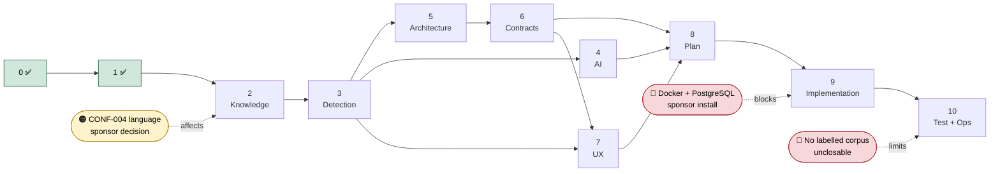

# TrustLens Programme Roadmap

| Field | Value |
|---|---|
| Document ID | ROADMAP |
| Version | 1.1 |
| Status | Draft |
| Owner role | Technical Program Director |
| Dependencies | PROGRAM-001, BASELINE-001 |
| Last updated | 2026-08-28 |

The complete artifact plan across all eleven phases, with per-phase inputs, outputs, quality
gates and **honest gate forecasts**. Forecasts are stated in advance so shortfalls are predicted
rather than discovered — `MP §3` forbids marking a phase complete without evidence, and the way
to honour that is to say beforehand where the evidence will be thin.

No calendar dates: there is no fixed programme end date ([ASM-009](assumption-register.md)), so
sequencing is by dependency. Relative sizing uses `S / M / L / XL` rather than false precision
(`MP §15`).

---

## Phase status

| Phase | Name | Artifacts | Size | Status | Gate forecast |
|---|---|---|---|---|---|
| **0** | Program definition | PROGRAM-001, BASELINE-001, 4 registers, glossary, roadmap, ADR index + 2 ADRs | M | ✅ **Complete** | **`PARTIAL`** — achieved |
| **1** | Research normalisation | RESEARCH-001…005, 3 knowledge files, seed corpus | L | ✅ **Complete** | **`PARTIAL`** — achieved ([GATE-001](GATE-001-phase-1-assessment.md)) |
| 2 | Knowledge engineering | KB-001, rule JSON Schema, encoded rules, taxonomy | XL | 🟡 **In progress** | `PASS` achievable |
| 3 | Detection engine design | DET-001 | XL | ⬜ | `PASS` achievable |
| 4 | AI intelligence layer | AI-001 | L | ⬜ | `PASS` achievable |
| 5 | Enterprise architecture | ARCH-001, ADR-0008…0013 | XL | ⬜ | `PASS` achievable |
| 6 | Data, API, integration | DATA-001, API-001, INT-001, OpenAPI | XL | ⬜ | `PASS` achievable |
| 7 | UX and reporting | UX-001, REPORT-001 | L | ⬜ | `PASS` achievable |
| 8 | Delivery plan | PLAN-001 | M | ⬜ | `PASS` achievable |
| 9 | Implementation | 11 vertical slices | XXL | ⬜ | **Blocked on Docker** |
| 10 | Testing and evaluation | TEST-001 + suites | XL | ⬜ | `PARTIAL` |
| — | Operations and readiness | OPS-001, PRR-001 | L | ⬜ | **`PARTIAL` — permanently** |

---

## Phase 0 — Program definition ✅

**Outputs.** PROGRAM-001 (84 requirements, 6 personas, 8 journeys, MVP staging, 11 provable
metrics) · BASELINE-001 (greenfield confirmed, 8 inputs classified, research evidence quantified)
· Conflict Register (8) · Assumption Register (19) · Risk Register (18) · Decision Log (5) ·
Glossary · ADR-0001, ADR-0002.

**Gate — `PARTIAL`.** Every requirement has an identifier and traceability path; conflicts and
gaps are visible. But requirements are *derived*, not elicited ([ASM-001](assumption-register.md)),
because no stakeholder is available. Structurally complete, evidentially thin at the foundation.

## Phase 1 — Official threat research normalisation ✅

**Inputs.** Phase One Research Foundation (`SECONDARY`, unverified) · BASELINE-001 §3.2 ·
[DEC-003](decision-log.md).

**Outcome.** 26 sources graded (11 `PRIMARY_VERIFIED`, 13 `RETRIEVAL_FAILED`) · 6 attribution
discrepancies caught, 4 of which would have reached user-facing output · 10 categories and 41
subcategories, each evidence-graded · 10 structured advisory extractions, all from verified
sources · 30 starter rules graded, of which **18 are both evidenced and implementable** · 22 gaps
registered · 27-case seed corpus, benign authored first. Full assessment:
[GATE-001](GATE-001-phase-1-assessment.md).

**Work executed, in order.**
1. **Source verification pass** — attempt retrieval of all ~26 cited URLs; strip `utm_source`;
   snapshot content hash and retrieval date; grade each per the [glossary scale](glossary.md#3-evidence-and-provenance-grades).
   Prioritise the three index-only rules named in BASELINE-001 §3.2.
2. **RESEARCH-001** — source inventory: issuing body, title, date, reference, topic, authority
   level, `verification_status`, evidence quality.
3. **RESEARCH-002** — scam taxonomy: 10 top-level categories with subcategories and canonical IDs.
4. **RESEARCH-003** — structured advisory extraction across the fields `MP §8` requires.
5. **RESEARCH-004** — evidence matrix: every proposed detection concept → supporting reference,
   or an explicit `HEURISTIC` / `UNSUPPORTED` classification.
6. **RESEARCH-005** — gap register, including the 5 rules from [CONF-003](conflict-register.md)
   and the language gap from [CONF-004](conflict-register.md).
7. **Seed corpus** — **benign cases authored first** ([CONF-002](conflict-register.md)), every
   item labelled `SYNTHETIC`.

**Gate — forecast `PARTIAL`, result `PARTIAL`.** `MP §8` demands every official-source-derived
fact be traceable. Half the source base did not retrieve — and the failure proved *structural*
rather than intermittent: `i4c.mha.gov.in`, `pib.gov.in` and `npci.org.in` block automated
retrieval outright while `cert-in.org.in`, `niti.gov.in` and `rbi.org.in` permit it. Those claims
were graded honestly rather than promoted, so `PASS` was never reachable from this environment.
The shortfall was predicted, not discovered. See [GATE-001](GATE-001-phase-1-assessment.md) for
the criterion-by-criterion assessment and the consequences it binds onto Phase 2.

## Phase 2 — Knowledge engineering ⬅ next

**Outputs.** KB-001 · rule **JSON Schema** · indicator-family and negative-indicator files under
`knowledge/` · 27 encoded rules, of which **18 publishable** · ADR-0003, ADR-0004, ADR-0014.

**Carries the resolutions of** [CONF-001](conflict-register.md) (severity ordinal, not a
score), [CONF-002](conflict-register.md) (three-layer indicator/composite/suppression model),
[CONF-005](conflict-register.md) (neutral IDs, sources as data).

**Work packages, in dependency order.**
1. ✅ **Rule JSON Schema** — makes a malformed rule impossible to load (FR-021), enforces a graded
   source reference on every non-heuristic rule (FR-025), carries `verdict` and `implementability`
   from [RESEARCH-004](../01-research/RESEARCH-004-evidence-matrix.md). →
   [ADR-0003](../../adr/ADR-0003-rule-representation-format.md). Delivered with 7 reference rules,
   a cross-file linter and 23 negative fixtures; `30/30`.
2. ✅ **Indicator families + extraction contracts** — [KB-002](../02-knowledge/KB-002-extraction-contracts.md).
   Four Draft-2020-12 contract schemas (input-envelope, observation, url-observation,
   indicator-observation), 28 indicator families partitioning the 63 positives
   ([`indicator-families-v1.json`](../../knowledge/indicators/indicator-families-v1.json)), negation/
   reported-speech + actor/action/target + payment-direction models, 15 golden fixtures, a 26-entry
   extraction-coverage matrix (25 starters + TL-SUP-001), and an 8th validator. Rule engine unchanged. See
   [GATE-005](GATE-005-phase-2-extraction-contracts.md).
3. ✅ **Negative-indicator library** — [G-07 CLOSED](../01-research/RESEARCH-005-gap-register.md#6a-g-07-closure-evidence-2026-08-28).
   Formal reusable library (`negative-indicator-library-v1.json`): 29 negative indicators + 6
   hard-risk overrides, graded explainable effects, dedicated validator, runner execution, 55 tests
   incl. adversarial decoys. See [GATE-003](GATE-003-phase-2-g07-and-encoding.md).
4. 🟡 **Rule encoding** — **25 of 30 starter rules encoded, 18 PUBLISHED** (+ TL-SUP-001, non-starter).
   The 5 unencoded are intentional: 4 UNSUPPORTED + 1 DEFERRED. Full reconciliation in
   [GATE-003 §3](GATE-003-phase-2-g07-and-encoding.md).
5. ✅ **Taxonomy completion** — `TAX-11` sextortion added, detection **deferred** ([DEC-007](decision-log.md));
   six-axis multidimensional model ([`dimensions-v1.json`](../../knowledge/taxonomies/dimensions-v1.json));
   `evidence_maturity` layer; loan-app/mule (G-12) preserved with no fabricated rule. Taxonomy v2.0.
6. ✅ **KB-001** — [knowledge governance, lifecycle, provenance, versioning](../02-knowledge/KB-001-knowledge-governance.md);
   storage deferred to ADR-0004.
7. 🟡 **Schema validation in CI** — eight validators exist (`manual_evidence_check`,
   `phase1_consistency_check`, `validate_taxonomy`, `validate_kb`, `validate_negative_library`,
   `validate_rules`, `rule_runner`, `validate_extraction`); wiring into a CI workflow remains.
8. **ADR-0004** (knowledge storage) · **ADR-0014** (language and script strategy).

**⚠ Partial blocker.** Work package 8's ADR-0014 is blocked on
[OI-04](PROGRAM-001-program-charter.md#11-open-issues) — language scope. Packages 1–7 are
unblocked, but the rule schema should reserve its language and script fields rather than assume
English-only, so that OI-04's resolution is a data change, not a schema migration.

**Gate.** Machine-validatable, source-traceable, extensible: a new scam type must be addable
through data alone. Per [DEC-004](decision-log.md), example rules are validated by a **real
schema validator**, not prose review.

## Phase 3 — Deterministic detection engine design

**Outputs.** DET-001 — pipeline, rule execution semantics, the risk/confidence/severity/evidence-quality
mathematics, explainability contract, false-positive strategy · ADR-0005, ADR-0006.

**The intellectual core of the programme.** Everything upstream feeds it; everything downstream
presents it.

**Gate.** Same evidence + rule-set version + configuration ⇒ identical result. Every score
decomposable, every finding traceable.

## Phase 4 — AI intelligence layer

**Outputs.** AI-001 — capabilities, mandatory boundaries, prompt-injection containment
([RSK-008](risk-register.md)), model strategy comparison · ADR-0007.

**Gate.** AI outputs bounded, schema-valid, auditable, non-authoritative; deterministic system
usable when AI is degraded — proven structurally by [ADR-0002](../../adr/ADR-0002-defer-python-intelligence-service.md).

## Phase 5 — Enterprise architecture

**Outputs.** ARCH-001 with C4 context/container/component views, STRIDE threat model, abuse
cases, security architecture, deployment topology · ADR-0008…0010, ADR-0013.

**Gate.** Every component has ownership, interfaces, data contracts, failure modes and security
controls. Major choices carry ADRs.

## Phase 6 — Data, API and integration contracts

**Outputs.** DATA-001 · API-001 + OpenAPI specification · INT-001 · ADR-0011, ADR-0012.

**Gate.** Contracts explicit enough that backend, frontend and AI work could proceed
independently without guessing. Schema validation and contract tests mandatory.

## Phase 7 — UX, evidence and reporting

**Outputs.** UX-001 · REPORT-001.

**Gate.** Uncertainty communicated honestly, risk visibly separate from confidence, evidence
integrity preserved, WCAG 2.2 AA, no dark patterns, report reproducible from stored evidence.

## Phase 8 — Implementation blueprint

**Outputs.** PLAN-001 — epics, slices, tasks, acceptance criteria, Definition of Ready/Done,
demonstration scenario per increment, release criteria.

**⚠ Decision point.** [DEC-004](decision-log.md) (specs before implementation) is flagged for
reconsideration at the Phase 3→4 boundary. **[RSK-006](risk-register.md) must be resolved here:**
Docker and PostgreSQL installation is required before Phase 9 can begin.

## Phase 9 — Implementation

Eleven vertical slices per `MP §15`, in the mandated order — repository hygiene and CI; walking
skeleton; rule schema, loader and validator; extraction pipeline; scoring and explanation engine;
evidence, case and report generation; URL intelligence adapters; screenshot and OCR; auth,
authz and admin rule lifecycle; **AI behind feature flags** (first appearance of the Python
service); analytics and hardening.

**Gate.** Every slice produces a visible, testable outcome and leaves main working.

## Phase 10 — Testing, evaluation and operations

**Outputs.** TEST-001 + implemented suites · OPS-001 · PRR-001.

**Gate — forecast `PARTIAL`, permanently.** Determinism, schema validity, security, resilience
and regression are all fully provable. **Precision, recall, calibration and false-positive rate
are not** — no labelled real-world corpus exists or can be obtained
([RSK-003](risk-register.md)). PRR-001 will ship as an evidence-backed checklist that names this
as an open, unclosable gap rather than papering over it. **No accuracy claim will be made.**

---

## Critical path and known blockers

**Critical path:** 0 → 1 → 2 → 3 → 5 → 6 → 8 → 9 → 10. Phases 4 and 7 branch off Phase 3 and can
absorb slippage without delaying the path.

## Open blockers

| ID | Blocker | Blocks | Needed from |
|---|---|---|---|
| [OI-02](PROGRAM-001-program-charter.md#11-open-issues) | Docker + PostgreSQL not installed | Phase 9 | Sponsor (admin install) |
| [OI-04](PROGRAM-001-program-charter.md#11-open-issues) | Language scope undecided ([CONF-004](conflict-register.md)) | Phase 2 rule schema | Sponsor decision |
| [OI-05](PROGRAM-001-program-charter.md#11-open-issues) | Retention period and legal basis | Phase 6 data model | Sponsor + legal |
| [OI-06](PROGRAM-001-program-charter.md#11-open-issues) | Deployment target unknown | Phase 5 topology | Sponsor |
| [OI-01](PROGRAM-001-program-charter.md#11-open-issues) | No stakeholder access | Confidence in all `DERIVED` requirements | Sponsor |
| [G-01](../01-research/RESEARCH-005-gap-register.md) | I4C unreachable — 7 rules unsupported | Promotion of those rules to the published set | Sponsor + TI Lead (manual retrieval) |

**OI-04** blocks only ADR-0014 inside Phase 2; the other seven work packages proceed without it.
**G-01** does not block Phase 2 either — the affected rules are encoded as `DRAFT` and promoted if
and when the sources are retrieved. The rest have runway.

## Change history

| Version | Date | Change | Author role |
|---|---|---|---|
| 1.0 | 2026-07-31 | Initial roadmap with per-phase gate forecasts. | Technical Program Director |
| 1.1 | 2026-08-14 | Phase 1 closed at `PARTIAL`, matching forecast ([GATE-001](GATE-001-phase-1-assessment.md)). Phase 2 expanded into eight dependency-ordered work packages and marked next; OI-04 restated as blocking ADR-0014 only, not the whole phase; G-01 added to open blockers. | Technical Program Director |
| 1.2 | 2026-08-28 | RESEARCH-006 manual retrieval reconciliation completed; Phase 2 marked **in progress** (WP1 done; WP2/3/4 partial — 14/30 starter rules encoded). Checkpoint recorded in [GATE-002](GATE-002-phase-2-checkpoint.md). | Technical Program Director |
| 1.3 | 2026-08-28 | **WP3 done (G-07 closed)**; WP4 advanced to **25/30 encoded, 18 published**. Checkpoint [GATE-003](GATE-003-phase-2-g07-and-encoding.md). WP2/5/6/8 remain open. | Technical Program Director |
| 1.4 | 2026-08-28 | **WP5 done (taxonomy v2.0, TAX-11 deferred, multidimensional model, KB-001)** and **WP6 done (KB-001)**. Checkpoint [GATE-004](GATE-004-phase-2-taxonomy-kb.md). WP2 + CI wiring + ADR-0004/0014 remain. | Technical Program Director |
| 1.5 | 2026-08-29 | **WP2 done (indicator families + extraction contracts, KB-002)**: four contract schemas, 28 families over 63 positives, 15 golden fixtures, 26-entry coverage matrix (25 starters + TL-SUP-001), 8th validator. Checkpoint [GATE-005](GATE-005-phase-2-extraction-contracts.md). Rule engine and prior gates unaffected. WP7 CI wiring + ADR-0004/0014 remain. | Technical Program Director |
