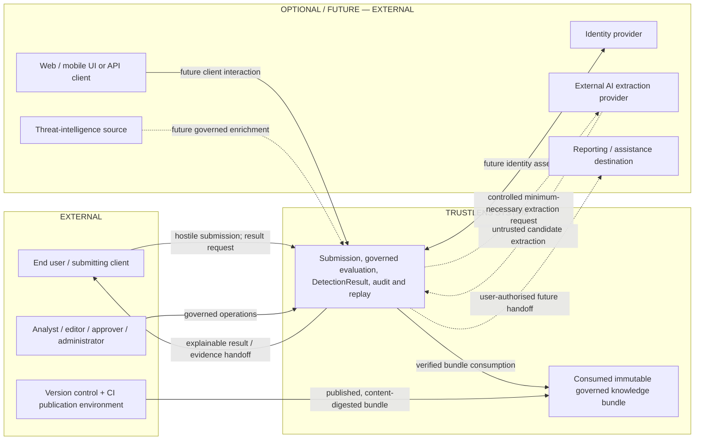
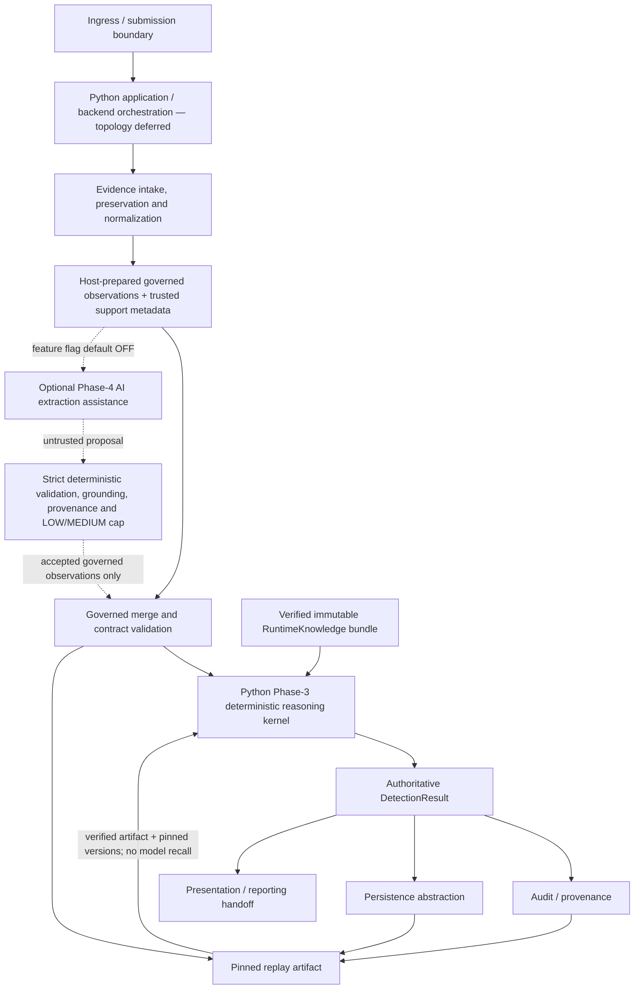

# ARCH-001 — TrustLens Enterprise Architecture — System Context and Logical Boundaries

| Field | Value |
|---|---|
| Document ID | ARCH-001 |
| Version | 1.0 |
| Status | **DESIGN CANDIDATE / PROPOSED** — requires independent review and GATE-012 finalisation |
| Owner role | Chief Architect |
| Phase | Phase 5 — enterprise architecture |
| Scope | Authoritative logical architecture candidate for P5-WP2 through P5-WP7; not a physical deployment design |
| Current backend direction | **Python-only server-side application and reasoning capabilities** — sponsor-directed; physical topology deferred to ADR-0008 |
| Related | [PROGRAM-001](../00-program/PROGRAM-001-program-charter.md), [GATE-011](../00-program/GATE-011-phase-4-ai-closure.md), [GATE-012](../00-program/GATE-012-phase-5-architecture-design.md), [DET-001](../03-detection/DET-001-deterministic-detection-engine.md), [AI-001](../04-ai/AI-001-ai-intelligence-layer.md), [ADR-0001](../../adr/ADR-0001-adopt-technical-baseline.md), [ADR-0002](../../adr/ADR-0002-defer-python-intelligence-service.md), [ADR-0004](../../adr/ADR-0004-knowledge-storage-architecture.md), [ADR-0005](../../adr/ADR-0005-rule-execution-model.md), [ADR-0006](../../adr/ADR-0006-risk-and-confidence-aggregation.md), [ADR-0007](../../adr/ADR-0007-ai-authority-and-model-strategy.md), [ADR-0014](../../adr/ADR-0014-language-and-script-strategy.md), [ADR-0015](../../adr/ADR-0015-evidence-hierarchy-and-official-alternate-provenance.md) |
| Planned decisions | ADR-0008 architecture style/topology; ADR-0009 identity; ADR-0010 evidence storage/tamper evidence; ADR-0013 rule-set publication/distribution |
| Last updated | 2026-09-06 |

> This document establishes logical authority and boundaries. It selects Python as the backend/server-side
> direction, but does not close Phase 5, select a physical runtime topology, or authorise implementation.
> Phase 1 remains PARTIAL, Phase 2 PASS, Phase 3 closed
> at `phase3-wp8-v1.0`, and Phase 4 formally closed at its merged GATE-011 baseline. G-09 remains OPEN.

## 1. Purpose and system outcome

TrustLens receives potentially hostile digital-scam evidence and submissions, preserves their identity,
normalizes them, derives governed observations, evaluates those observations with the authoritative
deterministic detection engine, produces an explainable `DetectionResult`, preserves audit and replay
provenance, and supports downstream presentation and reporting workflows.

The product assists a person or analyst in understanding submitted material and preserving an evidence trail.
It does not prevent fraud, intercept communications or payments, guarantee scam identification, issue an
official fraud determination, give legal advice, or automatically submit a report to law enforcement or a
regulator. G-09 provides no basis for a real-world efficacy claim.

### 1.1 Current Phase-5 backend direction

Python is the selected backend/runtime direction for TrustLens application, orchestration, and reasoning
capabilities. This direction follows both the current repository evidence—the authoritative Phase-3 engine and
Phase-4 AI governance/integration/replay implementation are Python—and explicit sponsor direction. It avoids a
second backend runtime or an unsupported semantic rewrite. The frontend remains a separate concern and may use
React/TypeScript under the existing baseline.

This language direction does not select a Python web framework, a process count, a deployable-unit count, or a
network boundary. Those physical choices remain deferred. Java is not part of the planned TrustLens server-side
runtime; introducing it later requires a compelling future requirement and an explicit approved ADR.

## 2. Logical system boundary

The **TrustLens system** owns these logical responsibilities. A responsibility is not a deployable service.

| Responsibility | Boundary and outcome |
|---|---|
| Ingress and submission | Accept declared input types through future product interfaces; treat all submitted content and metadata as untrusted until validated. |
| Application orchestration | Coordinate submission, evaluation identity, policy/feature flags, use-case flow, failures, and handoffs without inventing decision semantics. |
| Evidence intake and normalization | Preserve source identity and permitted raw material; produce normalized, referenceable input while retaining provenance. |
| Governed-observation preparation | Validate normalized observations and indicator observations against promoted contracts and trusted support metadata. |
| Optional AI extraction | Propose candidate observations through the bounded Phase-4 contract; remain default OFF, untrusted, provider-neutral, and non-authoritative. |
| Deterministic reasoning kernel | Load immutable knowledge; interpret rules; apply structural, suppression, aggregation, risk, confidence, explanation, and action policies; emit the sole authoritative `DetectionResult`. |
| Knowledge-bundle consumption | Verify and load the published, versioned, content-digested bundle into immutable runtime knowledge. |
| Result assembly and access | Return and retrieve the authoritative result without duplicating, recomputing, or reinterpreting its decision fields. |
| Audit and provenance | Record evaluation, configuration, knowledge, security, governance, and correction lineage using defined immutable/auditable records. |
| Replay | Reproduce an evaluation from the exact governed artifact and pinned engine, bundle, profile, and optional-AI configuration provenance. |
| Persistence abstraction | Express logical retention, integrity, retrieval, deletion, and audit needs while deferring physical storage to P5-WP3. |
| Reporting and presentation handoff | Render or export governed result/evidence material for users and future assistance workflows without changing its meaning or automatically submitting it. |
| Administration and governance | Support analyst adjudication, knowledge editing, peer/security approval, publication, role administration, and auditable correction where requirements authorise them. |

### 2.1 Outside the system

External actors and systems are limited to existing or explicitly future requirements:

- end users and other submitting clients;
- future web/mobile interfaces and future external API clients;
- analysts, knowledge editors, approvers, and administrators;
- the external version-control and CI environment used to review and publish governed knowledge;
- a future identity provider, with the identity mechanism deferred to ADR-0009;
- an optional future external AI provider, outside the trusted decision boundary;
- future provider-neutral threat-intelligence sources; and
- future reporting or assistance destinations selected by the user or an authorised workflow.

Official bodies whose published material contributes to the governed evidence base are evidence sources, not
interactive authorities inside TrustLens. No vendor or destination is selected by this architecture.

## 3. System context



The bundle is logically consumed within the system, while authoring, review, CI, and publication occur in the
external governed Git workflow defined by ADR-0004. Optional/future dashed interactions do not exist as
production integrations merely because they appear in the context.

## 4. Logical processing architecture



The optional AI branch is upstream of the governed merge and Phase-3 kernel. Rejection, unavailability, or
disabled AI contributes no AI observations and preserves the exact deterministic baseline. A later
re-extraction is a new evaluation; historical replay uses stored governed material and does not call a model.

## 5. Authority map

| Concern | Sole or governing authority | Architectural consequence |
|---|---|---|
| Final classification | Phase-3 deterministic engine | No other layer authors or overrides it. |
| Decision severity, matched-evidence strength, risk, detection confidence, governing rule, rule states, suppression, explanations and recommended actions | Phase 3 | Application, persistence, reporting, and AI carry the result but do not reconstruct decision fields. |
| Official evidence basis | Governed knowledge/evidence model and the exact matched rule source references | Presentation cannot add unsupported official claims. |
| Runtime knowledge | Immutable, verified `RuntimeKnowledge` loaded from a published ADR-0004 bundle | Evaluation cannot edit rules, taxonomy, indicators, policies, or evidence metadata. |
| Candidate AI extraction | Optional bounded Phase-4 assistant | Output is untrusted until atomic validation and cannot contain decision fields. |
| AI extraction confidence | Deterministic Phase-4 governance policy | Adapter assigns categorical `LOW`/`MEDIUM`; LLM-only evidence never receives `HIGH`. |
| Host identity, timestamps, input support, language and script | Trusted host/application context, constrained by promoted contracts and ADR-0014 | Submitted/model output cannot expand support or forge trusted evaluation context. |
| Historical replay | Exact pinned governed artifact plus bundle/content digest, engine version, profile, and AI `config_ref`/audit where used | No model recall and no silent use of current/latest knowledge. |
| User correction or analyst adjudication | Governed revision workflow with actor/rationale provenance | A correction creates a linked new evaluation; history is not mutated. |
| UI/report wording and layout | Presentation policy over the completed `DetectionResult` | It may simplify display while preserving classification, risk, confidence, evidence, limitations, and action semantics. |

## 6. Architecture invariants

1. **INV-01 — Sole decision authority.** Phase 3 is the sole authority for all final decision semantics and the `DetectionResult`.
2. **INV-02 — No AI override.** AI cannot directly set, override, or bypass classification, severity, risk, confidence, rules, evidence basis, explanation, or actions.
3. **INV-03 — Optional and default OFF.** Every AI capability is feature-gated and defaults OFF.
4. **INV-04 — Exact fallback.** Disabled, unavailable, rejected, or failed optional AI preserves the exact deterministic baseline behavior and does not manufacture a safe outcome.
5. **INV-05 — Untrusted output validation.** AI output is atomic, untrusted input until strict schema, semantic, membership, grounding, reference, and bounds validation succeeds.
6. **INV-06 — Support before inference.** Unsupported or non-English input is never treated as safe because an AI model can interpret it; governed English/Latn scope remains authoritative.
7. **INV-07 — Immutable knowledge.** Evaluation consumes versioned, content-digested, immutable, pinned published knowledge; it never reads an ungoverned latest version.
8. **INV-08 — Replay without model recall.** Historical replay uses the exact pinned governed artifact and never calls AI; re-extraction creates a new evaluation.
9. **INV-09 — Fail-closed integrity.** Invalid bundles, replay pins, required provenance, schemas, and trusted evaluation context fail according to established typed runtime semantics and never become `NO_SCAM_PATTERN`.
10. **INV-10 — No false precision.** TrustLens emits no final scam probability and no arbitrary 0–100 safety/risk score; risk and confidence remain separate categorical axes.
11. **INV-11 — Outer layers carry decisions.** Transport, orchestration, persistence, adapters, reporting, and presentation cannot directly construct or reinterpret decision semantics.
12. **INV-12 — Traceable evidence and provenance.** Every finding and high-stakes action remains traceable through governed observations, indicators, rules, evidence, source references, and pinned versions.
13. **INV-13 — No silent historical mutation.** Published knowledge, completed evaluations, audit events, and replay artifacts are not edited in place; correction and activation produce explicit new revisions/events.
14. **INV-14 — Rules remain governed data.** New scam types and rule changes flow through the governed knowledge lifecycle and cannot require rule-specific decision code or automatic AI publication.
15. **INV-15 — Preserve the proven Python reasoning implementation.** TrustLens must not rewrite or duplicate the authoritative Phase-3/Phase-4 reasoning semantics in another language without an explicit approved architecture decision and complete semantic-equivalence validation.

These invariants are inherited authority, not evaluation criteria that a later topology may trade away.

## 7. Logical layers and dependency direction

| Layer | Logical responsibility | May depend on |
|---|---|---|
| A. Experience / external interface | Future UI/API presentation, input formatting, access boundary | B contracts and completed result contracts |
| B. Application / orchestration | Python backend use cases, evaluation coordination, feature policy, identity context, transaction/use-case control | C contracts; F/G ports |
| C. Domain / governed evaluation | Evidence normalization policy, governed-observation preparation/validation, result/replay concepts | D kernel contracts and domain-owned ports |
| D. Deterministic reasoning kernel | Proven Python RuntimeKnowledge load boundary, rule execution, suppression, aggregation, explanation/actions, authoritative result | Governed contracts and immutable knowledge only |
| E. Optional intelligence / extraction | Provider-neutral candidate extraction behind default-OFF policy | C-defined extraction contracts; external access only through G |
| F. Persistence / audit adapters | Implement future storage, audit, retention, replay retrieval, and transaction mechanisms | Inward domain/application ports |
| G. External integration adapters | Identity, future AI, threat intelligence, publication, and reporting connectors | Inward application/domain ports and external contracts |

Dependencies point inward through defined contracts. Layer D and decision-owning parts of C do not depend on
web controllers, database drivers, queues, cloud SDKs, or AI/provider SDKs. Layer E supplies proposals to C;
D does not call it. F and G implement ports defined inward. This layering does not imply separate processes.

## 8. Existing reasoning kernel as an architectural asset

The repository contains a proven Python Phase-3 kernel at `ENGINE_VERSION = 1.0.0`. Its public composition
boundary, `evaluate_detection_from_governed(...)`, accepts governed observation data and trusted evaluation
context and produces one immutable, schema- and semantics-validated `DetectionResult`.

The implemented asset includes:

- all-or-nothing published-bundle loading and immutable `RuntimeKnowledge` indexes;
- promoted observation and indicator-observation validation;
- the ADR-0005 three-valued rule interpreter and structural occurrence semantics;
- governed suppression, hard-risk override, and evidence-diversity behavior;
- ADR-0006 aggregation with separate severity, matched-evidence strength, risk, and confidence;
- deterministic structured explanation and governed recommended-action mapping;
- authoritative result assembly with engine, bundle, component, and profile provenance; and
- the optional Phase-4 integration boundary that validates, maps, pins, and replays accepted AI-derived observations before the unchanged kernel evaluates them.

Phase 5 must preserve this Python asset and place it inside a deployable Python product architecture without
semantic drift. This document does not recode it, split it, wrap it in a chosen network protocol, or choose its
final process/runtime home.

## 9. Optional intelligence boundary

AI remains an optional extraction capability governed by ADR-0007 and AI-001. The domain owns a
provider-neutral contract; no provider or provider SDK is selected. Submitted content is data, the extraction
model receives no tools, and future egress must be controlled and limited to minimum-necessary content with
required masking. Secrets, credentials, retention terms, network placement, and a live-provider lifecycle are
decisions for later security/deployment work.

Accepted proposals carry adapter-owned categorical confidence and provenance, including a content-addressed
`config_ref` for provider/model, prompt-template, response-schema, adapter, and material decoding configuration.
The exact combined governed artifact consumed by Phase 3 is pinned for replay. Optional failures discard the
AI contribution and preserve deterministic fallback. The provider remains outside the trusted decision zone.

## 10. Governed knowledge boundary

ADR-0004 remains binding:

```text
governed Git authoring and review
  -> deterministic publication
  -> immutable versioned bundle + per-member hashes + content digest
  -> verified all-or-nothing load
  -> immutable in-memory RuntimeKnowledge
  -> deterministic evaluation
```

Git-authored rules, indicators, taxonomy, schemas, evidence metadata, and governed policies remain the source
of truth. The runtime consumes a published projection and must not mutate it or publish from runtime state.
Any future operational materialization is subordinate to the bundle and cannot become an alternate knowledge
authority. Exact publication, distribution, activation, authenticity, and rollback topology is deferred to
reserved ADR-0013; evidence tamper-evidence and submitted-evidence storage are deferred to ADR-0010/P5-WP3.

## 11. Logical data classification

Physical schemas and storage products are deferred to P5-WP3. “Immutable/audit” below means append-only or
revision-based logical history; the mechanism is not selected here.

| Logical data class | Primary classification | Sensitive? | Mutability / retention intent | Required version/configuration relationship |
|---|---|---:|---|---|
| Submitted/raw evidence | Sensitive evidence | Yes | Operational while retained; original identity/hash and chain events immutable | Input/case identity, ingestion policy, retention class |
| Normalized input | Sensitive derived evidence | Yes | Derived revision; do not silently replace its source | Normalizer/extractor version and source-input reference |
| Governed observations | Sensitive derived evidence | Usually | Evaluation artifact immutable; corrections create a new evaluation | Promoted contract, extractor provenance/config |
| Indicator observations | Sensitive derived evidence | Usually | Evaluation artifact immutable | Indicator/negative-library version, observation references, extraction provenance |
| `DetectionResult` | Derived result and audit evidence | Potentially | Completed result immutable | Engine, bundle/content digest, component versions, evaluation profile |
| AI extraction audit/provenance | Security-sensitive audit state | Potentially | Immutable per run; failed/rejected state retained per future policy | `config_ref`, adapter/model/prompt/schema versions, run/evaluation identity |
| Replay artifacts | Sensitive immutable/audit state | Yes | Tamper-evident immutable snapshot; correction creates a new snapshot | Governed artifact digest, engine, bundle, profile, optional AI configuration |
| Runtime knowledge bundle | Versioned configuration | No user evidence | Immutable and content-addressed; activate by new version | Bundle/version/member hashes/content digest/commit provenance |
| Operational metadata | Mutable operational state | Sometimes | Status and workflow state may change through auditable transitions | Correlation identity, component/deployment/config version where relevant |
| Security and governance audit events | Immutable/audit state | Yes | Append-only/tamper-evident logical history | Actor, operation/resource, timestamp, correlation, policy/config version |
| Future user/account metadata | Sensitive operational state | Yes | Mutable under authorised account lifecycle; deletion/export auditable | Identity/authorisation policy version and tenant context if later approved |

Submitted user evidence is distinct from official source material archived in the governed knowledge repository.
ADR-0004 does not authorise storing user submissions in Git.

## 12. Trust zones and validation boundaries

| Zone | Trust posture | Boundary rule |
|---|---|---|
| ZONE 0 — untrusted clients/submissions | Attacker-controlled content and untrusted request metadata | Apply size/type/rate/format validation before protected processing; content never becomes configuration or instruction. |
| ZONE 1 — authenticated/validated application boundary | Identity may be asserted only after future authentication; request data remains untrusted | Authenticate before protected operations and authorise each operation/resource; exact mechanism is ADR-0009. |
| ZONE 2 — trusted orchestration domain | Owns use-case policy, host metadata, feature flags, and correlation | Accept only validated boundary objects; do not infer trusted context from submitted or provider content. |
| ZONE 3 — deterministic reasoning/knowledge boundary | Highest decision-integrity zone | Consume governed observations and verified immutable knowledge only; fail closed on integrity/compatibility errors. |
| ZONE 4 — protected persistence/audit boundary | Holds sensitive evidence, results, provenance, and security history | Enforce confidentiality, integrity, retention, deletion, access control, and tamper evidence; mechanisms deferred. |
| ZONE 5 — optional external-provider egress | Outside the trusted decision boundary | Default deny; explicit controlled egress; minimum-necessary masked content; validate every response as untrusted. |

Crossing a zone always requires explicit validation and provenance. Authentication does not make submitted
content trusted, and an external provider never joins the decision boundary.

## 13. Security principles

This is the high-level security baseline; the full threat model and STRIDE analysis belong to P5-WP4.

- use least privilege and deny by default across interfaces, data, runtime capability, and egress;
- authenticate before protected operations and authorise per operation and resource;
- keep secrets and credentials out of source, artifacts, prompts, general logs, and result fields;
- keep raw/sensitive evidence and PII out of general logs, using correlation identities and bounded diagnostics;
- meet the charter’s encryption-in-transit and encryption-at-rest expectations, with implementation mechanisms reconciled in P5-WP3/P5-WP5;
- permit outbound connectivity only through explicit, policy-controlled adapters;
- preserve immutable or tamper-evident security, knowledge, evaluation, correction, and access audit events;
- pin deterministic provenance for knowledge, engine, profiles, extraction configuration, and replay material;
- validate schema, semantics, references, membership, bounds, identity, and integrity at each relevant trust boundary; and
- ensure optional dependency failure cannot create a benign result or bypass the deterministic authority.

## 14. Processing model

Two workload shapes are recognised without selecting infrastructure:

| Shape | Candidate interaction | Architectural implication |
|---|---|---|
| Fast / interactive | Small text evaluation may suit synchronous request/response execution | Preserve the charter's derived text latency target and keep orchestration thin; confirm in P5-WP2/P5-WP5. |
| Heavy | Attachments, OCR, and future complex extraction may need asynchronous execution | Preserve evidence identity, idempotency, status, retry, cancellation, and audit needs; no broker or queue is mandated. |

The synchronous/asynchronous boundary is a P5-WP2 and P5-WP5 decision based on validated latency,
reliability, deployment, and workload requirements.

## 15. Architecturally significant requirements

| ASR | Architectural response / target status |
|---|---|
| Determinism and reproducibility | Identical governed evidence, bundle, engine, and profile produce an identical result; charter target is 100% of golden replays. |
| Auditability | Defined security/knowledge actions require immutable recording; event completeness is 100% of defined events, while the definitive event catalogue remains later work. |
| Explainability | Every finding must retain a complete governed trace; charter target is 100% of findings. |
| Security | Least privilege, deny-by-default, boundary validation, controlled egress, and charter encryption requirements; detailed controls/STRIDE NOT YET SPECIFIED. |
| Privacy | Data minimisation, no raw evidence/secrets/PII in general logs, auditable retention/deletion; retention period and legal basis NOT YET SPECIFIED (OI-05). |
| Availability | External enrichment/AI failure cannot disable the deterministic core; numerical availability SLO NOT YET SPECIFIED. |
| Degraded mode | Core path remains unaffected when enrichment/AI is unavailable; uncertain or failed evidence never becomes safe. |
| Replayability | Exact governed material and all semantic versions/configuration are pinned; model recall is forbidden for historical replay. |
| Version reproducibility | Engine, bundle/content digest, component versions, profile, rule versions, and optional AI configuration are recorded. |
| Maintainability | One engineer plus AI assistance is the capacity constraint; minimise runtimes, deployments, and duplicated semantics until justified. |
| Testability | Pure kernel, provider-neutral ports, fixtures, promoted contracts, and CI gates; required levels are unit/schema/property/integration/contract/E2E. |
| Provider neutrality | AI and future enrichment use inward-owned contracts; no provider selected and single-provider loss must not stop core operation. |
| Extensibility | New scam types remain governed data; charter target is zero engine LOC for a new type, proven by test. |
| Operational observability | Structured logs, correlation IDs, metrics and health are required; precise telemetry schema, alert thresholds, and service-scoped SLOs NOT YET SPECIFIED. |
| Interactive latency | Text analysis target `p95 < 2 s` is a **DERIVED** charter requirement under ASM-001, not a measured production result. |
| Heavy-processing latency | Screenshot/OCR target `p95 < 10 s` is a **DERIVED post-MVP** charter requirement under ASM-001, not a selected processing topology. |

All DERIVED requirements inherit the PROGRAM-001/ASM-001 caveat: stakeholders have not validated them.
No additional numeric latency, throughput, recovery, durability, availability, or scale SLO is introduced here.

## 16. Non-goals and deferred choices

P5-WP1 does not decide or build physical microservices, a database product or physical schema, an object-store
product, a cache, a message broker, a cloud vendor, container orchestration, virtual-machine layout, an API
endpoint contract, a frontend, a live AI provider, credentials/secrets infrastructure, multi-tenancy, billing,
or real-world efficacy. Multi-tenant operation remains future charter scope. Deployment target is unresolved
(OI-06). No runtime, API, persistence, queue, container, cloud, AI, or UI implementation is authorised here.

The Python backend/server-side language direction is selected, while its framework and physical topology are
not. The frontend remains logically separate and may retain the React/TypeScript direction from ADR-0001;
P5-WP1 does not design or implement it.

ADR-0001 historically names a primary datastore. This WP neither repeats that choice as a new physical design
nor silently supersedes it; P5-WP3 must reconcile the accepted baseline with the evolved data classes and
ADR-0004 knowledge boundary before defining operational persistence.

Technology names such as Kafka, Kubernetes, Redis, SQS, RabbitMQ, AWS, Azure, and GCP are examples of choices
explicitly deferred by this section, not selections.

## 17. Decision required in P5-WP2 / ADR-0008

### Current backend direction and historical decision record

Accepted ADR-0001 selects a Java 21/Spring Boot core with a later separate Python intelligence service and a
modular-monolith shape. ADR-0002 assumes that Python service is the deferred intelligence runtime. Those
decisions were made when the repository had no implementation evidence and remain accepted; ARCH-001 neither
rewrites nor silently supersedes them.

The repository now contains materially changed evidence: the authoritative Phase-3 deterministic engine is
implemented in Python at `ENGINE_VERSION = 1.0.0`; Phase-4 AI governance, integration, and replay are also
implemented in Python; the canonical offline suite validates that implementation; and no Java counterpart of
those semantics exists. The sponsor has explicitly directed that subsequent server-side application and
reasoning development continue in Python. **CURRENT PHASE-5 BACKEND DIRECTION: Python is selected for the
TrustLens backend/runtime.** Java is not a planned runtime direction.

This records a current architecture direction without falsifying history. ADR-0001 and ADR-0002 retain their
historical Accepted status until P5-WP2 issues ADR-0008 to record the formal architecture-style decision and
explicitly reconcile or supersede the affected portions. A future proposal to introduce Java requires a
compelling approved requirement/ADR and complete semantic-equivalence validation for any duplicated or rewritten
Phase-3/Phase-4 semantics.

### Topology decision remaining for ADR-0008

ADR-0008, already reserved in the ADR index, must evaluate at least:

| Option | Candidate topology for later analysis | Central trade-off |
|---|---|---|
| A | Python modular monolith with the proven Phase-3/Phase-4 reasoning capabilities in-process | Lowest operational and semantic-boundary overhead; deployable independence is limited. |
| B | Python application/orchestration service plus a separately deployed Python reasoning service | Stronger deployment/failure isolation; adds a remote contract and operational unit. |
| C | Python modular backend initially, with explicit evidence-based future service-extraction criteria | Defers distribution cost while preserving a governed extraction path. |

No physical topology option is selected. WP2 may refine these Python-only alternatives and must compare
semantic-drift risk, operational complexity, one-engineer capacity,
transaction boundaries, latency, scalability, security isolation, deployment independence, failure isolation,
reuse of the proven Phase-3/4 implementation, testing burden, and reversal cost. It must also reconcile
ADR-0001/0002 explicitly rather than treating repository evolution as implicit supersession. Framework selection
is outside this WP1 decision and must be separately justified in the appropriate later package.

## 18. Phase-5 decision and work-package map

### 18.1 Decision map

| Authority | Decision |
|---|---|
| ARCH-001 | Logical system/context, authority, layering, data-class, and trust-boundary baseline |
| P5-WP2 / reserved ADR-0008 | Python architecture style and runtime/service/process topology; formal reconciliation of ADR-0001/0002 |
| P5-WP3 / reserved ADR-0010 | Submitted-evidence persistence, integrity, tamper evidence, retention/deletion model |
| P5-WP4 / reserved ADR-0009 | Identity, authentication, and authorisation |
| P5-WP3 or later governed Phase-5 WP / reserved ADR-0013 | Rule-set publication, distribution, activation, authenticity, and rollback topology |

### 18.2 Work-package roadmap

| Work package | Planned outcome |
|---|---|
| P5-WP1 | Architecture authority and system context (this design candidate) |
| P5-WP2 | Runtime/service decomposition and ADR-0008 |
| P5-WP3 | Persistence, evidence, and data architecture with relevant reserved ADRs |
| P5-WP4 | Security/trust-boundary detail, identity ADR-0009, and STRIDE |
| P5-WP5 | Deployment, resilience, scaling, and sync/async decisions |
| P5-WP6 | Observability and operations architecture |
| P5-WP7 | Integrated architecture closure and final Phase-5 gate |

This roadmap is planning only. Each later decision must preserve §§5–7 invariants or explicitly reopen the
governing authority through the programme process.

## 19. Open decisions and limitations

- ADR-0008 must resolve the Python application/reasoning process and service topology and formally reconcile ADR-0001/0002.
- P5-WP3 must resolve submitted-evidence/result/audit persistence, retention, deletion, and tamper evidence.
- P5-WP4 must complete STRIDE and identity/authorisation design.
- P5-WP5 must select the processing, deployment, resilience, and scaling model against measured needs.
- P5-WP6 must define operational telemetry, alerts, runbooks, and numerical service objectives where justified.
- ADR-0013 must define publication/distribution/activation and trusted authenticity anchors.
- Live AI provider, egress, secrets, privacy/residency, and lifecycle placement remain deferred.
- G-09 remains OPEN: the architecture establishes no accuracy, precision, recall, false-positive/negative rate,
  real-world detection-effectiveness, or production-readiness claim.

## 20. Acceptance and change control

This v1.0 document is a design candidate. It becomes the Phase-5 logical architecture authority only after an
independent review approves it, the canonical local gate passes, remote CI passes where triggered, and the
approved change merges to `main`. GATE-012 is the corresponding design checkpoint, not Phase-5 closure.

Changing any invariant or Phase-3/Phase-4 authority boundary requires explicit governance. Physical choices made
by later Phase-5 work packages must reference this document and record their assumptions, evidence, consequences,
failure modes, and reversal costs.
