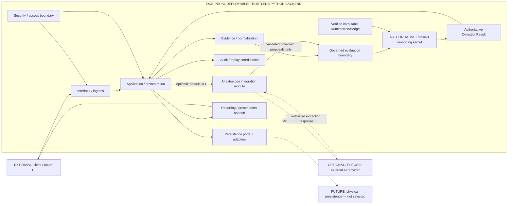
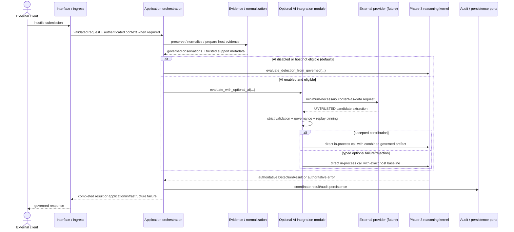
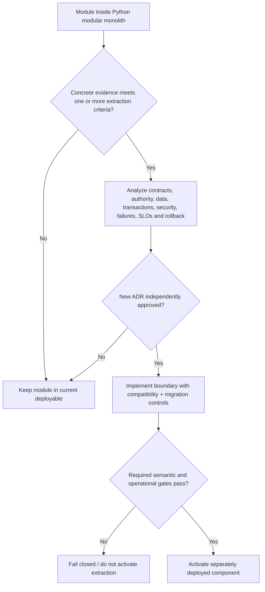

# ARCH-002 — TrustLens Python Runtime and Service Topology

| Field | Value |
|---|---|
| Document ID | ARCH-002 |
| Version | 1.0 |
| Status | **DECISION CANDIDATE** — independent review APPROVE and ADR-0008 Accepted; awaiting remote CI and merge |
| Owner role | Chief Architect |
| Phase | Phase 5 — P5-WP2 runtime and service topology |
| Decision | Python modular monolith; one initial backend deployable boundary; authoritative reasoning kernel in-process |
| Governing authority | [ARCH-001](ARCH-001-enterprise-architecture.md) `INV-01`…`INV-15`; [ADR-0008](../../adr/ADR-0008-python-runtime-service-topology.md) (Accepted) |
| Related | [GATE-013](../00-program/GATE-013-phase-5-runtime-topology.md), [DET-001](../03-detection/DET-001-deterministic-detection-engine.md), [AI-001](../04-ai/AI-001-ai-intelligence-layer.md), [AI-001 WP5](../04-ai/AI-001-WP5-phase3-integration.md), [AI-001 WP7](../04-ai/AI-001-WP7-phase4-closure.md), [ADR-0004](../../adr/ADR-0004-knowledge-storage-architecture.md), [ADR-0007](../../adr/ADR-0007-ai-authority-and-model-strategy.md) |
| Last updated | 2026-09-06 |

## 1. Decision summary

TrustLens starts with one Python backend deployable/process boundary organized as a modular monolith. Its application,
evidence, governed evaluation, reasoning, optional AI, audit/replay, security, persistence-adapter, external-
adapter, and reporting responsibilities remain explicit modules. The proven Phase-3/Phase-4 reasoning code runs
in-process through its existing Python contracts. No internal network protocol or separate reasoning deployment
is introduced.

This is the initial production architecture. It is not a prototype shortcut. It can run as multiple identical
backend replicas and can add justified background workers or extract modules later. P5-WP5 owns the physical
deployment/scaling mechanism; extraction requires evidence and a new ADR.

Python is selected. No web framework, persistence product, object-store product, broker, cloud platform,
container/orchestration platform, live AI provider, API endpoint design, or frontend implementation is selected.
G-09 remains OPEN, and this topology establishes no detection-efficacy or production-readiness claim.

## 2. Selected deployable and component topology



The large boundary is one deployable architecture, not one permanent replica or machine. The external AI
provider and future persistence are outside that boundary. The local AI integration module remains inside and
upstream of the kernel; it is not a verdict service. A module box is not a microservice.

## 3. Logical module catalogue

| Module | Owns | Does not own |
|---|---|---|
| Interface / ingress | External request adaptation, input bounds, authentication handoff, response adaptation | Use-case decisions, governed evidence semantics, decision construction |
| Application / orchestration | Use-case sequencing, trusted host context, feature policy, lifecycle, operational failures, port coordination | Rule/risk/classification semantics or direct infrastructure implementation |
| Evidence / normalization | Intake, source identity, normalized input, evidence references, deterministic/host-derived observation preparation | Final classification or physical evidence storage |
| Governed evaluation/domain | Promoted-contract boundary, governed observation merge, evaluation/replay domain concepts | Provider calls, transport, persistence drivers, final-rule reimplementation |
| Reasoning kernel | `RuntimeKnowledge`, rule interpretation, structural semantics, suppression, aggregation, explanations/actions, `DetectionResult` | Web/API, database transactions, queues, provider calls, presentation |
| Optional AI/extraction | Default-OFF policy integration, provider-neutral request/response seam, strict validation/governance/mapping, exact fallback | Final verdict, language support authority, rule publication, tools |
| Audit/replay | Correlation, immutable audit intent, replay pins, exact governed-artifact restoration coordination | Recalling a model during replay or changing historical results |
| Persistence ports/adapters | Inward-defined storage/retrieval ports and future technology-specific implementations | Knowledge authority or decision semantics |
| External integration ports/adapters | Future identity, threat-intelligence, AI-provider, reporting/destination connectors | Domain policy or direct kernel authority |
| Security/access boundary | Authentication/authorization enforcement points, trust-boundary policy, controlled egress hooks | A selected identity product or full STRIDE design in WP2 |
| Reporting/presentation handoff | Transfer of completed result/evidence material for rendering/export | Reinterpreting risk, confidence, evidence, limitations, or actions |

Module names are conceptual until implementation planning defines packages. WP2 creates no code directories or
service skeletons.

## 4. Dependency direction and enforcement intent

The primary dependency direction is inward:

```text
interface -> application -> governed domain -> reasoning kernel
                       \-> inward-defined persistence/external ports
optional AI integration -> governed observations -> reasoning kernel
infrastructure adapters -> implement inward-defined ports
```

Allowed dependencies:

- Interface code depends on application use-case contracts and completed result views.
- Application code depends on domain/evaluation contracts, the existing composition boundaries, and inward-
  defined ports.
- Evidence and optional-AI modules provide governed observations through domain-owned contracts.
- The Phase-4 integration module may invoke Phase 3 after validation/governance, as the existing
  `evaluate_with_optional_ai(...)` composition already does.
- Infrastructure adapters depend inward on ports; inward modules do not import adapter implementations.

Forbidden dependencies:

- The reasoning kernel does not depend on a web framework, database, queue, cloud SDK, AI-provider SDK,
  external adapter, application controller, or presentation layer.
- Phase 3 does not call the optional AI module or any provider.
- Application, interface, persistence, reporting, and provider adapters do not implement rule evaluation,
  suppression, aggregation, severity, risk, confidence, classification, explanation, or action semantics.
- No second “simplified” decision object or fallback classifier may exist outside the kernel.

Implementation should enforce these rules with package ownership, explicit public contracts, import/architecture
checks, and review. A network is not an enforcement mechanism and is not required for modularity.

## 5. In-process evaluation sequence



Both composition paths are ordinary Python invocation. No HTTP/RPC form is created for either boundary. A
provider response is always untrusted and appears before Phase 3. Historical replay supplies the exact pinned
artifact to the kernel without provider/model recall.

## 6. Application and kernel responsibility split

### Application/orchestration owns

- incoming use-case orchestration and trusted evaluation identity/time/support context;
- feature-policy selection and the choice to enter the optional-AI path;
- lifecycle coordination across evidence, evaluation, audit, persistence, and external handoff;
- calls to `evaluate_detection_from_governed(...)` or `evaluate_with_optional_ai(...)`;
- persistence/audit coordination through ports; and
- operational failures outside the reasoning contract.

### Reasoning kernel owns

- immutable `RuntimeKnowledge` loading/interpretation;
- governed observation validation at its production boundary;
- rule evaluation and structural occurrence semantics;
- suppression and hard-risk override behavior;
- aggregation, severity, matched-evidence strength, risk, and confidence;
- classification, deterministic explanations and recommended actions; and
- the single authoritative `DetectionResult`.

Application code carries the result and may select transport status/presentation. It cannot modify, recompute,
override, or “improve” the kernel’s decision fields. An application failure has no fraud meaning.

## 7. AI placement

The **AI module** is local Phase-4 Python validation/governance/integration code. The **AI provider** is a future
external dependency behind a provider-neutral adapter and controlled egress. They are different boundaries.

```text
application
  -> optional extraction adapter (default OFF)
  -> external untrusted response, if a future provider is configured
  -> strict Phase-4 validation/governance and LOW/MEDIUM confidence cap
  -> governed observations
  -> direct in-process Phase-3 evaluation
  -> authoritative DetectionResult
```

Provider failure or invalid output follows the existing exact deterministic fallback. Phase-3 errors are outside
the optional catch boundary and remain authoritative. The provider receives no decision authority and no tools.
Provider product, secrets, retention, residency, egress mechanism, and live lifecycle remain deferred.

## 8. Process, replica, and scaling model

“One initial backend deployable” means one versioned backend release boundary. It does not mean:

- one OS process forever;
- one replica forever;
- one machine forever; or
- every future workload must execute in the request process.

P5-WP5 may design multiple identical backend replicas when mutable application state is externalized through
defined ports. It may add background worker deployments for measured heavy/long-running work. Replication and
worker execution must preserve evaluation identities, bundle/profile pins, idempotency, audit ordering needs,
and exactly-once semantic outcomes even when infrastructure delivery is repeated. No physical scaling platform,
load balancer, cache, or broker is selected here.

Fast interactive text remains compatible with synchronous application-to-kernel invocation. Heavy OCR,
document processing, export, or external-provider workloads may later justify background execution or service
extraction. The reasoning kernel’s function semantics stay deterministic and transport-independent in either
case. Detailed sync/async contracts belong to P5-WP5 and Phase 6.

## 9. Transaction boundary principles

- The reasoning kernel owns no database transaction and performs no application-state persistence.
- Application orchestration defines the use-case persistence boundary and calls inward-defined ports.
- Audit, result, case, and evidence writes require a consistency/idempotency design in P5-WP3/Phase 6; WP2 does
  not select a transaction technology.
- No distributed transaction is introduced by the selected in-process topology.
- A separate reasoning service would force explicit coordination among remote evaluation, persistence, audit,
  timeout, and retry outcomes. That is a current disadvantage of Options B and C.
- Repeated transport or worker delivery must never create a different decision for the same pinned evaluation
  material or cause application code to synthesize a decision.

## 10. Failure semantics

| Failure | Required architectural treatment |
|---|---|
| Optional AI disabled/unavailable/rejected | Preserve the existing exact deterministic baseline and typed fallback reason. |
| Phase-3 authoritative `ERROR` or runtime failure | Propagate as authoritative; never catch as successful AI fallback or replace with another verdict. |
| Invalid bundle, replay pin, schema, or required provenance | Fail closed under existing semantics; never map to `NO_SCAM_PATTERN`. |
| Persistence/audit failure | Application/infrastructure failure; it is not evidence of safety and cannot change the completed kernel decision. |
| Response/transport failure | Application failure to deliver a result; retries must retain identity and cannot regenerate semantics opportunistically. |
| Process/resource failure | Application availability failure; recover/retry only through later governed idempotency and replay rules. |
| Future external-provider failure | Contained at the provider adapter; deterministic operation remains available under Phase-4 policy. |

Exact retry, idempotency-key, timeout, and recovery mechanisms remain later design work.

## 11. Evidence required for future service extraction

A module becomes an extraction candidate only when evidence demonstrates at least one meaningful driver:

1. **Independent scaling profile:** measured demand differs materially from the rest of the backend.
2. **Failure isolation:** demonstrated resource or availability risk warrants a separate failure domain.
3. **Security/trust isolation:** a process/network boundary materially reduces a documented threat.
4. **Distinct resource profile:** CPU, accelerator, memory, or long-running work conflicts with interactive operation.
5. **Release independence:** a proven cadence or compatibility lifecycle requires separate deployment.
6. **Ownership boundary:** a separate accountable team operates the component.
7. **Regulatory/data-residency constraint:** a verified obligation mandates separation.
8. **Availability/SLO isolation:** validated different objectives require independent runtime management.
9. **Technology constraint:** a justified dependency cannot reasonably or safely coexist in the Python backend.

One or more criteria may trigger analysis; none automatically approves a service. Extraction requires documented
evidence, contract/data/transaction/failure/security analysis, an explicit ADR, migration and rollback plans,
and appropriate regression/operational validation.

These are not sufficient alone: “microservices are modern,” codebase size, module count, aesthetic preference,
speculative future scale, desire to use another technology, one slow test, or organizational fashion.

## 12. Future extraction decision path



### Likely candidates if evidence emerges

- heavy OCR/document-processing worker;
- live AI/provider-egress worker or service;
- high-volume asynchronous evidence-processing worker; and
- independent reporting/export worker.

None is required today. The reasoning kernel is the last component to extract without compelling evidence,
because the remote boundary would surround the sole decision authority.

## 13. Kernel extraction safeguards

If later evidence justifies extracting the kernel, its ADR and implementation must prove:

1. identical governed input contracts and validation;
2. identical `DetectionResult` contract;
3. exact engine/bundle/profile/component provenance;
4. semantic-equivalence regression against the in-process authority;
5. golden-case equivalence;
6. Phase-4 integration, default-OFF, and exact-fallback equivalence;
7. explicit contract version negotiation;
8. fail-closed network timeout, partition, retry, and incompatibility behavior;
9. no application/client fallback decision implementation; and
10. no duplicated decision logic.

The in-process implementation remains the equivalence oracle during migration. Extraction cannot silently bump
or fork decision semantics; any semantic change follows its own governed process and versioning.

## 14. Security topology baseline

WP2 preserves these boundaries for the full P5-WP4 STRIDE analysis:

- untrusted external submission/client boundary;
- authenticated and validated application boundary, with the identity mechanism still deferred;
- trusted application/orchestration boundary for host context and feature policy;
- deterministic reasoning/immutable-knowledge authority boundary;
- protected persistence/audit port boundary; and
- optional external-provider egress boundary outside decision authority.

One deployable does not collapse logical trust. Inputs are revalidated at authoritative boundaries, sensitive
evidence stays out of general logs, outbound provider access remains controlled, and least privilege applies to
modules/adapters and future runtime identities. Exact controls and full threat analysis belong to P5-WP4.

## 15. Critical challenge of the selected architecture

| Challenge | Answer |
|---|---|
| Why not a separate reasoning service now? | No measured scaling, isolation, ownership, regulatory, or release need exists. It would add serialization, version, latency, retry, availability, and observability risks around proven semantics. |
| Why not microservices now? | Multiple deployables add distributed transactions, security surfaces, CI/release coordination, debugging, and operations work that current requirements and one-engineer capacity do not justify. |
| Why is an in-process kernel not improper coupling? | The dependency is on a stable domain contract. The kernel has no dependency back to application, transport, persistence, presentation, or provider code; deployment separation is not the definition of modularity. |
| How are boundaries kept extractable? | Inward-owned ports, narrow public composition points, forbidden reverse dependencies, immutable contracts, architecture/import tests, and no shared decision implementation outside the kernel. |
| What evidence triggers extraction? | One or more of the nine documented, measurable or verifiable scaling, isolation, resource, release, ownership, regulatory/SLO, or technology drivers plus a new ADR. |
| What if AI becomes resource-heavy? | Bound it and evaluate a provider-egress/background-worker extraction using measured resource/isolation evidence; default-OFF deterministic operation remains intact. |
| What if evaluation throughput increases? | First permit multiple identical backend replicas with appropriately externalized state; if measured kernel demand materially diverges, evaluate extraction under the stricter kernel safeguards. |
| What prevents application decision duplication? | ARCH-001 `INV-01`/`INV-11`, direct return of the authoritative `DetectionResult`, forbidden dependency/ownership rules, and architecture/contract tests. |
| What prevents a future service boundary changing semantics? | Identical contracts/provenance, version negotiation, semantic/golden/Phase-4 equivalence, fail-closed networking, and prohibition of client fallback logic. |

The disadvantages are real: shared failure/resource domains, whole-backend releases, and lack of independent
module scaling. They are accepted because current evidence does not justify paying distributed-system costs;
the extraction policy supplies the controlled response when that evidence changes.

## 16. Deferred decisions and next work packages

| Owner | Deferred decision |
|---|---|
| P5-WP3 | Physical evidence/result/audit persistence, tamper evidence, retention/deletion, transaction consistency, ADR-0010, and reconciliation of historical storage choices |
| P5-WP4 | Identity/authentication/authorization, ADR-0009, secrets/egress controls, and full STRIDE |
| P5-WP5 | Physical deployment, replicas, worker/process model, scaling, resilience, health, and sync/async mechanics |
| P5-WP6 | Operational telemetry, correlation, service objectives, alerting, and runbooks |
| Phase 6 | External API contracts, idempotency/retry protocol details, and integration contracts |

Framework selection is a later platform/implementation decision. Knowledge publication/distribution remains
reserved ADR-0013. No later package may alter Phase-3/Phase-4 authority as a side effect of infrastructure work.

## 17. Acceptance boundary

ADR-0008 is Accepted following independent review. ARCH-002 and GATE-013 remain Decision Candidates pending
remote CI where triggered and merge to `main`; GATE-013 is not Phase-5 closure. The documents make no
accuracy, precision, recall, false-positive/negative rate, real-world detection-effectiveness, or production-
readiness claim. G-09 remains OPEN.
