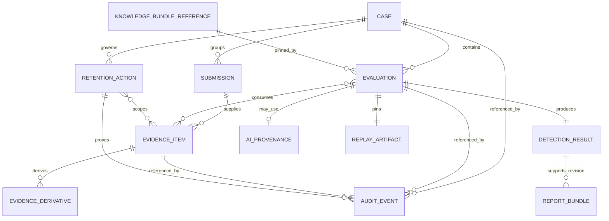
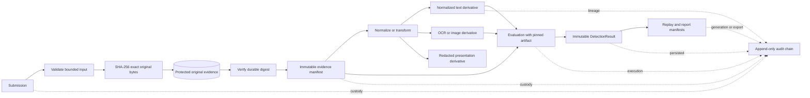
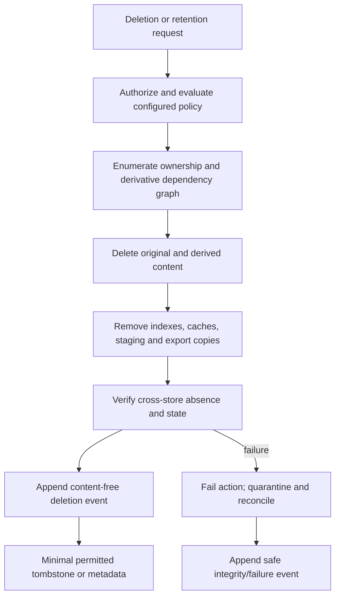

# ARCH-003 — Persistence, evidence storage and tamper-evidence architecture

| Field | Value |
|---|---|
| Document ID | ARCH-003 |
| Version | 1.0 |
| Status | **DECISION CANDIDATE** — ADR-0010 accepted following independent review; pending remote CI and merge |
| Phase | Phase 5 — P5-WP3 |
| Owner role | Chief Architect |
| Baseline | P5-WP2 merge `7238695e752038cf643851d03184b5e1d0cf49ec` |
| Decision | [ADR-0010](../../adr/ADR-0010-evidence-storage-tamper-evidence.md) (Accepted following independent review) |
| Governing architecture | [ARCH-001](ARCH-001-enterprise-architecture.md), [ARCH-002](ARCH-002-python-runtime-service-topology.md), [ADR-0004](../../adr/ADR-0004-knowledge-storage-architecture.md), [DET-001](../03-detection/DET-001-deterministic-detection-engine.md), [AI-001](../04-ai/AI-001-ai-intelligence-layer.md) |
| Checkpoint | [GATE-014](../00-program/GATE-014-phase-5-persistence-evidence.md) |
| Last updated | 2026-09-06 |

---

## 1. Purpose, authority and claim boundary

This document elaborates ADR-0010's persistence ownership, evidence custody, integrity, replay/report,
retention/deletion, and cross-store consistency design. It is a logical architecture for the Python modular
monolith selected by ADR-0008. It defines ports and responsibilities without choosing a framework, object-store
vendor, migration tool, queue, cloud platform, SQL schema, API, UI, identity provider, or key system.

Phase 3 remains the sole authority for `DetectionResult` meaning. Phase 4 remains optional extraction with no
decision authority. G-09 remains OPEN. Tamper evidence is not tamper-proofing, legal admissibility, certified
chain of custody, detection efficacy, or production readiness.

## 2. Requirements traceability

| Authority | Architecture response |
|---|---|
| FR-010 | Preserve original bytes; normalized, OCR, redacted and other transforms are separate lineage-linked derivatives |
| FR-024 | Every completed evaluation/result/replay/report pins immutable knowledge-bundle version and content digest |
| FR-037, NFR-001 | Store the exact governed input artifact and every semantic version needed for fail-closed historical replay |
| FR-050, RSK-011 | SHA-256 exact bytes on ingest, immutable manifest, custody events, derivative digests and boundary verification |
| FR-051 | Relational case ownership connects submissions, evidence, evaluations, findings/results, notes/corrections and reports |
| FR-052/053 | Persist immutable report inputs and digest-pinned revisions; Phase 7 owns report presentation |
| FR-054 | Export is application-authorized, private and audited; storage locators/public URLs are not export authority |
| FR-062/063, NFR-010 | Append-only hash-chained events and linked correction/adjudication revisions preserve history |
| FR-065, NFR-015 | Ownership graph, policy/version references, deletion state, verification and minimal non-content deletion proof |
| NFR-006 | TLS 1.3 in transit and AES-256 at rest, including content and backups |
| NFR-007, RSK-010 | Treat submissions as sensitive at ingest and exclude raw content, PII and secrets from general telemetry/audit |
| OI-05 | Retention durations, legal basis and post-deletion metadata rules remain explicitly unresolved |

## 3. Evidence domains and sources of truth

There are two unrelated uses of the word evidence:

1. **Official/knowledge evidence** supports governed rules and indicator meaning. ADR-0004 and ADR-0015 keep
   authored authority in Git and publish immutable hashed knowledge bundles. PostgreSQL may store an activation
   or consumption reference, never rule/taxonomy/indicator/source meaning.
2. **User-submitted case evidence** includes SMS, chat, email, URL, screenshot, user context, and future
   supported attachments. It is restricted operational data governed by ADR-0010. It is never stored in Git.

This separation is an architecture invariant. A shared digest algorithm does not create a shared authority,
authorization domain, retention policy, or storage namespace.

## 4. Logical persistence topology

The application owns persistence ports. Domain and reasoning modules do not import product adapters.

| Capability | Responsibility | Authority boundary |
|---|---|---|
| Structured operational repository | PostgreSQL-backed persistence for relationships, state, revisions, manifests, artifacts or their references, audit, and lifecycle | Authoritative for operational records only |
| `EvidenceContentStore` | Protected immutable byte objects, digest verification, deletion, backup/restore, and private lookup via internal locator | Authoritative byte content for externalized user evidence/artifacts |
| Knowledge bundle loader/store | Existing immutable bundle and in-memory indexes | ADR-0004 authority; outside PostgreSQL authorship |
| Integrity verifier | Recomputes/checks digests and link/chain continuity at trust boundaries | Reports integrity failure; never creates a classification |
| Retention/deletion coordinator | Policy evaluation, dependency enumeration, state transition, deletion and verification | Executes future configured policy; does not invent it |

PostgreSQL may contain structured JSON where existing canonical artifacts require it, but flexible encoding does
not relax ownership or immutability. The Phase-6 data model chooses tables, types, constraints, indexes,
transaction isolation, and migration tooling.

## 5. Data ownership matrix

Sensitivity labels here are architectural handling classes, not statutory classifications: **RESTRICTED** means
raw user evidence or direct account/UPI/phone/OTP-like content; **SENSITIVE** means derived evidence,
observations, and reports; **INTERNAL** means operational/non-content metadata; **GOVERNED** means public or
internal knowledge governed by ADR-0004/0015.

| # | State | Logical owner/module | Authoritative representation | Change model | Sensitivity | Persistence class | Retention/deletion behavior |
|---:|---|---|---|---|---|---|---|
| 1 | Case | Case/application | Structured case identity and ownership links | Mutable workflow; material transitions audited | INTERNAL, possibly SENSITIVE metadata | PostgreSQL operational | Governed by case policy; dependency root for export/deletion |
| 2 | Submission | Intake/evidence | Structured submission identity, channel and case association | Immutable identity with revisioned corrections | INTERNAL/SENSITIVE | PostgreSQL operational | Policy-linked; deletion traverses all submitted content |
| 3 | Raw evidence content | Evidence | Exact original bytes | Immutable until authorized deletion | RESTRICTED | `EvidenceContentStore` | Delete under policy; never Git; verify absence |
| 4 | Evidence metadata/manifest | Evidence | Structured identity, digest, locator, provenance and lifecycle | Digest/identity immutable; lifecycle transition audited | INTERNAL/SENSITIVE | PostgreSQL manifest | Retain/delete/minimize only under future policy; no invented rule |
| 5 | Normalized content | Normalization/evidence | Separate derivative of original | Immutable version; new transform creates revision | SENSITIVE | Content store or structured artifact plus PostgreSQL reference | Included in original's dependency graph |
| 6 | Evidence derivative | Producing component/evidence | Digest-pinned bytes/artifact plus parent and transform pins | Immutable version; replacement creates new derivative | SENSITIVE/RESTRICTED | Content store plus PostgreSQL lineage | Delete with owning evidence subject to policy; include OCR/redacted copies |
| 7 | Governed observations | Orchestration | Exact validated observations consumed by Phase 3 | Immutable per evaluation; corrections revisioned | SENSITIVE | PostgreSQL canonical artifact or content-store reference | Retention follows evaluation/evidence policy and deletion graph |
| 8 | Indicator observations | Orchestration | Exact validated indicator observations consumed by Phase 3 | Immutable per evaluation; corrections revisioned | SENSITIVE | PostgreSQL canonical artifact or content-store reference | Retention follows evaluation/evidence policy and deletion graph |
| 9 | Evaluation | Application orchestration | Identity, state, input/artifact and version pins | Processing state mutable; completed record immutable | INTERNAL/SENSITIVE | PostgreSQL operational | Completed history governed by result/evidence class; deletion policy unresolved |
| 10 | DetectionResult | Phase-3 reasoning kernel | Exact emitted canonical result and calculated result digest | Immutable when completed | SENSITIVE | PostgreSQL canonical artifact, externalized only if justified | Retrieve without recompute; delete/retain only per future policy |
| 11 | AI extraction provenance | Phase-4 governance/integration | Sealed audit/result metadata, config and validated-artifact pins | Immutable per attempt/run | SENSITIVE/INTERNAL | PostgreSQL canonical provenance | Follows evaluation and content-dependency policy; no provider recall |
| 12 | Replay snapshot/artifact | Replay capability using Phase-3/4 contracts | Exact governed input or digest-verified immutable reference plus version pins | Immutable | SENSITIVE | PostgreSQL metadata plus content store where externalized | Retain/delete with evaluation policy; integrity required before use |
| 13 | Audit event | Audit capability | Non-content event fields with previous/event hashes | Append-only | INTERNAL; references may be SENSITIVE | PostgreSQL audit history | Preserve only minimum allowed proof after deletion; OI-05 decides |
| 14 | Analyst adjudication/correction | Adjudication/application | Rationale, actor, predecessor and replacement links | Revisioned; never overwrites prior meaning | SENSITIVE/INTERNAL | PostgreSQL revision history | User export/deletion graph includes it; residual policy unresolved |
| 15 | User correction | Case/application | Correction payload, actor and predecessor links | Revisioned | SENSITIVE | PostgreSQL and content store if content-bearing | Dependent content included in deletion; event proof is content-free |
| 16 | Report bundle | Reporting (Phase 7 contract) | Immutable bytes/manifest with complete input pins and digest | Immutable revision; regeneration creates new revision | SENSITIVE | Content store where binary; PostgreSQL manifest | Export only through application; delete/retain under report policy |
| 17 | Knowledge-bundle activation/reference | Knowledge/application composition | Bundle version, content digest and activation/consumption metadata | Append-only activation history/current pointer may change | GOVERNED/INTERNAL | PostgreSQL reference only | Never deletes or rewrites Git/bundle authority; operational policy applies |
| 18 | Retention/deletion request | Privacy/lifecycle | Authorized request, policy/version reference, state and scope | Workflow mutable; outcome append-only/audited | INTERNAL/SENSITIVE | PostgreSQL lifecycle | Drives dependency traversal; proof excludes deleted content |
| 19 | Retention action | Privacy/lifecycle | Action identity, enumerated scope, verification and content-free outcome | Append-only | INTERNAL | PostgreSQL lifecycle/audit | Preserved only as future policy permits |
| 20 | Operational status | Owning application module | Processing/workflow state and safe failure code | Mutable with audited material transitions | INTERNAL | PostgreSQL operational | Temporary states cleaned by policy/reconciliation; no raw content |

This matrix defines ownership classes rather than SQL tables. One class may map to multiple physical records,
and several classes may share a canonical artifact, provided authority and lifecycle boundaries remain intact.

## 6. Conceptual ownership relationships



The diagram is conceptual. It does not prescribe tables, cardinality constraints, foreign-key syntax, or final
Phase-6 contracts.

## 7. Evidence identity, ingest and lineage

### 7.1 Identity contract boundary

Every evidence item conceptually has:

- `evidence_id` and case/submission association;
- `content_sha256` and byte length;
- declared media type and verified/normalized media type where applicable;
- ingest timestamp and governed source/channel metadata;
- actor/component provenance;
- retention-class reference and lifecycle state; and
- internal storage locator/reference.

The hash identifies bytes. `evidence_id` identifies the TrustLens record and remains the reference exposed to
application workflows. A content digest is never a public user identifier. Equal digests do not authorize
cross-user or cross-case correlation. Global user-evidence deduplication is forbidden unless a future explicit
security/privacy review proves isolation, independent authorization, and independent deletion.

### 7.2 Safe ingest consistency protocol

1. Assign an idempotent operation token and validate bounded bytes/content.
2. Calculate SHA-256 over the exact original bytes under the declared byte-definition contract.
3. Write to protected staging or final storage through `EvidenceContentStore`.
4. Verify the persisted bytes against the calculated digest.
5. In one PostgreSQL transaction, establish/finalize the immutable evidence manifest and state.
6. Append the custody event, with retry/outbox mechanics left to implementation design.
7. Reconcile staged/orphaned objects and incomplete records by operation token and explicit state.

States must distinguish at least receipt/staging, durable verification, manifest finalization, failure/quarantine,
and deletion without requiring these exact names. A row must never claim verified evidence when bytes are
absent or unverified. PostgreSQL and the content store do not share distributed ACID.

### 7.3 Evidence flow



The original remains separate from every derivative. Each stored derivative receives its own evidence/artifact
identity and digest, parent reference, transformation identity/version, timestamp, and actor/component provenance.

## 8. `EvidenceContentStore` port

The inward-owned port supports immutable put/stage/finalize semantics as later contracts require, verified read,
internal reference lookup, deletion, integrity checking, and backup/restore participation. It stores externalized
raw submissions, screenshots/images, future attachments, sensitive binaries, and immutable report/replay blobs
where appropriate.

Every adapter must provide AES-256 encryption at rest, TLS 1.3 in transit where a transport exists, non-public
access, application-mediated authorization, least privilege, deletion and restore verification. A locator is an
opaque internal reference. A presigned or direct public URL cannot become evidence authority. No adapter product
or deployment shape is selected.

## 9. Immutability and correction rules

| Class | Rule |
|---|---|
| Final immutable/append-only | Original evidence identity/digest metadata, completed evaluation, `DetectionResult`, AI provenance, replay artifact, report identity/manifest and audit events |
| Revisioned | Corrected extraction, analyst adjudication, user correction, regenerated evaluation and report revision; link predecessor/successor and reason |
| Mutable operational | Workflow, processing and deletion workflow status; audit security/custody-significant transitions |

No correction silently changes historical meaning. A corrected governed artifact leads to a linked new
evaluation and new `DetectionResult`; the prior result remains attributable until deletion policy requires its
removal. A persistence failure after successful calculation is an application/infrastructure failure. It does
not alter the result, claim durable completion, or trigger semantic recomputation; an idempotent retry persists
the exact calculated artifact.

## 10. Result and Phase-4 provenance persistence

Persist the authoritative completed `DetectionResult` exactly enough to retrieve without recomputation, verify
integrity, render/report, and compare against replay. Its canonical artifact and digest retain the existing
evaluation/input identities, engine and profile pins, knowledge bundle/content digest, emitted classification,
decision severity, evidence strength, risk, categorical detection confidence, rule results, explanations,
recommended actions, and component provenance. Phase 3 alone defines those fields and semantics.

When optional AI processing is attempted, failed, rejected, or used, persist the existing governed state needed
to explain the integration outcome: fallback status, `config_ref`, extraction result/audit identity,
validated-extraction digest, governed consumed-artifact digest, provider-neutral run/request identities, and
categorical confidence/review-required metadata. Preserve the sealed Phase-4 artifact rather than inventing a
model decision or numeric confidence. Safe telemetry does not include request/response bodies.

## 11. Historical replay and report inputs

### 11.1 Replay

A replay record contains or digest-verifiably references:

- the exact governed observations, indicator observations, and evaluation context consumed by Phase 3;
- evaluation/input identity, engine version and profile;
- knowledge-bundle version/content digest and component pins;
- Phase-4 `config_ref`, run/evaluation provenance and validated-extraction pins when used; and
- governed-artifact and whole-replay digests.

On read, all material and pins are verified before evaluation. Missing/mismatched material fails closed as an
integrity/application error. Replay never selects current/latest knowledge, invokes an AI provider, repairs a
snapshot, or maps failure to `NO_SCAM_PATTERN`, `INSUFFICIENT_EVIDENCE`, or any safe result.

### 11.2 Reports

Every report revision's manifest pins case/evaluation identity, evidence IDs/digests, `DetectionResult` digest,
engine version, knowledge-bundle digest, relevant AI configuration/provenance, report-contract version, future
template/version, and stable generation metadata. Report bytes/manifest receive a digest and revision identity.
Phase 7 defines report format; WP3 guarantees immutable inputs required for identical reproduction (FR-053).

Application-authorized export can traverse the case ownership graph to collect user evidence, evaluations,
results, report revisions, corrections, and relevant permitted audit metadata. Exact API and export formats
belong to Phase 6/7.

## 12. Audit chain and integrity verification

Candidate append-only events are `EVIDENCE_RECEIVED`, `EVIDENCE_STORED`, `EVIDENCE_DERIVED`,
`EVALUATION_STARTED`, `EVALUATION_COMPLETED`, `AI_ATTEMPTED`, `AI_REJECTED_OR_FAILED`, `RESULT_PERSISTED`,
`USER_CORRECTION`, `ANALYST_ADJUDICATION`, `REPORT_GENERATED`, `REPORT_EXPORTED`, `DELETION_REQUESTED`,
`CONTENT_DELETED`, `RETENTION_ACTION`, and `INTEGRITY_FAILURE`. Phase-6 contracts finalize taxonomy.

An event conceptually contains ID/type, timestamp, actor/service identity, relevant case/evaluation/evidence
references, correlation ID, non-sensitive metadata, `previous_event_hash`, and `event_hash`. Raw content is
forbidden. Conceptually:

```text
event_hash = SHA-256(canonical_event_without_hash + previous_event_hash)
```

Later contracts decide canonical encoding, genesis/root handling and chain partitioning. Chaining detects
alteration relative to a trusted root. A privileged operator who can replace the entire database and root can
rewrite all links, so this is tamper-evident rather than tamper-proof. P5-WP4/P5-WP5 may establish protected
signing keys and signed or independently anchored checkpoints. No blockchain, admissibility, or certification
claim follows.

Integrity verification covers content digests, manifest links, derivative-parent links, `DetectionResult`,
replay, report manifest/bundle, audit continuity, and knowledge-bundle digest. Mandatory high-value boundaries
include replay read, report generation/export, audit investigation, and restore declaration. Exact routine
frequency belongs implementation/operations. Every mismatch fails closed and emits a safe integrity error/event;
it never changes Phase-3 classification semantics.

## 13. Retention, deletion and export lifecycle

Retention configuration stores a class ID, policy/version, retention-basis metadata when governed,
expiry/delete-after only if supplied by future policy, and deletion state. Conceptual classes may cover case
evidence, derivatives, completed evaluation/results, audit, reports, and temporary/staging data. No durations,
legal basis, or legally required residual metadata are specified; OI-05 remains OPEN.

Deletion must discover raw originals, normalized content, OCR output, thumbnails/previews, redacted copies,
AI request/validated/governed artifacts containing user content, observations, indicator observations, replay
blobs, reports, exports, temporary/staged objects, search/index material, and caches. Authorization and policy
are evaluated before action. Each adapter deletes its scoped content, verification detects remaining copies, and
an append-only event proves the action without retaining deleted content. Any tombstone/audit residue is the
minimum non-content metadata allowed by the future decision.



Privacy deletion and proof of the deletion action coexist because the proof contains references/status and no
deleted bytes or content-derived values beyond what future policy permits. Per-object or domain key destruction
may later supplement verified physical/logical deletion; key management is P5-WP4 and cryptographic erasure is
not the sole mechanism.

## 14. Cross-store failure and reconciliation

| Failure | Required behavior |
|---|---|
| Content write fails | Do not finalize a verified manifest; retry by operation token or record safe failure |
| Content durable, PostgreSQL finalization fails | Leave staged/orphan-discoverable object; reconciliation verifies and finalizes idempotently or deletes/quarantines it |
| Manifest exists, content missing or digest differs | Mark integrity/application failure, prevent replay/report/use, and investigate/reconcile; never infer a safe classification |
| Custody event append is incomplete | Do not claim completed custody workflow; retry idempotently and expose safe operational failure |
| Result calculated, persistence fails | Keep semantics unchanged, report infrastructure failure, do not claim durable completion; later persist exact artifact |
| Deletion partly succeeds | Remain incomplete/failed, enumerate residual dependencies, retry safely, and audit non-sensitive status |

Reconciliation is controlled, least-privileged, observable through identifiers and categorical states, and cannot
silently forge digests or historical events. Detailed retry/outbox protocol belongs Phase 6.

## 15. Backup and restore

Backup sets and recovery procedures must preserve PostgreSQL relational consistency, evidence objects, digests,
manifest references, audit roots/chain, replay/report artifacts, and required encryption/key references. Backups
receive equivalent encryption, access control and lifecycle handling. A restore is not complete until it checks
object-manifest coverage, content/artifact digests, derivative links, result/replay/report pins, knowledge bundle
availability/digest, and audit continuity. RPO and RTO are not specified.

## 16. Security and telemetry boundary

- Preserve TLS 1.3 and AES-256; use separate least-privilege roles/credentials for structured data, content,
  backup, and later checkpoint/signing operations.
- Application authorization mediates evidence access and export. P5-WP4 defines identity, RBAC, secrets, and
  key lifecycle; P5-WP5 defines physical placement and resilience.
- PostgreSQL and evidence objects do not contain application credentials, encryption keys, provider secrets,
  or other operational secrets; P5-WP4 defines their protected mechanism.
- Logs, metrics, traces and general audit may contain opaque IDs, categorical status/error codes, durations,
  and correlation IDs. They must exclude raw evidence, full messages, AI response/request bodies with user
  content, OTP/PIN, PAN/account data, other PII, and secrets.
- PostgreSQL records bundle version, content digest and activation metadata only. Git and immutable bundles
  remain authoritative for rules, taxonomy, indicator definitions and official evidence provenance.

## 17. Deferred decisions

| Owner | Deferred decision |
|---|---|
| P5-WP4 / ADR-0009 | Identity, authorization/RBAC, secrets, key management, signing-key trust and full STRIDE |
| P5-WP5 | Physical PostgreSQL/content-store/checkpoint placement, resilience, replica/worker mechanics and backup platform |
| P5-WP6 | Operational checks/frequency, telemetry, alerts, recovery runbooks and justified objectives |
| Phase 6 / ADR-0011 | Exact data contracts/schema, SQL, migrations, transaction/isolation, idempotency/outbox/retry and export API contracts |
| Phase 6 / ADR-0012 | Threat-intelligence adapter/provider architecture where applicable |
| Phase 7 | REPORT-001 format, template/version contract, presentation and user interface/export format |
| Sponsor + legal / OI-05 | Retention duration, legal basis and permitted/required post-deletion metadata |
| Reserved ADR-0013 | Knowledge publication/distribution; this document only persists bundle activation/reference metadata |

## 18. Builder self-challenge

| Challenge | Answer |
|---|---|
| Why split PostgreSQL metadata from evidence blobs? | Relational state gains constraints and queryability while high-volume/sensitive bytes have a narrow private lifecycle and recovery boundary. |
| Why not store everything in PostgreSQL? | It improves local atomicity but couples database growth, backup, restore, privileges and recovery to binary evidence volume; current needs do not justify that coupling. |
| Why not filesystem-only storage? | It would require bespoke concurrency, relationship, lifecycle, audit-query and integrity machinery for cases and revisions. |
| Why is SHA-256 hashing insufficient by itself? | A digest detects byte change only relative to a trusted pin; it does not authenticate actors, preserve custody events, prevent deletion, or stop wholesale history replacement. |
| Can a privileged DB operator rewrite the whole chain? | Yes, if the operator also replaces the trusted root/history. The document states that limitation. |
| How is that mitigated without claiming tamper-proofing? | Protect roots and reserve signed or independently anchored checkpoints with keys/placement decided in P5-WP4/P5-WP5. |
| How does deletion coexist with immutable audit? | Delete sensitive content and derivatives, then retain only content-free proof/tombstone metadata allowed by future policy; append-only means no silent overwrite, not perpetual content retention. |
| Which derived artifacts must deletion discover? | Normalized/OCR/redacted/preview content, AI/governed inputs, observations, replay/report/export blobs, temporary objects, indexes and caches. |
| How is cross-store partial failure handled? | Idempotent tokens, explicit states, verify-before-finalize, orphan detection, controlled reconciliation and fail-closed use. |
| How does report reproduction remain deterministic? | Each revision pins evidence/result/bundle/AI/config/contract/template identities and digests plus stable generation metadata. |
| How is replay independent of latest knowledge? | It requires exact governed artifacts and bundle/config/version pins and refuses missing history; it never recalls AI or substitutes latest knowledge. |
| What if an evidence object fails verification? | Treat it as an integrity/application error, block use/replay/report, audit safely and reconcile/investigate; never return a safe classification. |
| How is PostgreSQL prevented from becoming knowledge authority? | It stores immutable bundle references and activation metadata only; Git and bundles under ADR-0004 retain all knowledge meaning. |

## 19. Acceptance boundary

ADR-0010 is Accepted following independent review; this architecture remains a Decision Candidate pending
required remote validation and merge. No storage implementation is authorized here. The accepted decision preserves
Phase-3/Phase-4 semantics and `ENGINE_VERSION = 1.0.0`, leaves G-09 OPEN, and makes no efficacy, production,
legal-admissibility, or certified-custody claim.
