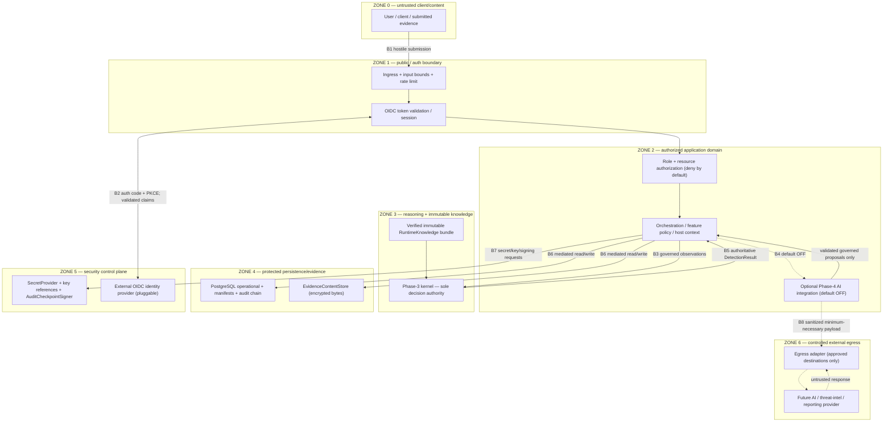
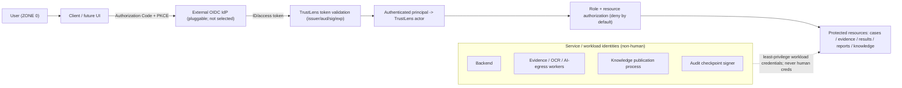
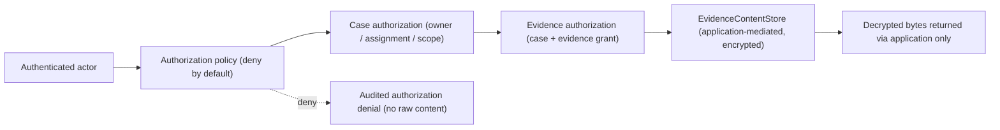
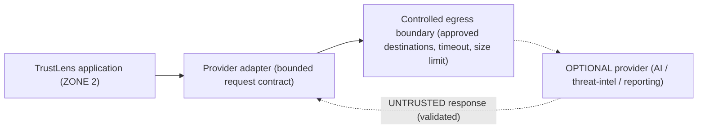

# ARCH-004 — Security, trust and threat model

| Field | Value |
|---|---|
| Document ID | ARCH-004 |
| Version | 1.0 |
| Status | **DECISION CANDIDATE / PROPOSED** — requires independent review and GATE-015 finalisation |
| Phase | Phase 5 — P5-WP4 security architecture and threat model |
| Owner role | Chief Architect / Principal Security Engineer |
| Baseline | P5-WP3 merge `12c6c9eb4736537d489ff64bc874ca42e7535c51` |
| Primary decision | [ADR-0009](../../adr/ADR-0009-identity-authentication-authorization.md) (Accepted following independent review) identity/authentication/authorisation |
| Governing authority | [ARCH-001](ARCH-001-enterprise-architecture.md) `INV-01`…`INV-15`, ZONE 0–5; [ARCH-002](ARCH-002-python-runtime-service-topology.md); [ARCH-003](ARCH-003-persistence-evidence-tamper-architecture.md); [ADR-0004](../../adr/ADR-0004-knowledge-storage-architecture.md); [ADR-0007](../../adr/ADR-0007-ai-authority-and-model-strategy.md); [ADR-0008](../../adr/ADR-0008-python-runtime-service-topology.md); [ADR-0010](../../adr/ADR-0010-evidence-storage-tamper-evidence.md) |
| Checkpoint | [GATE-015](../00-program/GATE-015-phase-5-security-architecture.md) |
| Related risks | RSK-008 (prompt injection), RSK-010 (sensitive-data exposure), RSK-011 (evidence integrity), RSK-012 (rule poisoning), RSK-017 (malicious upload), RSK-018 (external provider dependency) |
| Last updated | 2026-09-06 |

---

## 1. Purpose, authority and claim boundary

This document is the authoritative P5-WP4 security architecture and threat model. It refines the ARCH-001 trust
zones, defines the identity/authorisation boundary elaborated in ADR-0009, and specifies the secrets, encryption-
key, audit-signing, controlled-egress, SSRF, and malicious-upload boundaries, then performs a full architecture-
level STRIDE analysis with a control matrix and residual-risk statement.

This is architecture and threat modelling only. It adds **no** authentication code, IdP, login page, API
middleware, secret-manager integration, generated encryption/signing keys, network infrastructure, AI provider
credentials, or UI. It selects **no** security product or vendor.

Phase 3 remains the sole authority for `DetectionResult` meaning (CON-003, ARCH-001 `INV-01`). Phase 4 remains
optional, non-authoritative extraction (ADR-0007). `ENGINE_VERSION = 1.0.0` is unchanged. **G-09 remains OPEN.**
Tamper evidence is not tamper-proofing; nothing here asserts penetration-tested, zero-trust-certified, SOC 2 /
ISO 27001 / DPDP compliance, legal evidentiary admissibility, a non-repudiation guarantee, or production
readiness.

## 2. Requirements traceability

| Authority | Security-architecture response |
|---|---|
| FR-060 authenticate users | External/pluggable OIDC/OAuth 2.0 authentication boundary (ADR-0009); ZONE 1. |
| FR-061 RBAC (5 roles) + NFR-14 | TrustLens-owned role + resource authorisation; administrator operates without submitted-content access. |
| FR-062 / NFR-010 immutable audit | Security/knowledge/evidence-access events on the ADR-0010 append-only hash-chained audit; §6, §9. |
| FR-063 analyst adjudication + override audit | Adjudication is an authorised, audited operation with recorded rationale; STRIDE R1. |
| FR-054 secure report export | Application-authorised, access-controlled export over the case graph; locator/URL is never authority; §5.2, STRIDE I8. |
| FR-065 export/deletion with audit | Privileged, resource-scoped, audited lifecycle operations; §8, STRIDE R4. |
| FR-070 / FR-071 provider-neutral / graceful failure | Controlled egress adapters; single-provider loss cannot stop the deterministic core; §8, STRIDE D3. |
| FR-072…077 bounded AI security | Content-as-data, no tools, strict validation, default-OFF, exact fallback; AI never authoritative; §8.2, STRIDE E7/I6/I9. |
| NFR-006 TLS 1.3 + AES-256 | Encryption in transit and at rest preserved; envelope-encryption principle; §7. |
| NFR-007 / RSK-010 no secrets/PII/raw evidence in logs | Safe logging and safe error handling; §10. |
| NFR-010 auditability | Immutable/tamper-evident security event history; §6, §9. |
| NFR-016 rate limiting / abuse | Deny-by-default abuse protection at ingress and expensive operations; STRIDE D-series (thresholds deferred). |
| CON-003 rule engine sole authority | No identity, provider, or AI path can set/override/bypass a decision field; ZONE 3 integrity. |
| RSK-008/010/011/012/017/018 | Modelled explicitly in §11 STRIDE and §12 control matrix. |
| OI-05 | Retention duration, legal basis and permitted post-deletion metadata remain OPEN. |

## 3. Trust-zone model

ARCH-004 refines the ARCH-001 §12 zones and adds an explicit **security control plane** and **external egress**
zone. Names/numbers are a modelling aid; the responsibilities are authoritative.

| Zone | Responsibility | Trust posture | Boundary rule |
|---|---|---|---|
| **ZONE 0 — Untrusted client/content** | End users, clients, submitted evidence, request metadata | Attacker-controlled | Size/type/rate/format validation before any protected processing; content never becomes instruction or configuration. |
| **ZONE 1 — Public interface / authentication boundary** | Ingress, OIDC token validation, session establishment | Semi-trusted after validation only | Authenticate before protected operations; validate issuer/audience/signature/expiry; reject unsigned/invalid tokens. |
| **ZONE 2 — Authorized TrustLens application domain** | Orchestration, role+resource authorisation, feature policy, host context, correlation | Trusted application state | Deny by default; authorise every operation and resource server-side; never infer trust from submitted/provider content. |
| **ZONE 3 — Phase-3 reasoning + immutable knowledge** | Deterministic kernel, verified `RuntimeKnowledge`, sole decision authority | Highest decision-integrity | Consume governed observations + verified immutable knowledge only; fail closed on integrity/compat errors; no outer layer authors decision fields. |
| **ZONE 4 — Protected persistence / evidence** | PostgreSQL operational store, `EvidenceContentStore`, audit chain, replay/report artifacts | Sensitive at rest | AES-256 at rest, application-mediated access, least privilege, digest verification, tamper evidence; no public locator authority. |
| **ZONE 5 — Security control plane** | Identity abstraction, `SecretProvider`, encryption-key references, `AuditCheckpointSigner` | Most privileged; smallest surface | Secrets/keys never in Git/DB rows/logs; signing/key operations behind protected boundaries; the application cannot export raw private-key material. |
| **ZONE 6 — Controlled external egress / provider** | Outbound provider adapters (future AI, future threat-intelligence, reporting destinations) | Outside the decision boundary | Deny by default; explicit adapter + approved destination + sanitised minimum-necessary payload + timeout + response limits + audit; every response is untrusted. |

Crossing any zone requires explicit validation and provenance. Authentication (ZONE 1) never makes ZONE 0 content
trusted. An external provider (ZONE 6) never joins ZONE 3. A single deployable (ADR-0008) does not collapse these
logical trust boundaries.

## 4. Security data-flow and trust boundaries (STRIDE DFD)



Boundary crossings B1–B8 are the STRIDE trust boundaries analysed in §11. There is no unrestricted Internet arrow;
outbound access exists only through B8's controlled adapter.

## 5. Identity, authorization and evidence-access flows

### 5.1 Identity / security flow



Identity/token **signing** is owned by the IdP, not the TrustLens application. Service identities authenticate as
workloads, separately from human login.

### 5.2 Evidence-access flow



Direct client/browser access to the content store is **not** an authoritative path; a presigned or direct public
URL never becomes evidence authority (ADR-0010 §8). Report export follows the same case→resource authorisation
(FR-054).

## 6. Secrets management boundary

TrustLens defines a conceptual **`SecretProvider` / `SecretStore`** boundary in ZONE 5. Secrets include: database
credentials; object-store credentials; OIDC client secrets where applicable; external provider/API credentials;
signing credentials; and encryption-key references.

Secrets **must not** be stored in Git, source code, committed `.env` files, test fixtures, ordinary PostgreSQL
application rows, logs, error messages, or audit payloads. The runtime receives secrets from a protected
deployment secret mechanism through the `SecretProvider` boundary.

**Environment-variable precision.** Environment-variable injection **may** be one runtime delivery mechanism, but
it is **not itself** a secure secret-management system. The architecture prefers secret **references** / runtime
injection over hard-coded values, and does not claim that environment variables make secrets safe automatically.

The physical secret product is **deferred to P5-WP5**; no vendor is selected.

## 7. Encryption keys, envelope encryption and audit-signing trust

### 7.1 Key-purpose separation

Distinct cryptographic purposes are kept separate; no key is reused across purposes:

| Key purpose | Use | Owner boundary |
|---|---|---|
| **Data-encryption key** | Evidence/data encryption at rest (AES-256, NFR-006) | TrustLens persistence/security control plane |
| **Audit-signing key** | Signed audit checkpoints (§7.3) | Protected signer boundary; separated from ordinary app write credentials |
| **Token/identity signing** | Session/identity token signatures | **Owned by the identity system (IdP), not the TrustLens application** |

### 7.2 Envelope-encryption principle (vendor-neutral)

```text
sensitive evidence content
  -> encrypted with a data-encryption key (DEK)
data-encryption key (DEK)
  -> protected by a higher-level key-management mechanism (KEK / key-management service)
```

The key hierarchy is **not** implemented here and **no** KMS/HSM/vendor is selected. NFR-006's AES-256 at-rest
requirement is preserved. Envelope encryption is a principle, not a product.

### 7.3 Key-management principles

Key purpose separation; least privilege; rotation capability; **versioned key references** (so stored data pins
the key version used); no raw master keys in the application database; audit of key administration; recoverability
and backup/restore coordination (ARCH-003 §15); and revocation/disable capability. The actual KMS/HSM/platform is
**P5-WP5**.

### 7.4 Deletion and cryptographic erasure (OI-05 open)

Key destruction **may** assist deletion where the architecture permits (cryptographic erasure), but it is **not**
the only deletion mechanism (ADR-0010 §13 performs content/dependency deletion). Key destruction **must not**
accidentally destroy unrelated users' or cases' data; per-object keys are **not** mandated. Exact key granularity
is an implementation/deployment decision. **OI-05 remains open.**

### 7.5 Audit checkpoint signing

ARCH-003 established a hash-chained tamper-evident audit. ARCH-004 adds the trust enhancement:

```text
append-only audit stream
  -> periodic checkpoint digest
  -> protected signing operation (AuditCheckpointSigner port)
  -> signed checkpoint
```

The **`AuditCheckpointSigner`** is a conceptual port. The signing key is separated from ordinary application write
credentials, and the application **cannot** export raw signing private-key material. No HSM/KMS/vendor is selected.

**What signing does / does not prove.** Signing can strengthen **detection of rewritten history** relative to a
trusted signed checkpoint. It does **not** establish legal admissibility, non-repudiation against every possible
privileged actor, tamper-proof storage, or trusted timestamping unless a timestamp authority is separately
provided. A privileged operator able to replace the entire store *and* the signing trust anchor can still rewrite
history; this is tamper-**evident**, not tamper-**proof** (ARCH-003 §12).

## 8. Controlled external egress

### 8.1 Egress policy — deny by default

TrustLens modules cannot arbitrarily contact the Internet. Allowed external access is only through an **explicit
adapter** with: approved destination configuration; a bounded request contract; sanitised, minimum-necessary
payload; timeouts; response-size limits; audit/telemetry; and failure containment. No network product is selected.



There is no unrestricted Internet arrow. Egress-policy denials are audited (STRIDE E10/I6).

### 8.2 AI provider egress

For a future live AI provider (ADR-0007 preserved exactly):

```text
application
  -> bounded Phase-4 request preparation (content-as-data, credential masking <OTP_VALUE>/<PIN_VALUE>/<CARD_PAN>)
  -> controlled provider adapter
  -> approved egress boundary
  -> provider
```

The provider receives **only** the approved, minimum-necessary payload. It **never** receives database
credentials, storage credentials, raw filesystem access, rule-publication access, shell/tools, arbitrary internal
URLs, or user authorisation tokens. Phase-4 authority is unchanged: an untrusted response is strictly validated
before any governed observation is produced, and it can never set a decision field (ARCH-001 `INV-02`/`INV-05`).

### 8.3 Provider failure

External AI or enrichment provider compromise/unavailability **must not** change Phase-3 authority, turn
unsupported language into a safe result, fabricate a clean result, bypass validation, or block the deterministic
baseline where the existing governed fallback permits it. Phase-4 exact-fallback semantics (ADR-0007 §9,
ARCH-002 §10) are preserved (FR-071/076).

### 8.4 SSRF / user-controlled URL security

TrustLens accepts URLs as evidence. A user-submitted URL **must never** become an unrestricted server-side fetch
target merely because it was submitted. Future URL/threat-intelligence fetching must use controlled adapters with:
scheme validation; destination allow-listing/controls; redirect limits; response-size limits; timeouts;
private/internal-network protection (block link-local, loopback, metadata and RFC-1918 targets); and provider
isolation. Detailed adapter implementation belongs to **Phase 6 / ADR-0012**; no fetch capability is added here.

## 9. Malicious upload, logging and error handling

### 9.1 Malicious upload boundary (RSK-017)

Uploaded content is attacker-controlled. Required architectural principles: media-type validation **beyond
extension**; bounded size; bounded dimensions/decompression (anti-decompression-bomb); **no dynamic execution** of
submitted content; processing under least privilege; no trusted-filesystem assumptions; isolation of future
heavy/OCR processing where justified; and timeout/resource controls. Physical sandbox/worker placement is
**P5-WP5**.

### 9.2 Security logging

Security-relevant actions are audited: authentication success/failure; authorisation denial; privilege change;
role assignment; break-glass activation; evidence access/export; knowledge approval; secret/key administrative
action; egress-policy denial; and integrity failure. Logs, metrics, traces and general audit carry opaque IDs,
categorical status/error codes, durations and correlation IDs only.

Logs **must not** contain passwords, tokens, API keys, raw evidence, OTP/PIN/PAN/account content, other PII, or an
AI raw response containing user evidence (NFR-007, RSK-010, ARCH-003 §16).

### 9.3 Security error handling

External/client errors **must not** reveal internal stack traces, secret names/values, filesystem paths, SQL,
provider credentials, raw evidence, or authorisation-policy internals sufficient to aid an attacker. TrustLens
returns safe **categorical** errors. Detailed sensitive diagnostics belong to protected operational telemetry that
still obeys NFR-007.

## 10. Preventive / detective / recovery control classes

Each control is classed to make the defence posture explicit (referenced by §12 matrix): **P**reventive stops the
act, **D**etective reveals it, **R**ecovery restores a safe state. Most boundaries combine classes; no single
class is claimed sufficient.

## 11. STRIDE threat model

Architecture-level STRIDE over the actual TrustLens boundaries (B1–B8 in §4) and assets. Each threat lists the
asset/boundary, scenario, precondition, impact, existing controls, required architectural controls, residual risk
and owner. IDs are grouped by STRIDE category. No numeric probabilities are assigned (repository methodology does
not require them here).

### 11.1 Spoofing (S)

| ID | Asset / boundary | Scenario | Precondition | Impact | Existing controls | Required architectural controls | Residual risk | Owner |
|---|---|---|---|---|---|---|---|---|
| S1 | Identity / session (B2) | Stolen or forged user token replayed to gain access | Leaked/exfiltrated token or weak validation | Impersonated user access | ADR-0009 issuer/aud/sig/exp validation; TLS 1.3; short-lived tokens; no token in logs | Reject unsigned/invalid tokens; server-side per-request authorisation; token binding/rotation options | Stolen valid unexpired token until expiry/revocation | P5-WP5 / Phase 6 |
| S2 | Authorization layer (B2) | Forged analyst/admin identity to reach privileged operations | Bypassed authentication or accepted client-asserted role | Privileged operation as another actor | ADR-0009 authenticate-before-access; no client-authorised role | Deny by default; role+resource re-check server-side; audit every privileged op | IdP-account compromise of a privileged user | P5-WP5 / Phase 6 |
| S3 | Service / worker identity (SVC) | One service impersonates another to widen access | Reused/leaked workload credential | Lateral privilege | ADR-0009 distinct workload identities; no human-credential reuse | Short-lived scoped workload credentials; mutual authentication between components | Compromised host holding a workload credential | P5-WP5 |
| S4 | External AI egress (B8) | Forged/spoofed provider response source (MITM) | Missing transport authentication of provider | Malicious extraction injected | ADR-0007 untrusted-response validation; content-as-data | Authenticate provider endpoint; TLS validation; validate every response as untrusted | Provider endpoint itself compromised | Phase 6 |
| S5 | Audit checkpoint signing (B7) | Forged audit-checkpoint signer identity produces false "valid" checkpoints | Access to signing identity/key | False assurance of audit integrity | §7.5 signer separation; app cannot export private key | Protected signer identity; key custody separated from app; verify signer identity on checkpoint read | Full control-plane compromise | P5-WP5 |

### 11.2 Tampering (T)

| ID | Asset / boundary | Scenario | Precondition | Impact | Existing controls | Required architectural controls | Residual risk | Owner |
|---|---|---|---|---|---|---|---|---|
| T1 | `EvidenceContentStore` (Z4) | Evidence bytes mutated at rest | Store write access outside application | Corrupted/forged evidence | ADR-0010 SHA-256 on ingest; digest verification; AES-256 at rest | Application-mediated writes; verify digest on read; least-privilege store credential | Privileged store operator + matching manifest edit | P5-WP5 |
| T2 | PostgreSQL manifest (Z4) | Manifest/hash rows mutated to match tampered bytes | Direct DB write privilege | Integrity check defeated | ADR-0010 immutable manifest; integrity verifier | Least-privilege DB roles; audit-chain cross-check; signed checkpoints (§7.5) | Privileged DB operator rewriting rows + chain | P5-WP5 |
| T3 | `DetectionResult` (Z4) | Stored result mutated to change a recorded verdict | Direct DB write privilege | False historical result | ADR-0010 immutable completed result + result digest | Verify result digest on read; fail closed on mismatch; never recompute silently | Privileged operator + digest recompute | P5-WP5 |
| T4 | Replay artifact (Z4) | Replay pins/artifact mutated | Direct write to replay store | Replay returns altered outcome or fails | ARCH-003 §11 verify-before-replay; fail closed | Digest-verify all pins pre-evaluation; typed integrity failure (never `NO_SCAM_PATTERN`) | Whole-artifact + digest rewrite by privileged actor | P5-WP5 |
| T5 | Audit chain (Z4) | Append-only chain rewritten to hide actions | Whole-history + root replacement privilege | History repudiation | ARCH-003 §12 hash chain relative to trusted root | Signed/independently-anchored checkpoints (§7.5); protected root | Privileged whole-history + signing-anchor rewrite (tamper-evident, not -proof) | P5-WP4/WP5 |
| T6 | Knowledge bundle load (Z3) | Tampered bundle loaded into `RuntimeKnowledge` | Substituted bundle bytes | Corrupted decision knowledge | ADR-0004 per-member hashes + content digest; all-or-nothing verified load; fail closed | Preserve verified load; pin bundle digest in every evaluation | Compromised publication pipeline signing a bad bundle (see E9) | Existing / Phase 6 |
| T7 | Knowledge publication (Z2→Git) | Rule poisoning / publication bypass (RSK-012) | Ability to publish without governance | Degraded/suppressed detection | ADR-0004 Git/CI governance; SoD (ADR-0009); PUBLISHED-only; regression suite | App-layer author≠approver enforcement; required review; audit | Collusion of author + approver; compromised CI (E9) | Knowledge Approver / Phase 6 |
| T8 | External AI egress (B8) | Provider response tampered in transit | MITM / no transport integrity | Malicious candidate extraction | ADR-0007 strict validation, grounding, atomic rejection | TLS integrity; validate-as-untrusted; reject on any invalid item | Provider-side tamper before signing/return | Phase 6 |

### 11.3 Repudiation (R)

| ID | Asset / boundary | Scenario | Precondition | Impact | Existing controls | Required architectural controls | Residual risk | Owner |
|---|---|---|---|---|---|---|---|---|
| R1 | Adjudication (Z2) | Analyst denies performing an adjudication/override | Weak actor attribution | Disputed adjudication | FR-063 recorded rationale + override audit; ADR-0010 append-only | Strong authenticated actor binding on each adjudication event; immutable linkage | Shared/compromised analyst account | Phase 6 |
| R2 | Break-glass / evidence access (Z2/Z5) | Admin denies privileged evidence access | Missing elevation audit | Unattributable access | ADR-0009 break-glass audit (reason, actor, expiry) | Mandatory attributable break-glass record + post-event review | Colluding reviewer of break-glass | P5-WP5 |
| R3 | Knowledge approval (Z2/Git) | Approver denies approving a change | Weak approval attribution | Disputed publication | ADR-0004 governed approval; SoD | Authenticated approver binding; immutable approval event | Compromised approver credential | Phase 6 |
| R4 | Data export/deletion (Z2) | User disputes an export/deletion action | Missing action proof | Disputed lifecycle action | FR-065 audited fulfilment; ARCH-003 §13 content-free proof | Attributable, content-free deletion/export event; verification record | Residual-metadata policy unresolved (OI-05) | Sponsor+legal / OI-05 |
| R5 | Audit / signing operation (Z5) | Operator denies altering or signing audit history | No signer accountability | Disputed integrity operation | §7.5 separated signer; §9.2 key-admin audit | Audit key-administration + signing actions; separated custody | Full control-plane compromise | P5-WP5 |

Signatures do not solve every repudiation problem: a compromised or colluding privileged actor can still be
unattributable in the worst case; the model records this rather than claiming non-repudiation.

### 11.4 Information disclosure (I)

| ID | Asset / boundary | Scenario | Precondition | Impact | Existing controls | Required architectural controls | Residual risk | Owner |
|---|---|---|---|---|---|---|---|---|
| I1 | Case access (Z2) | Cross-user evidence/case access | Broken resource authorisation | Sensitive-data exposure (RSK-010) | ADR-0009 resource authz; deny by default; no global dedup (ADR-0010) | Enforce case+evidence authorisation on every read; audit denials | Authorised-but-malicious insider | Phase 6 |
| I2 | Administrator operations (Z2) | Admin overreach reads submitted content | Admin implicitly granted evidence | Content exposure (NFR-14) | ADR-0009 admin≠evidence reader | Separate platform admin from content access; audited break-glass only | Break-glass misuse (see E8) | P5-WP5 |
| I3 | Security logging (Z2/Z4) | Raw evidence/PII/secrets leak into logs | Unsafe logging | Leakage via telemetry (RSK-010) | NFR-007; ARCH-003 §16 content-free telemetry | Structured safe logging; automated leak scanning in CI | Ad-hoc debug logging by an operator | DevSecOps / Phase 6 |
| I4 | Backup / restore (Z4) | Backup set exposed or exfiltrated | Unencrypted/over-permissioned backup | Bulk sensitive exposure | ARCH-003 §15 equivalent encryption/access on backups | AES-256 backups; least-privilege backup credentials; access audit | Stolen backup + compromised key | P5-WP5 |
| I5 | Secrets (Z5) | Secret leaked via source/DB/log/error | Secret stored/emitted unsafely | Credential compromise | §6 `SecretProvider`; no secrets in Git/DB/logs; CI leak scan | Secret references only; runtime injection; rotation | Deployment secret mechanism compromise | P5-WP5 |
| I6 | AI provider egress (B8) | Payload oversharing sends more than minimum-necessary | Weak masking/minimisation | Evidence sent to provider (RSK-008/010) | ADR-0007 credential masking + minimum-necessary content | Enforced minimisation + masking at adapter; egress audit | Provider-side retention/handling (deferred) | Phase 6 |
| I7 | Identity / session (B2) | Token/session leakage | Token in URL/log/referrer | Account takeover | ADR-0009 no token in logs; TLS 1.3 | Short-lived tokens; secure cookie/handling; no token in URLs | Endpoint/browser compromise | Phase 6 |
| I8 | Report export (Z2) | Report/export leaked to an unauthorised party | Export without resource authz | Disclosure of derived sensitive data | FR-054 authenticated/access-controlled export; locator≠authority | Case-graph authorisation on export; audited export event | Authorised recipient mishandling | Phase 6 |
| I9 | Phase-4 AI boundary (Z2) | AI diagnostic leaks raw response containing user evidence | Unsafe AI telemetry | Sensitive leak | ADR-0010 §10 safe telemetry (no request/response bodies) | Sealed provenance only; no raw AI body in logs/audit | Debug capture of raw responses | Phase 6 |
| I10 | `EvidenceContentStore` (Z4) | Direct/presigned object-store URL exposes bytes | Public/direct locator usage | Bypass of authorisation | ADR-0010 §8 opaque internal locator; app-mediated access | No public/presigned authority; application-mediated reads only | Misconfigured store ACL | P5-WP5 |

### 11.5 Denial of service (D)

| ID | Asset / boundary | Scenario | Precondition | Impact | Existing controls | Required architectural controls | Residual risk | Owner |
|---|---|---|---|---|---|---|---|---|
| D1 | Evidence ingestion (Z0→Z1) | Large upload / decompression bomb | Unbounded input | Resource exhaustion (RSK-017) | §9.1 bounded size/dimensions/decompression | Enforce bounds pre-processing; reject oversized; isolate decode | Distributed high-volume abuse | P5-WP5 |
| D2 | Future OCR/heavy worker (SVC) | Expensive evidence processing exhausts capacity | Unbounded heavy work | Interactive-path degradation | ARCH-002 §8 heavy-work isolation path | Timeouts, resource caps, worker isolation, backpressure | Sustained heavy load beyond capacity | P5-WP5 |
| D3 | External AI egress (B8) | Provider timeout/hang exhausts callers | No egress timeout | Thread/connection exhaustion | ADR-0007 default OFF; deterministic fallback | Egress timeouts, circuit breaker, bulkhead; fallback preserved (FR-071) | Provider systemic outage (degrades gracefully) | Phase 6 |
| D4 | PostgreSQL (Z4) | Connection-pool exhaustion | Unbounded concurrency | Persistence unavailability | ARCH-002 replicas; ARCH-003 ports | Connection limits/pooling; rate limiting; least-privilege roles | Extreme burst beyond pool | P5-WP5 |
| D5 | `EvidenceContentStore` (Z4) | Object-store exhaustion (quota/space) | Unbounded writes | Ingest failure | ADR-0010 bounded ingest | Quotas, size limits, lifecycle cleanup, backpressure | Sustained storage abuse | P5-WP5 |
| D6 | Public ingress / auth (Z1) | Login/auth abuse (credential stuffing, flooding) | Public endpoint exposure | Auth availability / lockout | NFR-016 rate-limit intent; IdP-side controls | Rate limiting + abuse protection at ingress and auth; thresholds deferred | Distributed botnet abuse | P5-WP5 / Phase 6 |
| D7 | Report export (Z2) | Report-generation abuse | Expensive report ops | Compute exhaustion | Application authz on export | Rate/quotas on generation; async heavy generation | Authorised heavy usage | Phase 6 |
| D8 | Replay (Z2/Z4) | Repeated replay exhausts resources | Unbounded replay calls | Compute/IO exhaustion | ARCH-003 verify-before-replay | Rate limits; idempotency; bounded concurrency | Authorised burst | P5-WP5 |
| D9 | Phase-3 kernel / ingress (Z3) | Malformed content triggers pathological processing | Unvalidated input reaches kernel | Slowdown / fail | ARCH-001 boundary validation; kernel fail-closed | Input bounds before kernel; typed fail-closed; no unbounded work | Undiscovered pathological input | Phase 6 |

### 11.6 Elevation of privilege (E)

| ID | Asset / boundary | Scenario | Precondition | Impact | Existing controls | Required architectural controls | Residual risk | Owner |
|---|---|---|---|---|---|---|---|---|
| E1 | Authorization layer (B2) | Client claims admin role | Client-asserted role trusted | Full privilege escalation | ADR-0009 no client-authorised security | Server-side role from trusted state only; deny by default; audit | IdP privileged-account compromise | Phase 6 |
| E2 | Case access (Z2) | User accesses another user's case | Missing resource authz | Cross-user access (RSK-010) | ADR-0009 resource authorisation | Ownership/assignment check on every access; deny by default | Insider with legitimate broad grant | Phase 6 |
| E3 | Authorization / SoD (Z2) | Analyst self-escalates to knowledge approver | Role change unaudited/self-served | Governance bypass | ADR-0009 SoD; separated roles | Governed, audited role changes; enforce mutually-exclusive duties | Admin colluding to grant roles | P5-WP5 |
| E4 | Knowledge publication (Z2/Git) | Editor self-approves own rule (RSK-012) | Author==approver allowed | Rule poisoning | ADR-0009 author≠approver; ADR-0004 Git/CI | App + Git enforcement that same actor cannot author+approve | Author+approver collusion | Knowledge Approver |
| E5 | Administrator operations (Z2) | Admin implicitly gains evidence-reader rights | Admin role grants content | NFR-14 violation | ADR-0009 admin≠evidence reader | Explicit separation; content needs case+evidence authz or break-glass | Break-glass abuse (E8) | P5-WP5 |
| E6 | Service identity (SVC) | Workload identity over-permissioned | Broad service grants | Lateral escalation | ADR-0009 least-privilege workload identities | Scoped, minimal, short-lived workload credentials; no shared creds | Misconfigured over-grant | P5-WP5 |
| E7 | Phase-4 AI boundary (Z2/Z6) | Provider response triggers a privileged application action | AI output actioned directly | Injection-to-action (RSK-008) | ADR-0007 no tools; content-as-data; atomic validation; AI non-authoritative | AI output only becomes governed observation after validation; never triggers privileged ops or decision fields | Novel validation-bypass extraction (rejected, not actioned) | Phase 6 |
| E8 | Break-glass / privileged access (Z2/Z5) | Break-glass abused to obtain standing privilege | Elevation not time-boxed | Persistent overreach | ADR-0009 short-lived, reason, audit, review | Auto-expiry; explicit reason; strong audit; mandatory post-event review | Colluding approver of break-glass | P5-WP5 |
| E9 | CI / publication pipeline (Git/CI) | Compromised CI publishes a poisoned bundle / bypasses gates | Pipeline/credential compromise | Supply-chain rule poisoning (RSK-012) | ADR-0004 deterministic hashed bundle; canonical gate + `ci_selftest`; branch/PR governance | Protected pipeline credentials; required reviews; signed bundle/checkpoints; least-privilege publish identity | Full CI/repository-admin compromise | DevSecOps / Phase 6 |
| E10 | URL / threat-intel future boundary (B8) | SSRF via user-submitted URL reaches internal services/metadata | Server fetches user URL unrestricted | Internal access / metadata theft | §8.4 SSRF controls (design); egress deny-by-default | Scheme/destination validation; block internal/link-local/metadata; redirect/size/timeout limits; provider isolation | Future adapter misimplementation (Phase 6) | Phase 6 / ADR-0012 |

## 12. Security control matrix

Control classes: **P**reventive, **D**etective, **R**ecovery (§10).

| Control | Class | Primary requirements | Primary threats addressed |
|---|---|---|---|
| Authentication (external OIDC) | P | FR-060, NFR-006 | S1, S2, E1 |
| Authorization (role + resource, deny by default) | P/D | FR-061, NFR-14 | I1, I2, E1, E2, E5 |
| Resource authorization (ownership/assignment) | P | FR-054, FR-061 | I1, I8, E2 |
| Separation of duties | P | FR-061, RSK-012 | T7, E3, E4 |
| Least privilege (human + workload) | P | FR-061, NFR-14 | S3, E6, I2 |
| Evidence encryption at rest (AES-256, envelope) | P | NFR-006, RSK-011 | T1, I4, I10 |
| Digest verification / fail-closed integrity | D/R | FR-050, RSK-011 | T1–T4, T6, T8 |
| Audit chaining (append-only) | D | FR-062, NFR-010 | T5, R1–R5 |
| Audit checkpoint signing | D | NFR-010, RSK-011 | T5, S5, R5 |
| Secret management (`SecretProvider`) | P | NFR-007 | I5, S3 |
| Controlled egress (deny by default) | P | FR-070/071 | I6, D3, E10 |
| Input validation / bounds | P | NFR-016, RSK-017 | D1, D9, S4/T8 (as untrusted) |
| Upload isolation (media-type, no exec) | P | RSK-017 | D1, D2 |
| SSRF controls | P | RSK-017/018 | E10, I-internal |
| Safe logging / error handling | P/D | NFR-007, RSK-010 | I3, I7, I9 |
| Provider response validation (untrusted) | P | FR-073/077, RSK-008 | S4, T8, E7, I6 |
| Knowledge publication governance | P/D | FR-075, RSK-012 | T7, E4, E9 |
| Backups + protected restore | R | NFR-006 | I4, T-recovery |
| Break-glass governance | P/D | NFR-14 | E8, I2, R2 |
| Rate limiting / abuse protection | P/D | NFR-016 | D1, D4, D6, D7 |

## 13. Residual risk

No control set here reduces risk to zero. Explicit residual risks and the later controls that mitigate (not
eliminate) them:

| Residual risk | Nature | Later mitigation |
|---|---|---|
| Stolen authorised user session | Valid token used by an attacker until expiry/revocation | Short-lived tokens, revocation, anomaly detection (P5-WP6/Phase 6) |
| Malicious privileged operator | Insider with DB/store/control-plane rights | SoD, least privilege, signed checkpoints, break-glass review; tamper-**evident** not tamper-proof |
| Compromised IdP | External identity trust broken | Least privilege, audit, monitoring; pluggable-IdP replacement (ADR-0009) |
| Compromised deployment secret system | Secret mechanism breached | Rotation, least privilege, ZONE 5 isolation (P5-WP5) |
| Full-host compromise | Attacker controls runtime | Isolation, least privilege, integrity verification; deterministic core still fails closed |
| External-provider compromise | Provider returns hostile data | Untrusted-response validation; provider never authoritative (ADR-0007) |
| Supply-chain compromise | Poisoned dependency/CI/bundle | Pinned deps, canonical gate + `ci_selftest`, governance, signed bundle/checkpoints (E9) |
| Social engineering of authorised staff | Human trust exploited | MFA for privileged roles, SoD, audit, review; not fully preventable by architecture |

## 14. Trust assumptions

Load-bearing assumptions are stated explicitly rather than hidden:

- Cryptographic primitives (SHA-256, AES-256, TLS 1.3, signature algorithms) behave as specified.
- The configured OIDC identity provider is trusted to authenticate identity and issue valid claims.
- The deployment secret/key mechanism is correctly configured and access-controlled.
- The host/runtime is not already fully compromised at the time controls execute.
- Git/CI knowledge governance has the required repository protections (branch/PR/review) enabled.
- The time source is sufficiently reliable for audit ordering where ordering is used.
- Independent review, remote CI, and merge governance operate as defined by the programme process.

## 15. Builder self-challenge

| Challenge | Answer |
|---|---|
| Why not build local passwords? | It concentrates the highest-density credential-breach risk (RSK-010) in TrustLens and adds hashing/reset/MFA/lockout burden; external OIDC removes the local password store (ADR-0009, Option B rejected). |
| Why should IdP roles not directly authorise every resource? | It couples resource authorisation to IdP group hygiene, loses resource-level control and SoD, and makes an IdP misconfiguration a TrustLens breach (Option C rejected); it would violate NFR-14. |
| Can ADMIN read raw evidence? | No — administrator operates the platform without submitted-content access (NFR-14); content requires case+evidence authorisation or audited, time-boxed break-glass. |
| How is break-glass prevented from becoming permanent privilege? | Short-lived auto-expiring elevation, explicit reason, strong immutable audit, attributable actor, and mandatory post-event review (E8). |
| Can an analyst access every case? | No — analyst access is limited to assigned/authorised cases via resource authorisation; broad browsing is denied by default (I1, E2). |
| Can a knowledge editor self-approve? | No — author≠approver SoD is enforced at the application and by ADR-0004 Git/CI governance (E4, T7). |
| How do service identities differ from human users? | Non-human, least-privilege, short-lived workload credentials; they never reuse human credentials (S3, E6). |
| What if the IdP is compromised? | Modelled residual risk; least privilege, audit and monitoring reduce blast radius, and the pluggable IdP can be replaced; TrustLens authorisation remains its own control (rejecting Option C). |
| What if a bearer token leaks? | Short-lived tokens, no tokens in logs/URLs, server-side per-request authorisation, and revocation limit the window (S1, I7). |
| Where do AI provider credentials live? | In the ZONE 5 secret mechanism (not Git/DB/logs); the provider receives no TrustLens credentials/tokens (§6, §8.2). |
| Can user-controlled URLs cause SSRF? | Not by design — future URL fetching uses controlled adapters with scheme/destination/redirect/size/timeout limits and internal-network protection (E10, §8.4); no fetch is added now. |
| Can the AI provider reach internal services? | No — egress is deny-by-default through a bounded adapter to approved destinations; the provider gets no internal URLs, tools, or credentials (§8.2, E7). |
| Can the application export signing private keys? | No — the `AuditCheckpointSigner` custody is separated and the application cannot export raw private-key material (§7.5, S5). |
| What does audit signing actually prove? | Detection of history rewritten relative to a trusted signed checkpoint — not legal admissibility, universal non-repudiation, tamper-proofing, or trusted timestamping (§7.5). |
| Can a fully privileged operator still tamper? | Yes — a privileged whole-history + signing-anchor rewrite is possible; the audit is tamper-**evident**, not tamper-**proof** (T5, R5, residual risk). |
| What happens under full host compromise? | Confidentiality/integrity guarantees degrade; least privilege, isolation and integrity verification limit blast radius, and the deterministic core still fails closed rather than fabricating a safe result. |
| Which controls are preventive, detective or recovery? | Classified in §10 and the §12 matrix; no single class is claimed sufficient. |

## 16. Deferred decisions and handoff

| Owner | Deferred decision |
|---|---|
| P5-WP5 | Service/workload identity technology, physical secret product, KMS/HSM key placement, signer custody, deployment/network isolation, resilience, break-glass implementation |
| P5-WP6 | Security telemetry, anomaly/abuse detection, alert thresholds, incident runbooks |
| Phase 6 | Exact data/authorisation contracts, per-endpoint RBAC/resource policy, token lifetimes, rate-limit thresholds, enforcement tests (Phase-6 contract work; ADR-0011 is database migration tooling, not the authorisation-contract owner) |
| Phase 6 / ADR-0012 | Threat-intelligence/URL adapter architecture and SSRF-controlled fetch implementation |
| Phase 6 | AI provider selection, live-provider egress lifecycle, provider retention/residency posture |
| Sponsor + legal / OI-05 | Retention duration, legal basis, permitted post-deletion residual metadata |

No security implementation, IdP integration, secret/key material, middleware, or network infrastructure is created
by this WP; these are architecture and threat-model artifacts only.

## 17. Acceptance boundary and non-claims

ADR-0009 is **Accepted following independent review** (APPROVE; BLOCKER 0 / HIGH 0 / MEDIUM 0 / LOW 4 / INFO 2, the
LOW/INFO items recorded as P5-WP5 / Phase 6 follow-ups in GATE-015 §3.1); ARCH-004 and GATE-015 remain **Decision
Candidates** pending remote CI and merge. They become fully authoritative only after canonical local gate PASS, CI
self-test PASS, remote CI PASS where triggered, and merge to `main`. GATE-015 is a P5-WP4 checkpoint, not Phase-5
closure.

This document makes **no** claim of security certification, penetration testing, zero-trust certification, SOC 2 /
ISO 27001 / DPDP compliance, legal evidentiary admissibility, a non-repudiation guarantee, tamper-proof audit,
real-world detection efficacy, or production readiness. Phase-3 and Phase-4 authority and semantics are unchanged,
`ENGINE_VERSION = 1.0.0`, and **G-09 remains OPEN**.
