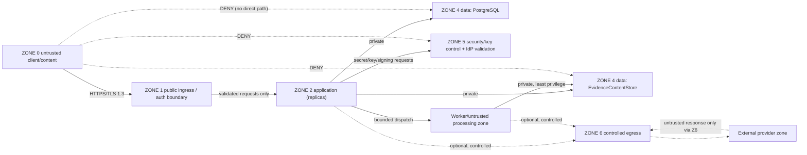
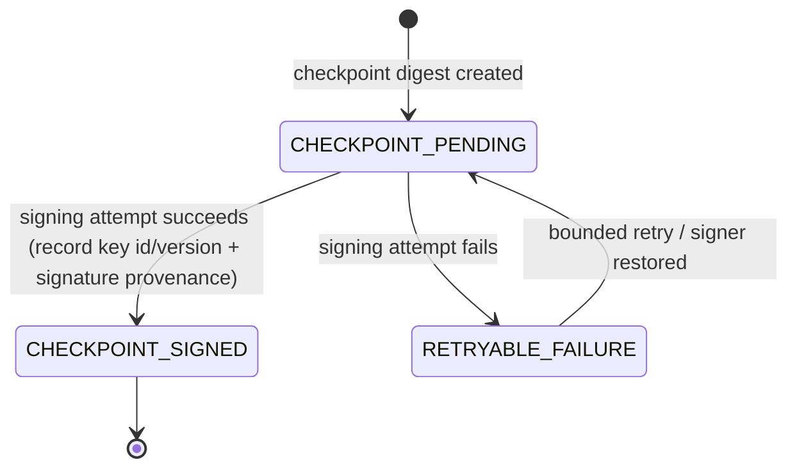
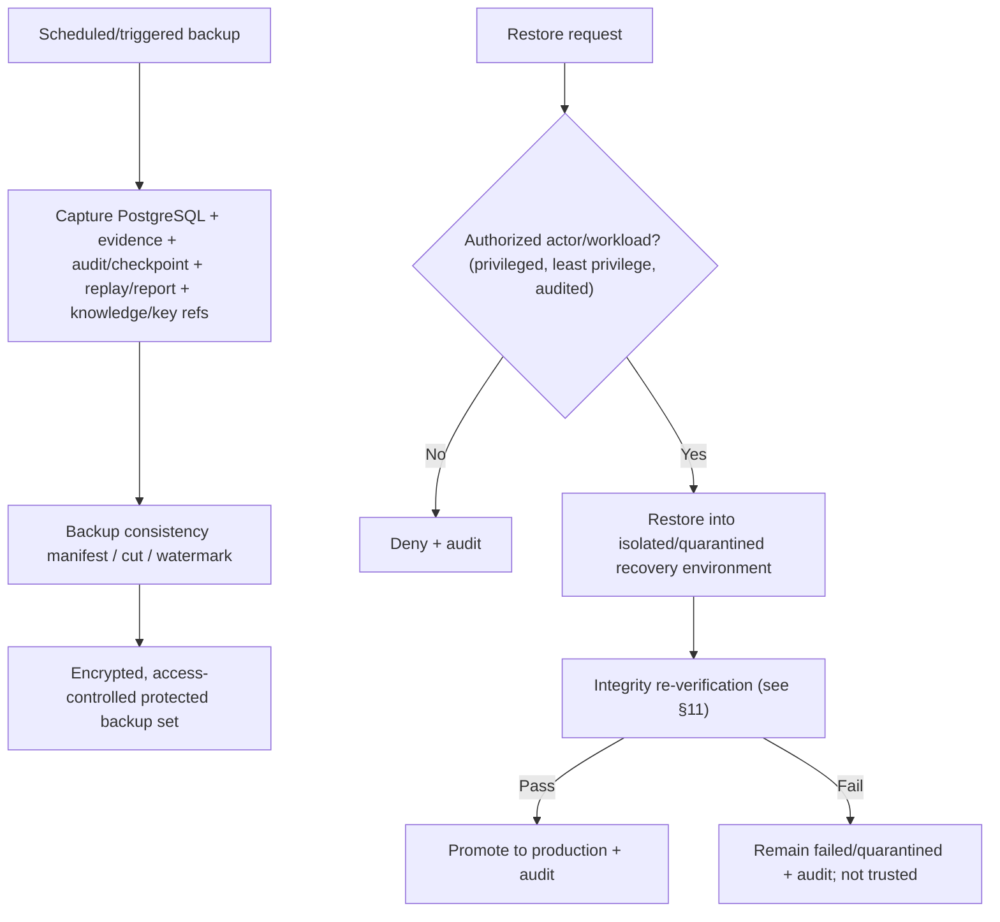

# ARCH-005 — Deployment, resilience and recovery architecture

| Field | Value |
|---|---|
| Document ID | ARCH-005 |
| Version | 1.0 |
| Status | **DECISION CANDIDATE / PROPOSED** — requires independent review and GATE-016 finalisation |
| Phase | Phase 5 — P5-WP5 deployment, resilience, recovery and runtime operations |
| Owner role | Chief Architect / Principal Security Engineer |
| Baseline | P5-WP4 merge `e83acea27293ca5037b17c20c699b0cfd099d5e5` |
| Primary decision | [ADR-0016](../../adr/ADR-0016-deployment-resilience-runtime-topology.md) (Accepted following independent review) deployment/resilience/runtime topology |
| Governing authority | [ARCH-001](ARCH-001-enterprise-architecture.md) `INV-01`…`INV-15`; [ARCH-002](ARCH-002-python-runtime-service-topology.md); [ARCH-003](ARCH-003-persistence-evidence-tamper-architecture.md); [ARCH-004](ARCH-004-security-trust-threat-model.md); [ADR-0004](../../adr/ADR-0004-knowledge-storage-architecture.md); [ADR-0007](../../adr/ADR-0007-ai-authority-and-model-strategy.md); [ADR-0008](../../adr/ADR-0008-python-runtime-service-topology.md); [ADR-0009](../../adr/ADR-0009-identity-authentication-authorization.md); [ADR-0010](../../adr/ADR-0010-evidence-storage-tamper-evidence.md) |
| Checkpoint | [GATE-016](../00-program/GATE-016-phase-5-deployment-resilience.md) |
| Closes | P5-WP4 LOW-WP4-2 (signer pending/signed), LOW-WP4-4 (restore authorisation + restored-evidence integrity) |
| Last updated | 2026-09-06 |

---

## 1. Purpose, authority and claim boundary

This document is the detailed runtime/deployment view for the decision recorded in ADR-0016: a replicated Python
modular-monolith backend with in-process Phase-3 reasoning, externalised durable state, an optional isolated
worker profile, a protected security/key/signing control boundary, deny-by-default network zones and controlled
egress, and coordinated backup with authorised, integrity-verified restore. It closes the two P5-WP5-owned WP4
LOW findings.

This is architecture only. It adds **no** container, Dockerfile, Kubernetes/Helm/Terraform, cloud resource, queue,
worker code, health endpoint, secret integration, database-failover config, backup script, or UI, and selects
**no** platform, orchestrator, queue, secret/KMS/HSM, DB-HA, object-store, or cloud vendor.

Phase 3 remains the sole decision authority (CON-003, `INV-01`/`INV-02`); Phase 4 remains optional, default-OFF,
non-authoritative (ADR-0007). `ENGINE_VERSION = 1.0.0` is unchanged. **G-09 remains OPEN.** Deployment capability
is not operational proof: no production-readiness, measured availability, zero-downtime, DR-certification,
achieved RPO/RTO, security-certification, legal-admissibility, tamper-proof-audit, or real-world detection-efficacy
claim is made.

## 2. Requirements traceability

| Authority | Deployment/resilience response |
|---|---|
| ADR-0008 modular monolith / in-process kernel | Preserved; identical replicas, no microservice split, no remote reasoning (§3, §4). |
| ADR-0010 externalised evidence/operational state | Durable authority in PostgreSQL + `EvidenceContentStore`; state-light replicas (§4). |
| ADR-0009 / ARCH-004 identity, secrets, keys, signer, egress, zones | Workload identity, `SecretProvider`, `DataKeyProvider`, `AuditCheckpointSigner`, deny-by-default zones (§5–§7). |
| ADR-0007 / FR-076 optional AI + exact fallback | Optional AI never gates deterministic readiness; provider failure → deterministic baseline (§8, §9). |
| NFR-006 TLS 1.3 / AES-256 | TLS across applicable boundaries; encrypted backups; encryption never replaces authorisation (§5, §10). |
| NFR-007 / RSK-010 no secrets/PII/raw evidence in logs | Safe operational telemetry; restore audit logs no restored raw evidence (§10, §11). |
| NFR-010 auditability | Signer lifecycle + restore audit as non-content events (§7, §11). |
| NFR-016 abuse/overload | Bounded work, admission control, backpressure (thresholds deferred) (§8.4). |
| RSK-011 evidence integrity | Restored-evidence integrity re-verification before promotion (§11). |
| RSK-017 malicious upload | Least-privilege isolated worker profile (§6). |
| RSK-018 provider dependency | Controlled egress + dependency isolation; single-provider loss does not stop the core (§8.4, §9). |
| P5-WP4 LOW-WP4-2 | Signer pending/signed lifecycle (§7.2). |
| P5-WP4 LOW-WP4-4 | Restore authorisation + restored-evidence integrity re-verification (§11). |
| P5-WP4 LOW-WP4-3 | **Not** closed here; DNS-rebinding/SSRF TOCTOU remains Phase 6 / ADR-0012 (§12). |
| RPO/RTO, OI-05 | NOT YET SPECIFIED (§10.4); retention/legal basis remain OI-05. |

## 3. Deployment topology

```mermaid
flowchart TD
    CLIENT["External client / future UI (ZONE 0)"] --> INGRESS["Generic ingress / load-balancing boundary (ZONE 1)"]

    subgraph APP["Application zone (ZONE 2) — one backend release, N identical replicas"]
        R1["Backend replica A — in-process Phase-3 kernel + immutable bundle"]
        R2["Backend replica B — in-process Phase-3 kernel + immutable bundle"]
        RN["Backend replica N — ..."]
    end
    INGRESS --> R1
    INGRESS --> R2
    INGRESS --> RN

    subgraph WORKER["Worker/untrusted processing zone — optional least-privilege profile"]
        W1["Worker profile (same release family): OCR / extraction / heavy report / enrichment"]
    end
    R1 -. "bounded work dispatch (no queue product selected)" .-> W1
    R2 -. .-> W1

    subgraph DATA["Data zone (ZONE 4) — private to authorized workloads"]
        PG["PostgreSQL — operational records, manifests, audit chain"]
        ECS["EvidenceContentStore — encrypted evidence bytes"]
    end

    subgraph SEC["Security / key control zone (ZONE 5)"]
        SECRET["SecretProvider (deployment secret boundary)"]
        KEY["DataKeyProvider (data-encryption key ops)"]
        SIGNER["AuditCheckpointSigner (signing key ops)"]
        IDP["External OIDC IdP (pluggable)"]
    end

    subgraph EGRESS["Controlled egress zone (ZONE 6)"]
        ADP["Egress adapter (approved destinations only)"]
    end
    PROV["OPTIONAL external provider: AI / threat-intel / reporting"]

    R1 --> PG
    R1 --> ECS
    W1 --> ECS
    R1 --> SECRET
    R1 --> KEY
    R1 --> SIGNER
    R1 -->|"validate tokens"| IDP
    R1 -.->|"optional, default OFF"| ADP
    W1 -.-> ADP
    ADP -.-> PROV
```

The large application box is one release running as identical replicas — a replica is not a microservice. Stores,
security controls, the signer and providers are outside the application zone. No vendor/product/logo appears.

## 4. Replica, state and rollout model

### 4.1 State placement

| State | Placement | Authority |
|---|---|---|
| Immutable knowledge bundle | Process memory (per replica) after verified load | Read-only projection of ADR-0004 bundle |
| Bounded caches / in-flight request/work state / ephemeral computation | Process memory | Never sole durable authority |
| Case ownership, evidence, `DetectionResult`, audit history, role-authorisation state, retention state | External stores (ADR-0010) | Durable authoritative |

Replicas are state-light: a crashed replica loses only ephemeral state; a healthy replica serves subsequent
independent requests, and no completed `DetectionResult` is ever reconstructed from process memory.

### 4.2 Sessions

No proprietary sticky-session requirement: requests may reach any replica and authorisation is re-evaluated
server-side per ADR-0009. Any future ephemeral session/cache is never decision authority. **Redis is not
selected.**

### 4.3 Knowledge-load gating

A replica becomes ready only after verifying a compatible immutable bundle (digest + schema/runtime
compatibility). Missing/corrupt/mismatched/incompatible knowledge fails closed — the replica does not serve
evaluation using guessed or latest content. Each evaluation pins the exact bundle/version/digest. This does not
redesign ADR-0004 or reserved ADR-0013.

### 4.4 Mixed-version rollout safety

Temporary mixed versions during controlled rollout are acknowledged. Because every completed evaluation pins
`ENGINE_VERSION`, bundle and profile/config provenance, completed results are never reinterpreted across versions;
rollout must avoid incompatible request/artifact formats between replicas. Release/rollback must not rewrite
completed historical results, silently substitute older knowledge for replay, or invalidate persisted evaluation
provenance. Rollout platform and blue/green/rolling mechanism are deferred; Phase-6 database migrations (reserved
ADR-0011) must be compatible with safe rollout/rollback.

## 5. Network zones and connectivity



**Deny by default.** Public ingress reaches only the application tier. PostgreSQL, `EvidenceContentStore`,
secret/key controls and the `AuditCheckpointSigner` are private to authorised workloads and are **never** directly
reachable from public ingress. External providers are reachable only through the controlled egress adapter. TLS
1.3 applies where boundaries cross applicable networks (NFR-006); encryption does not remove any authorisation
requirement. No firewall/WAF/service-mesh/egress product is selected.

## 6. Worker execution profile

The optional worker profile runs heavy/untrusted work (OCR, document/image extraction, large report generation,
controlled enrichment, other bounded long-running evidence processing) from the same release family with:

- a distinct least-privilege **workload identity** (non-human; never a human credential);
- resource limits and bounded concurrency;
- ARCH-004 malicious-upload isolation — no unrestricted filesystem, network, database, secrets, or host
  privileges; media-type validation beyond extension; bounded size/dimensions/decompression; no dynamic
  execution of submitted content;
- a conceptual **bounded work-dispatch** mechanism (no queue product selected).

A worker profile is justified by resource isolation, malicious-content isolation, long-running work, availability
protection, or bounded concurrency. It is an execution/isolation profile, **not** automatically a separately owned
service; independent service extraction still requires ARCH-002 §11 evidence criteria and a new ADR (ADR-0008 not
weakened). Workload credentials are preferably deployment-provided and short-lived; static long-lived shared
credentials are not preferred and, if unavoidable, must be protected/rotated/least-privileged. No SPIFFE / cloud
IAM / managed-identity / orchestrator-service-account product is required.

## 7. Security control placement

### 7.1 Secrets and keys

Operational secrets (DB, object-store, OIDC client, provider, signing credentials, encryption-key references)
arrive from a protected `SecretProvider`/deployment-secret boundary as references or runtime-injected access, and
are **never** baked into artifacts/images, stored in Git or general PostgreSQL rows, or logged. Data-encryption
and signing key operations live in the protected security zone behind conceptual `DataKeyProvider` and
`AuditCheckpointSigner` ports; the backend cannot possess or export raw master/signing private-key material
(ARCH-004 §7, key-purpose separation preserved). Secret/key mechanism unavailability fails affected protected
operations closed — no plaintext fallback, default hard-coded key, or disabled-encryption fallback. No
secret-manager or KMS/HSM vendor is selected.

### 7.2 Audit-checkpoint signer lifecycle (closes LOW-WP4-2)



Critical rules:

- an unsigned checkpoint is **never** labelled signed; there is **no** fake signature and **no** unsigned-as-signed
  fallback;
- a failed signing is visible as operational/security state (`CHECKPOINT_PENDING` / `RETRYABLE_FAILURE`), not
  silently suppressed;
- append-only application audit may continue while signing is temporarily unavailable, subject to future
  operational policy;
- a successful signature records key id/version + signature provenance;
- signer availability/failure is an explicit observable (§13); **P5-WP6** owns alert thresholds, maximum
  acceptable pending age, and the runbook — not invented here.

### 7.3 Signer custody

`AuditCheckpointSigner` identity/credentials/key access is separated from ordinary backend DB-write access and
ordinary application credentials, and requires no raw-evidence browsing, rule publication, or identity
administration (least privilege; ARCH-004 §7.5).

## 8. Health, load and lifecycle

### 8.1 Health-model matrix

| Probe | Question | Example checks | Must NOT |
|---|---|---|---|
| **Startup** | Can this process safely initialise? | config parse; knowledge-bundle validation; required crypto/config references available | mark ready before knowledge is verified |
| **Liveness** | Is this process internally functioning? | internal event loop / worker threads healthy | depend blindly on every external provider |
| **Readiness** | Can this instance safely accept the relevant workload? | required persistence/security dependencies reachable; bundle loaded | become ready without required dependencies |
| **Optional dependency health** | Is an optional provider available? | AI provider reachability (informational) | gate deterministic readiness on optional AI |
| **Degraded capability** | Which capabilities are reduced? | AI extraction unavailable → deterministic-only; worker backlog high → heavy tasks deferred | present degraded mode as a safe/clean result |

### 8.2 Optional vs required dependencies

Optional AI provider outage **must not** make the deterministic baseline unready or unavailable; Phase-4 fallback
(ADR-0007, FR-076) keeps normal deterministic operation. Readiness must never contradict Phase-4 semantics.
Required dependencies (PostgreSQL, `EvidenceContentStore`, key operation, identity validation) unavailable → the
operation fails closed as infrastructure/application failure; it never returns `NO_SCAM_PATTERN`, a safe
classification, or claimed durable completion.

### 8.3 Graceful shutdown and instance failure

Graceful shutdown: stop accepting new work → drain/complete bounded in-flight operations where safe →
checkpoint/reconcile state → terminate. Incomplete in-flight persistence relies on idempotency/reconciliation
(ADR-0010 §14), never fabricated completion. If a replica crashes mid-request, another healthy replica serves
subsequent independent requests; durable state comes from the accepted persistence architecture, not process
memory.

### 8.4 Overload, timeouts, retries, backoff, circuit isolation

- **Bounded work:** request size limits, bounded concurrency, bounded worker concurrency, timeout budgets,
  admission control, and backpressure/rejection under overload.
- **Timeouts:** every external/dependency interaction (provider, evidence store, DB, signing, restore-verification
  step, enrichment) has a bounded timeout; nothing is unbounded.
- **Retries:** bounded, operation-aware, idempotency-aware (WP3 idempotency principles); non-idempotent operations
  are never blindly retried; no infinite loops or retry storms.
- **Backoff/jitter:** bounded exponential-style backoff with jitter as a principle.
- **Circuit/dependency isolation:** a generic circuit-breaker/dependency-isolation pattern for unstable providers;
  a provider circuit opening never alters decision authority.

Exact HTTP status codes, queue lengths, thread counts, rate limits, timeout values and backoff schedules are
deferred to WP6/Phase 6; no numbers are invented here.

## 9. Failure / degradation matrix

| Failure | Impact | Safe behavior | Decision-authority effect | Recovery owner |
|---|---|---|---|---|
| Backend replica failure | One replica lost | Ingress routes to healthy replicas; in-flight work relies on idempotency/reconciliation | None — no completed result rebuilt from memory | P5-WP5 architecture / P5-WP6 ops |
| PostgreSQL failure | Durable operational store unavailable | Operations needing durable state fail as infra/app failure; no fabricated completion; no lost audit/result silently | None — Phase-3 semantics separate from persistence | P5-WP5 / P5-WP6 |
| `EvidenceContentStore` failure | Evidence bytes unavailable | Affected evidence operations fail explicitly; no stale/unverified substitute; failure not read as "safe" | None | P5-WP5 / P5-WP6 |
| Knowledge bundle failure (missing/corrupt/mismatch/incompatible) | Replica cannot serve governed evaluation | Fail closed at startup/readiness or evaluation; no guessed/latest content | Evaluation blocked, never `NO_SCAM_PATTERN` | ADR-0004 / P5-WP6 |
| IdP failure | Authentication uncertain | Fail closed; no auth bypass; no protected op from unverifiable identity | None | ADR-0009 / P5-WP6 |
| Secret/key mechanism failure | Protected ops cannot run | Fail closed; no plaintext/default-key/disabled-encryption fallback | None | ARCH-004 / P5-WP6 |
| AI/provider failure | Optional extraction unavailable | Deterministic baseline continues (Phase-4 exact fallback); readiness unaffected | Unchanged — AI non-authoritative | ADR-0007 / P5-WP6 |
| Audit signer failure | Checkpoints cannot be signed | `CHECKPOINT_PENDING` / `RETRYABLE_FAILURE`; never signed success; append-only audit continues | None | §7.2 / P5-WP6 (thresholds) |
| Worker failure | Heavy/optional task fails | Task fails/retried under idempotency; interactive deterministic path unaffected | None | P5-WP5 / P5-WP6 |
| Backup failure | Backup set incomplete | Do not mark backup complete; surface operational failure; retain last good set | None | P5-WP5 / P5-WP6 |
| Restore verification failure | Restored set not trustworthy | Restore stays failed/quarantined; not promoted to production | None — untrusted data never serves decisions | P5-WP5 / P5-WP6 |
| Egress failure | External provider unreachable | Controlled-egress failure contained; deterministic core unaffected; no arbitrary retry to Internet | None | ARCH-004 / P5-WP6 |

## 10. Backup architecture

### 10.1 Scope

Coordinated backup covers PostgreSQL, `EvidenceContentStore`, audit/checkpoint state, replay/report artifacts,
knowledge bundle/version references required for reproduction, and key/version references. Backup content is
protected equivalently to source sensitivity.

### 10.2 Cross-store consistency

PostgreSQL and `EvidenceContentStore` cannot assume a single atomic storage snapshot. A conceptual backup
**manifest / cut / watermark** records enough consistency metadata to determine which DB state, which evidence
objects, which audit/checkpoint state, and which knowledge/version references belong to the recoverable set.
Exact implementation is deferred.

### 10.3 Backup encryption and credentials

Backups containing sensitive data require AES-256 encryption and authorisation equivalent to their sensitivity
(NFR-006). Backup credentials must not become universal application credentials (least privilege). No backup
product is selected.

### 10.4 RPO / RTO and disaster recovery

**RPO = NOT YET SPECIFIED. RTO = NOT YET SPECIFIED** (P5-WP6 / sponsor operational requirements). DR is principle
only: backup restoration, integrity re-verification, configuration/bundle reconstruction, key-reference recovery,
and controlled traffic re-entry. No region/AZ count, cloud DR product, or active-active multi-region is chosen.
Stateful stores require an eventual resilience/failover mechanism appropriate to the chosen environment, without
selecting a clustering/replication/managed-service/synchronous-replication factor here.

### 10.5 Backup / restore flow



## 11. Restore authorisation and restored-evidence integrity (closes LOW-WP4-4)

### 11.1 Restore authorisation

Restore is a privileged security operation, not an application-user action. It requires: an explicit authorised
actor/workload; least privilege; auditable initiation; target-environment identification; a restore reason/change
reference where governed; controlled execution; and post-restore verification. An ordinary application user must
not trigger an infrastructure restore.

### 11.2 Restore isolation

Restored state is verified **before** it receives normal production traffic — via an isolated recovery
environment, quarantined restore state, or an equivalent gated process. No platform is selected.

### 11.3 Restored-evidence integrity re-verification

A restore is **not** successful merely because files/DB rows exist. Before promotion, re-verify as applicable:
PostgreSQL relational consistency; evidence object coverage; evidence SHA-256 digests; manifest linkage;
derivative lineage; `DetectionResult` digest; replay/report pins; audit chain/checkpoints; knowledge bundle
digest/availability; and required key-version references. On failure the restore remains failed/quarantined and
restored data is never returned as trusted.

### 11.4 Restore audit

Record non-sensitive security/audit metadata for: restore requested; restore authorised; restore started; restore
verification outcome; restore promoted/rejected. Restored **raw evidence is never logged** (NFR-007).

## 12. Egress and SSRF boundary

Controlled egress is deny-by-default (ARCH-004 §8): only controlled adapters may reach approved external
destinations, and no arbitrary Internet access is permitted from the reasoning kernel, worker, database, evidence
store, or signer. **LOW-WP4-3 is not closed here** — DNS-rebinding / resolve-time SSRF TOCTOU validation remains
Phase 6 / ADR-0012; this WP only preserves the controlled-egress/network-zone boundary.

## 13. Environments, artifacts, configuration and observability handoff

### 13.1 Environments and data

Conceptual separation of development, test, staging/pre-production and production where applicable, with separated
credentials, secret/key references, sensitive production evidence, and provider configuration. Production sensitive
evidence must not be casually copied to lower environments; any production-derived data requires an explicit
governed masking/authorisation policy (not designed here). The exact number of environments may vary with project
constraints.

### 13.2 Artifacts and configuration

Deploy immutable/versioned application artifacts; runtime code does not mutate deployed executable artifacts
(package format deferred; not Docker). Non-secret configuration is separated from secret/key references and is
version-identifiable where it materially affects runtime behaviour; decision semantics continue to use governed
profile/config provenance.

### 13.3 Observability handoff (WP6 owns thresholds)

WP5 defines **what** must be observable; **P5-WP6** defines metrics, logs, traces, alerts, SLOs, runbooks and
thresholds. Observable signals include: replica readiness; dependency state; worker backlog/concurrency; signer
pending state; backup success/failure; restore verification outcome; key/secret dependency errors; and
reconciliation failures.

## 14. Builder self-challenge

| Challenge | Answer |
|---|---|
| Why multiple replicas if current workload is small? | To provide application-tier availability and rolling-change headroom; the architecture supports one replica for low-demand/dev and scales out only where availability/throughput requires it — no minimum count is invented. |
| Why does multiple replicas not violate ADR-0008? | Identical replicas of one modular-monolith release are not microservices; there is no semantic split, no remote reasoning, and no second decision path. |
| What state is allowed in process memory? | Immutable knowledge bundle, bounded caches, in-flight state, safe config, ephemeral computation — never sole authority for case/evidence/result/audit/role/retention state. |
| What happens if one replica dies mid-request? | Another healthy replica serves subsequent independent requests; in-flight work relies on idempotency/reconciliation; no completed result is rebuilt from memory. |
| What if PostgreSQL fails after Phase 3 computes a result? | It is an infrastructure/application failure; the semantics are unchanged but durable completion is not claimed; an idempotent retry persists the exact calculated artifact (ADR-0010). |
| What if `EvidenceContentStore` fails? | Affected evidence operations fail explicitly; no stale/unverified substitute; failure is never read as "safe". |
| What makes an instance ready? | Verified knowledge bundle plus reachable required persistence/security dependencies; readiness fails closed otherwise. |
| Should AI provider outage make backend unready? | No — optional AI never gates deterministic readiness; the deterministic baseline continues under Phase-4 fallback. |
| What happens when the signer is unavailable? | Checkpoints stay `CHECKPOINT_PENDING` / `RETRYABLE_FAILURE`; never signed success; append-only audit continues; WP6 owns time-based policy. |
| How is an unsigned checkpoint distinguished from signed? | Explicit lifecycle states; a signed checkpoint records key id/version + signature provenance; no unsigned-as-signed fallback. |
| Who can authorise restore? | A privileged, least-privilege, audited actor/workload — never an ordinary application user. |
| How is restored evidence re-trusted? | Only after quarantined integrity re-verification (digests, manifests, lineage, result/replay/report pins, audit chain, knowledge digest, key-version references) passes. |
| Can a restore become production before digest verification? | No — promotion is blocked until verification passes; otherwise it stays failed/quarantined. |
| How are PostgreSQL and evidence backup cuts correlated? | Via a backup consistency manifest/cut/watermark recording which DB/evidence/audit/knowledge-version state belongs to the recoverable set. |
| Can secret/key failure cause plaintext fallback? | No — protected operations fail closed; no plaintext/default-key/disabled-encryption fallback. |
| What happens during mixed-version rollout? | Completed results pin engine/bundle/profile and are not reinterpreted; replicas must keep compatible request/artifact formats; rollback never rewrites history. |
| Why is heavy-worker isolation not automatically microservices? | It is an execution/isolation profile of the same release; separation of a service still needs ARCH-002 §11 evidence and a new ADR. |
| What concrete evidence would require a separate service? | One or more ARCH-002 §11 drivers (independent scaling, failure/security isolation, distinct resource profile, release independence, ownership, regulatory/SLO, technology constraint) plus a new ADR. |

## 15. Deferred decisions and handoff

| Owner | Deferred decision |
|---|---|
| P5-WP6 | Metrics/logs/traces/alerts/SLOs/runbooks/thresholds; max pending-checkpoint age; RPO/RTO objectives; readiness/timeout/backoff values |
| Phase 6 / ADR-0011 | Database migration tooling compatible with safe rollout/rollback |
| Phase 6 / ADR-0012 | Threat-intelligence/URL adapter and DNS-rebinding/SSRF-TOCTOU controls (LOW-WP4-3) |
| Phase 6 | Deployment platform, orchestrator, queue, secret/KMS/HSM, DB-HA/object-store products; health/backup/restore implementation; rollout mechanism |
| Sponsor + P5-WP6 | RPO/RTO, availability objectives; environment count |
| Sponsor + legal / OI-05 | Retention duration, legal basis, permitted post-deletion residual metadata |

No deployment, container, orchestrator, queue, worker, health, secret, backup, or failover implementation is
created by this WP; these are architecture artifacts only.

## 16. Acceptance boundary and non-claims

ADR-0016 is **Accepted following independent review** (APPROVE; BLOCKER 0 / HIGH 0 / MEDIUM 0 / LOW 2 / INFO 2, the
LOW/INFO items recorded as follow-ups in GATE-016 §3.1); ARCH-005 and GATE-016 remain **Decision Candidates**
pending remote CI and merge. They become fully authoritative only after canonical local gate PASS, CI self-test
PASS, remote CI PASS where triggered, and merge to `main`. GATE-016 is a P5-WP5 checkpoint, not Phase-5 closure.

This document makes **no** claim of production readiness, measured or five-nines availability, zero downtime,
disaster-recovery certification, achieved RPO/RTO, security certification, legal admissibility, tamper-proof audit,
or real-world detection efficacy. Architecture capability is not operational proof. Phase-3 and Phase-4 authority
and semantics are unchanged, `ENGINE_VERSION = 1.0.0`, and **G-09 remains OPEN**.
