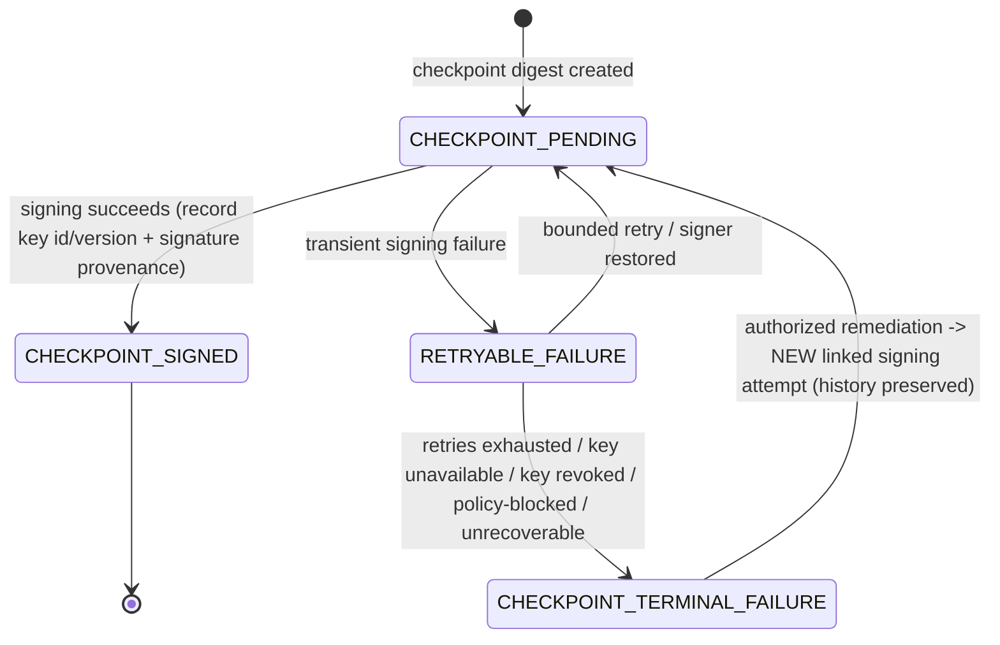
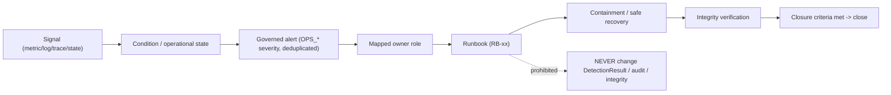
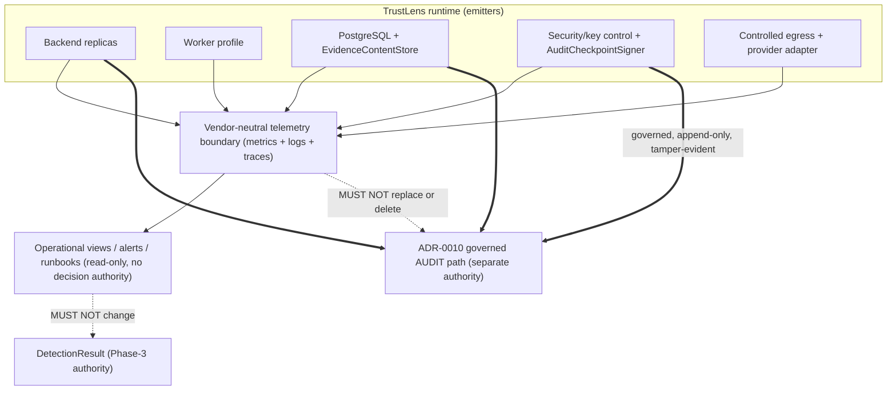
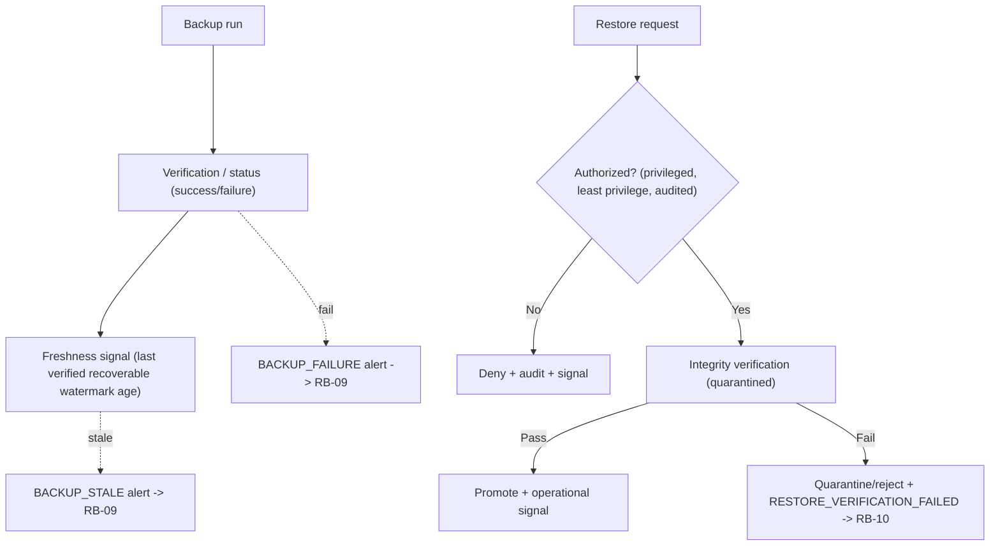

# ARCH-006 — Observability and operational readiness architecture

| Field | Value |
|---|---|
| Document ID | ARCH-006 |
| Version | 1.0 |
| Status | **DECISION CANDIDATE / PROPOSED** — requires independent review and GATE-017 finalisation |
| Phase | Phase 5 — P5-WP6 observability, operability and operational readiness |
| Owner role | Chief Architect / Principal Security Engineer |
| Baseline | P5-WP5 merge `2d348edd8a7c3e3df4059ff62c033d817be80521` |
| Primary decision | [ADR-0017](../../adr/ADR-0017-observability-operational-readiness.md) (Accepted following independent review) observability/operational readiness |
| Governing authority | [ARCH-001](ARCH-001-enterprise-architecture.md) `INV-01`…`INV-15`, §15; [ARCH-002](ARCH-002-python-runtime-service-topology.md); [ARCH-003](ARCH-003-persistence-evidence-tamper-architecture.md); [ARCH-004](ARCH-004-security-trust-threat-model.md); [ARCH-005](ARCH-005-deployment-resilience-recovery.md); [ADR-0004](../../adr/ADR-0004-knowledge-storage-architecture.md); [ADR-0007](../../adr/ADR-0007-ai-authority-and-model-strategy.md); [ADR-0009](../../adr/ADR-0009-identity-authentication-authorization.md); [ADR-0010](../../adr/ADR-0010-evidence-storage-tamper-evidence.md); [ADR-0016](../../adr/ADR-0016-deployment-resilience-runtime-topology.md) |
| Checkpoint | [GATE-017](../00-program/GATE-017-phase-5-observability-operations.md) |
| Closes | P5-WP5 LOW-WP5-1 (terminal operational signer-failure state) |
| Last updated | 2026-09-06 |

---

## 1. Purpose, authority and claim boundary

This document is the detailed WP6 architecture for the decision in ADR-0017: vendor-neutral metrics + structured
logs + traces/correlation, explicit health/dependency states, governed operational alerts, and runbook-driven
response — with operational telemetry strictly separated from the governed audit mechanism and from decision
authority. It closes the P5-WP5-owned LOW-WP5-1 finding by adding a terminal operational signer-failure state.

This is architecture only. It adds **no** telemetry SDK, logging library, trace exporter, metrics/health endpoint,
dashboard, alert rule, collector/agent config, pager integration, runbook automation, or UI, and selects **no**
observability vendor. Prometheus, Grafana, OpenTelemetry, Elastic, Splunk, Datadog, CloudWatch, Azure Monitor,
Google Cloud Monitoring, New Relic, Sentry, Jaeger, Zipkin, PagerDuty and Opsgenie appear only as clearly
non-selected examples.

Phase 3 remains the sole decision authority (CON-003, `INV-01`/`INV-11`); Phase 4 remains optional, default-OFF,
non-authoritative (ADR-0007). Telemetry never sets, overrides, reinterprets, blocks, or reconstructs a
`DetectionResult`. `ENGINE_VERSION = 1.0.0` is unchanged. **G-09 remains OPEN**: aggregate classification counts
are descriptive operational distributions only and are never accuracy, precision, recall, false-positive/negative
rate, detection rate, or real-world effectiveness. No production-readiness, measured/five-nines availability,
zero-downtime, achieved RPO/RTO, DR/security/compliance certification, legal-admissibility, or tamper-proof-logging
claim is made.

## 2. Requirements traceability

| Authority | Observability response |
|---|---|
| ARCH-001 §15 structured logs / correlation / metrics / health | Three-signal architecture + health/dependency signals (§3, §7, §10) |
| ADR-0010 governed audit | Telemetry ≠ audit; audit stays append-only/tamper-evident and authoritative (§4) |
| CON-003 / NG-07 / `INV-01` | Telemetry outside decision authority; no decision reconstruction from telemetry (§4, §5) |
| NFR-007 / RSK-010 | Privacy-by-construction; no raw evidence/secrets/PII/URL content in telemetry (§6) |
| NFR-010 auditability | Break-glass and security actions emit governed audit **and** operational signal (§11.5, §12) |
| NFR-016 abuse | Abuse/overload observability signals (§14.2) |
| ARCH-004 STRIDE / safe logging | Security-operational signals; safe error/log handling preserved (§12) |
| ARCH-005 handoff (readiness, signer, backup/restore, reconciliation, RPO/RTO, thresholds) | Signal domains + signer terminal failure + SLI/SLO + RPO/RTO frameworks (§7–§10, §13) |
| ADR-0007 / FR-076 optional AI | Optional-AI observability separated from core health/SLO (§11.4, §7.2, §10.3) |
| ADR-0004 / reserved ADR-0013 | Knowledge/CI observability is read-only status; publication authority unchanged; ADR-0013 → WP7 (§11.6, §17) |
| G-09 / RSK-003 | Classification distributions descriptive only; no efficacy metric (§1, §11.4) |
| OI-05 | Telemetry retention configurable; duration NOT YET SPECIFIED (§15.1) |

## 3. Three-signal architecture

| Signal | Answers | Form | Key controls |
|---|---|---|---|
| **Metrics** | *That* something is wrong; trends/rates | Bounded-cardinality counters/gauges/histograms (conceptual) | Bounded labels only (§6.3) |
| **Structured logs** | *What* happened for an operation | Categorical structured records | No sensitive free-text (§6.4) |
| **Traces / correlation** | *Where* across replica/worker/egress | Correlated spans; may be sampled | No remote Phase-3 (§6.5) |

Metrics alone lack per-incident context and correlation; logs alone lack aggregate/latency visibility and are easy
to leak into; only the three together give diagnosis + failure-localisation + correlation. All three are
vendor-neutral concepts behind portable contracts.

## 4. Telemetry vs governed audit (critical separation)

| Aspect | Governed audit (ADR-0010) | Operational telemetry (this doc) |
|---|---|---|
| Role | Security/history/custody/accountability | Operational health/diagnostics |
| Semantics | Append-only, tamper-evident chain/checkpoints | May be aggregated, sampled, expired under policy |
| Authority | Evidence/custody authority | **Not** evidence, custody, or decision authority |
| Loss behaviour | Fail-closed (WP3/WP4 semantics preserved) | Contained degradation (§5) |

Telemetry loss must **never** silently delete or replace required audit history. General application logs are
**not** "audit logs" unless within the governed audit mechanism. Metrics/logs/traces are **never** the
authoritative reconstruction of `DetectionResult`, evidence, audit history, or knowledge state — those remain with
their accepted stores/artifacts.

## 5. Telemetry failure behaviour

- General metrics/log/trace backend outage → operational `OBSERVABILITY_DEGRADED` (or equivalent). It **must not**
  change classification, severity, risk, confidence, governing rule, or actions, and **must not** produce
  `NO_SCAM_PATTERN`, safe, clean, or successful-integrity.
- Telemetry emission is **bounded and failure-contained**: bounded buffering, sampling, dropping lower-priority
  telemetry after bounds, and an explicit telemetry-loss/degraded signal — but a general telemetry sink outage
  never causes unbounded application blocking, and telemetry export is **never** a synchronous network dependency
  of Phase 3.
- **Audit failure is different (§4):** if an operation requires governed audit persistence and that fails, existing
  WP3/WP4 fail-closed semantics apply; audit failure is never treated as ordinary dropped telemetry and append-only
  requirements are not weakened. No queue/broker is selected.

## 6. Correlation, privacy and cardinality

### 6.1 Correlation model

Vendor-neutral fields (not all required for every signal): `correlation_id`, `trace_id`, `span_id`,
`operation_name`, `component`, `environment`, `release_version`, `ENGINE_VERSION` (where relevant),
`knowledge_bundle_version` (where relevant), `outcome`, `categorical_error_code`, `duration`. Opaque IDs may be
used where ARCH-003 already allows them.

### 6.2 Privacy (critical)

General operational telemetry **excludes**: raw evidence; full user messages; screenshots; raw uploaded files; AI
request bodies containing user content; AI response bodies containing user content; passwords; access tokens;
refresh tokens; API keys; private keys; OTP; PIN; PAN; bank/account data; unnecessary PII; secret values (ARCH-003
§16, ARCH-004 §9 preserved). Full attacker-controlled submitted **URLs are not logged by default** — prefer
categorical source/type, opaque references, safe destination category, or approved-host classification where
governed; telemetry storage must not become a sensitive-content replica.

### 6.3 Metric cardinality

Metrics must **not** use unbounded labels (`case_id`, `evidence_id`, `user_id`, `trace_id`, full URL, message
content). Bounded dimensions only: `component`, `operation`, `status`, `error_category`, `dependency`,
`environment`, `release_version`, `capability_mode`.

### 6.4 Structured logging

Each meaningful log record conceptually carries: `timestamp`, operational `level`/severity, `component`,
`operation`, correlation reference, categorical `event`/`error_code`, and `outcome` — avoiding sensitive free-text.

### 6.5 Tracing

Trace/correlation spans public request → backend replica → persistence → worker dispatch → worker execution →
controlled egress → provider call. **Phase-3 reasoning stays in-process; tracing must not create or imply a remote
Phase-3 service.** Tracing may be sampled, but sampling must not change application decisions, remove governed
audit, or be presented as full custody/history evidence; sampling rates are NOT YET SPECIFIED.

## 7. Operational severity and health observability

### 7.1 Operational severity (separate namespace)

`OPS_CRITICAL` / `OPS_HIGH` / `OPS_MEDIUM` / `OPS_LOW` / `OPS_INFO` describe system/operator urgency and are
**independent** of TrustLens `DetectionResult` severity (governed scam-risk reasoning). PostgreSQL unavailable is
an OPS incident, not a `CRITICAL` scam result (§11).

### 7.2 Health model (WP5 preserved, not redesigned)

| State | Observable signals | Alert semantics |
|---|---|---|
| Startup | config parse; knowledge validation; required crypto/config references | startup failure → init incident |
| Liveness | internal function healthy | liveness failure → process unhealthy |
| Readiness | required persistence/security deps reachable; bundle loaded | readiness failure → instance removed/not eligible |
| Optional dependency health | optional AI reachability (informational) | optional failure → degraded optional capability (not total outage) |
| Degraded capability | AI-off deterministic-only; worker backlog high | degraded ≠ safe/clean result |

### 7.3 Dependency-health categories

`HEALTHY` / `DEGRADED` / `UNAVAILABLE` / `UNKNOWN`. `UNKNOWN` is **never** silently interpreted as `HEALTHY`.
**Optional AI outage is never treated as core outage** and never gates deterministic readiness.

## 8. Signer operational lifecycle and terminal failure (closes LOW-WP5-1)

`CHECKPOINT_TERMINAL_FAILURE` means the current automatic signing lifecycle cannot safely succeed without explicit
remediation (retries exhausted, key permanently unavailable, key revoked, policy-blocked, or unrecoverable signer
error).

**Terminal-failure invariants:**

- terminal failure **never** becomes signed success automatically; **no** fabricated signature;
- the original failure remains auditable; a later remediation/new signing attempt preserves history;
- replacing/recovering a key does **not** rewrite old failure events;
- previously signed checkpoints remain signed and unchanged;
- terminal state generates an operational/security signal.

**Remediation (concept, not implementation):** authorised remediation → root cause resolved → new governed /
linked signing attempt → success or new failure. Historical terminal failure is **never** silently mutated into a
past success. **Pending age is measurable, but the maximum acceptable pending age is NOT YET SPECIFIED** (sponsor/
operational evidence; owner: Platform + Security Operations).

## 9. Signal catalog

Type key: **M** metric · **L** log · **T** trace · **S** state · **A→** references governed audit (not itself
audit). Every signal obeys the §6.2 forbidden-content rules.

| Domain | Signal | Type | Purpose | Safe dimensions | Owner | Alert / runbook |
|---|---|---|---|---|---|---|
| Application | replica startup / liveness / readiness | S,M | eligibility for workload | component, status, env, release | Platform Ops | NO_READY_BACKEND → RB-01 |
| Application | request volume / errors / latency | M,L,T | throughput & error health | component, operation, status, error_category | Platform Ops | RB-01/RB-12 |
| Application | overload/admission rejection; graceful shutdown | M,S | backpressure visibility | operation, status, capability_mode | Platform Ops | WORKER/APP saturation → RB-12 |
| Knowledge | bundle load success/failure; digest mismatch; incompatible bundle; activation/version state | S,M,L | knowledge readiness | component, status, error_category, bundle_version | Knowledge Governance | KNOWLEDGE_BUNDLE_INVALID → RB-04 |
| Persistence | PostgreSQL dependency state | S,M | durable-store health | dependency, status | Data/Storage Ops | POSTGRESQL_UNAVAILABLE → RB-02 |
| Persistence | EvidenceContentStore state | S,M | evidence-store health | dependency, status | Data/Storage Ops | EVIDENCE_STORE_UNAVAILABLE → RB-03 |
| Persistence | persistence failures; reconciliation failures; orphan/incomplete ops | M,L,S | integrity/reconcile visibility | operation, status, error_category | Data/Storage Ops | RECONCILIATION_FAILURE → RB-11 |
| Workers | worker health; bounded-work backlog; failures; processing duration; admission/backpressure | M,S,L | heavy-work health | component, operation, status | Platform Ops | WORKER_SATURATION → RB-12 |
| Identity/Security | identity validation failures; authorization denials; break-glass use/expiry; secret/key dependency failure; suspicious privilege state | M,L,S,A→ | security-operational visibility | component, operation, status, error_category | Security Ops | AUTH/SECRET_KEY dependency → RB-05/RB-06; RB-14 |
| Signer | CHECKPOINT_PENDING/SIGNED; RETRYABLE_FAILURE; CHECKPOINT_TERMINAL_FAILURE; pending age; signing failures; key/version reference | S,M,A→ | audit-signing health | component, status, key_version (bounded) | Security Ops | SIGNER_PENDING_TOO_LONG → RB-07; SIGNER_TERMINAL_FAILURE → RB-08 |
| Backup/Restore | backup started/completed/failed; freshness/age; last verified backup; restore requested/authorized/verification pass-fail/promoted-rejected | S,M,A→ | recoverability visibility | operation, status, freshness_bucket | Data/Storage Ops | BACKUP_FAILURE/STALE → RB-09; RESTORE_VERIFICATION_FAILED → RB-10 |
| Egress/Providers | controlled-egress health; provider availability/timeout; provider validation rejection; circuit/isolation state | M,S,L | provider dependency health | dependency, status, error_category | Platform Ops | CONTROLLED_EGRESS_FAILURE → RB-13 |
| AI | optional AI available/unavailable; extraction success/rejection/error; fallback to deterministic-only | M,S | optional-capability health (non-authoritative) | dependency, status, capability_mode | Platform Ops | OPTIONAL_AI_DEGRADED → RB-13 |
| Telemetry | telemetry pipeline health; telemetry loss/degraded | S,M | self-observability | component, status | Platform Ops | TELEMETRY_PIPELINE_DEGRADED → RB-15 |

AI health is **never** confused with core decision-engine health, and there is **no** AI "scam confidence" metric.

## 10. SLI / SLO / RPO / RTO frameworks

### 10.1 Candidate SLI classes

Backend request success; backend request latency; ready-replica availability; durable-operation completion;
persistence-dependency availability; evidence-access integrity success; signer checkpoint freshness/status; backup
freshness/success; restore-verification success/duration; worker processing availability/backlog; controlled-egress/
provider availability; telemetry-pipeline health. SLIs are not bound to Phase-6-undefined APIs.

### 10.2 SLO framework and ownership

SLOs must be measurable, service/capability-specific, justified by product/business requirements, and reviewed
against cost/complexity. **No achieved SLO is claimed.** Absent sponsor requirements, numeric SLO targets are
**NOT YET SPECIFIED** (owner: sponsor + Platform Ops). An **error-budget** concept is available as an optional SLO
management mechanism; no budget value or vendor is required.

### 10.3 Optional vs core objective

Optional AI-assisted-extraction availability is a **separate** capability objective and is **not** placed inside
the core deterministic-governed-evaluation availability objective. Exact values deferred.

### 10.4 RPO / RTO measurement framework

**RPO = NOT YET SPECIFIED; RTO = NOT YET SPECIFIED** (no sponsor evidence). Measurement approach: RPO observability
uses last-verified-recoverable-backup/watermark age; RTO observability uses restore-initiation → integrity-
verification → safe-promotion timing. Numeric targets remain pending sponsor/operational requirement.

## 11. Domain observability detail

### 11.1 Backup monitoring

Observe backup attempt identity, start/end, success/failure, recoverable watermark/reference, last successful
verified backup, age/freshness, and manifest integrity state. Backup **content is never logged** (§6.2).

### 11.2 Restore monitoring

Observe restore requested / authorized / started / verification-running / verification-passed / verification-failed
/ promoted / rejected-quarantined. Restore failure is operationally visible and auditable; normal traffic is
**never** promoted from failed verification (ARCH-005 §11). Periodic **restore-verification exercises** are a
required operational capability; **frequency NOT YET SPECIFIED**; no "restore tested" claim is made absent evidence.

### 11.3 Reconciliation monitoring

Observe orphan objects, incomplete cross-store operations, failed manifest/content verification, retry backlog, and
reconciliation failures (ARCH-003 §14) — without exposing evidence contents.

### 11.4 AI observability

AI is non-authoritative. Observe only operational/governance states: provider available/unavailable; request
attempted; response accepted/rejected by the deterministic validator; timeout; fallback used; governance rejection
category. **No** full prompts/responses containing user evidence are logged; **no** AI "scam confidence" metric
exists. When AI/provider fails and Phase-4 allows deterministic fallback, telemetry shows *optional capability
degraded* while the deterministic service remains healthy if its required dependencies are healthy. Aggregate
`DetectionResult` classification counts are descriptive operational/product distributions only — never accuracy,
precision, recall, false-positive/negative rate, detection rate, or real-world effectiveness (G-09 OPEN).

### 11.5 Security operational signals + break-glass

Safe signals for: repeated authentication failures; authorization denials; break-glass invocation/expiry; secret/
key failures; signer terminal failure; audit-chain integrity error; unexpected privilege-mapping failure;
controlled-egress violation attempt. No user profiling or behavioural-scoring functionality is created. **Break-
glass always generates governed audit AND a security-operational signal**; telemetry never replaces the governed
audit record.

### 11.6 Knowledge / CI observability

Observe bundle load, validation, version/digest reference, activation success/failure, and compatibility rejection;
operational architecture may expose canonical-validation outcome, bundle publication/activation event and bundle
rejection. **Telemetry is not authoritative for bundle publication**; Git/CI/immutable-bundle governance
(ADR-0004) remains authoritative, and rule approval/publication is **not** moved into monitoring infrastructure.

## 12. Alert architecture

Alerts are actionable, deduplicated/state-based where appropriate, owner- and runbook-mapped, and bounded against
alert storms. No paging integration is invented; no PagerDuty/Opsgenie/etc. is selected. Candidate alert classes
(**no numeric thresholds**; where a threshold is required it is **NOT YET SPECIFIED** with a named owner):

`NO_READY_BACKEND` · `KNOWLEDGE_BUNDLE_INVALID` · `POSTGRESQL_UNAVAILABLE` · `EVIDENCE_STORE_UNAVAILABLE` ·
`AUDIT_INTEGRITY_FAILURE` · `SECRET_KEY_DEPENDENCY_FAILURE` · `AUTHENTICATION_DEPENDENCY_FAILURE` ·
`SIGNER_PENDING_TOO_LONG` · `SIGNER_TERMINAL_FAILURE` · `BACKUP_FAILURE` · `BACKUP_STALE` ·
`RESTORE_VERIFICATION_FAILED` · `RECONCILIATION_FAILURE` · `WORKER_SATURATION` · `CONTROLLED_EGRESS_FAILURE` ·
`OPTIONAL_AI_DEGRADED` · `TELEMETRY_PIPELINE_DEGRADED`.

A **system operational incident is separate from user/case scam risk**: an operational alert severity never changes
a scam severity, and a scam result never raises an operational alert by itself.

## 13. Incident flow

The monitoring system never changes a `DetectionResult`.

## 14. Capacity, abuse and change observability

### 14.1 Capacity signals

CPU/resource pressure; memory pressure; request concurrency; worker concurrency/backlog; dependency connection
saturation; storage capacity; backup capacity. **No numeric thresholds.**

### 14.2 Abuse / overload signals

Request rejections; rate-limit enforcement events (once implemented); oversize submission rejection; malformed
submission rates; repeated authentication/authorization failures — observability only, **no** enforcement and **no**
behavioural risk scoring here.

### 14.3 Change / release observability

Release version; deployment/start event; readiness transition; rollback; bundle activation; configuration version —
supporting mixed-version diagnosis (ARCH-005 §4.4) **without** rewriting result provenance.

### 14.4 Clock / time

Operational correlation depends on a sufficiently reliable time source; define monitoring/handling for material
clock/time-source failure. This does **not** claim trusted timestamping, and operational timestamps are **not**
legal proof.

## 15. Telemetry governance

### 15.1 Retention

Telemetry retention is **configurable** and aligned with privacy, security, cost and operational/legal policy; **no
retention duration is invented** (OI-05 remains OPEN where applicable).

### 15.2 Access (least privilege)

Operational telemetry access follows least privilege; raw operational logs must **not** become a route around
case/evidence authorisation, and not all administrators may read sensitive telemetry (ADR-0009, NFR-14).

### 15.3 Integrity distinctions

Operational telemetry may support integrity checks and correlation, but telemetry ≠ tamper-proof, telemetry ≠ legal
evidence, and telemetry ≠ governed audit chain — those distinctions (ADR-0010, ARCH-003 §12) are preserved.

## 16. Operations topology and observability separation

The vendor-neutral telemetry boundary (thin edges) is visually and architecturally separate from the governed audit
path (bold edges). Telemetry never replaces/deletes audit and never changes a `DetectionResult`.

## 17. Backup / restore observability flow

## 18. Dashboards / operational views (conceptual)

| View | Contents |
|---|---|
| Platform health | replica health/readiness; error/latency; dependencies |
| Data & integrity | PostgreSQL; EvidenceContentStore; reconciliation/integrity failures |
| Audit & signer | pending; signed; retryable failure; terminal failure; pending age |
| Backup & recovery | backup success/failure/freshness; restore verification |
| Worker | worker health; backlog; failures |
| Provider / egress | controlled-egress state; optional provider health/fallback |
| Security operations | auth failures; authorization denials; break-glass; key/secret errors |

No UI/dashboard is implemented.

## 19. Runbook architecture and catalog

Each runbook conceptually includes: trigger; scope; owner; verification steps; containment; safe recovery;
integrity checks; escalation; closure criteria; prohibited actions. No tool/vendor-specific commands are written.

| ID | Trigger | Owner (role) |
|---|---|---|
| RB-01 | No ready backend replicas | Platform Ops |
| RB-02 | PostgreSQL unavailable | Data/Storage Ops |
| RB-03 | EvidenceContentStore unavailable | Data/Storage Ops |
| RB-04 | Knowledge bundle invalid | Knowledge Governance |
| RB-05 | Identity provider unavailable | Security Ops |
| RB-06 | Secret/key dependency unavailable | Security Ops |
| RB-07 | Signer pending / retryable failure | Security Ops |
| RB-08 | Signer terminal failure | Security Ops |
| RB-09 | Backup failure / stale backup | Data/Storage Ops |
| RB-10 | Restore verification failure | Data/Storage Ops |
| RB-11 | Reconciliation failure | Data/Storage Ops |
| RB-12 | Worker overload / failure | Platform Ops |
| RB-13 | Controlled egress / provider failure | Platform Ops |
| RB-14 | Audit integrity anomaly | Security Ops |
| RB-15 | Telemetry pipeline degradation | Platform Ops |

**Runbook safety — runbooks must NEVER instruct operators to:** manually change a `DetectionResult`; override scam
classification; edit a historical evidence digest; mark an unsigned checkpoint signed; disable encryption; bypass
authorisation; use arbitrary latest knowledge; delete audit history; or promote an unverified restore.

**Incident ownership** is logical (Platform Operations, Security Operations, Knowledge Governance, Data/Storage
Operations, Application Engineering); no headcount or on-call schedule is invented.

## 20. Failure-of-observability matrix

| Failure | Application impact | Decision-authority effect | Operator visibility | Recovery owner |
|---|---|---|---|---|
| Metrics sink unavailable | Reduced aggregate visibility | None | Degraded metrics; logs/traces + `TELEMETRY_PIPELINE_DEGRADED` remain | Platform Ops |
| Log sink unavailable | Reduced per-operation context | None | Degraded logs; metrics/traces + degraded signal remain | Platform Ops |
| Trace sink unavailable | Reduced cross-component correlation | None | Degraded traces; metrics/logs remain | Platform Ops |
| All general telemetry unavailable | `OBSERVABILITY_DEGRADED`; app keeps serving within required deps | None — decisions unchanged; never `NO_SCAM_PATTERN` | Explicit degraded signal; governed audit unaffected | Platform Ops |
| Governed audit unavailable | Operations requiring audit fail closed (WP3/WP4) | None — never a safe result | Security-operational signal; **not** treated as dropped telemetry | Security Ops |
| Clock/time unreliable | Correlation/ordering degraded | None | Time-source failure signal; no trusted-timestamp claim | Platform Ops |

## 21. Builder self-challenge

| Challenge | Answer |
|---|---|
| Why are metrics alone insufficient? | They show *that*/trends but lack per-incident context and correlation for root cause (Option C rejected). |
| Why are logs alone insufficient? | They lack aggregate/latency visibility and correlation, and risk sensitive free-text (Option B rejected). |
| Why is telemetry not audit? | Audit is governed, append-only, tamper-evident custody authority (ADR-0010); telemetry may be sampled/expired and is not evidence/decision authority (§4). |
| What if the monitoring backend is unavailable? | `OBSERVABILITY_DEGRADED`; bounded, non-blocking emission; the app keeps serving within required deps (§5, §20). |
| Can telemetry failure change a `DetectionResult`? | No — telemetry is outside decision authority and never a Phase-3 sync dependency. |
| Can missing telemetry become `NO_SCAM_PATTERN`? | No — never safe/clean/`NO_SCAM_PATTERN` from telemetry loss. |
| Can raw evidence appear in logs? | No — §6.2 excludes raw evidence/secrets/PII; URLs not logged by default. |
| Can `case_id` be a metric label? | No — bounded labels only; case/evidence/user/trace IDs and full URLs are forbidden labels (§6.3). |
| How are requests correlated across replica/worker/egress? | Via the vendor-neutral correlation model (§6.1) and traces (§6.5). |
| Does tracing create a remote Phase-3 service? | No — Phase-3 stays in-process; tracing must not imply a remote service. |
| What happens if the AI provider is down? | Optional capability degraded; deterministic service stays healthy if required deps are healthy (§11.4). |
| How do operators distinguish optional AI degradation from core outage? | Separate optional-dependency-health and `OPTIONAL_AI_DEGRADED` vs core readiness/availability (§7, §10.3). |
| What happens when signer retries can no longer safely continue? | `CHECKPOINT_TERMINAL_FAILURE` with an operational/security signal (§8). |
| Can a terminal signer failure later be silently marked signed? | No — never auto-signed, no fabricated signature; remediation preserves history (§8). |
| How is backup freshness measured? | Last-verified-recoverable-backup/watermark age (§10.4, §11.1). |
| How would RPO be measured later? | Last-verified-recoverable-backup/watermark age; numeric target NOT YET SPECIFIED. |
| How would RTO be measured later? | Restore-initiation → verification → safe-promotion timing; numeric target NOT YET SPECIFIED. |
| Are RPO/RTO values actually known? | No — NOT YET SPECIFIED; sponsor/operational evidence required. |
| Can restore failure be hidden? | No — restore verification pass/fail is observable and auditable; failed verification is never promoted (§11.2, §17). |
| Can operational alert severity change scam severity? | No — OPS severity is a separate namespace (§7.1, §12). |
| Can an operator runbook override the deterministic engine? | No — prohibited-actions list forbids it (§19). |
| What if telemetry storage contains sensitive content? | Prevented by §6.2 exclusions and least-privilege access (§15.2); telemetry must not replicate sensitive content. |
| What signals indicate reconciliation failure? | Orphan objects, incomplete cross-store ops, failed verification, retry backlog, reconciliation failures (§11.3). |
| How are mixed-version releases diagnosed? | Release/bundle/config version signals (§14.3) plus pinned result provenance (ARCH-005 §4.4). |

## 22. Deferred decisions and handoff

| Owner | Deferred decision |
|---|---|
| P5-WP7 | Reconcile reserved ADR-0013 (rule-set publication/distribution) before Phase-5 closure |
| Sponsor + P5-WP6 follow-up | Numeric SLO/RPO/RTO targets; alert thresholds; max pending-checkpoint age; restore-test frequency; telemetry retention durations |
| Phase 6 | Observability product/exporters/collectors/dashboards/alert rules; health/metrics endpoints; telemetry SDK/logging/trace libraries; rate-limit enforcement |
| Sponsor + legal / OI-05 | Retention/legal basis and permitted residual metadata |

No observability implementation, SDK, exporter, endpoint, dashboard, alert rule, collector, or pager integration is
created by this WP; these are architecture artifacts only.

## 23. Acceptance boundary and non-claims

ADR-0017 is **Accepted following independent review** (APPROVE; BLOCKER 0 / HIGH 0 / MEDIUM 0 / LOW 1 / INFO 3, the
LOW/INFO items recorded as follow-ups in GATE-017 §3.1); ARCH-006 and GATE-017 remain **Decision Candidates**
pending remote CI and merge. They become fully authoritative only after canonical local gate PASS, CI self-test
PASS, remote CI PASS where triggered, and merge to `main`. GATE-017 is a P5-WP6 checkpoint, not Phase-5 closure.

This document makes **no** claim of production readiness, measured/five-nines availability, zero downtime, achieved
RPO/RTO, DR/security/compliance certification, legal admissibility, tamper-proof logging, or real-world detection
efficacy (accuracy/precision/recall/false-positive/negative). Aggregate classification counts are descriptive
operational distributions only. Phase-3 and Phase-4 authority and semantics are unchanged, `ENGINE_VERSION = 1.0.0`,
and **G-09 remains OPEN**.
