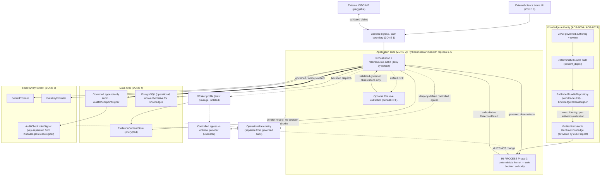

# ARCH-007 — Integrated Phase-5 enterprise architecture (closure candidate)

| Field | Value |
|---|---|
| Document ID | ARCH-007 |
| Version | 1.0 |
| Status | **PHASE-5 ARCHITECTURE APPROVED FOR CLOSURE** (local, following independent review) — remote CI and merge pending; **not** yet Phase-5 formally CLOSED |
| Phase | Phase 5 — P5-WP7 integrated architecture closure |
| Owner role | Chief Architect / Principal Security Engineer |
| Baseline | P5-WP6 merge `6145ce6448b9c64a089bbf89fece97abbca715d9` |
| Consolidates | [ARCH-001](ARCH-001-enterprise-architecture.md), [ARCH-002](ARCH-002-python-runtime-service-topology.md), [ARCH-003](ARCH-003-persistence-evidence-tamper-architecture.md), [ARCH-004](ARCH-004-security-trust-threat-model.md), [ARCH-005](ARCH-005-deployment-resilience-recovery.md), [ARCH-006](ARCH-006-observability-operational-readiness.md) |
| Governing ADRs | ADR-0003/0004/0005/0006/0007/0008/0009/0010/0013/0014/0015/0016/0017 |
| New decision | [ADR-0013](../../adr/ADR-0013-rule-set-publication-version-distribution.md) (Accepted, following independent review) rule-set publication/version distribution |
| Checkpoint | [GATE-018](../00-program/GATE-018-phase-5-architecture-closure.md) |
| Last updated | 2026-09-06 |

---

## 1. Purpose, authority and claim boundary

ARCH-007 consolidates the complete Phase-5 architecture (P5-WP1…WP6) and adds the final reserved decision
(ADR-0013, publication/version distribution — now **Accepted** following independent P5-WP7 closure review) so
Phase 5's architecture set is coherent and governed. It is an **authority map and reconciliation**, not a
re-statement of ARCH-001…006 detail: each concern points to its owning ADR/ARCH. Following that independent
review, the Phase-5 architecture package is **approved for closure**; formal Phase-5 closure still requires remote
CI PASS and merge to `main` (§11).

This is architecture only. It adds **no** API, UI, deployment/monitoring/publication implementation, and selects
**no** product/vendor. Phase 3 remains the sole decision authority (CON-003, `INV-01`); Phase 4 remains optional,
default-OFF, non-authoritative (ADR-0007). `ENGINE_VERSION = 1.0.0` is unchanged. **G-09 remains OPEN.**

**Phase-5 architecture closure means the architecture decisions required for this phase are coherent and governed
after independent review + CI + merge. It does NOT mean production readiness.** No production-readiness, security/
compliance certification, legal-admissibility, measured/five-nines availability, zero-downtime, achieved RPO/RTO,
or real-world detection-efficacy (accuracy/precision/recall/false-positive/negative) claim is made.

## 2. Authority map

| Concern | Owning authority |
|---|---|
| Knowledge authoring / governance | ADR-0004 / ADR-0015 / KB-001 |
| Rule representation | ADR-0003 |
| Rule execution | ADR-0005 / DET-001 |
| Risk / confidence semantics | ADR-0006 / DET-001 |
| AI authority (bounded, non-authoritative) | ADR-0007 / AI-001 |
| Backend / runtime topology | ADR-0008 / ARCH-002 |
| Identity / authorization / secrets / keys / STRIDE | ADR-0009 / ARCH-004 |
| Persistence / evidence / audit / tamper-evidence | ADR-0010 / ARCH-003 |
| Language / script support | ADR-0014 |
| Evidence hierarchy / official-alternate provenance | ADR-0015 |
| Deployment / resilience / recovery | ADR-0016 / ARCH-005 |
| Observability / operability | ADR-0017 / ARCH-006 |
| **Publication / version distribution** | **ADR-0013 / ARCH-007** |
| Enterprise context / invariants | ARCH-001 |

Deferred/reserved: ADR-0011 (database migration tooling, Phase 6, Planned); ADR-0012 (threat-intelligence adapter/
provider + SSRF-TOCTOU controls, Phase 6, Planned).

## 3. Integrated system view

Authority directions are explicit: knowledge flows Git → digest-addressed immutable bundle → in-process kernel;
the kernel alone authors the `DetectionResult`; telemetry and outer layers never change it; and there is **no
remote Phase-3 service**.

## 4. Architecture-invariant reconciliation (ARCH-001 §6)

No invariant is weakened. Verdict = consistency of the Phase-5 architecture set with each invariant.

| Invariant | Owning architecture | WP7 verdict | Residual dependency |
|---|---|---|---|
| INV-01 Sole decision authority | DET-001 / ADR-0005/0008 | ✅ Consistent — kernel in-process, no remote/second decision path | None |
| INV-02 No AI override | ADR-0007 / ARCH-004 | ✅ Consistent — AI validated to governed observations only | None |
| INV-03 Optional, default OFF | ADR-0007 / ARCH-005 | ✅ Consistent — readiness never gates on optional AI | None |
| INV-04 Exact fallback | ADR-0007 / ARCH-005 §9 | ✅ Consistent — provider/telemetry failure preserves baseline | None |
| INV-05 Untrusted output validation | ADR-0007 / AI-001 | ✅ Consistent — atomic validation before governed input | None |
| INV-06 Support before inference | ADR-0014 / ARCH-001 | ✅ Consistent — unsupported never becomes safe | None |
| INV-07 Immutable knowledge | ADR-0004 / **ADR-0013** | ✅ Consistent — digest-addressed immutable bundle; no in-place mutation | Phase-6 activation impl |
| INV-08 Replay without model recall | ADR-0010 / ADR-0007 / **ADR-0013** | ✅ Consistent — missing pinned bundle fails closed; no latest substitution | Phase-6 replay impl |
| INV-09 Fail-closed integrity | ARCH-003/004/005 | ✅ Consistent — required-dependency loss fails closed | None |
| INV-10 No false precision | ADR-0006 / ARCH-006 | ✅ Consistent — classification counts descriptive only; no efficacy metric | None |
| INV-11 Outer layers carry decisions | ADR-0008 / ARCH-006 | ✅ Consistent — telemetry/transport/persistence never author decisions | None |
| INV-12 Traceable evidence/provenance | ADR-0010 / ARCH-003 | ✅ Consistent — governed observations→rules→evidence→pins | None |
| INV-13 No silent historical mutation | ADR-0010 / **ADR-0013** | ✅ Consistent — rollback/withdrawal never rewrite history/results | Phase-6 retention policy (OI-05) |
| INV-14 Rules remain governed data | ADR-0004 / ADR-0013 | ✅ Consistent — publication needs review/CI; AI/UI cannot publish | None |
| INV-15 Preserve proven Python reasoning | ADR-0008 / ARCH-002 | ✅ Consistent — in-process kernel, no rewrite | None |

**No contradiction found.**

## 5. Cross-WP contract matrix

| Flow | Boundaries (owning ADR/ARCH) |
|---|---|
| **Evaluation** | raw input (ZONE 0) → optional AI extraction (ADR-0007/AI-001) → validated governed observations (AI-001-WP3/WP4) → in-process Phase-3 (ADR-0005/0008, DET-001) → `DetectionResult` (ADR-0006, DET-001) → persistence (ADR-0010/ARCH-003) → evidence/report/replay (ARCH-003 §11) |
| **Knowledge** | Git (ADR-0004) → CI (canonical gate) → deterministic bundle+`content_digest` (ADR-0004/build_bundle) → publication (ADR-0013) → distribution (`PublishedBundleRepository`, ADR-0013) → pre-activation validation + authenticity (ADR-0013) → explicit activation (ADR-0013) → immutable `RuntimeKnowledge` (ADR-0004, `INV-07`) |
| **Security** | identity (ADR-0009/OIDC) → role+resource authorization deny-by-default (ADR-0009/ARCH-004) → evidence/resource access (ARCH-003 §16/ARCH-004 §5.2) |
| **Operations** | runtime signals (ARCH-006 §9) → vendor-neutral telemetry (ADR-0017, non-authoritative) → alert/runbook (ARCH-006 §12/§19) |
| **Audit** | governed action (ADR-0010) → append-only tamper-evident audit (ARCH-003 §12) → checkpoint signing incl. terminal-failure state (ARCH-005 §7 / ARCH-006 §8) |

Each boundary is owned by a governed ADR/ARCH; no boundary is owned by telemetry, a distribution store, a database,
or an outer transport layer.

### 5.1 Active-bundle-withdrawn operational state and remediation (ADR-0013 amendment)

A bundle may be cryptographically digest-valid yet **governance-withdrawn** (ADR-0013 "Withdrawal / revocation"):
digest validity alone is not sufficient for approved operational use, and a deployment must know the governed
eligibility state of its exact active bundle. When a currently-active bundle becomes withdrawn/revoked and
withdrawal is **effective** for a deployment, this must be surfaced through the accepted WP6 observability
architecture (ARCH-006) — **ARCH-006 is unchanged**; the signals map onto its existing knowledge/security domains.

| Element | Concept | Owner |
|---|---|---|
| Operational/governance state | `ACTIVE_BUNDLE_WITHDRAWN` (exact `content_digest` withdrawn while active) | Knowledge Governance + Platform Ops |
| Alert class | `ACTIVE_KNOWLEDGE_BUNDLE_WITHDRAWN` (state-based; maps to remediation) | Knowledge Governance |
| Governed audit | withdrawal + active-withdrawn remediation events (ADR-0013 Decision 14, ADR-0010) — **not** replaced by the alert | Security Ops / Knowledge Governance |
| Mixed-replica inconsistency | one replica on an approved bundle, another on a withdrawn bundle → operational inconsistency requiring remediation; **not** healthy merely because both are digest-valid | Platform Ops |

**Conceptual remediation runbook — currently-active knowledge bundle withdrawn/revoked** (no vendor-specific
commands): verify the exact active bundle identity; verify the withdrawal/revocation governance state; stop **new**
evaluations from beginning on the withdrawn bundle once withdrawal is effective; select an approved replacement or
a previous known-good **exact** bundle; perform normal pre-activation validation; explicitly activate the
replacement/rollback (governed, exact-identity, auditable); verify fleet/replica active-bundle state; preserve
historical provenance (prior results/replay unchanged); and close the incident only after no deployment intended
for governed service remains on the withdrawn bundle. An in-flight evaluation stays pinned to the exact bundle it
started with and never switches mid-execution; telemetry provides visibility but never replaces the governed audit
event.

## 6. Residual-findings register (all Phase-5 WPs reconciled)

| WP | Finding | Disposition |
|---|---|---|
| P5-WP1 | Diagram-precision LOW (presentational) | Non-authority / presentational; no semantic impact |
| P5-WP2 | Review INFO bookkeeping | Resolved / non-blocking |
| P5-WP3 | No material review finding | None outstanding |
| P5-WP4 | LOW-1 handoff wording (ADR-0011 vs Phase-6 contracts) | Corrected in ARCH-004 §16 |
| P5-WP4 | LOW-2 signer pending/signed distinction | **CLOSED** by P5-WP5 (ARCH-005 §7.2) |
| P5-WP4 | LOW-3 DNS-rebinding / resolve-time SSRF TOCTOU | **Deferred** to Phase 6 / ADR-0012 (not closed) |
| P5-WP4 | LOW-4 restore authorization + restored-data integrity | **CLOSED** by P5-WP5 (ARCH-005 §11) |
| P5-WP5 | LOW-1 terminal signer-failure state | **CLOSED** by P5-WP6 (ARCH-006 §8, `CHECKPOINT_TERMINAL_FAILURE`) |
| P5-WP5 | LOW-2 diagram replica-edge shorthand | Presentational only |
| P5-WP6 | LOW cross-reference (§14.4→§14.2) | Corrected at WP6 acceptance |
| P5-WP6 | INFO `OPTIONAL_AI_DEGRADED`→RB-13 mapping | Acceptable; optional Phase-6 refinement |
| P5-WP6 | INFO ADR-0008 governing-list omission | Non-semantic; not reopened |
| P5-WP7 | MEDIUM-1 withdrawn currently-active bundle under-specified | **CLOSED** (targeted re-review) — ADR-0013 "Withdrawal / revocation" (case C) + §5.1 (`ACTIVE_BUNDLE_WITHDRAWN` state, `ACTIVE_KNOWLEDGE_BUNDLE_WITHDRAWN` alert, remediation runbook, governed audit) |
| P5-WP7 | LOW-1 publication-lifecycle governed audit not explicit | **CLOSED** (targeted re-review) — ADR-0013 Decision 14 (governed audit for publication/distribution/activation/rollback/withdrawal/rejected-activation/active-withdrawn) |

No closure is fabricated: the only still-open finding (WP4 LOW-3) is explicitly **deferred with an owner** (Phase 6
/ ADR-0012), not marked closed. The P5-WP7 MEDIUM-1/LOW-1 findings are **CLOSED** by this narrow correction (no
redesign), confirmed by the independent targeted re-review (BLOCKER 0 / HIGH 0 / MEDIUM 0 / LOW 0 / INFO 1),
following which ADR-0013 is **Accepted**.

## 7. Open program items (owned/deferred, not silent)

| Item | Status | Owner |
|---|---|---|
| G-09 (efficacy) | **OPEN** | Programme (RSK-003) — unclosable without a labelled corpus |
| OI-05 (retention duration / legal basis / residual metadata) | **OPEN** where applicable | Sponsor + legal |
| Numeric SLO targets | NOT YET SPECIFIED | Sponsor + Platform Ops |
| RPO / RTO | NOT YET SPECIFIED | Sponsor + Platform Ops |
| Alert thresholds | NOT YET SPECIFIED | P5-WP6 follow-up / Phase 6 |
| Signer max pending age | NOT YET SPECIFIED | Security Ops / Phase 6 |
| Restore-test frequency | NOT YET SPECIFIED | Data/Storage Ops |
| Telemetry retention duration | NOT YET SPECIFIED | Sponsor + Ops (OI-05) |

These are correctly owned/deferred and do **not** block Phase-5 **architecture** closure; several are inherently
sponsor/operational values that architecture must not invent.

## 8. Phase-6 deferred ADRs

| ADR | Topic | Phase | Status |
|---|---|---|---|
| ADR-0011 | Database migration tooling | 6 | Planned |
| ADR-0012 | Threat-intelligence adapter architecture / provider selection (incl. DNS-rebinding/SSRF-TOCTOU) | 6 | Planned |

ADR-0013 is now issued and **Accepted** (following independent P5-WP7 closure review) and no longer appears as
Planned.

## 9. Phase-6 entry contract

Phase 6 **may** now design/implement, without reopening Phase 5, so long as it preserves accepted Phase-5
architecture (unless a new ADR explicitly supersedes it):

- data/API contracts and per-endpoint authorization/API policy contracts (within ADR-0009/ARCH-004);
- database schema/migration strategy and tooling (ADR-0011);
- threat-intelligence adapter contracts and SSRF-TOCTOU controls (ADR-0012, closing WP4 LOW-3);
- integration contracts and provider/platform-specific selections where authorized;
- health/telemetry implementation contracts (within ADR-0017/ARCH-006);
- backup/restore implementation contracts (within ADR-0010/ARCH-005);
- publication/distribution, `KnowledgeReleaseSigner`/PKI, and activation/rollback/withdrawal implementation
  (within ADR-0013).

### 9.1 Non-negotiable Phase-5 constraints (no silent Phase-6 rewrite)

Phase 6 must **not** silently replace any of: the Python modular monolith; the in-process Phase-3 kernel; Phase-3
decision authority; the Phase-4 AI authority boundary; Git/CI knowledge authority; the PostgreSQL +
`EvidenceContentStore` split; resource-level authorization; tamper-evident audit; deny-by-default egress; the
deployment replica model; telemetry/audit separation; or explicit knowledge-bundle identity/activation. Any change
requires explicit architecture-change governance (a new/superseding ADR).

## 10. Builder self-challenge

| Challenge | Answer |
|---|---|
| Why does ADR-0013 exist if ADR-0004 defines bundles? | ADR-0004 defines authoring→build→load; ADR-0013 answers how a bundle is identified, released, distributed, activated, rolled back, withdrawn and verified across deployments. |
| What identifies one immutable published bundle? | `content_digest` plus `bundle_version`/`manifest_schema_version`/`commit_sha`/`component_versions`. |
| Can `bundle_version` alone identify exact contents? | No — it is a static constant; `content_digest` is load-bearing. |
| Can runtime follow "latest"? | No — activation is by exact validated identity; a channel pointer is never sufficient provenance. |
| What if a distributed bundle digest mismatches? | Candidate rejected; no fallback to latest. |
| What if publisher-authenticity verification fails? | Do not activate/trust; preserve known-good active bundle. |
| Does SHA-256 prove publisher identity? | No — integrity ≠ authenticity; a separate `KnowledgeReleaseSigner` is required externally. |
| Should the `AuditCheckpointSigner` key sign knowledge releases? | No — key-purpose separation; distinct signer. |
| Can an admin UI directly activate hand-edited knowledge? | No — changes must enter governed publication (review/CI). |
| Can AI publish a rule? | No — AI cannot approve/publish/activate/withdraw/override. |
| Can a bundle update change an in-flight evaluation? | No — `RuntimeKnowledge` immutable; new instance via controlled activation; no mid-evaluation switch. |
| How is rollback performed? | Explicit activation of a previous known-good exact immutable bundle. |
| Does rollback rewrite historical decisions? | No — history/results/replay provenance are unchanged. |
| What if a bundle is withdrawn after prior evaluations used it? | Two cases. (A) Historical evaluations are unchanged — their exact bundle provenance is preserved and there is no historical rewrite; artifacts are retained for reproducibility. (B) If the withdrawn bundle is also currently active, the deployment enters `ACTIVE_BUNDLE_WITHDRAWN`: once withdrawal is effective, new evaluations are blocked, an alert + governed remediation are raised, and an explicit approved replacement/rollback (exact identity, validated, audited) is required, while any in-flight evaluation stays pinned to the bundle it started with. |
| Can historical replay substitute a newer bundle? | No — missing pinned bundle fails replay explicitly (`INV-08`). |
| Can PostgreSQL become authoritative for rules? | No — operational only; Git/ADR-0004 authoritative. |
| Can a distribution service become authoritative? | No — transport does not change authority. |
| Can a replica start without a valid bundle? | No — readiness fails closed; never `NO_SCAM_PATTERN`. |
| Can replicas temporarily use different bundles? | Yes during controlled rollout; each evaluation pins its exact bundle. |
| How is each evaluation reproducible? | Pinned engine/bundle-digest/profile provenance per completed result. |
| Are all ARCH-001 invariants preserved? | Yes — §4 matrix; no contradiction found. |
| Any Phase-5 LOW findings unresolved without an owner? | No — all closed or explicitly deferred with an owner (WP4 LOW-3 → Phase 6/ADR-0012). |
| What remains for Phase 6? | §9 entry contract (impl contracts, ADR-0011/0012, distribution/signing/activation impl). |
| Does Phase-5 closure imply production readiness? | No — architecture coherence only; G-09 OPEN. |

## 11. Acceptance boundary and non-claims

ADR-0013 is **Accepted** following independent P5-WP7 closure review; the Phase-5 architecture package is
**approved for closure** locally. Formal Phase-5 closure occurs **only** after all of: (1) local canonical
validation PASS; (2) CI self-test PASS; (3) remote GitHub Actions CI PASS; and (4) the closure PR merged into
`main`. Until then the correct state is **Phase 5 = CLOSURE APPROVED / MERGE PENDING**, not CLOSED. **Phase 5 is
not formally CLOSED by this document.**

No production-readiness, security/compliance certification, legal-admissibility, measured/five-nines availability,
zero-downtime, achieved RPO/RTO, or real-world detection-efficacy (accuracy/precision/recall/false-positive/
negative) claim is made. Phase-3 and Phase-4 authority and semantics are unchanged, `ENGINE_VERSION = 1.0.0`, and
**G-09 remains OPEN**.
