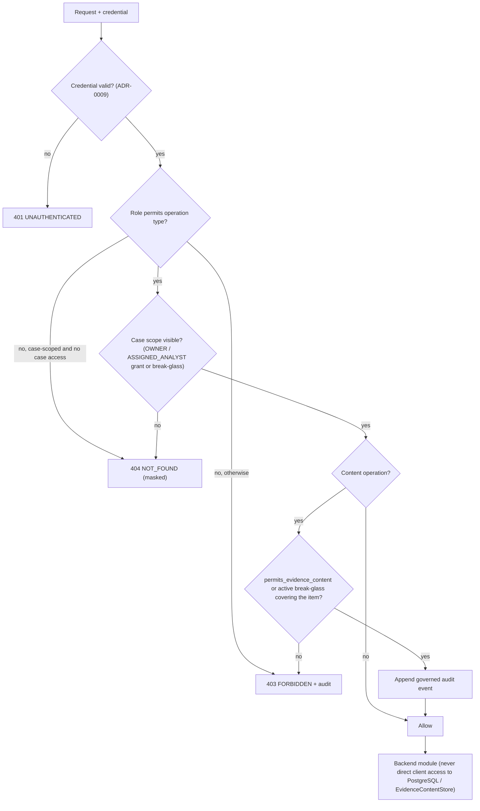
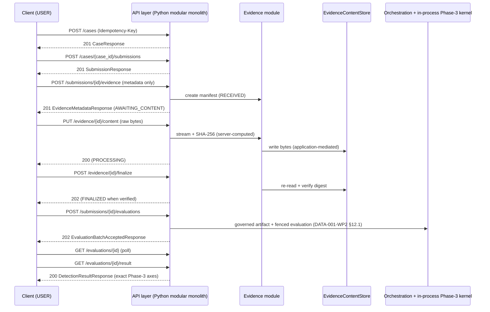
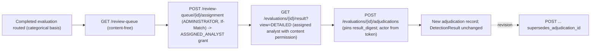
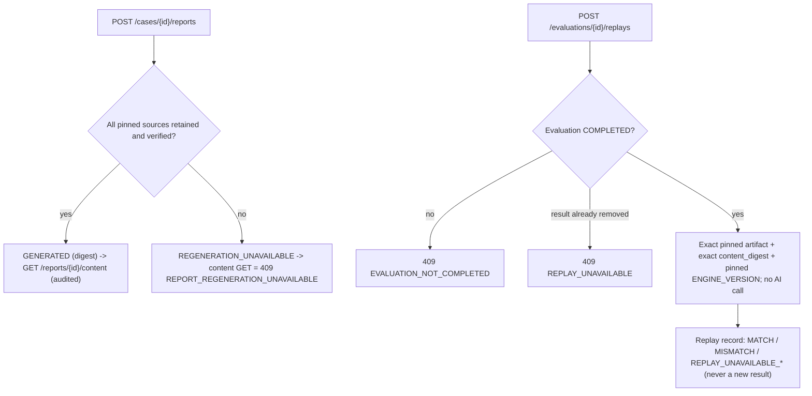
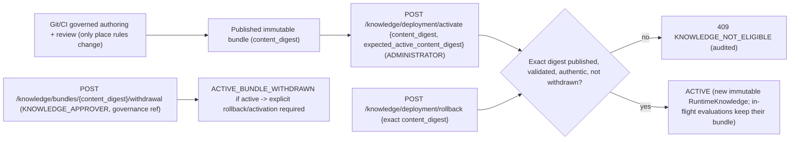
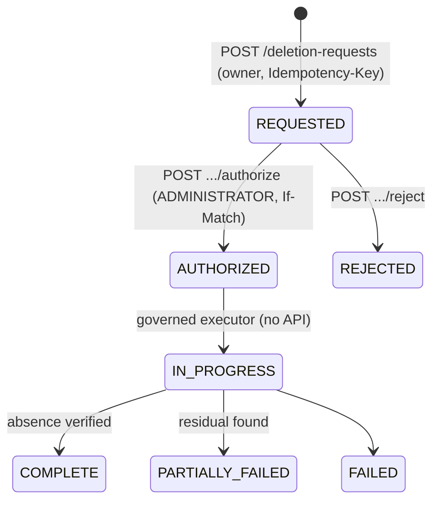

# API-001 — API resource, authorization and protocol contract

| Field | Value |
|---|---|
| Document ID | API-001 |
| Version | 0.1 |
| Status | **P6-WP3 API CONTRACT APPROVED FOLLOWING INDEPENDENT REVIEW — REMOTE CI + MERGE PENDING** (initial review REQUEST_CHANGES → corrections → targeted re-review APPROVE, §44); not formally closed; no API implemented |
| Phase | Phase 6 — Data, API & Integration Contracts |
| Work package | P6-WP3 — API resource, authorization & protocol contract |
| Owner role | API Architect / Backend Architect |
| Baseline | P6-WP2 merge `58c8853dc6ee6ea7cf621ff88fe7c54bceae15a3` (PR #27) |
| Machine-readable catalog | [`contracts/api/api-v1.json`](../../contracts/api/api-v1.json), validated by [`api-contract.schema.json`](../../contracts/api/api-contract.schema.json) and `knowledge/validation/validate_api_contract.py` |
| Data contracts | [DATA-001](DATA-001-data-domain-lifecycle-contract.md) (logical), [DATA-001-WP2](DATA-001-WP2-postgresql-persistence-contract.md) (PostgreSQL) |
| Governing authority | ADR-0008, ADR-0009, ADR-0010, ADR-0011, ADR-0013, ADR-0014, ADR-0016, ADR-0017; ARCH-002…007; DET-001; AI-001 WP4/WP5 |
| Checkpoint | [GATE-021](../00-program/GATE-021-phase-6-api-contract.md) |
| Next consumer | P6-WP4 OpenAPI encoding (generated from / compared against `api-v1.json`) |
| P6-WP6 delta | **P6-WP6 ADDITIVE ACTIVATION** (§45): `listEvaluationEnrichments` activated at contract level; `listAuditEvents` audit event `AUDIT_LOG_ACCESSED`; idempotency/ETag persistence resolved by DATA-001-WP2 P6-WP6-ADD-001 — reviewed by [GATE-024](../00-program/GATE-024-phase-6-operational-contract.md), not GATE-021 |
| Current revision state | Original P6-WP3 work package merged (PR #28); the status above is historical. This document also contains a P6-WP6 additive delta (§45): APPROVED FOLLOWING INDEPENDENT REVIEW — REMOTE CI + MERGE PENDING (GATE-024) |
| Last updated | 2026-10-03 |

---

## 1. Purpose, scope and claim boundary

API-001 is the **normative HTTP resource and protocol contract** for TrustLens API v1. It turns DATA-001,
DATA-001-WP2 and the accepted Phase-5 architecture into implementation-independent operations, authorization rules,
status semantics, idempotency, concurrency, pagination, error and versioning rules. P6-WP4 will encode it in OpenAPI;
`contracts/api/api-v1.json` is the machine-readable source for that work, and every table marked *generated* below is
rendered from it.

Not in scope: no FastAPI/framework code, handlers, Pydantic models, middleware, upload or report implementation, UI,
OpenAPI document, or API-gateway product. Nothing here claims an API is implemented, deployed, penetration-tested,
load-tested, available, production-ready, compliant or legally admissible, or that detection is accurate. **G-09 and
OI-05 remain OPEN.** Phase-3 and Phase-4 semantics and `ENGINE_VERSION = 1.0.0` are unchanged.

## 2. Authority boundaries preserved

| Boundary | Authority | API consequence |
|---|---|---|
| Governed knowledge | Git/CI + immutable published bundle (ADR-0004/0013) | Read-only bundle identity; activation/rollback/withdrawal only by exact `content_digest`; no rule-body API |
| Structured operational records | PostgreSQL (ADR-0010, DATA-001-WP2) | Reached only through backend modules; API DTOs are independent of tables |
| Raw/sensitive bytes | `EvidenceContentStore` | Application-mediated byte transfer; locators never exposed |
| Accountability | Governed append-only audit (`AUD`) | Governed operations audited; telemetry is not audit |
| Secrets/keys | `SecretProvider` / key boundaries | No API for secrets or keys |
| Decisions | Phase 3 only (`INV-01`) | Clients can never supply decision, provenance or knowledge fields |
| AI | Phase 4 optional, default-OFF, non-authoritative (ADR-0007) | Clients may only *request* AI-assisted extraction where policy enables it |

## 3. Conventions

- **Style:** RESTful HTTP resources over JSON; asynchronous work is a resource whose status is polled. No GraphQL,
  gRPC, WebSocket or SSE: no requirement needs them.
- **Base path:** `/api/v1`. Internal health probes live under `/health/` and are not routed publicly.
- **Identifiers:** operational IDs are the opaque UUIDv4 values of DATA-001-WP2 §5.2, rendered as lowercase canonical
  text. They encode nothing (no email, phone, tenant, case type, classification, time or rule ID). Governed knowledge
  identifiers (`rule_id`, `content_digest`) are a separate namespace.
- **Time:** every timestamp is RFC 3339 UTC. The server is authoritative for `created_at`, `completed_at`,
  `adjudicated_at` and every audit time. Client times (e.g. `capture_declared_at`) are contextual declarations only.
- **Content types:** JSON bodies are `application/json`. Evidence and report bytes use their own media types and are
  never base64-embedded in JSON.
- **Headers:** `Authorization` (credential, §4); `Idempotency-Key` (§27); `ETag` / `If-Match` (§28); `X-Request-Id`
  (server-generated, returned on every response); optional `traceparent` per ADR-0017 policy. All client-supplied
  correlation values are untrusted metadata.

## 4. Authentication

Every non-probe operation requires an authenticated principal established by the authentication boundary from a
validated OIDC/OAuth 2.0 credential (ADR-0009): issuer, audience, signature and expiry are validated, and authorization
is re-evaluated server-side on every request. API v1 accepts the access token as `Authorization: Bearer`; whether a
Phase-7 browser client uses a cookie session instead (and therefore CSRF controls) is decided in P6-WP4 / Phase 7. The
API never stores or returns passwords, never returns IdP access/refresh/ID tokens, and never accepts a client-asserted
identity. No IdP vendor and no token lifetime are selected.

## 5. Authorization model

Authorization is **role + resource, deny by default** (ADR-0009 Decision 4). A role gates the operation type; a
resource relationship gates the specific object. Neither alone is sufficient for case data.

| Resource-authorization category | Requirement (in addition to the listed roles) |
|---|---|
| `SELF` | Acts on the caller's own principal or creates a caller-owned resource |
| `CASE_OWNER` | Caller holds the case's active `OWNER` grant |
| `CASE_ACCESS` | Active `OWNER` or `ASSIGNED_ANALYST` grant with `permits_case_metadata` |
| `CASE_ASSIGNED_ANALYST` | Active `ASSIGNED_ANALYST` grant **and** the `ANALYST` role |
| `CASE_DERIVED_CONTENT` | `CASE_ACCESS` **and** `permits_evidence_content` (results and reports quote evidence) |
| `CASE_EVIDENCE_CONTENT` | `CASE_ACCESS` **and** `permits_evidence_content`, **or** an active, unexpired break-glass grant covering the item |
| `CASE_ASSIGNED_ANALYST_OR_PLATFORM_ADMIN` | Assigned analyst, or administrator for content-free integrity operations (replay returns digests and outcomes only) |
| `CASE_OWNER_OR_PLATFORM_ADMIN` | Case owner, or administrator for content-free grant metadata |
| `REVIEW_QUEUE` | `ANALYST` role; entries are content-free |
| `PLATFORM_ADMIN` | `ADMINISTRATOR` role; content-free platform resources only |
| `KNOWLEDGE_READ` / `KNOWLEDGE_OPERATION` | Knowledge-governance or platform role; knowledge resources only, never case data |
| `DELETION_SCOPE_OWNER` (`_OR_PLATFORM_ADMIN`) | Owner of the case/submission/evidence in scope (or administrator, status only) |
| `BREAK_GLASS_SELF` / `_GRANTEE` / `_REVIEWER` | Creator (**ADMINISTRATOR only in v1**); the grantee; a reviewer who is **not** the grantee |
| `AUDIT_READ` | `ADMINISTRATOR`; content-free audit metadata |

**Administrator ≠ evidence reader.** No operation grants `ADMINISTRATOR` evidence or derived content by role.
Administrators reach content only through an explicit, audited, short-lived break-glass grant (§23). No analyst can
elevate themselves: break-glass creation is administrator-only, and review assignment forbids assigning oneself
(§16), including for a principal that holds both roles. **Case-metadata
access never implies raw-evidence access:** content operations additionally require `permits_evidence_content`.

**Existence masking (consistent rule).** If the caller has **no** access to a case's scope, every case-scoped
resource (case, submission, evidence, evaluation, result, adjudication, report, replay, grants) answers
**`404 NOT_FOUND`**, exactly as if it did not exist. If the caller **can** see the resource but lacks the role or
permission for the requested operation (e.g. metadata allowed, content not), the answer is **`403 FORBIDDEN`**.
Non-case resources (knowledge, operations, audit, review queue) answer `403` on a missing role. Every denial of a
sensitive operation is audited (`AUTHORIZATION_DENIED`).



## 6. Tenancy

ASM-002 (single tenancy) remains **UNCONFIRMED / PROVISIONAL**. API v1 assumes the current provisional single
deployment scope. **No `tenant_id` appears in any path, header, query parameter, request body or response body**
(validator AC-12). The deployment-wide review queue is tenancy-sensitive and marked PROVISIONAL. If multi-tenancy is
confirmed, this contract must be re-reviewed before implementation wherever resource addressing, authorization or
uniqueness would change. ASM-002 does not block review of this contract.

## 7. Matrix A — resource catalog (generated)

| Resource | Canonical path | DATA-001 object | API mutability |
|---|---|---|---|
| `Principal` | `/api/v1/me` | `PrincipalReference` | `READ_ONLY` |
| `Case` | `/api/v1/cases/{case_id}` | `Case` | `COMMAND_ONLY` |
| `Submission` | `/api/v1/submissions/{submission_id}` | `Submission` | `IMMUTABLE_AFTER_CREATE` |
| `EvidenceItem` | `/api/v1/evidence/{evidence_id}` | `EvidenceItem` | `COMMAND_ONLY` |
| `EvidenceContent` | `/api/v1/evidence/{evidence_id}/content` | `EvidenceItem` | `WRITE_ONCE` |
| `Evaluation` | `/api/v1/evaluations/{evaluation_id}` | `Evaluation` | `IMMUTABLE` |
| `DetectionResult` | `/api/v1/evaluations/{evaluation_id}/result` | `DetectionResultRecord` | `IMMUTABLE` |
| `UserCorrection` | `/api/v1/evaluations/{evaluation_id}/corrections` | `UserCorrection` | `APPEND_ONLY` |
| `AnalystAdjudication` | `/api/v1/adjudications/{adjudication_id}` | `AnalystAdjudication` | `APPEND_ONLY` |
| `ReviewItem` | `/api/v1/review-queue/{review_item_id}` | `ReviewRoutingState` | `COMMAND_ONLY` |
| `CaseAccessGrant` | `/api/v1/access-grants/{grant_id}` | `CaseAccessGrant` | `APPEND_ONLY` |
| `ReportBundle` | `/api/v1/reports/{report_id}` | `ReportBundleRecord` | `IMMUTABLE` |
| `Replay` | `/api/v1/replays/{replay_id}` | `ReplayExecution` | `IMMUTABLE` |
| `ExternalEnrichmentResult` | `/api/v1/evaluations/{evaluation_id}/enrichments` | `ExternalEnrichmentResult` | `IMMUTABLE` |
| `KnowledgeDeploymentState` | `/api/v1/knowledge/active` | `KnowledgeActivationRecord` | `COMMAND_ONLY` |
| `KnowledgeBundleReference` | `/api/v1/knowledge/bundles/{content_digest}` | `KnowledgeBundleReference` | `COMMAND_ONLY` |
| `KnowledgeActivationRecord` | `/api/v1/knowledge/activations` | `KnowledgeActivationRecord` | `APPEND_ONLY` |
| `DeletionRequest` | `/api/v1/deletion-requests/{deletion_request_id}` | `DeletionRequest` | `COMMAND_ONLY` |
| `BreakGlassGrant` | `/api/v1/break-glass-grants/{break_glass_grant_id}` | `BreakGlassGrant` | `COMMAND_ONLY` |
| `AuditEvent` | `/api/v1/audit-events` | `AuditEventReference` | `IMMUTABLE` |
| `Health` | `/health/*` | `—` | `READ_ONLY` |

`api_mutability`: `IMMUTABLE` never changes through the API; `APPEND_ONLY` gains new records (never edits);
`COMMAND_ONLY` changes only through explicit governed commands; `WRITE_ONCE` is set once (evidence bytes).
No resource is `PATCHABLE_FIELDS` in v1: DATA-001-WP2 gives the case record no client-mutable descriptive fields
(free-text labels would be PII-bearing content), so case lifecycle changes are commands (§26).

## 8. Matrix B — operation catalog (generated)

| Operation ID | Method | Path | Purpose | Roles | Resource condition | Request | Success | Response | Idempotency | Audit | Sensitivity | Mode |
|---|---|---|---|---|---|---|---|---|---|---|---|---|
| `getMe` | GET | `/api/v1/me` | Authenticated principal summary | U, A, KE, KA, AD | `SELF` | — | 200 | `MeResponse` | NOT_APPLICABLE | NOT_REQUIRED | C5 | SYNC |
| `getLiveness` | GET | `/health/live` | Liveness probe (internal routing only) | — (internal probe) | `NONE_INTERNAL_PROBE` | — | 200 | `HealthProbeResponse` | NOT_APPLICABLE | NOT_REQUIRED | C2 | SYNC |
| `getReadiness` | GET | `/health/ready` | Readiness probe (internal routing only) | — (internal probe) | `NONE_INTERNAL_PROBE` | — | 200 | `HealthProbeResponse` | NOT_APPLICABLE | NOT_REQUIRED | C2 | SYNC |
| `getOperationalHealth` | GET | `/api/v1/ops/health` | Categorical capability health for operators | AD | `PLATFORM_ADMIN` | — | 200 | `OperationalHealthResponse` | NOT_APPLICABLE | NOT_REQUIRED | C2 | SYNC |
| `createCase` | POST | `/api/v1/cases` | Create an empty case owned by the caller | U | `SELF` | `CaseCreateRequest` | 201 | `CaseResponse` | REQUIRED | REQUIRED | C2 | SYNC |
| `listCases` | GET | `/api/v1/cases` | List cases the caller owns or is assigned to | U, A | `CASE_ACCESS` | — | 200 | `CaseListResponse` | NOT_APPLICABLE | NOT_REQUIRED | C2 | SYNC |
| `getCase` | GET | `/api/v1/cases/{case_id}` | Read a case | U, A | `CASE_ACCESS` | — | 200 | `CaseResponse` | NOT_APPLICABLE | NOT_REQUIRED | C2 | SYNC |
| `closeCase` | POST | `/api/v1/cases/{case_id}/close` | Close a case | U, A | `CASE_ACCESS` | `CaseCloseRequest` | 200 | `CaseResponse` | REQUIRED | REQUIRED | C2 | SYNC |
| `reopenCase` | POST | `/api/v1/cases/{case_id}/reopen` | Reopen a closed case | U, A | `CASE_ACCESS` | `ReasonCommandRequest` | 200 | `CaseResponse` | REQUIRED | REQUIRED | C2 | SYNC |
| `createSubmission` | POST | `/api/v1/cases/{case_id}/submissions` | Create a submission (categorical metadata only) | U | `CASE_OWNER` | `SubmissionCreateRequest` | 201 | `SubmissionResponse` | REQUIRED | NOT_REQUIRED | C2 | SYNC |
| `listSubmissions` | GET | `/api/v1/cases/{case_id}/submissions` | List a case's submissions | U, A | `CASE_ACCESS` | — | 200 | `SubmissionListResponse` | NOT_APPLICABLE | NOT_REQUIRED | C2 | SYNC |
| `getSubmission` | GET | `/api/v1/submissions/{submission_id}` | Read a submission | U, A | `CASE_ACCESS` | — | 200 | `SubmissionResponse` | NOT_APPLICABLE | NOT_REQUIRED | C2 | SYNC |
| `createEvidenceUpload` | POST | `/api/v1/submissions/{submission_id}/evidence` | Initiate an evidence item (metadata declaration) | U | `CASE_OWNER` | `EvidenceUploadCreateRequest` | 201 | `EvidenceMetadataResponse` | REQUIRED | REQUIRED | C2 | SYNC |
| `putEvidenceContent` | PUT | `/api/v1/evidence/{evidence_id}/content` | Transfer the exact original bytes (server computes SHA-256) | U | `CASE_OWNER` | `EvidenceContentUpload` | 200 | `EvidenceMetadataResponse` | NATURALLY_IDEMPOTENT | REQUIRED | C3 | SYNC |
| `finalizeEvidence` | POST | `/api/v1/evidence/{evidence_id}/finalize` | Request durable verification and manifest finalization | U | `CASE_OWNER` | `EvidenceFinalizeRequest` | 202 | `EvidenceMetadataResponse` | REQUIRED | REQUIRED | C2 | ASYNC |
| `listEvidence` | GET | `/api/v1/submissions/{submission_id}/evidence` | List evidence metadata | U, A | `CASE_ACCESS` | — | 200 | `EvidenceListResponse` | NOT_APPLICABLE | NOT_REQUIRED | C2 | SYNC |
| `getEvidenceMetadata` | GET | `/api/v1/evidence/{evidence_id}` | Read evidence metadata (never content) | U, A | `CASE_ACCESS` | — | 200 | `EvidenceMetadataResponse` | NOT_APPLICABLE | NOT_REQUIRED | C2 | SYNC |
| `getEvidenceContent` | GET | `/api/v1/evidence/{evidence_id}/content` | Download exact original evidence bytes | U, A | `CASE_EVIDENCE_CONTENT` | — | 200 | `EvidenceContentDownload` | NOT_APPLICABLE | REQUIRED | C3 | SYNC |
| `createEvaluations` | POST | `/api/v1/submissions/{submission_id}/evaluations` | Request deterministic evaluation (new evaluation(s)) | U, A | `CASE_ACCESS` | `EvaluationCreateRequest` | 202 | `EvaluationBatchAcceptedResponse` | REQUIRED | REQUIRED | C2 | ASYNC |
| `listCaseEvaluations` | GET | `/api/v1/cases/{case_id}/evaluations` | List a case's evaluations | U, A | `CASE_ACCESS` | — | 200 | `EvaluationListResponse` | NOT_APPLICABLE | NOT_REQUIRED | C2 | SYNC |
| `getEvaluation` | GET | `/api/v1/evaluations/{evaluation_id}` | Read evaluation status | U, A | `CASE_ACCESS` | — | 200 | `EvaluationResponse` | NOT_APPLICABLE | NOT_REQUIRED | C2 | SYNC |
| `getDetectionResult` | GET | `/api/v1/evaluations/{evaluation_id}/result` | Read the immutable DetectionResult (?view=STANDARD or DETAILED) | U, A | `CASE_DERIVED_CONTENT` | — | 200 | `DetectionResultResponse` | NOT_APPLICABLE | REQUIRED | C4 | SYNC |
| `createCorrection` | POST | `/api/v1/evaluations/{evaluation_id}/corrections` | User extraction correction -> NEW evaluation | U | `CASE_OWNER` | `UserCorrectionCreateRequest` | 202 | `CorrectionAcceptedResponse` | REQUIRED | REQUIRED | C4 | ASYNC |
| `listEvaluationEnrichments` | GET | `/api/v1/evaluations/{evaluation_id}/enrichments` | Advisory enrichment metadata (provider assertions only; never a TrustLens verdict) | A | `CASE_ACCESS` | — | 200 | `EnrichmentListResponse` | NOT_APPLICABLE | NOT_REQUIRED | C2 | SYNC |
| `createAdjudication` | POST | `/api/v1/evaluations/{evaluation_id}/adjudications` | Record a new adjudication of the exact result | A | `CASE_ASSIGNED_ANALYST` | `AdjudicationCreateRequest` | 201 | `AdjudicationResponse` | REQUIRED | REQUIRED | C4 | SYNC |
| `listAdjudications` | GET | `/api/v1/evaluations/{evaluation_id}/adjudications` | List adjudications of an evaluation | U, A | `CASE_ACCESS` | — | 200 | `AdjudicationListResponse` | NOT_APPLICABLE | REQUIRED | C4 | SYNC |
| `getAdjudication` | GET | `/api/v1/adjudications/{adjudication_id}` | Read one adjudication | U, A | `CASE_ACCESS` | — | 200 | `AdjudicationResponse` | NOT_APPLICABLE | REQUIRED | C4 | SYNC |
| `listReviewQueue` | GET | `/api/v1/review-queue` | Content-free review queue | A | `REVIEW_QUEUE` | — | 200 | `ReviewQueueResponse` | NOT_APPLICABLE | NOT_REQUIRED | C2 | SYNC |
| `assignReview` | POST | `/api/v1/review-queue/{review_item_id}/assignment` | Assign an analyst to a review item (creates ASSIGNED_ANALYST grant) | AD | `PLATFORM_ADMIN` | `ReviewAssignmentRequest` | 200 | `ReviewItemResponse` | REQUIRED | REQUIRED | C2 | SYNC |
| `listCaseAccessGrants` | GET | `/api/v1/cases/{case_id}/access-grants` | List who can access a case | U, AD | `CASE_OWNER_OR_PLATFORM_ADMIN` | — | 200 | `CaseAccessGrantListResponse` | NOT_APPLICABLE | NOT_REQUIRED | C5 | SYNC |
| `revokeCaseAccessGrant` | POST | `/api/v1/access-grants/{grant_id}/revoke` | Revoke a case access grant | AD | `PLATFORM_ADMIN` | `ReasonCommandRequest` | 200 | `CaseAccessGrantResponse` | REQUIRED | REQUIRED | C5 | SYNC |
| `createReport` | POST | `/api/v1/cases/{case_id}/reports` | Generate a report revision or reproduce one from its pins | U, A | `CASE_DERIVED_CONTENT` | `ReportCreateRequest` | 202 | `ReportResponse` | REQUIRED | REQUIRED | C4 | ASYNC |
| `listReports` | GET | `/api/v1/cases/{case_id}/reports` | List report revisions | U, A | `CASE_ACCESS` | — | 200 | `ReportListResponse` | NOT_APPLICABLE | NOT_REQUIRED | C2 | SYNC |
| `getReport` | GET | `/api/v1/reports/{report_id}` | Report metadata/status | U, A | `CASE_ACCESS` | — | 200 | `ReportResponse` | NOT_APPLICABLE | NOT_REQUIRED | C2 | SYNC |
| `getReportContent` | GET | `/api/v1/reports/{report_id}/content` | Download report content | U, A | `CASE_DERIVED_CONTENT` | — | 200 | `ReportContentDownload` | NOT_APPLICABLE | REQUIRED | C4 | SYNC |
| `createReplay` | POST | `/api/v1/evaluations/{evaluation_id}/replays` | Historical replay of exactly the pinned material (verification only) | A, AD | `CASE_ASSIGNED_ANALYST_OR_PLATFORM_ADMIN` | `ReplayCreateRequest` | 202 | `ReplayResponse` | REQUIRED | REQUIRED | C2 | ASYNC |
| `getReplay` | GET | `/api/v1/replays/{replay_id}` | Replay status/outcome | A, AD | `CASE_ASSIGNED_ANALYST_OR_PLATFORM_ADMIN` | — | 200 | `ReplayResponse` | NOT_APPLICABLE | NOT_REQUIRED | C2 | SYNC |
| `getActiveKnowledge` | GET | `/api/v1/knowledge/active` | Active exact bundle identity for this deployment | A, KE, KA, AD | `KNOWLEDGE_READ` | — | 200 | `KnowledgeActiveResponse` | NOT_APPLICABLE | NOT_REQUIRED | C1 | SYNC |
| `getKnowledgeBundle` | GET | `/api/v1/knowledge/bundles/{content_digest}` | Bundle reference metadata by exact digest | A, KE, KA, AD | `KNOWLEDGE_READ` | — | 200 | `KnowledgeBundleResponse` | NOT_APPLICABLE | NOT_REQUIRED | C1 | SYNC |
| `listKnowledgeActivations` | GET | `/api/v1/knowledge/activations` | Activation history | KE, KA, AD | `KNOWLEDGE_READ` | — | 200 | `KnowledgeActivationListResponse` | NOT_APPLICABLE | NOT_REQUIRED | C2 | SYNC |
| `activateKnowledgeBundle` | POST | `/api/v1/knowledge/deployment/activate` | Activate an exact published, validated bundle | AD | `KNOWLEDGE_OPERATION` | `KnowledgeActivationRequest` | 202 | `KnowledgeActivationResponse` | REQUIRED | REQUIRED | C2 | ASYNC |
| `rollbackKnowledgeBundle` | POST | `/api/v1/knowledge/deployment/rollback` | Explicit rollback to an exact previously validated bundle | AD | `KNOWLEDGE_OPERATION` | `KnowledgeRollbackRequest` | 202 | `KnowledgeActivationResponse` | REQUIRED | REQUIRED | C2 | ASYNC |
| `withdrawKnowledgeBundle` | POST | `/api/v1/knowledge/bundles/{content_digest}/withdrawal` | Record governed withdrawal of an exact bundle for this deployment | KA | `KNOWLEDGE_OPERATION` | `KnowledgeWithdrawalRequest` | 202 | `KnowledgeBundleResponse` | REQUIRED | REQUIRED | C2 | ASYNC |
| `createDeletionRequest` | POST | `/api/v1/deletion-requests` | Request governed deletion of an owned case/submission/evidence item | U | `DELETION_SCOPE_OWNER` | `DeletionRequestCreateRequest` | 201 | `DeletionRequestResponse` | REQUIRED | REQUIRED | C2 | SYNC |
| `listDeletionRequests` | GET | `/api/v1/deletion-requests` | List deletion requests (own, or all for administrators) | U, AD | `DELETION_SCOPE_OWNER_OR_PLATFORM_ADMIN` | — | 200 | `DeletionRequestListResponse` | NOT_APPLICABLE | NOT_REQUIRED | C2 | SYNC |
| `getDeletionRequest` | GET | `/api/v1/deletion-requests/{deletion_request_id}` | Deletion request status | U, AD | `DELETION_SCOPE_OWNER_OR_PLATFORM_ADMIN` | — | 200 | `DeletionRequestResponse` | NOT_APPLICABLE | NOT_REQUIRED | C2 | SYNC |
| `authorizeDeletionRequest` | POST | `/api/v1/deletion-requests/{deletion_request_id}/authorize` | Authorize a deletion request (content-free) | AD | `PLATFORM_ADMIN` | `ReasonCommandRequest` | 202 | `DeletionRequestResponse` | REQUIRED | REQUIRED | C2 | ASYNC |
| `rejectDeletionRequest` | POST | `/api/v1/deletion-requests/{deletion_request_id}/reject` | Reject a deletion request | AD | `PLATFORM_ADMIN` | `ReasonCommandRequest` | 200 | `DeletionRequestResponse` | REQUIRED | REQUIRED | C2 | SYNC |
| `createBreakGlassGrant` | POST | `/api/v1/break-glass-grants` | Request explicit emergency content elevation | AD | `BREAK_GLASS_SELF` | `BreakGlassCreateRequest` | 201 | `BreakGlassGrantResponse` | REQUIRED | REQUIRED | C5 | SYNC |
| `getBreakGlassGrant` | GET | `/api/v1/break-glass-grants/{break_glass_grant_id}` | Read a break-glass grant | AD | `BREAK_GLASS_GRANTEE_OR_PLATFORM_ADMIN` | — | 200 | `BreakGlassGrantResponse` | NOT_APPLICABLE | NOT_REQUIRED | C5 | SYNC |
| `endBreakGlassGrant` | POST | `/api/v1/break-glass-grants/{break_glass_grant_id}/end` | End a break-glass grant early | AD | `BREAK_GLASS_GRANTEE` | `EmptyCommandRequest` | 200 | `BreakGlassGrantResponse` | REQUIRED | REQUIRED | C5 | SYNC |
| `reviewBreakGlassGrant` | POST | `/api/v1/break-glass-grants/{break_glass_grant_id}/review` | Mandatory post-event review (different principal) | AD | `BREAK_GLASS_REVIEWER` | `BreakGlassReviewRequest` | 200 | `BreakGlassGrantResponse` | REQUIRED | REQUIRED | C5 | SYNC |
| `listAuditEvents` | GET | `/api/v1/audit-events` | Content-free audit investigation | AD | `AUDIT_READ` | — | 200 | `AuditEventListResponse` | NOT_APPLICABLE | REQUIRED | C6 | SYNC |

All 53 operations carry, in `api-v1.json`, their request/response schema, error codes, sensitivity class and notes.

## 9. Matrix C — authorization matrix (generated)

| Endpoint | Method | Roles | Resource-level condition | Sensitive-content permission | Audit | Break-glass | Notes |
|---|---|---|---|---|---|---|---|
| `/api/v1/me` | GET | U, A, KE, KA, AD | `SELF` | NONE | NOT_REQUIRED | no |  |
| `/health/live` | GET | — (internal probe) | `NONE_INTERNAL_PROBE` | NONE | NOT_REQUIRED | no |  |
| `/health/ready` | GET | — (internal probe) | `NONE_INTERNAL_PROBE` | NONE | NOT_REQUIRED | no |  |
| `/api/v1/ops/health` | GET | AD | `PLATFORM_ADMIN` | NONE | NOT_REQUIRED | no |  |
| `/api/v1/cases` | POST | U | `SELF` | NONE | REQUIRED | no |  |
| `/api/v1/cases` | GET | U, A | `CASE_ACCESS` | NONE | NOT_REQUIRED | no |  |
| `/api/v1/cases/{case_id}` | GET | U, A | `CASE_ACCESS` | NONE | NOT_REQUIRED | no |  |
| `/api/v1/cases/{case_id}/close` | POST | U, A | `CASE_ACCESS` | NONE | REQUIRED | no | If-Match required |
| `/api/v1/cases/{case_id}/reopen` | POST | U, A | `CASE_ACCESS` | NONE | REQUIRED | no | If-Match required |
| `/api/v1/cases/{case_id}/submissions` | POST | U | `CASE_OWNER` | NONE | NOT_REQUIRED | no |  |
| `/api/v1/cases/{case_id}/submissions` | GET | U, A | `CASE_ACCESS` | NONE | NOT_REQUIRED | no |  |
| `/api/v1/submissions/{submission_id}` | GET | U, A | `CASE_ACCESS` | NONE | NOT_REQUIRED | no |  |
| `/api/v1/submissions/{submission_id}/evidence` | POST | U | `CASE_OWNER` | NONE | REQUIRED | no |  |
| `/api/v1/evidence/{evidence_id}/content` | PUT | U | `CASE_OWNER` | EVIDENCE_CONTENT | REQUIRED | no | Allowed once while AWAITING_CONTENT; an identical re-PUT (same server-computed digest) returns the same state; different bytes after content exists -> STATE_CONFLICT. |
| `/api/v1/evidence/{evidence_id}/finalize` | POST | U | `CASE_OWNER` | NONE | REQUIRED | no |  |
| `/api/v1/submissions/{submission_id}/evidence` | GET | U, A | `CASE_ACCESS` | NONE | NOT_REQUIRED | no |  |
| `/api/v1/evidence/{evidence_id}` | GET | U, A | `CASE_ACCESS` | NONE | NOT_REQUIRED | no |  |
| `/api/v1/evidence/{evidence_id}/content` | GET | U, A | `CASE_EVIDENCE_CONTENT` | EVIDENCE_CONTENT | REQUIRED | yes (AD) | Requires a grant with permits_evidence_content (owner by policy; assigned analyst only if granted) or an active break-glass grant covering the item. Case-metadata access alone is insufficient. |
| `/api/v1/submissions/{submission_id}/evaluations` | POST | U, A | `CASE_ACCESS` | NONE | REQUIRED | no |  |
| `/api/v1/cases/{case_id}/evaluations` | GET | U, A | `CASE_ACCESS` | NONE | NOT_REQUIRED | no |  |
| `/api/v1/evaluations/{evaluation_id}` | GET | U, A | `CASE_ACCESS` | NONE | NOT_REQUIRED | no |  |
| `/api/v1/evaluations/{evaluation_id}/result` | GET | U, A | `CASE_DERIVED_CONTENT` | DERIVED_CONTENT | REQUIRED | no | DETAILED view: assigned analyst with permits_evidence_content only. Never PUT/PATCH/DELETE. |
| `/api/v1/evaluations/{evaluation_id}/corrections` | POST | U | `CASE_OWNER` | DERIVED_CONTENT | REQUIRED | no |  |
| `/api/v1/evaluations/{evaluation_id}/enrichments` | GET | A | `CASE_ACCESS` | NONE | NOT_REQUIRED | no | P6-WP6 ADDITIVE ACTIVATION — contract-level active (was `FUTURE_INT_001`); advisory metadata only |
| `/api/v1/evaluations/{evaluation_id}/adjudications` | POST | A | `CASE_ASSIGNED_ANALYST` | DERIVED_CONTENT | REQUIRED | no |  |
| `/api/v1/evaluations/{evaluation_id}/adjudications` | GET | U, A | `CASE_ACCESS` | NONE | REQUIRED | no | Outcome visible with case access; rationale (C4) included only for an assigned analyst with permits_evidence_content, and that access is audited. |
| `/api/v1/adjudications/{adjudication_id}` | GET | U, A | `CASE_ACCESS` | NONE | REQUIRED | no | Outcome visible with case access; rationale (C4) included only for an assigned analyst with permits_evidence_content, and that access is audited. |
| `/api/v1/review-queue` | GET | A | `REVIEW_QUEUE` | NONE | NOT_REQUIRED | no | tenancy PROVISIONAL (ASM-002) |
| `/api/v1/review-queue/{review_item_id}/assignment` | POST | AD | `PLATFORM_ADMIN` | NONE | REQUIRED | no | analyst_principal_id must differ from the authenticated caller (also for a principal holding both ADMINISTRATOR and ANALYST) -> 403 FORBIDDEN; the assignee must hold the ANALYST role.; constraint: ASSIGNEE_NOT_CALLER |
| `/api/v1/cases/{case_id}/access-grants` | GET | U, AD | `CASE_OWNER_OR_PLATFORM_ADMIN` | NONE | NOT_REQUIRED | no |  |
| `/api/v1/access-grants/{grant_id}/revoke` | POST | AD | `PLATFORM_ADMIN` | NONE | REQUIRED | no |  |
| `/api/v1/cases/{case_id}/reports` | POST | U, A | `CASE_DERIVED_CONTENT` | DERIVED_CONTENT | REQUIRED | no |  |
| `/api/v1/cases/{case_id}/reports` | GET | U, A | `CASE_ACCESS` | NONE | NOT_REQUIRED | no |  |
| `/api/v1/reports/{report_id}` | GET | U, A | `CASE_ACCESS` | NONE | NOT_REQUIRED | no |  |
| `/api/v1/reports/{report_id}/content` | GET | U, A | `CASE_DERIVED_CONTENT` | DERIVED_CONTENT | REQUIRED | no |  |
| `/api/v1/evaluations/{evaluation_id}/replays` | POST | A, AD | `CASE_ASSIGNED_ANALYST_OR_PLATFORM_ADMIN` | NONE | REQUIRED | no |  |
| `/api/v1/replays/{replay_id}` | GET | A, AD | `CASE_ASSIGNED_ANALYST_OR_PLATFORM_ADMIN` | NONE | NOT_REQUIRED | no |  |
| `/api/v1/knowledge/active` | GET | A, KE, KA, AD | `KNOWLEDGE_READ` | NONE | NOT_REQUIRED | no |  |
| `/api/v1/knowledge/bundles/{content_digest}` | GET | A, KE, KA, AD | `KNOWLEDGE_READ` | NONE | NOT_REQUIRED | no |  |
| `/api/v1/knowledge/activations` | GET | KE, KA, AD | `KNOWLEDGE_READ` | NONE | NOT_REQUIRED | no |  |
| `/api/v1/knowledge/deployment/activate` | POST | AD | `KNOWLEDGE_OPERATION` | NONE | REQUIRED | no |  |
| `/api/v1/knowledge/deployment/rollback` | POST | AD | `KNOWLEDGE_OPERATION` | NONE | REQUIRED | no |  |
| `/api/v1/knowledge/bundles/{content_digest}/withdrawal` | POST | KA | `KNOWLEDGE_OPERATION` | NONE | REQUIRED | no |  |
| `/api/v1/deletion-requests` | POST | U | `DELETION_SCOPE_OWNER` | NONE | REQUIRED | no |  |
| `/api/v1/deletion-requests` | GET | U, AD | `DELETION_SCOPE_OWNER_OR_PLATFORM_ADMIN` | NONE | NOT_REQUIRED | no |  |
| `/api/v1/deletion-requests/{deletion_request_id}` | GET | U, AD | `DELETION_SCOPE_OWNER_OR_PLATFORM_ADMIN` | NONE | NOT_REQUIRED | no |  |
| `/api/v1/deletion-requests/{deletion_request_id}/authorize` | POST | AD | `PLATFORM_ADMIN` | NONE | REQUIRED | no | If-Match required |
| `/api/v1/deletion-requests/{deletion_request_id}/reject` | POST | AD | `PLATFORM_ADMIN` | NONE | REQUIRED | no | If-Match required |
| `/api/v1/break-glass-grants` | POST | AD | `BREAK_GLASS_SELF` | NONE | REQUIRED | no | v1: ADMINISTRATOR is the only creator/activator (an ANALYST cannot self-elevate). Reason required; server-set short expiry (duration NOT YET SPECIFIED); always audited and signalled; mandatory review by a different principal. Analyst request/approval is a possible future, separately reviewed workflow. |
| `/api/v1/break-glass-grants/{break_glass_grant_id}` | GET | AD | `BREAK_GLASS_GRANTEE_OR_PLATFORM_ADMIN` | NONE | NOT_REQUIRED | no |  |
| `/api/v1/break-glass-grants/{break_glass_grant_id}/end` | POST | AD | `BREAK_GLASS_GRANTEE` | NONE | REQUIRED | no |  |
| `/api/v1/break-glass-grants/{break_glass_grant_id}/review` | POST | AD | `BREAK_GLASS_REVIEWER` | NONE | REQUIRED | no | constraint: REVIEWER_NOT_GRANTEE |
| `/api/v1/audit-events` | GET | AD | `AUDIT_READ` | NONE | REQUIRED | no | Audit read access is itself audited: one `AUDIT_LOG_ACCESSED` event per authorized read (P6-WP6 additive; OPS-001 §8). |

No endpoint relies on a role alone for evidence or derived content (validator AC-05).

## 10. Core flows

### 10.1 Submission → evidence → evaluation → result



### 10.2 Analyst review and adjudication



### 10.3 Report and replay



### 10.4 Knowledge activation control path



### 10.5 Deletion request lifecycle



## 11. Case and submission contract

- **`CaseCreateRequest`** carries only optional categorical context; the owner is the authenticated principal, the
  state starts `OPEN`, and no evidence is required. `201` returns `CaseResponse` (ID, state, `is_synthetic`,
  `created_at`, the caller's own access, `ETag`, links). There is **no verdict on a case**.
- **Lifecycle:** `POST /cases/{id}/close` and `/reopen` are If-Match-guarded commands; `DELETION_PENDING`/`DELETED` are
  reached only through governed deletion.
- **`SubmissionCreateRequest`** carries only categorical metadata (`declared_input_type`, optional
  `relationship_to_content`). **All content-bearing user material, including the free-text context of SRS 4.1.3.7
  (sender, channel description), goes through the evidence boundary** (§12), never into submission JSON.

## 12. Evidence upload and access contract

**Selected API-level mechanism: application-mediated three-step upload.**

| Option | Assessment |
|---|---|
| Multipart (metadata + bytes in one request) | Mixes trusted and untrusted parts in one parser; larger attack surface; harder idempotency |
| **Initiate → raw-byte PUT → finalize (selected)** | Metadata and bytes separated; server streams and hashes; idempotent by state and digest; vendor-neutral |
| Pre-authorized direct-to-store upload (signed URL) | Needs a store vendor and URL lifetime policy; a locator must never become authority (ADR-0010) — deferred |

1. **Initiate** `POST /submissions/{id}/evidence` with `EvidenceUploadCreateRequest`: `artifact_kind`,
   `declared_media_type`, `declared_byte_length`, optional `display_filename`, optional `capture_declared_at`, optional
   advisory `client_declared_sha256`. Returns `201` with `upload_state = AWAITING_CONTENT`.
2. **Transfer** `PUT /evidence/{id}/content` with the exact bytes as the body (`Content-Type` = declared media type;
   pasted SMS/chat text as `text/plain; charset=utf-8`; a submitted URL as `text/uri-list` — **never fetched**). The
   server streams, enforces the size bound, computes the authoritative SHA-256, and writes through
   `EvidenceContentStore`. An identical re-PUT is a no-op; different bytes after content exists → `409 STATE_CONFLICT`.
3. **Finalize** `POST /evidence/{id}/finalize` → `202`; the server re-reads, verifies the digest and finalizes the
   manifest. `FINALIZED` is reported only when bytes are durable and verified (AC-17).

- **Size:** over the configured bound → `413 PAYLOAD_TOO_LARGE`; declared/actual length mismatch → `400`. The numeric
  maximum is **NOT YET SPECIFIED** (no authority sets one).
- **Media:** validated beyond extension (ARCH-004 §9.1); unaccepted → `415 UNSUPPORTED_MEDIA_TYPE`. The accepted-type
  list is configuration (images are Post-MVP).
- **Digest:** `client_declared_sha256` is advisory; a mismatch with the server digest is recorded and rejected as
  `400`, but **only the server digest is authoritative**.
- **Untrusted metadata:** filename, content type, URL text, sender name and email subject are untrusted. The raw
  filename is never used as a storage path or response filename; downloads use a server-generated filename.
- **User-supplied context** (sender, channel, description) is uploaded as an evidence item of `artifact_kind OTHER` with
  media type `application/vnd.trustlens.user-context+json`; it is hashed, stored only in `ECS`, and folded into the
  governed input envelope (DATA-001-WP2 §5.5). A dedicated `artifact_kind` value would be an additive WP2 vocabulary
  change and is recorded as an open decision (§41), not made here.
- **Metadata vs content:** `GET /evidence/{id}` returns metadata only, never bytes or the storage locator.
  `GET /evidence/{id}/content` needs `CASE_EVIDENCE_CONTENT` and is always audited (`EVIDENCE_ACCESSED`); responses
  carry `Content-Type` = verified media type, `Content-Disposition: attachment`, `X-Content-Type-Options: nosniff`,
  `Cache-Control: no-store`. Removed content → `410 REMOVED_UNDER_GOVERNANCE`; failed verification →
  `500 INTEGRITY_FAILURE` with nothing returned. No signed or public URL is issued, and no URL lifetime is defined.

## 13. Evaluation contract

- **Create:** `POST /submissions/{submission_id}/evaluations` with `EvaluationCreateRequest`: optional `analysis_mode`
  (`DETERMINISTIC` | `AI_ASSISTED_IF_ENABLED`), optional `predecessor_evaluation_id` + `reason_code` for re-analysis.
  It **cannot** carry classification, severity, risk, confidence, evidence strength, rule results, governing rule,
  explanations, actions, AI verdict/confidence, `ENGINE_VERSION`, `content_digest`/bundle selection, profile,
  `origin`, state or timestamps (AC-15). There is one governed evaluation profile in v1, so no profile parameter
  exists.
- **Asynchronous:** `202 Accepted` with `EvaluationBatchAcceptedResponse` (one `EvaluationResponse` per governed
  input envelope). No response-time SLA and no polling interval are defined; clients poll `GET /evaluations/{id}`.
- **Input scope (resolves the API part of DATA-001 §23 item 5):** the server normalizes the submission's finalized
  evidence into governed input envelopes per KB-002 — one primary envelope for its text/URL/email content (user
  context included), plus one per OCR/vision-derived text (Post-MVP). **One evaluation per envelope; there is no
  submission- or case-level aggregate verdict.** MVP text submissions therefore yield exactly one evaluation.
- **Origin is server-derived:** no predecessor → `INITIAL`; predecessor `FAILED_INFRASTRUCTURE` → `RETRY_AFTER_FAILURE`;
  `AI_ASSISTED_IF_ENABLED` with a predecessor → `AI_RE_EXTRACTION`; otherwise `RE_EVALUATION`. User corrections use
  `POST /evaluations/{id}/corrections` (`USER_CORRECTION`). Every one of these is a **new** evaluation with a new
  governed artifact; nothing reuses a failed evaluation's identity.
- **AI control:** `AI_ASSISTED_IF_ENABLED` is honoured only if deployment policy enables Phase-4 extraction;
  otherwise the evaluation runs deterministically with `fallback_reason = AI_DISABLED`. AI usage is exposed only as
  `AiUsageSummary` (requested / enabled by policy / used / closed fallback reason).

### 13.1 State mapping (API ↔ DATA-001-WP2)

| Persistence `evaluation_status` | API `state` | API `failure.failure_class` |
|---|---|---|
| `REQUESTED` | `QUEUED` | — |
| `RUNNING` | `RUNNING` | — |
| `RESULT_COMPUTED_PERSISTENCE_PENDING` | `RUNNING` (never shown as complete before durable persistence) | — |
| `COMPLETED` | `COMPLETED` | — |
| `FAILED_PRECONDITION` | `FAILED` | `PRECONDITION` |
| `FAILED_INTEGRITY` | `FAILED` | `INTEGRITY` |
| `FAILED_INFRASTRUCTURE` | `FAILED` | `INFRASTRUCTURE` (guidance `RETRY_AS_NEW_EVALUATION`) |

Safe failure reasons (from `evaluation_failure_category`): `KNOWLEDGE_UNAVAILABLE` (no valid / withdrawn active
bundle), `INPUT_NOT_EVALUABLE`, `INTEGRITY_FAILURE`, `INFRASTRUCTURE_FAILURE`. No failure is ever expressed as a
classification, and none is shown as safe. **Unsupported or non-English input is not a failure:** it completes with
classification `UNSUPPORTED` (ADR-0014), never `NO_SCAM_PATTERN`.

`result_availability`: `NOT_YET_AVAILABLE` (queued/running), `AVAILABLE`, `NOT_PRODUCED` (failed),
`REMOVED_UNDER_GOVERNANCE` (§19).

## 14. DetectionResult response

`GET /evaluations/{id}/result` returns `DetectionResultResponse` with the exact Phase-3 vocabulary (synchronised by the
persistence contract with `detection-result.schema.json`): `input_support_status`, `language`, `script`,
`classification`, `decision_severity`, `matched_evidence_strength`, `risk_level`, `detection_confidence`, `degraded`,
`governing_rule`, `matched_rules` (with source references, FR-045), `explanation`, `recommended_actions`,
`limitations`, `unknowns`, `ambiguities`, `provenance` (engine version, result contract version, bundle digest and
version, profile, evaluation time), `result_digest`, and `not_an_official_determination: true` (SRS §6).

- **No probability, 0–100 score or AI confidence exists in any API schema** (AC-13). Recommended actions carry the
  governed `action_code` only — **no priority** (the runtime emits none) — and no field is invented (§14.1, AC-24).
- When the classification is `NO_SCAM_PATTERN`, `absence_of_finding_notice` states that no governed pattern matched and
  that this is **not** a determination that the content is safe (RSK-009).
- **Views:** `STANDARD` (default; owner or assigned analyst with content permission) gives axes, explanation,
  actions, matched rules with sources, limitations and provenance. `DETAILED` (assigned analyst with
  `permits_evidence_content`) adds the per-rule decomposition `rule_results`. Knowledge roles and administrators get
  no case results (§34).
- **Immutable:** no PUT, PATCH or DELETE exists for a result (AC-06). Correction means a **new evaluation**;
  adjudication is a separate record. `409 EVALUATION_NOT_COMPLETED` before completion; `410 REMOVED_UNDER_GOVERNANCE`
  for a governed-deletion tombstone.

### 14.1 Field traceability (AC-24, generated)

Every field of the governed result response tree traces either to an existing, runtime-emitted node of the promoted
Phase-3 schemas or to one of four API-only categories that carry no decision meaning (`VIEW_SELECTOR`, `DISCLAIMER`,
`INTERPRETATION_NOTICE`, `PERSISTENCE_PROVENANCE`). The schema-reserved `recommendedAction.priority` is **not**
emitted by the Phase-3 runtime (P3-WP6 asserts "no priority"), so it may not be traced to or exposed. Recommended
actions therefore carry `action_code` only: the API never manufactures a priority, urgency, rank or score.

| Response field (governed result tree) | Trace |
|---|---|
| `DetectionResultResponse.evaluation_id` | `phase3:detection-result.schema.json#/properties/evaluation_id` |
| `DetectionResultResponse.result_contract_version` | `phase3:detection-result.schema.json#/properties/result_contract_version` |
| `DetectionResultResponse.result_digest` | `api:PERSISTENCE_PROVENANCE` |
| `DetectionResultResponse.view` | `api:VIEW_SELECTOR` |
| `DetectionResultResponse.input_support_status` | `phase3:detection-result.schema.json#/properties/input_support_status` |
| `DetectionResultResponse.language` | `phase3:detection-result.schema.json#/properties/language` |
| `DetectionResultResponse.script` | `phase3:detection-result.schema.json#/properties/script` |
| `DetectionResultResponse.classification` | `phase3:detection-result.schema.json#/properties/classification` |
| `DetectionResultResponse.decision_severity` | `phase3:detection-result.schema.json#/properties/decision_severity` |
| `DetectionResultResponse.matched_evidence_strength` | `phase3:detection-result.schema.json#/properties/matched_evidence_strength` |
| `DetectionResultResponse.risk_level` | `phase3:detection-result.schema.json#/properties/risk_level` |
| `DetectionResultResponse.detection_confidence` | `phase3:detection-result.schema.json#/properties/detection_confidence` |
| `DetectionResultResponse.degraded` | `phase3:detection-result.schema.json#/properties/degraded` |
| `DetectionResultResponse.governing_rule` | `phase3:rule-evaluation-result.schema.json#/properties/governing` |
| `DetectionResultResponse.matched_rules` | `phase3:detection-result.schema.json#/properties/matched_rules` |
| `DetectionResultResponse.explanation` | `phase3:detection-result.schema.json#/properties/explanation` |
| `DetectionResultResponse.recommended_actions` | `phase3:detection-result.schema.json#/properties/recommended_actions` |
| `DetectionResultResponse.limitations` | `phase3:detection-result.schema.json#/properties/limitations` |
| `DetectionResultResponse.unknowns` | `phase3:detection-result.schema.json#/properties/unknowns` |
| `DetectionResultResponse.ambiguities` | `phase3:detection-result.schema.json#/properties/ambiguities` |
| `DetectionResultResponse.rule_results` | `phase3:detection-result.schema.json#/properties/rule_results` |
| `DetectionResultResponse.provenance` | `phase3:detection-result.schema.json#/properties/provenance` |
| `DetectionResultResponse.not_an_official_determination` | `api:DISCLAIMER` |
| `DetectionResultResponse.absence_of_finding_notice` | `api:INTERPRETATION_NOTICE` |
| `RuleReference.rule_id` | `phase3:rule-evaluation-result.schema.json#/properties/rule_id` |
| `RuleReference.rule_version` | `phase3:rule-evaluation-result.schema.json#/properties/rule_version` |
| `RuleReference.source_references` | `phase3:rule-evaluation-result.schema.json#/properties/source_references` |
| `ExplanationView.summary` | `phase3:detection-result.schema.json#/$defs/explanation/properties/summary` |
| `ExplanationView.evidence_basis` | `phase3:detection-result.schema.json#/$defs/explanation/properties/evidence_basis` |
| `RecommendedActionView.action_code` | `phase3:detection-result.schema.json#/$defs/recommendedAction/properties/action_code` |
| `RuleResultView.rule_id` | `phase3:rule-evaluation-result.schema.json#/properties/rule_id` |
| `RuleResultView.rule_version` | `phase3:rule-evaluation-result.schema.json#/properties/rule_version` |
| `RuleResultView.kind` | `phase3:rule-evaluation-result.schema.json#/properties/kind` |
| `RuleResultView.evaluation_state` | `phase3:rule-evaluation-result.schema.json#/properties/evaluation_state` |
| `RuleResultView.governing` | `phase3:rule-evaluation-result.schema.json#/properties/governing` |
| `RuleResultView.effective_severity` | `phase3:rule-evaluation-result.schema.json#/properties/effective_severity` |
| `RuleResultView.rule_evidence_strength` | `phase3:rule-evaluation-result.schema.json#/properties/rule_evidence_strength` |
| `RuleResultView.rule_detection_confidence` | `phase3:rule-evaluation-result.schema.json#/properties/rule_detection_confidence` |
| `ProvenanceSummary.engine_version` | `phase3:detection-result.schema.json#/properties/provenance/properties/engine_version` |
| `ProvenanceSummary.result_contract_version` | `phase3:detection-result.schema.json#/properties/result_contract_version` |
| `ProvenanceSummary.bundle_content_digest` | `phase3:detection-result.schema.json#/properties/provenance/properties/bundle_content_digest` |
| `ProvenanceSummary.bundle_version` | `phase3:detection-result.schema.json#/properties/provenance/properties/bundle_version` |
| `ProvenanceSummary.evaluation_profile_id` | `phase3:detection-result.schema.json#/properties/provenance/properties/evaluation_profile/properties/profile_id` |
| `ProvenanceSummary.evaluation_timestamp` | `phase3:detection-result.schema.json#/properties/evaluation_timestamp` |

## 15. Adjudication contract

`POST /evaluations/{id}/adjudications` (assigned analyst) with `AdjudicationCreateRequest`:
`adjudicated_result_digest` (must equal the stored `result_digest`, otherwise `409`), `outcome`
(`AGREES_WITH_RESULT` | `DISAGREES_WITH_RESULT` | `UNABLE_TO_ADJUDICATE`), `rationale`, optional
`supersedes_adjudication_id`. The actor and time come from the server; the client cannot supply them (AC-15). Each
call appends a new record; supersession is a relationship, never an edit. The `DetectionResult`, rules and history are
never changed.

**Rationale visibility (C4).** The rationale may quote evidence, so it is returned only to an assigned analyst whose
grant has `permits_evidence_content`; assignment alone is insufficient. The owner sees outcome and time only; knowledge
roles and administrators never see it by role. `getAdjudication` and `listAdjudications` are therefore classified C4,
and a read that includes the rationale is audited (`EVIDENCE_ACCESSED`).

## 16. Review queue, assignment and grants

- `GET /review-queue` (ANALYST): content-free entries (IDs, routing basis, state, assignee, queued time); tenancy
  PROVISIONAL.
- `POST /review-queue/{id}/assignment` (ADMINISTRATOR, If-Match): creates an `ASSIGNED_ANALYST` grant with an explicit
  `permits_evidence_content` decision; audited. Administrators assign but gain no content. **The assignee must differ
  from the authenticated caller** (`ASSIGNEE_NOT_CALLER`, `403 FORBIDDEN` otherwise), so a principal holding both
  ADMINISTRATOR and ANALYST cannot assign themselves; analysts have no assignment operation at all. Any future
  self-assignment model needs separate review.
- `GET /cases/{id}/access-grants` (owner or administrator) and `POST /access-grants/{id}/revoke` (administrator).

## 17. Report contract

`POST /cases/{id}/reports` with `ReportCreateRequest` (`evaluation_ids`, optional `reproduction_of_report_id`) returns
`202` with `ReportResponse` (`GENERATING`). Generation pins case/evaluations, result digests, evidence digests, bundle
digest, engine version and the report contract version (DATA-001-WP2 §10). `GET /reports/{id}/content` is audited
(`REPORT_EXPORTED`). If a required pinned source was removed under governance, the outcome is
`REGENERATION_UNAVAILABLE` and content retrieval returns `409 REPORT_REGENERATION_UNAVAILABLE`: no approximate
regeneration, no AI call, no substitution, and no content retained just for reproducibility. Report layout and format
belong to Phase 7 / REPORT-001. Reports are never sent anywhere automatically (SRS 5.5.7).

## 18. Replay contract

`POST /evaluations/{id}/replays` (assigned analyst or administrator; content-free output) means **historical
deterministic replay of exactly the pinned material** (DATA-001-WP2 §9): the exact governed input artifact, the exact
`content_digest`, the pinned `ENGINE_VERSION`, the pinned AI snapshot if AI was used — with **no AI call, no
latest/current knowledge, no substitution**. `ReplayCreateRequest` accepts only a reason code (AC-14). The response is
`202` with a replay record that ends as `MATCH`, `MISMATCH` or an explicit `REPLAY_UNAVAILABLE_*` capability with the
missing material kinds — never a generic internal error and never a new result. A request for a non-`COMPLETED`
evaluation returns `409 EVALUATION_NOT_COMPLETED`; for one whose result is already known removed, `409
REPLAY_UNAVAILABLE`. **Re-extraction or re-analysis is a new evaluation** (`POST .../evaluations`), never replay.

## 19. Post-deletion tombstones

A `COMPLETED` evaluation may survive as a historical tombstone after governed deletion removed its result or source
artifacts (P6-WP2 INFO-B). The API distinguishes it without weakening the normal invariant:
`result_availability = REMOVED_UNDER_GOVERNANCE`; result, evidence-content and report-content requests return
`410 REMOVED_UNDER_GOVERNANCE`; replay returns `409 REPLAY_UNAVAILABLE`; report regeneration ends
`REGENERATION_UNAVAILABLE`. All of these fail closed. Tombstone content and retention rules remain **P6-WP6 / OI-05**.

## 20. Deletion contract

No `DELETE` verb exists for evidence, results, evaluations, audit or any governed resource (AC-07). Deletion is a
governed workflow: `POST /deletion-requests` (scope owner; reason; idempotent; audited) → `REQUESTED`; an
administrator authorizes or rejects with If-Match (content-free); the governed executor (no API) moves it through
`IN_PROGRESS` → `COMPLETE` | `PARTIALLY_FAILED` | `FAILED`, all visible on `GET /deletion-requests/{id}`. No retention
period is defined (OI-05).

## 21. Knowledge API boundary

- **Read:** active deployment state and exact bundle identity (`content_digest`, `bundle_version`,
  `manifest_schema_version`, `commit_sha`, governance eligibility) and activation history. No rule bodies.
- **Control (governed operations only):** `POST /knowledge/deployment/activate` and `/rollback` (ADMINISTRATOR) take
  the **exact 64-hex `content_digest`** plus `expected_active_content_digest` as a concurrency guard; `POST
  /knowledge/bundles/{content_digest}/withdrawal` (KNOWLEDGE_APPROVER) records a withdrawal already decided in Git
  governance. Ineligible (unpublished, unvalidated, unauthentic, withdrawn) → `409 KNOWLEDGE_NOT_ELIGIBLE`. All are
  idempotent, asynchronous and audited.
- **Never:** `POST /rules`, `PUT /rules/{id}`, direct database rule mutation, "activate latest", "rollback to
  previous", or activation by `bundle_version` alone (AC-10). `bundle_version` is never an identity; mutable labels
  are never provenance.

## 22. External enrichment

`GET /evaluations/{id}/enrichments` is reserved (`FUTURE_INT_001`) and inactive until INT-001 / ADR-0012 exist. When
enabled it returns normalized, advisory data only: provider category, status, normalized reputation result, observed
time. No credentials, no raw provider bodies by default, and never an input to a result. **No endpoint performs an
arbitrary server-side URL fetch** (AC-11); WP4 LOW-3 (DNS-rebinding / resolve-time SSRF TOCTOU) stays **OPEN /
DEFERRED → P6-WP5 / ADR-0012**.

**P6-WP6 ADDITIVE ACTIVATION (historical text above preserved).** INT-001 / ADR-0012 are accepted (P6-WP5), and
P6-WP6 removed the `FUTURE_INT_001` guard at contract level (§45). The response stays advisory metadata; provider
`CLEAN` is a provider assertion, never TrustLens safe. Runtime serving requires the Phase-9 implementation.

## 23. Break-glass API

`POST /break-glass-grants` is **ADMINISTRATOR-only in v1**: an ANALYST cannot create or self-activate break-glass
access (AC-25). The request names the scope (a case, or one evidence item) and an explicit reason; the server sets a
short expiry (duration **NOT YET SPECIFIED**). The grant is always audited and signalled, ends automatically, can be
ended early, is never permanent, and must be reviewed by a different principal (`POST .../review`,
`REVIEWER_NOT_GRANTEE`). It is a separate operation: no request carries a `sudo=true` flag, and break-glass never
replaces normal role + resource authorization. A future analyst *request* with separate approval would be a new,
separately reviewed workflow. Because only administrators can call it, the existence signal a create attempt gives for
an arbitrary case ID is confined to administrators, who already see case identifiers in content-free audit and grant
metadata (review INFO-4).

## 24. Health and operations

`GET /health/live` and `GET /health/ready` are internal probes (not publicly routed) returning only
`OK` / `NOT_READY` / `FAILED`; readiness follows ARCH-005 §8 (optional AI never gates readiness). `GET /api/v1/ops/health`
(ADMINISTRATOR) returns categorical capability health (`HEALTHY` / `DEGRADED` / `UNAVAILABLE` / `UNKNOWN`) with no
hostnames, infrastructure versions or topology.

## 25. Audit read

`GET /audit-events` (ADMINISTRATOR) returns content-free audit metadata with allow-listed filters. Reading audit is
itself audited; the persistence audit taxonomy has no audit-read event type yet, so that additive type is owned by
P6-WP6. Telemetry never substitutes for audit.

**P6-WP6 additive:** the event type is now `AUDIT_LOG_ACCESSED` — exactly one event per authorized audit-read
operation (actor, time, correlation, scope/filter category), never a copy of the returned events and never one event per
returned row, so reads do not recurse (OPS-001 §8).

## 26. Matrix H — state-transition commands

| Resource | Command | From → To | Guard |
|---|---|---|---|
| Case | `POST /cases/{id}/close` | `OPEN`/`UNDER_REVIEW` → `CLOSED` | If-Match; owner or assigned analyst |
| Case | `POST /cases/{id}/reopen` | `CLOSED` → `OPEN` | If-Match |
| Evidence | `PUT .../content` | `AWAITING_CONTENT` → `PROCESSING` | Write-once by digest |
| Evidence | `POST .../finalize` | `PROCESSING` → `FINALIZED` / `REJECTED` | Server verification |
| Evaluation | `POST .../evaluations`, `.../corrections` | (new) `QUEUED` → `RUNNING` → `COMPLETED` / `FAILED` | Server-driven; fenced completion |
| Review item | `POST .../assignment` | `QUEUED` → `IN_REVIEW` | If-Match; administrator |
| Adjudication | `POST .../adjudications` | append | Pins `result_digest` |
| Report | `POST .../reports` | (new) `GENERATING` → outcome | Pinned sources |
| Replay | `POST .../replays` | (new) `PENDING` → `COMPLETED` | Evaluation `COMPLETED` |
| Deletion request | `.../authorize`, `.../reject` | `REQUESTED` → `AUTHORIZED` / `REJECTED` | If-Match; administrator |
| Knowledge | `.../activate`, `.../rollback` | → `ACTIVE` / `REJECTED` | Exact digest; expected active digest |
| Knowledge | `.../withdrawal` | → withdrawn (+ `ACTIVE_BUNDLE_WITHDRAWN` if active) | Governance reference |
| Break-glass | create / `.../end` / `.../review` | active → ended; `REVIEW_PENDING` → reviewed | Expiry; reviewer ≠ grantee |
| Access grant | `.../revoke` | active → revoked | Write-once |

No lifecycle is changed by a generic `PATCH status=...`.

## 27. Matrix E — idempotency (generated)

| Operation | Method | Idempotency | Why |
|---|---|---|---|
| `createCase` | POST | **REQUIRED** | Duplicate execution would create a duplicate resource or repeat a governed action |
| `closeCase` | POST | **REQUIRED** | Duplicate execution would create a duplicate resource or repeat a governed action |
| `reopenCase` | POST | **REQUIRED** | Duplicate execution would create a duplicate resource or repeat a governed action |
| `createSubmission` | POST | **REQUIRED** | Duplicate execution would create a duplicate resource or repeat a governed action |
| `createEvidenceUpload` | POST | **REQUIRED** | Duplicate execution would create a duplicate resource or repeat a governed action |
| `putEvidenceContent` | PUT | **NATURALLY_IDEMPOTENT** | Write-once bytes: identical re-PUT is a no-op; different bytes conflict |
| `finalizeEvidence` | POST | **REQUIRED** | Duplicate execution would create a duplicate resource or repeat a governed action |
| `createEvaluations` | POST | **REQUIRED** | Duplicate execution would create a duplicate resource or repeat a governed action |
| `createCorrection` | POST | **REQUIRED** | Duplicate execution would create a duplicate resource or repeat a governed action |
| `createAdjudication` | POST | **REQUIRED** | Duplicate execution would create a duplicate resource or repeat a governed action |
| `assignReview` | POST | **REQUIRED** | Duplicate execution would create a duplicate resource or repeat a governed action |
| `revokeCaseAccessGrant` | POST | **REQUIRED** | Duplicate execution would create a duplicate resource or repeat a governed action |
| `createReport` | POST | **REQUIRED** | Duplicate execution would create a duplicate resource or repeat a governed action |
| `createReplay` | POST | **REQUIRED** | Duplicate execution would create a duplicate resource or repeat a governed action |
| `activateKnowledgeBundle` | POST | **REQUIRED** | Duplicate execution would create a duplicate resource or repeat a governed action |
| `rollbackKnowledgeBundle` | POST | **REQUIRED** | Duplicate execution would create a duplicate resource or repeat a governed action |
| `withdrawKnowledgeBundle` | POST | **REQUIRED** | Duplicate execution would create a duplicate resource or repeat a governed action |
| `createDeletionRequest` | POST | **REQUIRED** | Duplicate execution would create a duplicate resource or repeat a governed action |
| `authorizeDeletionRequest` | POST | **REQUIRED** | Duplicate execution would create a duplicate resource or repeat a governed action |
| `rejectDeletionRequest` | POST | **REQUIRED** | Duplicate execution would create a duplicate resource or repeat a governed action |
| `createBreakGlassGrant` | POST | **REQUIRED** | Duplicate execution would create a duplicate resource or repeat a governed action |
| `endBreakGlassGrant` | POST | **REQUIRED** | Duplicate execution would create a duplicate resource or repeat a governed action |
| `reviewBreakGlassGrant` | POST | **REQUIRED** | Duplicate execution would create a duplicate resource or repeat a governed action |
| all `GET` operations | GET | NOT_APPLICABLE | Safe and idempotent by HTTP semantics |

- `Idempotency-Key` is a client-generated, high-entropy opaque value, scoped to **(authenticated principal, operation_id,
  target resource path)**.
- Same key + semantically identical request → the original outcome is returned (same status and resource), without a
  second execution.
- Same key + different request → `409 IDEMPOTENCY_KEY_REUSED`. Same key while the original is still running →
  `409 IDEMPOTENCY_IN_PROGRESS` (retryable).
- The retention period for idempotency records is **NOT YET SPECIFIED** (P6-WP6). DATA-001-WP2 has no general
  API-idempotency table yet; that persistence addition is recorded in §41.
- **P6-WP6 additive:** durable persistence is now `api_idempotency_record` (DATA-001-WP2 P6-WP6-ADD-001; OPS-001 §§4–5):
  key digest only, atomic claim on the principal + operation + target + key scope, finite governed active window (value
  still NOT YET SPECIFIED). Contract-level closed; runtime pending Phase 9.

## 28. Concurrency

**Selected: `ETag` + `If-Match`** (strong, opaque) over an explicit `version` field, because it is the HTTP-native
mechanism, keeps version bookkeeping out of DTOs, and is what P6-WP4/OpenAPI and generic clients understand. Mutable
shared resources (case lifecycle, review items, deletion requests) return `ETag`; their commands require `If-Match`:
mismatch → `412 PRECONDITION_FAILED`, absent → `428 PRECONDITION_REQUIRED`. Knowledge activation uses the explicit
`expected_active_content_digest` guard instead, because the guarded value is itself the exact identity. The ETag is
opaque and encodes nothing; its source (a representation digest or a future version column) is an implementation
detail and any version column would be a DATA-001-WP2 addition (§41). **Immutable resources (`DetectionResult`,
evaluations, adjudications, audit, replays, reports) have no mutation and no concurrency token.**

## 29. Error model

Every error uses one envelope (`application/json`):

```json
{"error": {"code": "FORBIDDEN", "message": "You do not have permission to download this evidence.",
           "request_id": "…", "retryability": "NOT_RETRYABLE", "field_errors": []}}
```

`field_errors` name field paths and codes only, never echoing submitted values. Messages are safe and actionable;
errors never contain stack traces, SQL, internal paths or hostnames, provider credentials, tokens, raw evidence,
authorization-policy internals or topology.

### 29.1 Matrix F — error codes and HTTP status (generated)

| Code | HTTP | Retryability | Meaning |
|---|---:|---|---|
| `INVALID_REQUEST` | 400 | RETRY_WITH_CHANGES | Malformed body, unknown/forbidden field, enum/length/format violation, declared/actual length mismatch. |
| `UNAUTHENTICATED` | 401 | RETRY_WITH_CHANGES | Missing/invalid/expired credential. |
| `FORBIDDEN` | 403 | NOT_RETRYABLE | Caller can see the resource but lacks the role or permission for this operation. |
| `NOT_FOUND` | 404 | NOT_RETRYABLE | Resource does not exist OR caller has no access to its case scope (existence masked). |
| `CONFLICT` | 409 | NOT_RETRYABLE | Uniqueness or relationship conflict. |
| `IDEMPOTENCY_KEY_REUSED` | 409 | RETRY_WITH_CHANGES | Same Idempotency-Key reused with a different request. |
| `IDEMPOTENCY_IN_PROGRESS` | 409 | RETRYABLE | Original request with this key is still executing. |
| `STATE_CONFLICT` | 409 | NOT_RETRYABLE | Command not allowed in the resource's current state. |
| `EVALUATION_NOT_COMPLETED` | 409 | RETRYABLE | Result/replay requested for an evaluation that is not COMPLETED (queued/running) or failed. |
| `PRECONDITION_FAILED` | 412 | RETRY_WITH_CHANGES | If-Match / expected-state guard did not match. |
| `PRECONDITION_REQUIRED` | 428 | RETRY_WITH_CHANGES | If-Match required but absent. |
| `REMOVED_UNDER_GOVERNANCE` | 410 | NOT_RETRYABLE | Content or result was deleted under governed retention/deletion; historical record only. |
| `PAYLOAD_TOO_LARGE` | 413 | RETRY_WITH_CHANGES | Exceeds the configured size bound (value NOT YET SPECIFIED). |
| `UNSUPPORTED_MEDIA_TYPE` | 415 | RETRY_WITH_CHANGES | Media type not accepted or content fails media validation beyond extension. |
| `RATE_LIMITED` | 429 | RETRYABLE | Admission control; Retry-After may be returned (thresholds NOT YET SPECIFIED). |
| `DEPENDENCY_UNAVAILABLE` | 503 | RETRYABLE | Required dependency (operational store, evidence store, key operation, identity validation) unavailable; nothing claimed complete. |
| `INTEGRITY_FAILURE` | 500 | NOT_RETRYABLE | Stored material failed integrity verification; content withheld; investigated. |
| `REPLAY_UNAVAILABLE` | 409 | NOT_RETRYABLE | Replay cannot be accepted because required pinned material is already known to be removed. |
| `REPORT_REGENERATION_UNAVAILABLE` | 409 | NOT_RETRYABLE | Report content cannot be produced because required pinned sources were removed under governance. |
| `KNOWLEDGE_NOT_ELIGIBLE` | 409 | NOT_RETRYABLE | Exact bundle not published/validated or withdrawn; activation refused. |
| `INTERNAL_ERROR` | 500 | RETRYABLE | Unexpected failure; safe message only. |

Not every failure is a 500: client-attributable conditions are 4xx; only unexpected failures, integrity failures and
unavailable required dependencies are 5xx. `422` is deliberately **not** used: all request validation is `400` with
field errors. A dependency failure is **never** a successful or safe result (ARCH-005 §8.2).

## 30. Pagination, filtering and sorting

Cursor-based pagination for every list: `limit` (bounded by implementation configuration; default and maximum **NOT
YET SPECIFIED**) and opaque `cursor`; responses return `page.next_cursor` (null at the end). Cursors are opaque, bound
to the caller and query, and encode nothing sensitive. Sorting is fixed per list and stable (e.g. `created_at desc,
id desc`). Filters are explicit per operation (listed in Matrix B / `api-v1.json`), drawn from an allow-list
(state, time ranges, categorical kinds, `assigned_to_me`, …); **no generic database-field filtering**, and no
sensitive or internal fields as query parameters (AC-20).

## 31. Correlation and time

The server generates `X-Request-Id` for every request and returns it in responses and error bodies. A client
`X-Client-Request-Id` or `traceparent` is accepted as untrusted metadata only. Case, evidence and user identifiers are
never used as metric labels (ARCH-006 §6.3).

## 32. Input validation, mass assignment and DTO boundary

- **Request DTOs are operation-specific** and **reject unknown fields** (`400`, AC-16). Required vs optional, enum
  membership, lengths (`BOUNDED`; numeric limits in P6-WP4), formats (UUID, RFC 3339, 64-hex) and media types are
  validated. Explicit `null` is accepted only where a field is declared nullable; absent optional fields mean "not
  provided".
- **Mass-assignment protection:** clients can never set `owner_principal_id`, `created_by`, actor identity, audit
  hashes, `execution_fence_token`, internal status/state, timestamps of record, classification or any decision axis,
  result provenance, digests as authority, `ENGINE_VERSION`, bundle selection, `is_synthetic`, roles or grant kinds,
  unless the operation explicitly governs that field (AC-15).
- **Response DTOs are independent of PostgreSQL tables:** no ORM or row object is ever serialized, and persistence
  changes never silently become API changes. Responses may gain fields; clients must tolerate unknown response fields
  and unknown enum values.

## 33. Request/response schema catalog (generated)

| Schema | Kind | Body | Unknown fields | Fields |
|---|---|---|---|---|
| `ApiError` | RESPONSE | JSON | CLIENT_MUST_TOLERATE | `error` |
| `ApiErrorBody` | RESPONSE | JSON | CLIENT_MUST_TOLERATE | `code`, `message`, `request_id`, `retryability`, `field_errors`? |
| `FieldError` | RESPONSE | JSON | CLIENT_MUST_TOLERATE | `field`, `code`, `message` |
| `PageInfo` | RESPONSE | JSON | CLIENT_MUST_TOLERATE | `next_cursor`?, `limit` |
| `EmptyCommandRequest` | REQUEST | JSON | REJECT | — |
| `ReasonCommandRequest` | REQUEST | JSON | REJECT | `reason_code`, `reason_note`? |
| `MeResponse` | RESPONSE | JSON | CLIENT_MUST_TOLERATE | `principal_id`, `principal_kind`, `roles`, `capabilities` |
| `HealthProbeResponse` | RESPONSE | JSON | CLIENT_MUST_TOLERATE | `status` |
| `OperationalHealthResponse` | RESPONSE | JSON | CLIENT_MUST_TOLERATE | `overall`, `capabilities`, `knowledge_state` |
| `CapabilityHealth` | RESPONSE | JSON | CLIENT_MUST_TOLERATE | `capability`, `health` |
| `CaseCreateRequest` | REQUEST | JSON | REJECT | `relationship_to_content`? |
| `CaseResponse` | RESPONSE | JSON | CLIENT_MUST_TOLERATE | `case_id`, `state`, `is_synthetic`, `created_at`, `closed_at`?, `viewer_access`, `etag`, `links` |
| `CaseViewerAccess` | RESPONSE | JSON | CLIENT_MUST_TOLERATE | `relationship`, `can_view_evidence_content` |
| `Links` | RESPONSE | JSON | CLIENT_MUST_TOLERATE | `self`, `related`? |
| `CaseListResponse` | RESPONSE | JSON | CLIENT_MUST_TOLERATE | `items`, `page` |
| `CaseCloseRequest` | REQUEST | JSON | REJECT | `reason_code` |
| `SubmissionCreateRequest` | REQUEST | JSON | REJECT | `declared_input_type`, `relationship_to_content`? |
| `SubmissionResponse` | RESPONSE | JSON | CLIENT_MUST_TOLERATE | `submission_id`, `case_id`, `declared_input_type`, `relationship_to_content`?, `state`, `received_at`, `is_synthetic`, `links` |
| `SubmissionListResponse` | RESPONSE | JSON | CLIENT_MUST_TOLERATE | `items`, `page` |
| `EvidenceUploadCreateRequest` | REQUEST | JSON | REJECT | `artifact_kind`, `declared_media_type`, `declared_byte_length`, `display_filename`?, `capture_declared_at`?, `client_declared_sha256`? |
| `EvidenceContentUpload` | REQUEST | BINARY | REJECT | — (body is raw bytes) |
| `EvidenceFinalizeRequest` | REQUEST | JSON | REJECT | — |
| `EvidenceMetadataResponse` | RESPONSE | JSON | CLIENT_MUST_TOLERATE | `evidence_id`, `submission_id`, `artifact_kind`, `upload_state`, `content_sha256`?, `byte_length`?, `declared_media_type`, `verified_media_type`?, `display_filename`?, `ingested_at`, `finalized_at`?, `content_link`?, `links` |
| `EvidenceListResponse` | RESPONSE | JSON | CLIENT_MUST_TOLERATE | `items`, `page` |
| `EvidenceContentDownload` | RESPONSE | BINARY | CLIENT_MUST_TOLERATE | — (body is raw bytes) |
| `EvaluationCreateRequest` | REQUEST | JSON | REJECT | `analysis_mode`?, `predecessor_evaluation_id`?, `reason_code`? |
| `EvaluationBatchAcceptedResponse` | RESPONSE | JSON | CLIENT_MUST_TOLERATE | `evaluations` |
| `EvaluationResponse` | RESPONSE | JSON | CLIENT_MUST_TOLERATE | `evaluation_id`, `case_id`, `submission_id`, `origin`, `predecessor_evaluation_id`?, `state`, `failure`?, `result_availability`, `requested_at`, `completed_at`?, `ai_usage`, `provenance`?, `links` |
| `EvaluationFailure` | RESPONSE | JSON | CLIENT_MUST_TOLERATE | `failure_class`, `reason`, `retry_guidance` |
| `AiUsageSummary` | RESPONSE | JSON | CLIENT_MUST_TOLERATE | `requested`, `enabled_by_policy`, `used`, `fallback_reason`? |
| `ProvenanceSummary` | RESPONSE | JSON | CLIENT_MUST_TOLERATE | `engine_version`, `result_contract_version`, `bundle_content_digest`, `bundle_version`, `evaluation_profile_id`, `evaluation_timestamp` |
| `EvaluationListResponse` | RESPONSE | JSON | CLIENT_MUST_TOLERATE | `items`, `page` |
| `DetectionResultResponse` | RESPONSE | JSON | CLIENT_MUST_TOLERATE | `evaluation_id`, `result_contract_version`, `result_digest`, `view`, `input_support_status`, `language`, `script`, `classification`, `decision_severity`, `matched_evidence_strength`, `risk_level`, `detection_confidence`, `degraded`, `governing_rule`?, `matched_rules`, `explanation`, `recommended_actions`, `limitations`, `unknowns`, `ambiguities`, `rule_results`?, `provenance`, `not_an_official_determination`, `absence_of_finding_notice`? |
| `RuleReference` | RESPONSE | JSON | CLIENT_MUST_TOLERATE | `rule_id`, `rule_version`, `source_references`? |
| `ExplanationView` | RESPONSE | JSON | CLIENT_MUST_TOLERATE | `summary`, `evidence_basis`? |
| `RecommendedActionView` | RESPONSE | JSON | CLIENT_MUST_TOLERATE | `action_code` |
| `RuleResultView` | RESPONSE | JSON | CLIENT_MUST_TOLERATE | `rule_id`, `rule_version`, `kind`, `evaluation_state`, `governing`, `effective_severity`?, `rule_evidence_strength`?, `rule_detection_confidence`? |
| `UserCorrectionCreateRequest` | REQUEST | JSON | REJECT | `correction_description`, `reason_code` |
| `CorrectionAcceptedResponse` | RESPONSE | JSON | CLIENT_MUST_TOLERATE | `correction_id`, `corrected_evaluation_id`, `new_evaluation` |
| `EnrichmentListResponse` | RESPONSE | JSON | CLIENT_MUST_TOLERATE | `items`, `page` |
| `EnrichmentView` | RESPONSE | JSON | CLIENT_MUST_TOLERATE | `enrichment_id`, `provider_category`, `status`, `reputation_result`, `observed_at`?, `advisory` |
| `AdjudicationCreateRequest` | REQUEST | JSON | REJECT | `adjudicated_result_digest`, `outcome`, `rationale`, `supersedes_adjudication_id`? |
| `AdjudicationResponse` | RESPONSE | JSON | CLIENT_MUST_TOLERATE | `adjudication_id`, `evaluation_id`, `adjudicated_result_digest`, `outcome`, `rationale`?, `adjudicated_by`, `adjudicated_at`, `supersedes_adjudication_id`? |
| `AdjudicationListResponse` | RESPONSE | JSON | CLIENT_MUST_TOLERATE | `items`, `page` |
| `ReviewItemResponse` | RESPONSE | JSON | CLIENT_MUST_TOLERATE | `review_item_id`, `evaluation_id`, `case_id`, `state`, `routing_basis`, `assigned_analyst_id`?, `queued_at`, `etag` |
| `ReviewQueueResponse` | RESPONSE | JSON | CLIENT_MUST_TOLERATE | `items`, `page` |
| `ReviewAssignmentRequest` | REQUEST | JSON | REJECT | `analyst_principal_id`, `permits_evidence_content`, `reason_code` |
| `CaseAccessGrantResponse` | RESPONSE | JSON | CLIENT_MUST_TOLERATE | `grant_id`, `case_id`, `principal_id`, `grant_kind`, `permits_case_metadata`, `permits_evidence_content`, `effective_from`, `revoked_at`? |
| `CaseAccessGrantListResponse` | RESPONSE | JSON | CLIENT_MUST_TOLERATE | `items`, `page` |
| `ReportCreateRequest` | REQUEST | JSON | REJECT | `evaluation_ids`, `reproduction_of_report_id`? |
| `ReportResponse` | RESPONSE | JSON | CLIENT_MUST_TOLERATE | `report_id`, `case_id`, `revision_number`?, `state`, `report_contract_version`, `report_digest`?, `reproduction_of_report_id`?, `unavailable_reason`?, `generated_at`?, `content_link`? |
| `ReportListResponse` | RESPONSE | JSON | CLIENT_MUST_TOLERATE | `items`, `page` |
| `ReportContentDownload` | RESPONSE | BINARY | CLIENT_MUST_TOLERATE | — (body is raw bytes) |
| `ReplayCreateRequest` | REQUEST | JSON | REJECT | `reason_code` |
| `ReplayResponse` | RESPONSE | JSON | CLIENT_MUST_TOLERATE | `replay_id`, `evaluation_id`, `state`, `capability`?, `outcome`?, `missing_material_kinds`?, `replayed_result_digest`?, `requested_at`, `completed_at`? |
| `KnowledgeActiveResponse` | RESPONSE | JSON | CLIENT_MUST_TOLERATE | `deployment_state`, `active_bundle`?, `state_changed_at` |
| `KnowledgeBundleResponse` | RESPONSE | JSON | CLIENT_MUST_TOLERATE | `content_digest`, `bundle_version`, `manifest_schema_version`, `commit_sha`?, `governance_eligibility` |
| `KnowledgeActivationListResponse` | RESPONSE | JSON | CLIENT_MUST_TOLERATE | `items`, `page` |
| `KnowledgeActivationResponse` | RESPONSE | JSON | CLIENT_MUST_TOLERATE | `activation_id`, `action_kind`, `content_digest`, `previous_content_digest`?, `lifecycle_state`, `outcome`, `recorded_at` |
| `KnowledgeActivationRequest` | REQUEST | JSON | REJECT | `content_digest`, `expected_active_content_digest`?, `governance_change_ref` |
| `KnowledgeRollbackRequest` | REQUEST | JSON | REJECT | `content_digest`, `expected_active_content_digest`, `reason_code` |
| `KnowledgeWithdrawalRequest` | REQUEST | JSON | REJECT | `governance_change_ref`, `reason_code` |
| `DeletionRequestCreateRequest` | REQUEST | JSON | REJECT | `scope_kind`, `scope_id`, `reason_code` |
| `DeletionRequestResponse` | RESPONSE | JSON | CLIENT_MUST_TOLERATE | `deletion_request_id`, `scope_kind`, `scope_id`, `state`, `requested_at`, `completed_at`?, `failure_category`?, `etag` |
| `DeletionRequestListResponse` | RESPONSE | JSON | CLIENT_MUST_TOLERATE | `items`, `page` |
| `BreakGlassCreateRequest` | REQUEST | JSON | REJECT | `scope_kind`, `case_id`, `evidence_id`?, `reason` |
| `BreakGlassGrantResponse` | RESPONSE | JSON | CLIENT_MUST_TOLERATE | `break_glass_grant_id`, `scope_kind`, `case_id`, `evidence_id`?, `started_at`, `expires_at`, `ended_at`?, `review_state` |
| `BreakGlassReviewRequest` | REQUEST | JSON | REJECT | `review_outcome`, `review_note`? |
| `AuditEventListResponse` | RESPONSE | JSON | CLIENT_MUST_TOLERATE | `items`, `page` |
| `AuditEventView` | RESPONSE | JSON | CLIENT_MUST_TOLERATE | `event_id`, `event_type`, `occurred_at`, `actor_id`?, `actor_kind`, `outcome`, `target_kind`, `target_id`?, `case_id`?, `correlation_id`, `chain_sequence`, `event_hash` |

Full field definitions (type, required, nullable, vocabulary, pattern, bounded length, untrusted/advisory markers,
role visibility) are in `api-v1.json` → `schemas`.

## 34. Matrix D — sensitive field visibility (generated)

| Field group | USER | ANALYST | KNOWLEDGE_EDITOR | KNOWLEDGE_APPROVER | ADMINISTRATOR |
|---|---|---|---|---|---|
| raw evidence content | `OWN_CASE` | `IF_GRANTED_CONTENT` | `HIDDEN` | `HIDDEN` | `BREAK_GLASS_ONLY` |
| evidence metadata | `OWN_CASE` | `ASSIGNED` | `HIDDEN` | `HIDDEN` | `HIDDEN` |
| normalized sensitive content | `HIDDEN` | `HIDDEN` | `HIDDEN` | `HIDDEN` | `HIDDEN` |
| governed observations | `HIDDEN` | `IF_GRANTED_CONTENT` | `HIDDEN` | `HIDDEN` | `HIDDEN` |
| result decision axes | `OWN_CASE` | `ASSIGNED` | `HIDDEN` | `HIDDEN` | `HIDDEN` |
| result explanation evidence basis | `OWN_CASE` | `IF_GRANTED_CONTENT` | `HIDDEN` | `HIDDEN` | `HIDDEN` |
| per rule results | `HIDDEN` | `IF_GRANTED_CONTENT` | `HIDDEN` | `HIDDEN` | `HIDDEN` |
| knowledge bundle identity | `IN_OWN_RESULT_PROVENANCE` | `VISIBLE` | `VISIBLE` | `VISIBLE` | `VISIBLE` |
| provider details | `HIDDEN` | `NORMALIZED_ONLY` | `HIDDEN` | `HIDDEN` | `HIDDEN` |
| adjudication rationale | `HIDDEN` | `IF_GRANTED_CONTENT` | `HIDDEN` | `HIDDEN` | `HIDDEN` |
| audit metadata | `HIDDEN` | `HIDDEN` | `HIDDEN` | `HIDDEN` | `VISIBLE` |
| principal information | `SELF` | `SELF` | `SELF` | `SELF` | `VISIBLE_NO_CREDENTIALS` |
| secrets and keys | `HIDDEN` | `HIDDEN` | `HIDDEN` | `HIDDEN` | `HIDDEN` |

`OWN_CASE` = caller owns the case; `ASSIGNED` = active assignment; `IF_GRANTED_CONTENT` = assignment with
`permits_evidence_content`; `BREAK_GLASS_ONLY` = only under an active break-glass grant. `ADMINISTRATOR` sees no case
content by role (AC-23), and **no role ever receives secrets or keys**; the API has no secret or key endpoints, only
non-sensitive key/version references where governance needs them.

## 35. Matrix G — audit-required operations (generated)

| Operation | Method | Path | Audit event |
|---|---|---|---|
| `createCase` | POST | `/api/v1/cases` | `CASE_CREATED` |
| `closeCase` | POST | `/api/v1/cases/{case_id}/close` | `CASE_STATE_CHANGED` |
| `reopenCase` | POST | `/api/v1/cases/{case_id}/reopen` | `CASE_STATE_CHANGED` |
| `createEvidenceUpload` | POST | `/api/v1/submissions/{submission_id}/evidence` | `EVIDENCE_RECEIVED` |
| `putEvidenceContent` | PUT | `/api/v1/evidence/{evidence_id}/content` | `EVIDENCE_STORED` |
| `finalizeEvidence` | POST | `/api/v1/evidence/{evidence_id}/finalize` | `EVIDENCE_STORED` |
| `getEvidenceContent` | GET | `/api/v1/evidence/{evidence_id}/content` | `EVIDENCE_ACCESSED` |
| `createEvaluations` | POST | `/api/v1/submissions/{submission_id}/evaluations` | `EVALUATION_STARTED` |
| `getDetectionResult` | GET | `/api/v1/evaluations/{evaluation_id}/result` | `EVIDENCE_ACCESSED` |
| `createCorrection` | POST | `/api/v1/evaluations/{evaluation_id}/corrections` | `USER_CORRECTION` |
| `createAdjudication` | POST | `/api/v1/evaluations/{evaluation_id}/adjudications` | `ANALYST_ADJUDICATION` |
| `listAdjudications` | GET | `/api/v1/evaluations/{evaluation_id}/adjudications` | `EVIDENCE_ACCESSED` |
| `getAdjudication` | GET | `/api/v1/adjudications/{adjudication_id}` | `EVIDENCE_ACCESSED` |
| `assignReview` | POST | `/api/v1/review-queue/{review_item_id}/assignment` | `CASE_ACCESS_GRANTED` |
| `revokeCaseAccessGrant` | POST | `/api/v1/access-grants/{grant_id}/revoke` | `CASE_ACCESS_REVOKED` |
| `createReport` | POST | `/api/v1/cases/{case_id}/reports` | `REPORT_GENERATED` |
| `getReportContent` | GET | `/api/v1/reports/{report_id}/content` | `REPORT_EXPORTED` |
| `createReplay` | POST | `/api/v1/evaluations/{evaluation_id}/replays` | `REPLAY_EXECUTED` |
| `activateKnowledgeBundle` | POST | `/api/v1/knowledge/deployment/activate` | `KNOWLEDGE_ACTIVATED` |
| `rollbackKnowledgeBundle` | POST | `/api/v1/knowledge/deployment/rollback` | `KNOWLEDGE_ROLLED_BACK` |
| `withdrawKnowledgeBundle` | POST | `/api/v1/knowledge/bundles/{content_digest}/withdrawal` | `KNOWLEDGE_WITHDRAWN` |
| `createDeletionRequest` | POST | `/api/v1/deletion-requests` | `DELETION_REQUESTED` |
| `authorizeDeletionRequest` | POST | `/api/v1/deletion-requests/{deletion_request_id}/authorize` | `RETENTION_ACTION` |
| `rejectDeletionRequest` | POST | `/api/v1/deletion-requests/{deletion_request_id}/reject` | `RETENTION_ACTION` |
| `createBreakGlassGrant` | POST | `/api/v1/break-glass-grants` | `BREAK_GLASS_ACTIVATED` |
| `endBreakGlassGrant` | POST | `/api/v1/break-glass-grants/{break_glass_grant_id}/end` | `BREAK_GLASS_EXPIRED` |
| `reviewBreakGlassGrant` | POST | `/api/v1/break-glass-grants/{break_glass_grant_id}/review` | `BREAK_GLASS_REVIEWED` |
| `listAuditEvents` | GET | `/api/v1/audit-events` | `AUDIT_LOG_ACCESSED` (P6-WP6 additive) |

Denied sensitive operations are additionally audited as `AUTHORIZATION_DENIED`. Operational telemetry never
substitutes for these governed events (ADR-0017).

## 36. Cross-cutting safety rules

- **Rate limiting / abuse:** public operations are subject to admission control (SRS 4.10.3.4) → `429` with optional
  `Retry-After`. No thresholds are defined, no gateway is selected, and no behavioural user-risk scoring is created.
- **Dependency failure:** an unavailable required dependency (PostgreSQL, `EvidenceContentStore`, key operation,
  identity validation) → `503 DEPENDENCY_UNAVAILABLE` with nothing claimed complete. Optional AI unavailability keeps
  Phase-4 fallback semantics (deterministic result, `AI_PROVIDER_FAILED`), never an error and never a safe result.
- **AI:** no API field accepts an AI classification, AI risk, AI probability or AI confidence. AI provenance is
  exposed only as governed metadata.
- **SSRF:** no arbitrary fetch endpoint; submitted URLs are evidence bytes, never fetched (§22).
- **DELETE verb:** not used in v1; no ephemeral, non-governed resource needs it.
- **Secrets:** no endpoint reads or writes private keys, provider credentials, secret values or OIDC client secrets.

## 37. Versioning

`/api/v1` is the API major version. Within v1, compatible changes (new optional request fields, new response fields,
new operations, new response enum values that clients must tolerate) are allowed. Removing or renaming fields, tightening
validation, changing semantics or adding request-side required fields is breaking: a new major version, or a governed
compatibility strategy reviewed under P6-WP4. **API version, `ENGINE_VERSION`, `bundle_version`/`content_digest`,
`result_contract_version` and database migration revision are distinct and independent.** Durable artifacts expose
their own contract version only where needed to interpret them (`result_contract_version`, `report_contract_version`).

## 38. Matrix I — API ↔ DATA-001 traceability (generated)

| API resource | DATA-001 object | Physical table(s) (DATA-001-WP2) | Operations |
|---|---|---|---|
| `Principal` | `PrincipalReference` | `principal_reference` | `getMe` |
| `Case` | `Case` | `case_record` | `createCase`, `listCases`, `getCase`, `closeCase`, `reopenCase` |
| `Submission` | `Submission` | `submission` | `createSubmission`, `listSubmissions`, `getSubmission` |
| `EvidenceItem` | `EvidenceItem` | `evidence_item` | `createEvidenceUpload`, `finalizeEvidence`, `listEvidence`, `getEvidenceMetadata` |
| `EvidenceContent` | `EvidenceItem` | `evidence_item` | `putEvidenceContent`, `getEvidenceContent` |
| `Evaluation` | `Evaluation` | `evaluation` | `createEvaluations`, `listCaseEvaluations`, `getEvaluation` |
| `DetectionResult` | `DetectionResultRecord` | `detection_result`, `rule_result_projection` | `getDetectionResult` |
| `UserCorrection` | `UserCorrection` | `user_correction` | `createCorrection` |
| `AnalystAdjudication` | `AnalystAdjudication` | `analyst_adjudication` | `createAdjudication`, `listAdjudications`, `getAdjudication` |
| `ReviewItem` | `ReviewRoutingState` | `review_routing_state` | `listReviewQueue`, `assignReview` |
| `CaseAccessGrant` | `CaseAccessGrant` | `case_access_grant` | `listCaseAccessGrants`, `revokeCaseAccessGrant` |
| `ReportBundle` | `ReportBundleRecord` | `report_bundle_record`, `report_evaluation_pin`, `report_evidence_pin` | `createReport`, `listReports`, `getReport`, `getReportContent` |
| `Replay` | `ReplayExecution` | `replay_execution` | `createReplay`, `getReplay` |
| `ExternalEnrichmentResult` | `ExternalEnrichmentResult` | `external_enrichment_result` | `listEvaluationEnrichments` |
| `KnowledgeDeploymentState` | `KnowledgeActivationRecord` | `knowledge_activation_record`, `knowledge_deployment_state` | `getActiveKnowledge` |
| `KnowledgeBundleReference` | `KnowledgeBundleReference` | `knowledge_bundle_reference` | `getKnowledgeBundle`, `withdrawKnowledgeBundle` |
| `KnowledgeActivationRecord` | `KnowledgeActivationRecord` | `knowledge_activation_record`, `knowledge_deployment_state` | `listKnowledgeActivations`, `activateKnowledgeBundle`, `rollbackKnowledgeBundle` |
| `DeletionRequest` | `DeletionRequest` | `deletion_request` | `createDeletionRequest`, `listDeletionRequests`, `getDeletionRequest`, `authorizeDeletionRequest`, `rejectDeletionRequest` |
| `BreakGlassGrant` | `BreakGlassGrant` | `break_glass_grant` | `createBreakGlassGrant`, `getBreakGlassGrant`, `endBreakGlassGrant`, `reviewBreakGlassGrant` |
| `AuditEvent` | `AuditEventReference` | `audit_event`, `audit_chain_head`, `audit_checkpoint`, `audit_checkpoint_signing_attempt` | `listAuditEvents` |
| `Health` | `—` |  | `getLiveness`, `getReadiness`, `getOperationalHealth` |

## 39. Matrix J — Phase-5/Phase-6 authority traceability

| Principle | Authority | API-001 |
|---|---|---|
| Sole decision authority; outer layers never construct decisions | `INV-01`, `INV-11`, DET-001 | §§13–14, 32 (AC-15) |
| AI optional, default-OFF, non-authoritative | ADR-0007, AI-001 WP4/WP5 | §§13, 36 |
| Role + resource authorization, deny by default, admin ≠ evidence reader, break-glass | ADR-0009, ARCH-004 §5 | §§5, 9, 23, 34 (AC-05, AC-23) |
| Evidence bytes in ECS, application-mediated, hash on ingest, no public URL authority | ADR-0010, ARCH-003 §§7–8 | §12 |
| Immutable results; correction = new evaluation; adjudication separate | ADR-0010 §6, `INV-13`, DATA-001 §§5.10–5.13 | §§14–15 (AC-06) |
| Replay: exact pins, no AI recall, no latest substitution, fail closed | `INV-08`, ADR-0007/0010/0013, DATA-001-WP2 §9 | §18 (AC-14) |
| Fenced completion; nothing complete before durable persistence | DATA-001-WP2 §12.1 | §13.1 (AC-17) |
| Report reproducibility conditional on retention | DATA-001 §5.14, WP2 §10 | §17 |
| Knowledge authority Git/bundle; activation by exact digest; no latest | ADR-0004, ADR-0013 | §21 (AC-10) |
| Language support; unsupported never safe | ADR-0014, `INV-06` | §13.1 |
| Telemetry ≠ audit; no sensitive telemetry | ADR-0017, ARCH-006 | §§31, 35 |
| Health model; optional AI never gates readiness | ADR-0016, ARCH-005 §8 | §24 |
| Deny-by-default egress; SSRF deferred | ARCH-004 §8.4, ARCH-005 §12 | §22 (AC-11) |
| Python modular monolith, in-process kernel (no remote decision service) | ADR-0008, ARCH-002 | §§2, 10 |
| Retention/deletion governed; OI-05 open | ADR-0010 §10, DATA-001 §17 | §20 |
| Single provisional tenancy | ASM-002, DATA-001-WP2 §3 | §6 (AC-12) |

## 40. Machine-readable catalog and validation

| Artifact | Role |
|---|---|
| `contracts/api/api-v1.json` | Maintained source: conventions, tenancy, roles, error codes, vocabularies (API + persistence-referenced, with state mappings), 70 schemas, resources, field visibility, 53 operations |
| `contracts/api/api-contract.schema.json` | Draft 2020-12 structural schema (deliberately admits forbidden values so named checks reject them) |
| `contracts/api/fixtures/negative-mutations.json` | 32 negative mutations, each required to be rejected by a named check |
| `knowledge/validation/validate_api_contract.py` | Static offline validator, checks AC-01…AC-27; 25th check in `run_all.py` |
| `knowledge/validation/ci_selftest.py` | New defect: a PATCH on the completed DetectionResult must be caught by `validate_api_contract.py` |

CI: the existing path filters `docs/06-contracts/**` and `contracts/**` (added in P6-WP2) already trigger the gate for
every new file, so the workflow is unchanged. The catalog is not OpenAPI and not runtime authority; P6-WP4 encodes and
compares against it. Hand edits must pass the JSON Schema, the validator (with every negative mutation), the CI
self-test and the canonical gate.

## 41. Open decisions and owners

| # | Decision | Owner |
|---:|---|---|
| 1 | Persistence for API idempotency records — not in DATA-001-WP2 (review LOW-2; does not block this contract; required before implementation) | Additive DATA-001-WP2 revision + P6-WP6 |
| 2 | Concrete ETag derivation, incl. ABA risk for OPEN → CLOSED → OPEN (review LOW-3) | P6-WP4 (additive WP2 `state_changed_at`/version if needed, before implementation) |
| 3 | Dedicated `artifact_kind` for user-supplied context (currently `OTHER` + vendor media type) | Next DATA-001-WP2 vocabulary revision |
| 4 | Break-glass maximum duration; any future analyst request/approval workflow | Security Operations / governance |
| 5 | Review assignment authority (administrator in v1; a dedicated review-lead role would be a new ADR-0009 role) | Programme + Security governance |
| 6 | User data export endpoint (FR-065) | P6-WP4 / Phase 7 |
| 7 | Browser cookie-session mode + CSRF controls for the Phase-7 client | P6-WP4 / Phase 7 |
| 8 | Audit-read audit event type | P6-WP6 (additive audit taxonomy) |
| 9 | Numeric limits: page size, request/evidence size, rate thresholds, idempotency retention, break-glass duration | P6-WP4 / P6-WP6 / Sponsor (none invented) |
| 10 | Analytics/reporting endpoints (SRS 4.10, Post-MVP) | Later WP |
| 11 | Enrichment endpoint activation and provider schema; SSRF-TOCTOU controls (WP4 LOW-3) | P6-WP5 / INT-001 / ADR-0012 |
| 12 | Multi-artifact envelope re-normalization identity rule (rest of DATA-001 §23 item 5) | P6-WP6 / implementation |
| 13 | Tombstone representation and retention (INFO-B) | P6-WP6 / OI-05 |
| 14 | Confirm single tenancy (ASM-002) before tenancy-sensitive implementation | Sponsor / Programme |

## 42. Builder self-challenge

| Challenge | Answer |
|---|---|
| Can a user set classification in `EvaluationCreateRequest`? | No. Decision fields are forbidden in requests (AC-15; NEG-10). |
| Can a client set `actor_id` on an adjudication? | No. The actor comes from the token (AC-15; NEG-09). |
| Can an administrator download evidence solely because they are administrator? | No. Only via break-glass (AC-05; NEG-03). |
| Does `RecommendedActionView` contain an API-invented priority? | No. Removed; traceability enforced (AC-24; NEG-23, NEG-24). |
| Can an ANALYST create or self-activate break-glass? | No. ADMINISTRATOR only in v1 (AC-25; NEG-27, NEG-28). |
| Can an ADMINISTRATOR create break-glass under governed controls? | Yes: reason, short expiry, audit, review by a different principal. |
| Can an analyst self-assign review work? | No. There is no analyst assignment operation. |
| Can a dual-role ADMINISTRATOR+ANALYST self-assign? | No. `ASSIGNEE_NOT_CALLER` (AC-26; NEG-29). |
| Can an assigned analyst without content permission see adjudication rationale? | No. `IF_GRANTED_CONTENT` (AC-27; NEG-30, NEG-31). |
| Can case-metadata access grant raw evidence access? | No. Content also needs `permits_evidence_content` or break-glass. |
| Can `DetectionResult` be PATCHed? | No. No mutation exists (AC-06; NEG-01; CI self-test). |
| Can replay call AI? | No (AC-14; NEG-08). |
| Can replay use latest knowledge? | No; pinned digest only (AC-14; NEG-15). |
| Can a missing replay artifact return a fake success? | No. It ends as an explicit `REPLAY_UNAVAILABLE_*` outcome. |
| Can report regeneration survive deletion by secretly retaining content? | No. It ends `REGENERATION_UNAVAILABLE`; nothing is retained for it. |
| Can an arbitrary DELETE bypass governed deletion? | No. No DELETE verb exists (AC-07; NEG-14). |
| Can knowledge be activated by `bundle_version` only? | No; exact `content_digest` is required (AC-10; NEG-04). |
| Can the API activate "latest"? | No (AC-10; NEG-05). |
| Can the API mutate rule bodies? | No (AC-10; NEG-20). |
| Can the API perform an arbitrary server-side URL fetch? | No (AC-11; NEG-06). |
| Can `tenant_id` appear anywhere? | No (AC-12; NEG-07). |
| Can a client set created_by, owner, audit hash or fence token? | No (AC-15). |
| Can duplicate create requests execute twice? | No; every POST requires `Idempotency-Key` (AC-09; NEG-16). |
| What if an idempotency key is reused with a different payload? | `409 IDEMPOTENCY_KEY_REUSED`; nothing executes. |
| Can errors leak SQL, provider or raw-evidence data? | No. Safe envelope; field errors never echo values. |
| Are list filters bounded to an allow-list? | Yes (AC-20; NEG-22). |
| Can an end user see every internal rule detail? | No. `STANDARD` view only; `DETAILED` is for assigned analysts with content permission. |
| Can an administrator see secrets? | No. No secret endpoint exists; visibility is HIDDEN for all (AC-23). |
| Can unsupported language become `NO_SCAM_PATTERN`? | No. It completes as `UNSUPPORTED`. |
| Does dependency failure become safe or success? | No. `503 DEPENDENCY_UNAVAILABLE`, nothing claimed complete. |
| Is the API version confused with `ENGINE_VERSION`? | No. They are independent (§37). |
| Is OpenAPI already being implemented? | No. That is P6-WP4. |

### 42.1 Known weaknesses (not hidden)

- **Two persistence gaps** (§41 items 1–2): API idempotency records and ETag version sources are not modelled in
  DATA-001-WP2. The API contract does not depend on a particular storage, but implementation will need an additive
  persistence revision.
- **User-context mapping** (§41 item 3) uses `artifact_kind OTHER` plus a vendor media type — workable, but a reviewer
  may prefer a dedicated value.
- **Review assignment by administrators** (§41 item 5) concentrates assignment in a platform role. It grants no
  content to the assigner (self-assignment is forbidden), but the assigner decides who may see content.
- **Break-glass is administrator-only**, which keeps analysts from self-elevating but means an analyst emergency always
  goes through an administrator.
- **Owner-visible adjudications.** Owners see adjudication outcomes but not rationale; whether owners should see
  them at all is a product decision for Phase 7.
- **Static only.** No server exists; status mappings and authorization are contract text checked statically.

## 43. Acceptance boundary and non-claims

API-001 v0.1 is the **P6-WP3 API contract, APPROVED following independent review**; remote CI and merge to `main` are
pending, so P6-WP3 is not formally closed. It issues no ADR (ADR-0012 remains
**Planned**), changes no accepted data, persistence or ADR document, and implements nothing. ASM-002 remains
UNCONFIRMED / PROVISIONAL with no `tenant_id`; G-09 and OI-05 remain OPEN; WP4 LOW-3 remains deferred to P6-WP5 /
ADR-0012. No production-readiness, penetration-test, load-test, availability, compliance, legal-admissibility or
detection-efficacy claim is made.

## 44. Independent review corrections (P6-WP3)

Initial independent review: **BLOCKER 0 / HIGH 0 / MEDIUM 2 / LOW 4 / INFO 4 — REQUEST_CHANGES.**

| Finding | Disposition |
|---|---|
| MEDIUM-1 `RecommendedActionView.priority` required as a free string (API-invented decision semantics) | **Corrected** — `priority` removed; AC-24 now structurally traces every governed result field to a runtime-emitted Phase-3 node or an allow-listed API-only category; the reserved-but-not-emitted Phase-3 `priority` is rejected; NEG-23…NEG-26 |
| MEDIUM-2 ANALYST could create and self-activate break-glass | **Corrected** — ADMINISTRATOR-only creation/activation and break-glass content access in v1; review by a different principal; AC-25; NEG-27, NEG-28 |
| LOW-1 `assignReview` allowed assignee == caller (dual-role self-assignment) | **Corrected** — `ASSIGNEE_NOT_CALLER`; AC-26; NEG-29 |
| LOW-4 adjudication rationale (C4) visible to any assigned analyst | **Corrected** — `IF_GRANTED_CONTENT`; adjudication reads classified C4 and audited; AC-27; NEG-30…NEG-32 |
| LOW-2 API idempotency persistence gap | **Recorded** — does not block this contract; requires an additive DATA-001-WP2 revision + P6-WP6 before implementation. The durable record needs: idempotency key, authenticated-principal scope, operation/resource scope, request fingerprint, execution state, original outcome/resource identity, response material as policy allows, and retention/expiry once defined. Stored outcomes containing C4 material join classification, retention and deletion governance. No retention invented |
| LOW-3 ETag ABA risk (OPEN → CLOSED → OPEN) | **Recorded** — ETag + If-Match stays the protocol; P6-WP4 defines derivation; an additive WP2 `state_changed_at` or version is added before implementation if needed. No storage field invented here |
| INFO-1 user context as `artifact_kind OTHER` | **Accepted as non-blocking** — hashed, ECS-only, part of envelope construction; a dedicated kind may come in a later WP2 vocabulary revision |
| INFO-2 audit-read event type | **Unresolved; owner P6-WP6** — not invented |
| INFO-3 numeric limits | **Preserved as NOT YET SPECIFIED** — pagination default/max, upload size, break-glass duration, rate thresholds, idempotency retention |
| INFO-4 break-glass create may reveal case existence | **Recorded; exposure now confined to administrators** (§23); the general existence-masking rule (§5) is unchanged and consistent |

### 44.1 Targeted re-review and acceptance

Targeted independent re-review: **BLOCKER 0 / HIGH 0 / MEDIUM 0 / LOW 2 / INFO 5 — APPROVE.** Reviewer canonical
validation: `run_all` PASS 25/25; `run_all --json` `gate=PASS`, `validators_run=25`, `validators_failed=0`;
`ci_selftest` PASS 10/10; `git diff --check` clean; `ENGINE_VERSION = 1.0.0`.

- **MEDIUM-1, MEDIUM-2, LOW-1, LOW-4: CLOSED** (corrections in the table above, approved at re-review).
- **LOW — idempotency persistence: OPEN / NON-BLOCKING** — does not block this contract but requires an additive
  DATA-001-WP2 persistence revision + P6-WP6 before implementation; no retention invented.
- **LOW — ETag ABA risk: OPEN / NON-BLOCKING** — ETag + If-Match retained; P6-WP4 defines derivation; additive WP2
  resource-version / `state_changed_at` before implementation if needed.
- **INFO-1…INFO-4** carried as recorded above.
- **INFO-5:** AC-24 explicitly knows the one Phase-3 field that is reserved in the schema but not emitted by the
  runtime (`recommendedAction.priority`). If Phase 3 later reserves another non-emitted result field, the API
  traceability guard must be updated in the same governed change.

## 45. P6-WP6 ADDITIVE ACTIVATION (reviewed by GATE-024)

This section records the P6-WP6 delta. GATE-021 did not review it; [GATE-024](../00-program/GATE-024-phase-6-operational-contract.md)
owns its acceptance. Historical sections above are preserved.

| Item | Before (P6-WP3) | After (P6-WP6) |
|---|---|---|
| `listEvaluationEnrichments` availability | `FUTURE_INT_001` | guard removed (contract-level active); method `GET`, path, operationId, role `ANALYST`, `CASE_ACCESS`, `200`, cursor pagination unchanged |
| Operation count | 53 | 53 (no new endpoint; base `/api/v1`) |
| `EnrichmentView` | advisory fields | same six fields; description states provider `CLEAN` is a provider assertion, never TrustLens safe |
| `listAuditEvents` audit event | `PENDING_TAXONOMY_P6_WP6` | `AUDIT_LOG_ACCESSED` |
| Idempotency persistence (§30 / §41 item) | open | `api_idempotency_record` — CONTRACT-LEVEL CLOSED (runtime pending Phase 9) |
| ETag persistence | open (OAS-001 Decision B dependency) | `mutation_revision` on case_record / review_routing_state / deletion_request — CONTRACT-LEVEL CLOSED |

No decision semantics, Phase-3 vocabulary, `ENGINE_VERSION` or API version changed. Details: OPS-001 §§4–8, 14.
