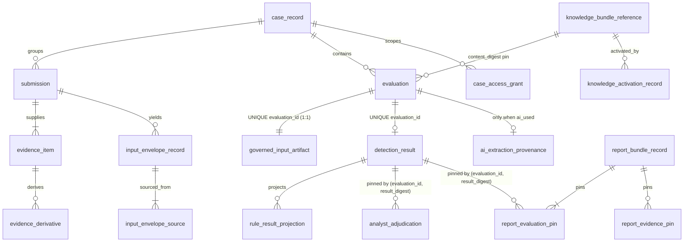
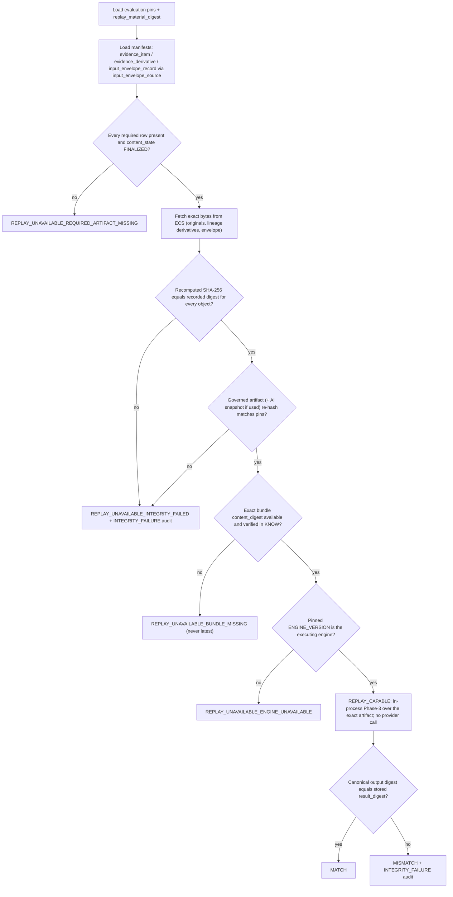
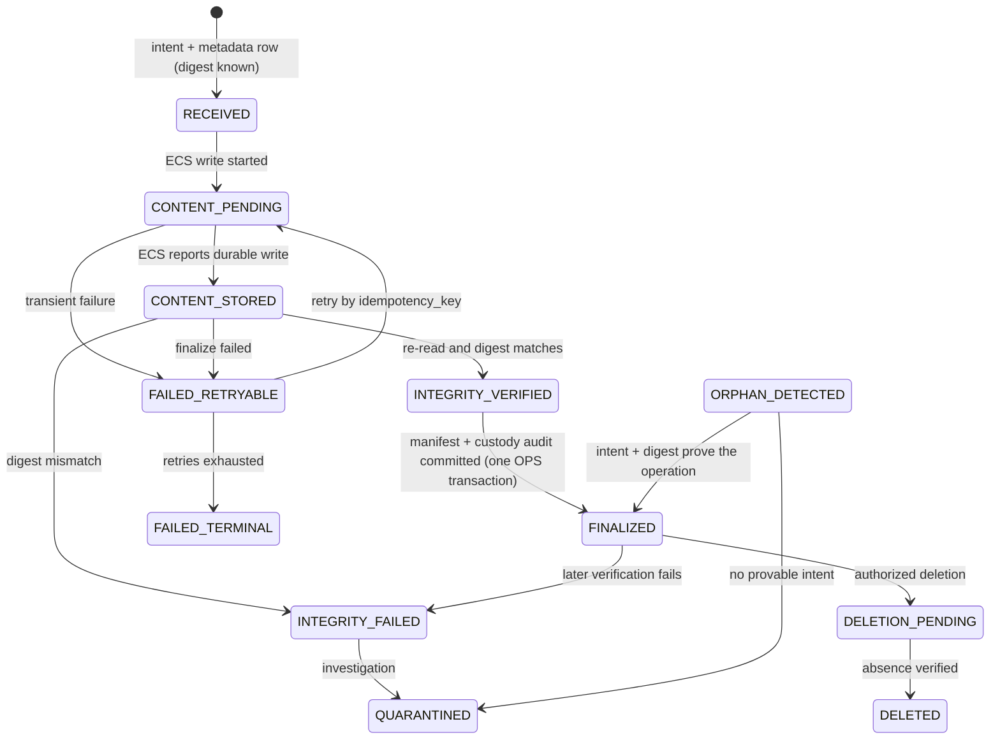

# DATA-001-WP2 — PostgreSQL persistence contract

| Field | Value |
|---|---|
| Document ID | DATA-001-WP2 |
| Version | 0.1 |
| Status | **P6-WP2 PERSISTENCE CONTRACT APPROVED — following independent review** (initial review REQUEST_CHANGES → MEDIUM-1 closed → targeted re-review APPROVE); remote CI + merge pending; not formally closed; no PostgreSQL implementation exists |
| Phase | Phase 6 — Data, API & Integration Contracts |
| Work package | P6-WP2 — PostgreSQL persistence contract + ADR-0011 |
| Owner role | Data Architect / Backend Architect |
| Baseline | P6-WP1 merge `0ac84cd89be1f15895e7f8c3a8cd39126cfaa874` (PR #26) |
| Supplements | [DATA-001](DATA-001-data-domain-lifecycle-contract.md) v0.1 (logical contract — remains authoritative for meaning) |
| Machine-readable contract | [`contracts/postgresql/schema-v1.json`](../../contracts/postgresql/schema-v1.json) (contract 0.1.0), validated by [`schema-contract.schema.json`](../../contracts/postgresql/schema-contract.schema.json) and `knowledge/validation/validate_data_contract.py` |
| Decision | [ADR-0011](../../adr/ADR-0011-database-migration-tooling.md) — database migration tooling (**Accepted** following independent P6-WP2 review) |
| Checkpoint | [GATE-020](../00-program/GATE-020-phase-6-postgresql-persistence.md) |
| Governing authority | ADR-0004, ADR-0008, ADR-0009, ADR-0010, ADR-0013, ADR-0016, ADR-0017; ARCH-003…007; DET-001; AI-001-WP4/WP5 |
| Last updated | 2026-10-02 |

---

## 1. Purpose, scope and claim boundary

This document converts the approved logical contract DATA-001 into an **implementation-ready PostgreSQL
persistence contract**: table families, column contracts, types, controlled vocabularies, keys, constraints,
indexes, immutability enforcement, cross-store state representation, replay/report material, and the migration
strategy decided in ADR-0011. The normative physical structure is the machine-readable contract
`contracts/postgresql/schema-v1.json`; this document explains and justifies it. Where the two disagree, the
validator-checked JSON is the physical source and the disagreement is a defect.

It does **not** implement anything: no DDL file, no migration, no connection code, no ORM model, no repository
layer, no API, no UI. It does not claim that PostgreSQL is installed (RSK-006), that a database was created or
migrated, production readiness, zero-downtime migration, achieved RPO/RTO, legal compliance, or detection efficacy.
**G-09 remains OPEN. OI-05 remains OPEN.** Phase-3/Phase-4 semantics and `ENGINE_VERSION = 1.0.0` are unchanged.

## 2. Authority

| Concern | Authority | This document |
|---|---|---|
| Meaning of every data object | DATA-001 (logical) | Refines representation only; no silent semantic change |
| Governed knowledge | `KNOW` — Git/CI + immutable bundle (ADR-0004/0013) | Stores references (`content_digest`, versions, rule IDs) only |
| Structured operational records | `OPS` — PostgreSQL (ADR-0010) | Tables in §6 |
| Raw/sensitive bytes | `ECS` — EvidenceContentStore (ADR-0010) | Opaque locators + digests only |
| Accountability history | `AUD` — append-only hash-chained audit (ADR-0010 §9, ARCH-004 §7.5) | Physically in PostgreSQL (ARCH-003 §5 row 13, ARCH-005 §3), logically separate, §15 |
| Secrets / keys | `SEC` (ARCH-004 §6–7) | Never stored; at most versioned key **references** |
| Telemetry | `TEL` (ADR-0017) | Not a persistence target here |
| Decision semantics | Phase 3 only (`INV-01`) | Stored verbatim; projections non-authoritative |

The physical design exposed no contradiction with DATA-001. It exposed three ambiguities that P6-WP1 already
assigned here; their narrow clarifications are recorded in DATA-001 §28 (§22 below).

## 3. Tenancy stop condition (ASM-002)

**Finding: no sponsor/programme confirmation of single tenancy exists in the repository.** ASM-002 still reads
"Sponsor confirmation before DATA-001"; the decision log contains no tenancy decision. PROGRAM-001 lists
"multi-tenant operation" under *Future* scope, which is consistent with single tenancy but is **not** a
confirmation. Therefore:

- No `tenant_id` or other tenant column is added (validator DC-14 rejects one).
- Multi-tenancy is not designed.
- Every tenancy-sensitive structure is marked **PROVISIONAL / BLOCKED ON ASM-002** in the machine-readable contract:

| Structure | Why it is tenancy-sensitive |
|---|---|
| `principal_reference` + `uq_principal_reference_external_identity` | Global (issuer, subject) namespace assumes one tenant |
| `role_assignment` + `uq_role_assignment_active` | Roles (including `ADMINISTRATOR`) are deployment-global |
| `ix_review_routing_state_queue` | Analysts see a deployment-wide review queue |
| `retention_policy_reference` + `uq_retention_policy_reference_class_version` | Retention classes are deployment-global |
| `audit_chain_head` + chain partitioning (`chain_id`) | One audit chain per deployment vs per tenant |

The UUIDv4 identifier choice (§5.2) does not assume tenancy. **ASM-002 does not block acceptance of this versioned
persistence contract**, because the tenancy-sensitive structures above are explicitly provisional and machine-checked
(DC-14). **ASM-002 MUST be resolved by the Sponsor/Programme before the first schema-creating migration is accepted
or executed, and before tenancy-sensitive implementation is finalized.** If the sponsor confirms multi-tenancy
instead, this contract must be revised and re-reviewed (tenant scoping of the structures above, cross-tenant
isolation constraints, per-tenant audit chains and retention) before any schema implementation.

## 4. Inputs read

DATA-001, GATE-019, ARCH-003…007, ADR-0004/0008/0009/0010/0013/0016/0017, `adr/README.md`, DET-001, AI-001 (+ WP4/WP5),
SRS-001 v2.1, the assumption/risk registers, PROGRAM-001, and the promoted runtime structures
(`knowledge/runtime/result.py`, `knowledge/schemas/**`, `knowledge/ai/governance.py`, `knowledge/ai/integration.py`).
Nothing among them was modified.

## 5. Conventions

### 5.1 Naming

`snake_case`; **singular** table nouns (`evaluation`, `detection_result`); `case_record` because `case` is an SQL
keyword; primary key `<table>_id`; `*_at` instants; `*_sha256` / `*_digest` SHA-256 hex; `*_ref` opaque external
references; constraint prefixes `uq_`, `ck_`, `ix_`. Names are implementation vocabulary, not domain authority.
Existing contract field names are kept where they already exist (`content_sha256`, `bundle_content_digest`,
`governed_artifact_digest`, `input_id`).

### 5.2 Identifier representation

| Criterion | UUIDv4 (random) | Database-generated `bigint` | Time-ordered (ULID / UUIDv7-style) |
|---|---|---|---|
| Opacity / non-semantic | Fully opaque | Reveals volume and creation order | Embeds creation time (metadata leakage) |
| Generation before persistence | Yes — required for cross-store ops, `idempotency_key`, and the Phase-3 `evaluation_id` that must exist before the kernel call | No — needs a database round trip | Yes |
| Offline / multi-replica generation | No coordination | Central sequence | No coordination |
| Index locality | Random inserts (acceptable; no scale claim made) | Excellent | Good |
| API exposure (future) | Non-enumerable | Enumerable (aids IDOR probing) | Weakly enumerable by time window |
| Cross-store references | Same value in OPS, ECS metadata, audit soft references | Works | Works |
| Security authority | Never — authorization is always server-side (ADR-0009) | Never | Never |
| Fit with governed identifier shape | Canonical text satisfies `^[A-Za-z0-9][A-Za-z0-9_.:-]{1,127}$` | Yes | Yes |
| Tenancy assumption | None | None | None |
| Migration complexity | Native `uuid` type | Lowest | Native `uuid` or text |

**Selected: UUIDv4, generated in the application from a CSPRNG, stored as PostgreSQL `uuid`, rendered as lowercase
canonical hyphenated text** whenever it crosses into a Phase-2/3/4 contract (`evaluation_id`, `input_id`,
`observation_id`, Phase-4 `run_id`). Identifier generation is never a security control. Ordering needs use explicit
instants or, for the audit chain only, `chain_sequence` (an ordinal, not an identifier). No identifier encodes PII,
content, digests or meaning.

### 5.3 Types

| Type | Used for | Not used for |
|---|---|---|
| `uuid` | Identifiers, soft references | — |
| `text` | Identifiers from governed contracts, vocabularies (CHECK-constrained), versions, hex digests, canonical JSON, opaque locators/refs | Raw evidence |
| `text[]` | Language/script tags, routing basis, missing replay material kinds | Free-form lists |
| `boolean` | Flags (`degraded`, `ai_used`, permissions) | — |
| `integer` / `bigint` | Ordinals, revision numbers, attempt counters, byte lengths, `chain_sequence` | Any decision quantity |
| `timestamptz` | Every instant | Durations (no `interval` type is used; no retention period exists) |
| `jsonb` | Four bounded, versioned maps only (§5.6) | The domain model; canonical artifacts |
| `bytea` | Audit checkpoint signatures only | Evidence, reports, keys |

No floating-point, `numeric`, probability, percentage or 0–100 score column exists (DC-12). Digests are lowercase
hex `text` with `^[0-9a-f]{64}$` (DC-21), matching every existing repository contract; `bytea` digests were
considered and rejected to avoid encoding conversions at every contract boundary.

### 5.4 Controlled vocabularies

| Representation | Assessment |
|---|---|
| PostgreSQL `ENUM` | Values can be added but not removed or renamed without type rebuilds; awkward under expand/contract migrations |
| **CHECK-constrained `text` (selected)** | Changing a vocabulary is a reviewed constraint replacement in one migration; values stay readable; works with `text[]` (`<@`) |
| Reference tables | Useful when values carry metadata; adds joins and seed-data migrations without a current need |

The contract defines 69 vocabularies. **Promoted Phase-2/3/4 vocabularies carry exact values and a `source`
pointer** (e.g. `classification` ← `detection-result.schema.json#/properties/classification`; `ai_fallback_reason` ←
`AIFallbackReason`). The validator resolves each source and fails on any drift (DC-13), so persistence can never
add, drop or rename a Phase-3 value (`classification`, severity, risk, confidence, evidence strength, rule
evaluation state, …). Persistence-only vocabularies (lifecycle states, outcomes) are owned by this contract.

### 5.5 Canonical JSON and inline vs ECS content

**`TRUSTLENS_CANONICAL_JSON_V1`** is the existing Phase-4 convention (`knowledge/ai/governance.py`
`canonical_json`): sorted keys, compact separators, `ensure_ascii=True`, `allow_nan=False`, UTF-8. It closes
DATA-001 §23 item 3: `result_digest`, `governed_artifact_digest`, report-manifest and replay-material digests are
SHA-256 over these bytes.

Immutable canonical artifacts (`DetectionResult`, governed input artifact, sealed AI result and replay snapshot,
report manifest) are stored as **the exact canonical JSON `text`**, not `jsonb`, because:

- the stored bytes are the hashed bytes, so integrity is verified by re-hashing the column — no re-canonicalisation;
- `jsonb` discards key order and duplicate keys and rejects the `\u0000` escape, which submitted content could
  produce inside quoted evidence; ASCII-escaped canonical text stores it safely.

Each such artifact has `storage_mode` `INLINE` (canonical text in OPS) or `ECS` (externalised; OPS keeps locator and
digest), with a CHECK that exactly one location is set. The size threshold for externalising is **NOT YET
SPECIFIED** (owner: P6-WP6 / implementation); canonicalisation itself is bounded by the Phase-4 limits and fails
closed rather than truncating.

**Full submitted content never enters OPS** (DC-07): originals, derivatives (normalized/OCR/redacted/previews,
URL-observation records) and **input envelopes** — which carry `raw_text`, `normalized_text` and free-text user
context — are stored only in ECS. `submission` keeps only categorical user context (`relationship_to_content`);
sender identifiers and other PII stay in the ECS envelope. Small, content-bearing `C4` free text that is
operational by nature (case notes, adjudication rationale, correction descriptions) is stored in OPS, classified
`C4`, and covered by the deletion graph.

### 5.6 JSONB fields

| Field | Contract / version source | Immutability | Validation owner |
|---|---|---|---|
| `evaluation.component_versions` | `detection-result.schema.json` `provenance.component_versions` / `result_contract_version` | Immutable once written | Persistence adapter validates against the promoted schema before write |
| `detection_result.component_versions` | same | Immutable | same |
| `knowledge_bundle_reference.component_versions` | `bundle-manifest.schema.json` `component_versions` / `manifest_schema_version` | Immutable | Knowledge activation adapter |
| `audit_event.safe_metadata` | Audit event schema / `event_schema_version` | Append-only | Audit capability; raw content, PII and secrets forbidden |

## 6. Table families

37 tables cover the 27 mapped DATA-001 objects (`Feedback` deferred); several objects map to more than one table
(for example `AuditEventReference` → `audit_event`, `audit_chain_head`, `audit_checkpoint`,
`audit_checkpoint_signing_attempt`). Full column contracts, keys, checks and indexes are in
`contracts/postgresql/schema-v1.json`.

| # | Table | DATA-001 object | Store | Authority | Class | Mutability | Delete policy | Retention | Tenancy |
|---:|---|---|---|---|---|---|---|---|---|
| 1 | `principal_reference` | `PrincipalReference` | `OPS` | operational record | `C5` | `M-OPS` | governed minimization only | — | PROVISIONAL |
| 2 | `role_assignment` | `RoleAssignment` | `OPS` | operational record | `C5` | `M-APP` | never | — | PROVISIONAL |
| 3 | `case_access_grant` | `CaseAccessGrant` | `OPS` | operational record | `C5` | `M-APP` | governed deletion only | — | — |
| 4 | `break_glass_grant` | `BreakGlassGrant` | `OPS` | operational record | `C5` | `M-APP` | never | — | — |
| 5 | `knowledge_change_reference` | `RoleAssignment` (SoD context) | `OPS` | reference to knowledge authority | `C2` | `M-APP` | never | — | — |
| 6 | `case_record` | `Case` | `OPS` | operational record | `C2` | `M-OPS` | governed deletion only | explicit | — |
| 7 | `case_note` | `CaseNote` | `OPS` | operational record | `C4` | `M-APP` | governed deletion only | via `case_record` | — |
| 8 | `submission` | `Submission` | `OPS` | operational record | `C2` | `M-OPS` | governed deletion only | explicit | — |
| 9 | `evidence_item` | `EvidenceItem` | `OPS` | operational record | `C2` | `M-IMM` (+ content state) | governed deletion only | explicit | — |
| 10 | `evidence_derivative` | `EvidenceDerivative` | `OPS` | operational record | `C2` | `M-IMM` (+ content state) | governed deletion only | explicit | — |
| 11 | `input_envelope_record` | `InputEnvelopeRecord` | `OPS` | operational record | `C2` | `M-IMM` (+ content state) | governed deletion only | explicit | — |
| 12 | `input_envelope_source` | `InputEnvelopeRecord` | `OPS` | operational record | `C2` | `M-IMM` | governed deletion only | via `input_envelope_record` | — |
| 13 | `governed_input_artifact` | `GovernedInputArtifact` | `OPS` | operational record | `C4` | `M-IMM` | governed deletion only | explicit | — |
| 14 | `governed_observation_reference` | `GovernedInputArtifact` | `OPS` | non-authoritative projection | `C2` | `M-IMM` | governed deletion only | via `governed_input_artifact` | — |
| 15 | `ai_extraction_provenance` | `AIExtractionProvenance` | `OPS` | operational record | `C4` | `M-IMM` | governed deletion only | explicit | — |
| 16 | `evaluation` | `Evaluation` | `OPS` | operational record | `C2` | `M-OPS` (write-once pins) | governed deletion only | via `case_record` | — |
| 17 | `detection_result` | `DetectionResultRecord` | `OPS` | operational record | `C4` | `M-IMM` | governed deletion only | explicit | — |
| 18 | `rule_result_projection` | `DetectionResultRecord` | `OPS` | non-authoritative projection | `C2` | `M-IMM` | governed deletion only | via `detection_result` | — |
| 19 | `user_correction` | `UserCorrection` | `OPS` | operational record | `C4` | `M-APP` | governed deletion only | via `case_record` | — |
| 20 | `review_routing_state` | `ReviewRoutingState` | `OPS` | operational record | `C2` | `M-OPS` | governed deletion only | via `case_record` | PROVISIONAL |
| 21 | `analyst_adjudication` | `AnalystAdjudication` | `OPS` | operational record | `C4` | `M-APP` | governed deletion only | via `case_record` | — |
| 22 | `report_bundle_record` | `ReportBundleRecord` | `OPS` | operational record | `C2` | `M-IMM` | governed deletion only | explicit | — |
| 23 | `report_evaluation_pin` | `ReportBundleRecord` | `OPS` | operational record | `C2` | `M-IMM` | governed deletion only | via `report_bundle_record` | — |
| 24 | `report_evidence_pin` | `ReportBundleRecord` | `OPS` | operational record | `C2` | `M-IMM` | governed deletion only | via `report_bundle_record` | — |
| 25 | `replay_execution` | `ReplayExecution` | `OPS` | operational record | `C2` | `M-APP` | governed deletion only | via `evaluation` | — |
| 26 | `external_enrichment_result` | `ExternalEnrichmentResult` | `OPS` | operational record | `C2` | `M-IMM` | governed deletion only | explicit | — |
| 27 | `knowledge_bundle_reference` | `KnowledgeBundleReference` | `OPS` | reference to knowledge authority | `C1` | `M-REF` | never | — | — |
| 28 | `knowledge_activation_record` | `KnowledgeActivationRecord` | `OPS` | operational record | `C2` | `M-APP` | never | — | — |
| 29 | `knowledge_deployment_state` | `KnowledgeActivationRecord` | `OPS` | operational pointer | `C2` | `M-OPS` | never | — | — |
| 30 | `retention_policy_reference` | `RetentionClassReference` | `OPS` | operational record | `C2` | `M-REF` | never | — | PROVISIONAL |
| 31 | `deletion_request` | `DeletionRequest` | `OPS` | operational record | `C2` | `M-OPS` | never | — | — |
| 32 | `deletion_action` | `DeletionAction` (workflow) | `OPS` | operational record | `C2` | `M-OPS` | never | — | — |
| 33 | `cross_store_operation` | `CrossStoreOperation` | `OPS` | operational record | `C2` | `M-OPS` | governed deletion only | — | — |
| 34 | `audit_chain_head` | `AuditEventReference` | `AUD` | accountability history | `C6` | `M-OPS` | never | — | PROVISIONAL |
| 35 | `audit_event` | `AuditEventReference` (+ `DeletionAction` accountability) | `AUD` | accountability history | `C6` | `M-APP` | never | — | — |
| 36 | `audit_checkpoint` | `AuditEventReference` | `AUD` | accountability history | `C6` | `M-IMM` | never | — | — |
| 37 | `audit_checkpoint_signing_attempt` | `AuditEventReference` | `AUD` | accountability history | `C6` | `M-APP` | never | — | — |

`Feedback` (DATA-001 object 28) is **deferred**: Post-MVP, non-authoritative, never auto-trains; mapped when the
feedback capability is scheduled. No table is knowledge authority (DC-06); no table stores rule, indicator,
taxonomy or action-policy definitions.

### 6.1 Core relationships



Audit tables have **no foreign keys into OPS**; they use soft `uuid` references so accountability history outlives
governed deletion of the resources it describes.

## 7. Key invariants and constraints

| Invariant | Physical enforcement |
|---|---|
| Evaluation ↔ governed input artifact **exactly 1:1** (P6-WP1 LOW-1) | `governed_input_artifact.evaluation_id` NOT NULL + `uq_governed_input_artifact_evaluation` + FK → `evaluation`; `tg_evaluation_running_requires_artifact` forbids an evaluation from **entering `RUNNING`** without its exact artifact (`REQUESTED` → `FAILED_PRECONDITION` needs none). Every evaluation that runs has exactly one artifact; a re-evaluation creates a new `evaluation` **and** a new artifact row. |
| One completed `DetectionResult` per evaluation | `uq_detection_result_evaluation` |
| A result exists **only** under a `COMPLETED` evaluation; a fenced/failed evaluation can never own one (MEDIUM-1) | Fenced completion protocol (§12.1): `detection_result.execution_fence_token` NOT NULL + binding FK `(evaluation_id, execution_fence_token)` → `evaluation`; `ck_evaluation_fence_cleared_when_failed`; `tg_detection_result_insert_guard` (BEFORE INSERT); deferred commit invariants `tg_detection_result_requires_completed` and `tg_evaluation_completed_requires_result` (DC-25) |
| `DetectionResult` immutable | Table `M-IMM`: no mutable/write-once columns; application roles hold no UPDATE privilege; `BEFORE UPDATE` trigger rejects; DELETE only by `tl_deletion_executor` under an authorized deletion |
| Adjudication/report pin the **exact** result | Composite FK `(evaluation_id, result_digest)` → `uq_detection_result_evaluation_digest` |
| Adjudication never overwrites the result | Separate `M-APP` table; revisions chained via `predecessor_analyst_adjudication_id` (single successor) |
| Evidence never deduplicated across users/cases | No unique constraint over `content_sha256`/`derivative_sha256` (DC-19) |
| Every derivative has exactly one parent | `ck_evidence_derivative_single_parent` (`num_nonnulls(...) = 1`) |
| Envelope `input_id` consistency | Composite FK `(input_envelope_record_id, input_id)` from `evaluation` and `governed_input_artifact` |
| AI provenance consistent with the consumed artifact | Composite FK `(evaluation_id, governed_artifact_digest)` → `governed_input_artifact` |
| Enrichment never enters a result (current contracts) | `ck_external_enrichment_not_consumed`; failure/absence is never `CLEAN` |
| Evaluation pins exact knowledge | `evaluation.bundle_content_digest` FK → `knowledge_bundle_reference.content_digest`; nothing references `knowledge_deployment_state` (DC-16) |
| Never `ACTIVE` without validation/authenticity | `ck_knowledge_activation_active_validated` |
| SoD for governed knowledge changes | `ck_knowledge_change_sod` (author ≠ approver), complementing Git review |
| One active OWNER per case | `uq_case_access_grant_single_owner` (partial unique) |
| No administrator evidence grant | `case_grant_kind` = {`OWNER`, `ASSIGNED_ANALYST`} (DC-20) |

Constraints enforce structure and integrity only. They never re-implement Phase-3 semantics (for example, the
risk matrix is not duplicated as a CHECK): projections must equal the canonical document, which stays authoritative.

## 8. Immutability and history enforcement

Three layers, because no single one is sufficient against a privileged operator (tamper-evident, not tamper-proof):

1. **Privileges.** Conceptual database roles (exact SQL-role mechanics are an implementation detail of ADR-0016's
   deployment):

   | Role | Privileges |
   |---|---|
   | `tl_schema_migrator` | DDL; used only by the ADR-0011 release step |
   | `tl_app_runtime` | SELECT/INSERT on OPS; column-level UPDATE only on declared `mutable_columns`/`write_once_columns`; no DELETE. On AUD: INSERT/SELECT on `audit_event`, `audit_checkpoint`, `audit_checkpoint_signing_attempt`; **no UPDATE or DELETE on any historical audit row**. Its only AUD UPDATE is a narrow column-level grant on `audit_chain_head` (`last_chain_sequence`, `last_event_hash`, `updated_at`) to advance the chain on append — not general AUD UPDATE, and unable to alter prior events or hashes |
   | `tl_reconciler` | Cross-store state transitions; `evaluation` fencing (`RUNNING`/`RESULT_COMPUTED_PERSISTENCE_PENDING` → `FAILED_INFRASTRUCTURE` with token clear) only; audit append (same narrow `audit_chain_head` grant) |
   | `tl_deletion_executor` | DELETE / tombstone minimization on `GOVERNED_*` tables within an authorized `deletion_action`; audit append (same narrow `audit_chain_head` grant); never UPDATE/DELETE on audit history or `NEVER` tables |
   | `tl_audit_reader` | SELECT on AUD only |

2. **Triggers.** `M-IMM` tables reject UPDATE; `write_once_columns` may move only from NULL to a value; `M-OPS`
   tables enforce declared transitions (`transition_guards` / structured `constraint_triggers` in the contract);
   `audit_event` rejects UPDATE and DELETE unconditionally. Where exact SQL-role mechanics are deferred to deployment,
   these privileges are the contract requirement.
3. **Verification.** Canonical artifacts are re-hashed at replay, report, export, restore and investigation
   boundaries (ARCH-003 §12); the audit chain and signed checkpoints detect rewritten history.

## 9. Replay material set (closes P6-WP1 LOW-2)

### 9.1 Material

The replay contract is **strict full-provenance replay**: a replay is `REPLAY_CAPABLE` only when **every** item
below that applies is present and verifies. No reduced "decision-only" replay mode is defined; adding one would
require a governed decision.

| ID | Material | Required | Physical location |
|---|---|---|---|
| RM-01 | Evaluation identity, `evaluation_timestamp`, `input_id`, whole `replay_material_digest` | Always | `evaluation` |
| RM-02 | Exact governed input artifact + `governed_artifact_digest` | Always | `governed_input_artifact` (inline or ECS) |
| RM-03 | `ENGINE_VERSION` — must equal the executing engine | Always | `evaluation`, `detection_result` |
| RM-04 | Result contract version | Always | `evaluation`, `detection_result` |
| RM-05 | Exact knowledge: `bundle_content_digest` + bundle/manifest/commit/component versions, and the bundle itself, digest-verified | Always | `evaluation`, `knowledge_bundle_reference`, `KNOW:PublishedBundleRepository` |
| RM-06 | Profile/config versions (profile id, confidence gate, risk-matrix id, confidence-policy id, action-policy version) | Always | `evaluation` |
| RM-07 | Support/language state (`input_support_status`, `language`, `script`) | Always | `evaluation` |
| RM-08 | Phase-4 sealed `AIExtractionResult` + `AIReplaySnapshot` + `config_ref` | When `ai_used` | `ai_extraction_provenance` |
| RM-09 | External enrichment actually consumed — **none** under current contracts (enforced); any future consumption is inside RM-02 | Always (assertion) | `external_enrichment_result.consumed_in_governed_artifact` |
| RM-10 | Immutable stored `DetectionResult` + `result_digest` (comparison target) | Always | `detection_result` |
| RM-11 | Original evidence manifests for every envelope source | Always | `input_envelope_source`, `evidence_item` |
| RM-12 | Retained original evidence bytes, re-hashed | Always | `ECS` via `evidence_item.ecs_locator` |
| RM-13 | Derivatives in the lineage, with digests and bytes | When present in lineage | `evidence_derivative`, `ECS` |
| RM-14 | Normalized input envelope bytes + digest | Always | `input_envelope_record`, `ECS` |

`replay_material_digest` is written once at `COMPLETED` over the canonical set of RM-01…RM-10 pins plus the
evidence/derivative/envelope digests in RM-11…RM-14.

### 9.2 Capability states

`replay_execution.replay_capability_state` ∈ `REPLAY_CAPABLE`, `REPLAY_UNAVAILABLE_REQUIRED_ARTIFACT_MISSING`,
`REPLAY_UNAVAILABLE_INTEGRITY_FAILED`, `REPLAY_UNAVAILABLE_BUNDLE_MISSING`, `REPLAY_UNAVAILABLE_ENGINE_UNAVAILABLE`;
unavailable states must list `missing_material_kinds`. Only `REPLAY_CAPABLE` may produce `MATCH`/`MISMATCH`
(`ck_replay_execution_capable_outcomes`). If governed deletion removed any required item — including original
evidence bytes while the governed artifact survives — replay fails explicitly: no AI recall, no current/latest
substitution, no approximate success.

### 9.3 Evidence re-verification sequence



A digest match proves byte integrity relative to the recorded digest only — not truth, authorship or legal
admissibility.

## 10. Report reproducibility (P6-WP1 LOW-3, physical)

`report_bundle_record` stores the canonical manifest (identifiers and digests only) and its digest;
`report_evaluation_pin` pins each `(evaluation_id, result_digest)`, engine version, bundle digest and AI `config_ref`;
`report_evidence_pin` pins each evidence/derivative digest. Regeneration re-reads only these pins and verifies every
source as in §9.3. If any required source has been deleted under governed policy, the regeneration row records
`generation_outcome = REGENERATION_UNAVAILABLE` with a failure category, no bytes and no digest
(`ck_report_bundle_unavailable`). Nothing is reconstructed approximately, no AI call is made, no newer evidence is
substituted, and **sensitive content is not duplicated or retained solely to keep reports reproducible** unless a
governed retention policy permits it (OI-05 OPEN). Report format stays Phase 7 / REPORT-001.

## 11. Cross-store state machine



| DATA-001 §9 logical state | Physical state |
|---|---|
| `RECEIVED` | `RECEIVED` (→ `CONTENT_PENDING` while writing) |
| `STAGED` | `CONTENT_STORED` |
| `STORED_VERIFIED` | `INTEGRITY_VERIFIED` |
| `FINALIZED` | `FINALIZED` |
| `FAILED` | `FAILED_RETRYABLE` / `FAILED_TERMINAL` |
| `QUARANTINED` / `ORPHAN_DETECTED` / `INTEGRITY_FAILED` | same names |
| `DELETION_PENDING` / `DELETED` | same names |

- **Never complete without bytes:** `ck_<table>_finalized_requires_verified` forbids `CONTENT_STORED`,
  `INTEGRITY_VERIFIED` or `FINALIZED` without a locator and digest, and `FINALIZED` without verification/finalization
  instants (DC-22).
- **Idempotency:** each content-bearing row carries a unique `idempotency_key` shared with its
  `cross_store_operation` (`uq_cross_store_operation_idempotency`).
- **Retry ownership:** `cross_store_operation.owner_module` (`EVIDENCE`, `GOVERNED_EVALUATION`, `REPORTING`,
  `PRIVACY_LIFECYCLE`), executed by `tl_reconciler`; operationally owned by Data/Storage Operations (ARCH-006 §11.3).
- **Reconciliation queryability:** partial indexes over non-terminal states (`ix_cross_store_operation_open`,
  `ix_evidence_item_incomplete`, `ix_evidence_derivative_incomplete`).
- **Terminal vs retryable:** `FAILED_RETRYABLE` carries `next_attempt_not_before`; `FINALIZED`, `FAILED_TERMINAL`,
  `QUARANTINED`, `DELETED` are terminal (`ck_cross_store_operation_terminal`). Backoff values and maximum attempts
  are NOT YET SPECIFIED (P6-WP6).
- **Content stored, metadata finalization failed:** the row stays `CONTENT_STORED`/`FAILED_RETRYABLE`; the
  reconciler finalizes only when the recorded intent and digest prove the operation. ECS content with no intent
  record becomes an `ORPHAN_RECONCILIATION` operation in `ORPHAN_DETECTED`, then is quarantined or deleted — never
  silently adopted.
- **Metadata present, content missing/mismatched:** `INTEGRITY_FAILED`; replay, report and use are blocked; an
  `INTEGRITY_FAILURE` audit event is appended.
- **No message broker is selected;** the operation table is the durable work list. A PostgreSQL transaction never
  covers ECS (§19).

## 12. Evaluation lifecycle and the lost in-memory result (closes P6-WP1 INFO-2)

```mermaid
stateDiagram-v2
    [*] --> REQUESTED
    REQUESTED --> RUNNING: pins written once + governed_input_artifact inserted
    REQUESTED --> FAILED_PRECONDITION: no valid active bundle / ACTIVE_BUNDLE_WITHDRAWN / invalid context
    RUNNING --> COMPLETED: one transaction - detection_result + projections + pins + audit
    RUNNING --> RESULT_COMPUTED_PERSISTENCE_PENDING: first persistence attempt failed; exact result still held in memory
    RESULT_COMPUTED_PERSISTENCE_PENDING --> COMPLETED: idempotent retry persists the EXACT held result
    RUNNING --> FAILED_INTEGRITY: typed bundle/artifact/assembly failure
    RUNNING --> FAILED_INFRASTRUCTURE: fenced after lease expiry (token cleared)
    RESULT_COMPUTED_PERSISTENCE_PENDING --> FAILED_INFRASTRUCTURE: fenced; result lost or durability unconfirmed
```



`REQUESTED → RUNNING` requires the exact governed input artifact (`tg_evaluation_running_requires_artifact`) and sets a
fresh `execution_fence_token`.

- **Durability protocol.** Persisting the result is the single fenced PostgreSQL transaction of §12.1. A committed
  `detection_result` row for the `evaluation_id` exists **if and only if** that evaluation is `COMPLETED` — there is
  no half-committed state, and a result can never belong to a failed evaluation.
- **Process death.** The executing replica holds `execution_lease_expires_at` and the opaque
  `execution_fence_token`. If the lease expires while the evaluation is `RUNNING` or
  `RESULT_COMPUTED_PERSISTENCE_PENDING`, the reconciler **fences** it: one compare-and-set sets
  `FAILED_INFRASTRUCTURE` with `failure_category = RESULT_DURABILITY_UNCONFIRMED` (or `EXECUTION_LEASE_EXPIRED`)
  **and clears the token**. Lease length is NOT YET SPECIFIED (P6-WP6). Expiry only *permits* fencing; trust is never
  based on time alone.
- **Never appears complete.** Terminal states never change (transition guard); a `FAILED_INFRASTRUCTURE` evaluation
  can never become `COMPLETED`.
- **Retry = new evaluation.** A retry creates a **new** `evaluation` (`origin = RETRY_AFTER_FAILURE`,
  `predecessor_evaluation_id` = the failed one) with a **new** governed input artifact. No result is recomputed and
  attached to the original evaluation identity. The only same-identity retry is persisting the exact result still
  held in memory, keyed by `evaluation_id` (ADR-0010 §6).
- Phase-3 `ERROR`/`UNSUPPORTED` classifications are **completed** results, not execution failures.

### 12.1 Fenced, commit-coherent completion (closes review MEDIUM-1)

**Defect corrected.** Previously a slow worker whose lease had expired could insert `detection_result` after the
reconciler had already moved the evaluation to `FAILED_INFRASTRUCTURE`; its completion compare-and-set matched zero
rows but nothing stopped the transaction committing, leaving a failed evaluation owning an authoritative result.

**Fencing.** `evaluation.execution_fence_token` is an opaque UUIDv4 issued when the evaluation enters `RUNNING`.
`ck_evaluation_fence_held_while_executing` requires it while `RUNNING`/`RESULT_COMPUTED_PERSISTENCE_PENDING`;
`ck_evaluation_fence_cleared_when_failed` requires it to be NULL in **every** terminal non-success state
(`FAILED_PRECONDITION`, `FAILED_INTEGRITY`, `FAILED_INFRASTRUCTURE`). Lease renewal and completion are
compare-and-set on the token, never on a previously observed timestamp.

**Result binding.** `detection_result.execution_fence_token` is NOT NULL and immutable, and the binding FK
`(evaluation_id, execution_fence_token)` → `evaluation (evaluation_id, execution_fence_token)` (`uq_evaluation_fence`;
no cascade, no set-null) means:

1. a result can only be inserted while its writer's token is the evaluation's **live** token;
2. once the evaluation is fenced (token NULL), no result can reference it;
3. once a result exists, the token cannot be cleared, so that evaluation can never become `FAILED_*`.

**Guards.** `tg_detection_result_insert_guard` (BEFORE INSERT) locks the evaluation row and admits only
`RUNNING`/`RESULT_COMPUTED_PERSISTENCE_PENDING` with a matching token. Two deferred commit-time invariants make the
pair coherent: `tg_detection_result_requires_completed` (result ⇒ `COMPLETED`) and
`tg_evaluation_completed_requires_result` (`COMPLETED` ⇒ result).

**Completion transaction.**

```text
BEGIN
  SELECT evaluation FOR UPDATE
    WHERE evaluation_id = :e AND status IN ('RUNNING','RESULT_COMPUTED_PERSISTENCE_PENDING')
      AND execution_fence_token = :fence                -- 0 rows => ROLLBACK (fenced or ineligible)
  INSERT detection_result (..., execution_fence_token = :fence)   -- insert guard + binding FK
  INSERT rule_result_projection ...; INSERT audit_event ...
  UPDATE evaluation SET status = 'COMPLETED', completed_at, replay_material_digest
    WHERE evaluation_id = :e AND status IN ('RUNNING','RESULT_COMPUTED_PERSISTENCE_PENDING')
      AND execution_fence_token = :fence                -- must affect exactly 1 row, else ROLLBACK
COMMIT                                                  -- deferred: result exists <=> COMPLETED
```

**Fence transaction (reconciler).**

```text
BEGIN
  UPDATE evaluation SET status = 'FAILED_INFRASTRUCTURE', failure_category = 'RESULT_DURABILITY_UNCONFIRMED',
         failed_at = now(), execution_fence_token = NULL
    WHERE evaluation_id = :e AND status IN ('RUNNING','RESULT_COMPUTED_PERSISTENCE_PENDING')
      AND execution_fence_token = :observed_token AND execution_lease_expires_at < now()
  INSERT audit_event (EVALUATION_FAILED)
COMMIT
```

The evaluation row lock serialises the two transactions. Whichever commits first wins; the other matches zero rows.
If the worker loses, its transaction rolls back, its result row never persists, it cannot resurrect the failed
evaluation, and it never touches the retry. A retry is always a **new** evaluation (`RETRY_AFTER_FAILURE`, new
governed artifact, new token); it never inherits an uncommitted in-memory result.

**Consumer safety.** Because results exist only under `COMPLETED` evaluations (a terminal state),
`analyst_adjudication` and `report_evaluation_pin` — which pin `(evaluation_id, result_digest)` through a FK to
`detection_result` — can only pin authoritative results, and `tg_replay_execution_requires_completed` admits replay
only for `COMPLETED` evaluations. The machine-readable `completion_protocol` encodes all of this and validator check
DC-25 verifies each link structurally (seven negative mutations; one CI self-test defect).

## 13. Retention, deletion and DeletionAction (closes P6-WP1 INFO-1)

- `retention_policy_reference` holds class code, policy version, `policy_status` (`UNRESOLVED_OI05` | `GOVERNED`) and
  a basis reference **only once governed**. It has **no duration, interval, expiry or legal-basis value** (DC-17;
  `ck_retention_policy_unresolved_no_basis`). Until OI-05 is decided every content-bearing object references an
  `UNRESOLVED_OI05` class, so **no automatic expiry exists** and deletion happens only through authorized requests.
  ASM-014's placeholder is not adopted.
- `deletion_request` states: `REQUESTED` → `AUTHORIZED` → `IN_PROGRESS` → `COMPLETE` | `PARTIALLY_FAILED` |
  `FAILED`, or `REJECTED`. Its scope target is a soft reference so it outlives what it deletes.
- **INFO-1 resolution — two separate concerns.** `deletion_action` is the **OPS workflow** record (`C2`, `M-OPS`:
  `PLANNED` → `EXECUTING` → `VERIFIED_ABSENT` | `RESIDUAL_FOUND` | `FAILED`). **Accountability** is a separate
  append-only `audit_event` (`CONTENT_DELETED`, `RETENTION_ACTION`; `C6`, `AUD`) carrying only opaque identifiers
  and categorical outcomes. Mutable workflow state is never treated as audit authority, and no sensitive content is
  copied into audit. DATA-001 §5.19.3 and Matrix A are clarified accordingly (§22).
- **Dependent-object handling (corrected per review LOW-1).** Every FK stays `RESTRICT`; nothing cascades. The
  deletion executor works in two phases:
  1. **Content phase (ECS).** Delete and verify the bytes in scope (originals, derivatives, envelopes, externalised
     artifacts, report blobs, staging objects). The OPS rows move to `DELETION_PENDING` → `DELETED` (tombstone) and
     keep their FKs intact, so this phase never conflicts with `RESTRICT`.
  2. **Row phase (OPS), children first.** Derived from the declared FK graph (only `GOVERNED_DELETION_ONLY` tables
     take part; no `NEVER` table hard-references them):

     | Level | Tables (may be deleted only after every level above) |
     |---:|---|
     | 1 | `ai_extraction_provenance`, `analyst_adjudication`, `case_access_grant`, `case_note`, `cross_store_operation`, `external_enrichment_result`, `governed_observation_reference`, `input_envelope_source`, `replay_execution`, `report_evaluation_pin`, `report_evidence_pin`, `review_routing_state`, `rule_result_projection`, `user_correction` |
     | 2 | `detection_result`, `evidence_derivative`, `governed_input_artifact`, `report_bundle_record` |
     | 3 | `evaluation`, `evidence_item` |
     | 4 | `input_envelope_record` |
     | 5 | `submission` |
     | 6 | `case_record` |

     Within a self-referencing table (`case_note`, `analyst_adjudication`, `evidence_derivative`, `evaluation`,
     `report_bundle_record`), successors and child derivatives are removed before their predecessor or parent.
  - **Retention exceptions.** If policy retains a row (for example a `DetectionResult` under a future OI-05 decision),
    every FK ancestor of that row is retained as well (minimized/tombstoned where permitted); a parent is never
    removed while a retained child references it. Residual rows are reported as `RESIDUAL_FOUND`, and the request ends
    `PARTIALLY_FAILED` unless the residue is policy-sanctioned. Tombstone content is limited to what OI-05 permits.

## 14. Knowledge references, activation and withdrawal

- `knowledge_bundle_reference` stores `content_digest` (unique, load-bearing), bundle/manifest/commit/component
  versions, a release reference, and a **non-authoritative mirror** of governance eligibility (`ELIGIBLE` |
  `WITHDRAWN` | `UNKNOWN`) with the observation instant and source. No knowledge content is stored.
- `knowledge_activation_record` is append-only history: action kind, lifecycle state (`PUBLISHED`, `DISTRIBUTED`,
  `VALIDATED`, `ACTIVE`, `REJECTED`, `ACTIVE_BUNDLE_WITHDRAWN`), validation and authenticity outcomes, previous
  bundle, actor, reason, outcome.
- `knowledge_deployment_state` is the per-deployment **current pointer** (`NO_ACTIVE_BUNDLE` | `ACTIVE` |
  `ACTIVE_BUNDLE_WITHDRAWN`). It is mutable and **nothing references it** (DC-16): evaluation, result and report
  provenance pin the exact `content_digest`, never "current/latest".
- Rule references appear only as `rule_id`/`rule_version` inside results and `rule_result_projection` (`C1`
  references), never as definitions.

## 15. Audit storage

- `audit_event` is append-only (`M-APP`, no updatable columns, `delete_policy = NEVER`): identity, `chain_id`,
  `chain_sequence` (unique per chain, gap-free), `event_type`, `occurred_at`/`recorded_at`, actor (soft reference +
  kind), `outcome`, target kind/id, case/evaluation/evidence soft references, bundle digest for knowledge lifecycle
  events, correlation id, bounded `safe_metadata`, `previous_event_hash`, `event_hash`.
- `event_hash = SHA-256(TRUSTLENS_CANONICAL_JSON_V1(event_without_hash) || previous_event_hash)`; genesis
  `previous_event_hash` is 64 zeros at `chain_sequence = 1` (`ck_audit_event_genesis`).
- Appends lock the chain's `audit_chain_head` row in the same transaction, so sequence and previous hash are
  serialised; the operation and its required audit event commit atomically, so a required audit failure fails the
  operation (ARCH-006 §5).
- `audit_checkpoint` (range + digest, immutable) and `audit_checkpoint_signing_attempt` (append-only lifecycle rows
  `CHECKPOINT_PENDING` → `RETRYABLE_FAILURE` → `CHECKPOINT_SIGNED` | `CHECKPOINT_TERMINAL_FAILURE`; remediation is a
  new linked attempt) implement ARCH-005 §7.2 / ARCH-006 §8. Only a real signature with key id/version references
  is `SIGNED`; the signing key never touches the database.
- No raw evidence, message bodies, AI bodies, secrets or PII in audit rows. **Tamper-evident, not tamper-proof:** a
  privileged operator who replaces the database and the checkpoint trust anchor can rewrite history (ADR-0010 §9).

## 16. Security and authorization support

The schema provides, for later per-endpoint authorization (P6-WP3): resource ownership (`case_record.owner_principal_id`
+ one active `OWNER` grant); `case_access_grant` with **separate** `permits_case_metadata` and
`permits_evidence_content`; analyst assignment (`ASSIGNED_ANALYST` grants; guard requires an active `ANALYST` role);
`knowledge_change_reference` for editor/approver SoD; `break_glass_grant` with mandatory expiry, reason, and
post-event review (no self-review). **Administrator alone confers no evidence access**: there is no administrator
grant kind and roles never imply grants (DC-20). The schema stores no passwords, tokens, MFA secrets, private keys,
provider credentials or data-encryption keys (DC-10) — only versioned key *references* (`data_key_version_ref`,
`signer_key_*_ref`).

## 17. Delete behaviour

`ON DELETE CASCADE` is **forbidden** (DC-04); all foreign keys are `RESTRICT`. No `SET NULL` is used. Soft references
(no FK) are used deliberately where a record must outlive its target: all audit references; `deletion_request` and
`deletion_action` targets; `cross_store_operation.target_id`; `break_glass_grant` scope. History tables
(`audit_*`, activation history, role/break-glass grants, bundle references, retention references) are
`delete_policy = NEVER`; principals are minimized, not deleted (`GOVERNED_MINIMIZATION_ONLY`, residual rules OI-05).

## 18. Index strategy

Every index carries a written justification in the contract. Categories, all from concrete access or integrity
needs and no scale claim:

- **Authorization:** `ix_case_access_grant_principal_active`, `ix_case_record_owner`, `ix_break_glass_grant_active`.
- **Case navigation:** submission-by-case, evidence-by-submission, envelope-by-submission, evaluation-by-case,
  adjudication-by-case/evaluation.
- **Deletion dependency enumeration:** every FK whose parent table is `GOVERNED_DELETION_ONLY` has a supporting
  index led by the FK's first column — full, or partial only on `IS NOT NULL` — because PostgreSQL does not index FK
  columns automatically and `RESTRICT` checks would otherwise scan. Enforced by validator check DC-24.
- **Work queues:** review queue (PROVISIONAL), reconciliation, deletion requests/actions, in-flight evaluation
  lease sweeper, unsigned checkpoints, break-glass review — all partial over non-terminal states.
- **Provenance:** `ix_evaluation_bundle_digest` (which evaluations used a withdrawn bundle), activation history per
  deployment.
- **Audit investigation:** by case and by target.

Rule-usage analytics indexes (FR-080, Post-MVP) are intentionally not added until that work is scheduled.

## 19. Transaction boundaries

| Atomic PostgreSQL unit | Contents |
|---|---|
| Case creation | `case_record` + `OWNER` grant + `CASE_CREATED` audit |
| Role/grant change | `role_assignment` / `case_access_grant` / `break_glass_grant` row + audit |
| Evidence finalization | manifest state → `FINALIZED` + `EVIDENCE_STORED` custody audit (after ECS verification) |
| Evaluation start | write-once pins + `RUNNING` + `governed_input_artifact` + `EVALUATION_STARTED` audit |
| Result persistence | Fenced completion (§12.1): eligibility + token check → `detection_result` + projections + guarded `COMPLETED` compare-and-set + `replay_material_digest` + review routing + audit; deferred invariants at commit |
| Fencing | Reconciler compare-and-set to `FAILED_INFRASTRUCTURE` clearing the token + audit |
| Adjudication | `analyst_adjudication` + routing state + audit |
| Activation | `knowledge_activation_record` + `knowledge_deployment_state` + audit |
| Deletion step | `deletion_action` state + OPS row deletions + audit (ECS deletion happens before and is verified separately) |

State transitions use compare-and-set updates (`UPDATE … WHERE status = <expected>`) under the default isolation
level; the audit chain uses a row lock on `audit_chain_head`. **No transaction includes `EvidenceContentStore`:**
every OPS+ECS operation uses §11 states, idempotency keys and reconciliation.

## 20. Migration strategy

Decided in **ADR-0011 (Accepted)**: Alembic-managed, versioned, SQL-first migrations; no ORM selected; no autogenerate
authority; linear reviewed history; explicit operator-run upgrade; no production-startup schema mutation;
expand → migrate → contract for rolling compatibility; advisory-locked single migrator; backup point before
destructive change; downgrades only when lossless, otherwise forward repair; destructive-change governance; history
and canonical artifacts never rewritten by migrations. **No migration exists yet**, and the first schema-creating
migration must not be accepted or executed until ASM-002 is resolved.

## 21. Machine-readable contract and validation

| Artifact | Role |
|---|---|
| `contracts/postgresql/schema-v1.json` | Physical contract: conventions, tenancy status, database roles, 69 vocabularies, DATA-001 coverage, replay material set, fenced `completion_protocol`, 37 tables (columns, types, nullability, classification, keys, FKs, uniques, checks, indexes, mutability, delete policy, retention, soft references, guards, structured constraint triggers) |
| `contracts/postgresql/schema-contract.schema.json` | Draft 2020-12 structural schema (narrow; deliberately admits forbidden values so named checks reject them) |
| `contracts/postgresql/fixtures/negative-mutations.json` | 28 negative mutations, each required to be rejected by a named check (NEG-22…NEG-28 cover MEDIUM-1) |
| `knowledge/validation/validate_data_contract.py` | Static, offline validator (checks DC-01…DC-25, listed in its docstring; DC-25 = fenced completion); 24th check in `run_all.py` |
| `knowledge/validation/ci_selftest.py` | Two new representative defects, both caught by `validate_data_contract.py`: removing the 1:1 unique constraint, and removing the result insert guard (MEDIUM-1) |
| `.github/workflows/knowledge-validation.yml` | Path filter now includes `docs/06-contracts/**` and `contracts/**` (closes P6-WP1 LOW-5) |

The contract is **not runtime database authority** and is not a migration; it is the reviewable target that a
future migration chain and catalog check must match (ADR-0011 validation plan).

**Maintenance.** `contracts/postgresql/schema-v1.json` is the **maintained source artifact** for the Phase-6
persistence contract. The scratch generator used during initial authoring is not part of the repository and is not
required. Future changes may be hand-edited in the JSON but MUST pass the JSON Schema, `validate_data_contract.py`
(including every negative mutation), the CI self-test and the canonical gate.

## 22. P6-WP1 carryover resolution

| Item | Resolution |
|---|---|
| LOW-2 replay material completeness | **Closed** — §9 (RM-01…RM-14, capability states, re-verification sequence) |
| LOW-3 report reproducibility vs retention | Carried physically — §10 (`REGENERATION_UNAVAILABLE`, pins) |
| LOW-4 single tenancy | **Still open** — §3; structures marked PROVISIONAL and machine-checked; does not block this contract; blocks the first schema-creating migration and tenancy-sensitive implementation |
| LOW-5 CI path filter | **Closed** — `docs/06-contracts/**` and `contracts/**` added with the first dependent validator |
| INFO-1 C6 vs DeletionAction | **Closed** — §13: OPS workflow (`C2`) + AUD accountability event (`C6`); DATA-001 clarified |
| INFO-2 lost in-memory result | **Closed** — §12: lease → `FAILED_INFRASTRUCTURE` / `RESULT_DURABILITY_UNCONFIRMED`; retry = new evaluation |
| DATA-001 §23 item 1 (physical schema) | Defined here (approved persistence contract) |
| DATA-001 §23 item 2 (identifiers) | UUIDv4, application-generated (§5.2) |
| DATA-001 §23 item 3 (canonical serialization) | `TRUSTLENS_CANONICAL_JSON_V1` (§5.5) |
| DATA-001 §23 item 4 (vocabularies) | Persistence vocabularies finalized in the contract; audit taxonomy v1 (additive extension only; P6-WP6 may extend) |
| DATA-001 §23 item 13 / 14 / 15 | Closed (LOW-5, LOW-2, INFO-1/INFO-2 above) |

Representation choices recorded in DATA-001 §28 (no semantic change): Phase-4 attempt/fallback state lives on
`evaluation`, and `ai_extraction_provenance` rows exist only when AI was used (sealed audit and snapshot exist only
then); free-text user context is stored in the ECS envelope rather than on `submission`; input envelopes and
content-bearing derivatives are ECS-only.

## 23. Open decisions and owners

| # | Decision | Owner |
|---:|---|---|
| 1 | Confirm single tenancy (ASM-002) before the first schema-creating migration is accepted/executed and before tenancy-sensitive implementation; revise and re-review if multi-tenant | **Sponsor / Programme** |
| 2 | Retention durations, legal basis, residual metadata / tombstone content (OI-05) | **Sponsor + legal/governance** |
| 3 | Inline-vs-ECS size threshold; lease length; retry backoff / max attempts | P6-WP6 / implementation |
| 4 | Exact SQL-role / workload-credential mechanics on the chosen platform | ADR-0016 deployment implementation |
| 5 | API payloads and per-endpoint authorization over this schema | P6-WP3 / P6-WP4 |
| 6 | Enrichment consumption contract (would change RM-09) and SSRF-TOCTOU controls (WP4 LOW-3) | P6-WP5 / INT-001 / ADR-0012 |
| 7 | Feedback table (Post-MVP) and analytics indexes (FR-080) | Later scheduled WP |
| 8 | Disposable-database verification of the migration chain, CHECK expressions, constraint triggers (incl. §12.1 fencing) and roles against this contract | Implementation / ADR-0011 validation plan (needs PostgreSQL, RSK-006) |
| 9 | ADR-0011 acceptance | Independent review |

## 24. Builder self-challenge

| Challenge | Answer |
|---|---|
| Does PostgreSQL become rule authority? | No. Only references (`content_digest`, versions, rule IDs) are stored; DC-06 rejects definition tables/columns. |
| Are raw evidence bytes in PostgreSQL? | No. Originals, derivatives and envelopes are ECS-only; DC-07 rejects raw-content columns, `C3` columns and non-signature `bytea`. |
| Can one governed input artifact belong to multiple evaluations? | No. `evaluation_id` is NOT NULL + UNIQUE on the artifact; the CI self-test proves removing it is caught. |
| Can a completed DetectionResult be updated? | No. No UPDATE privilege, trigger rejection, no mutable columns (DC-08). |
| What if the computed result is lost before persistence? | Lease expiry → `FAILED_INFRASTRUCTURE` / `RESULT_DURABILITY_UNCONFIRMED`; it can never become `COMPLETED`; a retry is a new evaluation. |
| What exact artifacts are required for replay? | RM-01…RM-14 (§9.1). |
| Can replay succeed after one required artifact was deleted? | No. It is `REPLAY_UNAVAILABLE_*` with the missing kinds listed. |
| Can report regeneration defeat deletion policy? | No. Deleted inputs make regeneration `REGENERATION_UNAVAILABLE`; nothing is retained just for reproducibility. |
| Does mutable deletion workflow state become the audit itself? | No. `deletion_action` is OPS workflow; accountability is a separate append-only `audit_event`. |
| Can an administrator gain content access through schema design? | No. There is no administrator grant kind; content access needs an explicit grant with `permits_evidence_content` or audited break-glass. |
| Do IDs encode PII? | No. UUIDv4 is random and non-semantic. |
| Why this identifier strategy? | Pre-persistence generation for cross-store and Phase-3 identities, opacity, non-enumerability, no coordination, no embedded time (§5.2). |
| Why this migration tool? | Python-native, PostgreSQL-mature, offline-capable, reviewable linear history, no ORM required, least bespoke machinery (ADR-0011). |
| Does the migration tool force an ORM? | No. Alembic needs SQLAlchemy Core as a library; no ORM models or autogenerate authority are used. |
| Can application startup silently mutate production schema? | No. Upgrade is an explicit operator step; replicas only check that the revision is supported. |
| Can old/new app versions coexist during migrations? | Yes, when changes follow expand → migrate → contract; each migration states its compatibility window. Not every migration is online-safe. |
| Are all migrations reversible? | No. Downgrades are provided only when lossless. |
| What if downgrade would lose data? | No destructive downgrade; forward repair or authorised restore from a verified backup. |
| Does a PostgreSQL transaction falsely cover ECS? | No. Cross-store work uses states, idempotency keys and reconciliation (§11, §19). |
| Are destructive migrations governed? | Yes. Compatibility analysis, backup point, retention assessment, recovery plan, two-party review (ADR-0011). |
| Is tenancy confirmed? | **No.** ASM-002 remains unconfirmed; it does not block this contract, but it blocks the first schema-creating migration and tenancy-sensitive implementation. |
| Does any constraint depend on an unconfirmed tenancy decision? | Yes. Five structures (§3), all marked PROVISIONAL / BLOCKED ON ASM-002. |
| Does CI now trigger for `docs/06-contracts/**`? | Yes, and for `contracts/**`. |
| Does the new validator fail on a representative defect? | Yes. 28 in-validator negative mutations, plus two `ci_selftest` defects caught by `validate_data_contract.py`. |
| Can `detection_result` be inserted when the evaluation is already FAILED? | No. The token is NULL in every `FAILED_*` state, so the binding FK fails, and the insert guard rejects the state. |
| Can a stale worker complete after its lease/fence is lost? | No. Its token no longer matches; the locked eligibility check and the completion compare-and-set match zero rows, so it rolls back. |
| Can a transaction commit with a result row and a FAILED evaluation? | No. The deferred invariant requires `COMPLETED`, and an existing result blocks clearing the token. |
| Can a transaction commit with a result row and a non-COMPLETED evaluation? | No. `tg_detection_result_requires_completed` fails the commit. |
| Does stale-worker failure delete or alter the retry evaluation? | No. It only ever addresses its own `evaluation_id` and token. |
| Does a retry reuse the failed evaluation's identity? | No. A retry is a new evaluation with a new artifact and token. |
| Can an orphaned result be pinned by adjudication, report or replay? | No. Results exist only under `COMPLETED` evaluations; adjudication and report pins go through the result FK; replay requires `COMPLETED`. |
| Does the validator detect loss of the result-state guard? | Yes (DC-25; NEG-22 and the CI self-test defect). |

### 24.1 Known weaknesses (not hidden)

- **Static only.** No PostgreSQL is available (RSK-006). Constraint expressions, triggers and roles are contract
  text; their behaviour is unverified until a disposable-database check exists. CHECK rules are plain strings the
  validator does not parse as SQL.
- **Strict replay depends on raw-evidence retention.** Because the replay contract requires original bytes, any
  governed deletion of evidence ends exact replay for that evaluation. That is intentional, and OI-05 will decide
  how long this capability lasts.
- **Projections can drift if the write path is wrong.** `detection_result` projections and the
  `rule_result_projection` table are verified against the canonical document by the write path and verification
  jobs, not by database constraints.
- **Trigger-based guards** (artifact presence on entering `RUNNING`, OWNER grant, analyst role, transitions, the
  §12.1 insert guard and deferred commit invariants) are specified, not implemented. Owner: implementation /
  ADR-0011 validation plan. No runtime-tested claim is made.
- **Tenancy remains open** (§3): it does not block this contract but blocks the first schema-creating migration and
  tenancy-sensitive implementation.
- **Audit throughput** is serialised per chain by design; no capacity claim is made.

## 25. Acceptance boundary and non-claims

DATA-001-WP2 v0.1 is the **P6-WP2 persistence contract, APPROVED following independent review**; remote CI and merge
to `main` are pending, so P6-WP2 is not formally closed. ADR-0011 is **Accepted**; ADR-0012 remains **Planned**. ASM-002 does not block acceptance of this contract; it must be resolved
before the first schema-creating migration is accepted or executed and before tenancy-sensitive implementation. Phase-3/Phase-4 semantics and `ENGINE_VERSION = 1.0.0` are unchanged; G-09 and OI-05 remain OPEN;
WP4 LOW-3 remains deferred to ADR-0012. No database, migration, repository, API or UI was implemented, and no
production-readiness, zero-downtime, RPO/RTO, legal-compliance or detection-efficacy claim is made.

## 26. Independent review corrections (P6-WP2)

Initial independent review: **BLOCKER 0 / HIGH 0 / MEDIUM 1 / LOW 4 / INFO 4 — REQUEST_CHANGES.**

| Finding | Disposition |
|---|---|
| MEDIUM-1 result row could commit under an evaluation already fenced to `FAILED_INFRASTRUCTURE` | **Addressed** — fenced, commit-coherent completion (§12.1): fence token, binding FK, failed-clears-token CHECK, BEFORE INSERT guard, deferred two-way commit invariants, consumer guards; `completion_protocol` in the contract; DC-25; NEG-22…NEG-28; CI self-test defect |
| LOW-1 documented deletion order conflicted with `RESTRICT` FKs | **Addressed** — §13 order derived from the declared FK graph; `RESTRICT` unchanged |
| LOW-2 artifact-presence wording conflicted with `REQUESTED → FAILED_PRECONDITION` | **Addressed** — an evaluation may not **enter `RUNNING`** without its exact artifact (`tg_evaluation_running_requires_artifact`) |
| LOW-3 ASM-002 wording | **Aligned** — does not block this contract; blocks the first schema-creating migration and tenancy-sensitive implementation (§3) |
| LOW-4 static-only PostgreSQL limitation | **Retained as a disclosed limitation** — owner: implementation / ADR-0011 validation plan (§24.1) |
| INFO-1 audit role wording vs `audit_chain_head` append | **Addressed** — narrow column-level `audit_chain_head` UPDATE only; no UPDATE/DELETE on historical audit rows (§8) |
| INFO-2 scratch generator | **Addressed** — JSON is the maintained source; hand edits must pass all checks (§21) |
| INFO-3 DATA-001 Submission `C3` placement | **Narrowly aligned** in DATA-001 §5.3 and Matrix A |
| INFO-4 unset operational values | **Deferred to P6-WP6** — inline-vs-ECS threshold, lease length, retry backoff remain NOT YET SPECIFIED |

### 26.1 Targeted re-review and acceptance

Targeted independent re-review: **BLOCKER 0 / HIGH 0 / MEDIUM 0 / LOW 2 / INFO 3 — APPROVE.**

- **MEDIUM-1 — CLOSED** by: the opaque execution fence token; the result insertion-state guard; the fence-token
  binding between `evaluation` and `detection_result`; the compare-and-set completion on the current fence; failed
  states clearing the fence; the deferred commit-time invariant (result exists ⇔ evaluation `COMPLETED`); retry as a
  **new** evaluation; DC-25 structural validation; NEG-22…NEG-28; and canonical CI self-test coverage. These semantics
  are unchanged by acceptance.
- **Remaining LOW — ASM-002 (single tenancy): OPEN / EXTERNAL DEPENDENCY; NON-BLOCKING for this contract.** Owner
  Sponsor / Programme. It blocks the first schema-creating migration and tenancy-sensitive implementation; the five
  tenancy-sensitive structures stay PROVISIONAL / BLOCKED ON ASM-002; no `tenant_id`.
- **Remaining LOW — static-only PostgreSQL validation: NON-BLOCKING / FUTURE VALIDATION.** CHECK expressions,
  constraint triggers, roles/grants, DDL semantics and the migration chain are specified but have not been executed
  against a disposable PostgreSQL instance. Owner: implementation phase / ADR-0011 validation plan. No runtime
  database verification is claimed.
- **INFO-A — DATA-001 §5.2 tenancy wording:** aligned with the disposition above.
- **INFO-B — deletion vs `COMPLETED` tombstone: carried to P6-WP6 (operational/replay contract) and OI-05
  (retention/tombstone policy).** If governed deletion removes a `DetectionResult` while a `COMPLETED` evaluation
  tombstone remains, the shorthand "`COMPLETED` implies a `DetectionResult` exists" no longer describes that
  post-deletion historical state. Safety is preserved because replay fails closed at the required-artifact check
  (§9.2). Future work must distinguish the **normal durable-completion invariant** (unchanged and binding here) from
  **post-governed-deletion tombstone semantics**; no tombstone retention rule is invented.
- **INFO-4 — handed to P6-WP6:** inline-vs-ECS size threshold, lease length and retry backoff remain NOT YET
  SPECIFIED.
- **P6-WP1 carryovers remain CLOSED:** LOW-2 (replay material), INFO-1 (deletion workflow OPS vs AUD), INFO-2 (lost
  in-memory result, through the MEDIUM-1 correction), LOW-5 (`docs/06-contracts/**` CI coverage).
