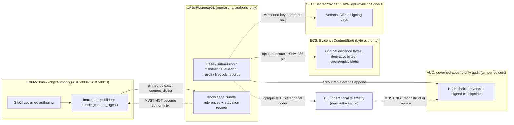
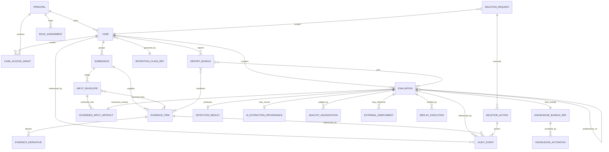
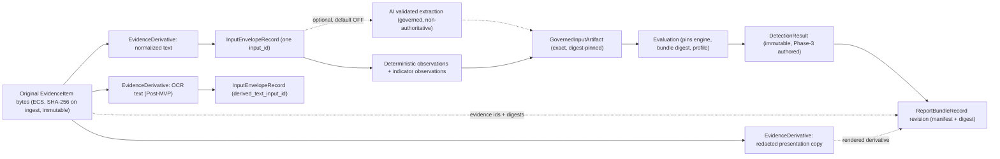
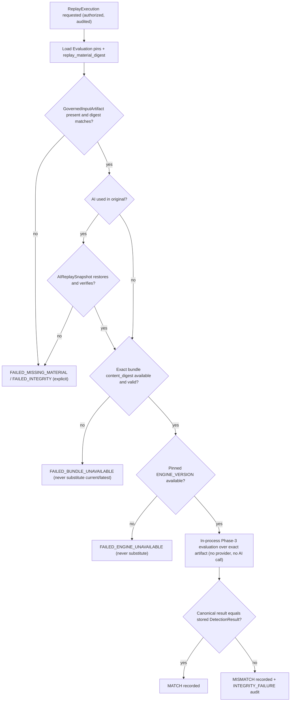

# DATA-001 — Canonical data domain and lifecycle contract

| Field | Value |
|---|---|
| Document ID | DATA-001 |
| Version | 0.1 |
| Status | **P6-WP1 CONTRACT APPROVED — following independent review** (BLOCKER 0 / HIGH 0 / MEDIUM 0 / LOW 5 / INFO 4; APPROVE) — remote CI + merge pending; logical contract only; not Phase-6 closure; no physical schema/API implemented |
| Phase | Phase 6 — Data, API & Integration Contracts |
| Work package | P6-WP1 — Canonical data domain & lifecycle contract foundation |
| Owner role | Data Architect / Backend Architect |
| Baseline | Phase-5 closure merge `6c20f448d6df3e36f2a2e9cc97a806aa1deb4f36` (PR #25) |
| Governing architecture | [ARCH-001](../05-architecture/ARCH-001-enterprise-architecture.md) … [ARCH-007](../05-architecture/ARCH-007-integrated-phase-5-architecture.md); [ADR-0004](../../adr/ADR-0004-knowledge-storage-architecture.md), [ADR-0005](../../adr/ADR-0005-rule-execution-model.md), [ADR-0006](../../adr/ADR-0006-risk-and-confidence-aggregation.md), [ADR-0007](../../adr/ADR-0007-ai-authority-and-model-strategy.md), [ADR-0008](../../adr/ADR-0008-python-runtime-service-topology.md), [ADR-0009](../../adr/ADR-0009-identity-authentication-authorization.md), [ADR-0010](../../adr/ADR-0010-evidence-storage-tamper-evidence.md), [ADR-0013](../../adr/ADR-0013-rule-set-publication-version-distribution.md), [ADR-0014](../../adr/ADR-0014-language-and-script-strategy.md), [ADR-0015](../../adr/ADR-0015-evidence-hierarchy-and-official-alternate-provenance.md), [ADR-0016](../../adr/ADR-0016-deployment-resilience-runtime-topology.md), [ADR-0017](../../adr/ADR-0017-observability-operational-readiness.md) |
| Runtime contracts reused | [DET-001](../03-detection/DET-001-deterministic-detection-engine.md), `knowledge/runtime/result.py` (`result_contract_version` 1.1.0), `knowledge/runtime/observations.py`, `knowledge/runtime/runtime_knowledge.py`, `knowledge/schemas/*.schema.json`, [AI-001-WP4](../04-ai/AI-001-WP4-containment-provenance.md), [AI-001-WP5](../04-ai/AI-001-WP5-phase3-integration.md), [KB-002](../02-knowledge/KB-002-extraction-contracts.md) |
| Checkpoint | [GATE-019](../00-program/GATE-019-phase-6-data-contract-foundation.md) |
| Later Phase-6 consumers | P6-WP2 persistence/schema + ADR-0011 · P6-WP3 API · P6-WP4 OpenAPI · P6-WP5 integrations (INT-001, ADR-0012) · P6-WP6 operational contracts |
| Last updated | 2026-10-02 |

---

## 1. Purpose, scope and claim boundary

DATA-001 is the **canonical logical data contract** for TrustLens. It names every durable data object the
Python modular monolith (ADR-0008) persists or references, and for each one fixes its purpose, authority,
owning module, sensitivity class, authoritative store class, mutability, retention/deletion relevance,
integrity/provenance requirements, relationships and replay relevance. Later Phase-6 work packages **must** use
these objects and rules; they refine representation, not meaning.

P6-WP1 is **logical only**. It defines no SQL, table, column type, key or constraint syntax, index, partitioning,
ORM class, connection configuration, migration file or migration framework (P6-WP2 / ADR-0011), and no endpoint
path, HTTP method, status code, pagination shape, payload or OpenAPI document (P6-WP3 / P6-WP4). It selects no
product: PostgreSQL is already accepted architecture (ADR-0010); `EvidenceContentStore` remains vendor-neutral;
no ORM, migration tool, object-store vendor, queue, identity provider or threat-intelligence provider is chosen.

Phase 3 remains the sole decision authority (`INV-01`); Phase 4 remains optional, default-OFF and
non-authoritative (ADR-0007). `ENGINE_VERSION = 1.0.0` is unchanged. **G-09 remains OPEN** and **OI-05 remains
OPEN**. DATA-001 makes no production-readiness, legal-compliance (including DPDP), legal-admissibility,
certified-custody, or detection-efficacy (accuracy/precision/recall/false-positive/negative) claim.

## 2. Authority precedence and SRS conflict note

Precedence, highest first, for any data question:

1. Accepted ADRs and the merged Phase-5 architecture (ARCH-001…007, ADR-0003…0010/0013…0017).
2. Promoted Phase-3/Phase-4 runtime contracts and schemas (DET-001, `result.py`, `observations.py`,
   `knowledge/schemas/**`, `knowledge/ai/**` governed structures).
3. PROGRAM-001 requirements and the SRS functional requirements, as inputs.
4. Historical design examples in older documents.

**SRS authority note.** SRS-001 v2.1's functional requirements remain inputs to this contract unless superseded
by a later governed decision. Some of its **implementation and analysis-model examples predate accepted Phase-5
architecture and are subordinate to it where they conflict.** The following are flagged as historical /
non-current wherever encountered; DATA-001 does not carry them forward:

| SRS / register wording | Current authority | DATA-001 treatment |
|---|---|---|
| Java 21 + Spring Boot backend (SRS §2.4, constraint 2.5.4; ASM-010) | ADR-0008 / ARCH-002: Python modular monolith with in-process Phase-3 kernel | Historical; not modelled |
| Separate, mandatory Python/FastAPI intelligence service (SRS §2.4; ADR-0002 historical) | ADR-0008; ADR-0007: Phase 4 optional, default-OFF, in-process module | Historical; no service data boundary modelled |
| Database-owned `RULE` / `RULE_SET` / `INDICATOR` / `SCAM` entities (SRS Appendix B.1 ER model, `D3 Rule-Set Store`) | ADR-0004 / ADR-0013: Git/CI + immutable digest-addressed bundle is knowledge authority | Only operational **references** (`content_digest`, rule IDs/versions) are modelled (§18) |
| `ANALYSIS_RESULT` / "score" / "full score breakdown" wording (SRS §4.3–4.5, FR-043) | DET-001 / ADR-0006 / `result.py`: categorical, decomposed axes; no score | Read as "full decomposition of the categorical decision axes" (§19) |

The SRS is not declared invalid as a whole and is not modified by this work package.

## 3. Modelling conventions

### 3.1 Object contract template

Every canonical object in §5 states: **purpose**; **authority**; **owning module** (ARCH-002 §3 catalogue);
**classification** (§3.4); **store class** (§3.3); **mutability** (§3.5); **retention/deletion relevance**;
**integrity/provenance**; **relationships**; **replay relevance**; and **logical content** — the information the
object must carry, named conceptually. Logical content names are contract vocabulary, not column names; P6-WP2 may
restructure them provided every stated distinction survives.

### 3.2 Identifiers

Every canonical object has an identifier that is **stable, opaque, non-semantic, and immutable for the logical
object**. An identifier:

- never encodes PII, submitted content, a content digest, a user name, a phone/UPI/account value, a case title, a
  classification, or any other meaning;
- is never reused for another object, including after deletion;
- is distinct from a content digest — `content_sha256` identifies bytes; `evidence_id` identifies the TrustLens
  record (ADR-0010 §5); a digest is never a public identifier and never authorises cross-user/case correlation;
- is never client-authoritative for security purposes — a client-supplied owner, role, assignment or admin
  identifier is never trusted (ADR-0009 Decision 8).

DATA-001 does **not** choose UUID, ULID, database sequences, Snowflake-style IDs or any other generation scheme.
One existing accepted constraint applies: identifiers that cross into the promoted Phase-2/3/4 contracts
(`input_id`, `observation_id`, `attachment_id`, `evaluation_id`, Phase-4 `run_id`/host identifiers) must satisfy
the governed identifier shape already enforced by those contracts (`^[A-Za-z0-9][A-Za-z0-9_.:-]{1,127}$` in
`input-envelope.schema.json` and `knowledge/ai/governance.py`). Representation and generation are P6-WP2 work.

### 3.3 Store classes

| Code | Store class | Authority | Accepted source |
|---|---|---|---|
| `KNOW` | Git/CI governed knowledge + immutable published, digest-addressed knowledge bundle | **Authoritative** for rules, indicators, negative library, taxonomy, dimensions, action policy, official/knowledge evidence provenance | ADR-0004, ADR-0013, ADR-0015 |
| `OPS` | PostgreSQL structured operational store | Authoritative for **operational** records only (cases, submissions, manifests, evaluations, results, provenance, lifecycle, references) | ADR-0010 Decision 1 |
| `ECS` | `EvidenceContentStore` port (vendor-neutral, encrypted, private) | Authoritative for externalised **bytes** of user evidence, derivatives, report/replay blobs | ADR-0010 Decision 2, ARCH-003 §8 |
| `AUD` | Governed append-only, hash-chained, tamper-evident audit history + `AuditCheckpointSigner` checkpoints | Authoritative for **accountability history** | ADR-0010 §9, ARCH-003 §12, ARCH-004 §7.5. Physically recorded as PostgreSQL audit history (ARCH-003 §5 row 13) but logically a distinct class with append-only rules |
| `SEC` | `SecretProvider` / `DataKeyProvider` / signer boundaries (ZONE 5) | Authoritative for secrets and key material; **never** ordinary application records | ARCH-004 §6–7, ARCH-007 §3 |
| `IDP` | External, pluggable OIDC identity provider | Authoritative for credentials, MFA and account recovery — outside TrustLens | ADR-0009 Decisions 1–2 |
| `TEL` | Vendor-neutral operational telemetry (logs/metrics/traces) | **Non-authoritative** diagnostics; never audit, evidence, result or knowledge authority | ADR-0017, ARCH-006 §4 |
| `MEM` | Replica process memory (loaded `RuntimeKnowledge`, caches, in-flight state) | Never sole durable authority | ARCH-005 §4.1 |

### 3.4 Data classification classes

| Class | Name | ARCH-003/ADR-0010 handling label | Examples |
|---|---|---|---|
| `C1` | Public / governed knowledge | GOVERNED | Rules, indicators, taxonomy, official source provenance, published bundle manifest |
| `C2` | Operational metadata | INTERNAL | Identifiers, lifecycle/status codes, timestamps, version pins, digests, categorical outcomes |
| `C3` | Sensitive submitted evidence | RESTRICTED | Original SMS/chat/email/URL/screenshot bytes, user-supplied context, OTP/PIN/account-like content |
| `C4` | Derived sensitive content | SENSITIVE | Normalized text, OCR text, redacted copies, input envelopes, observations (spans), AI validated extraction, `DetectionResult` (may quote evidence), reports, adjudication rationale |
| `C5` | Security / identity metadata | INTERNAL (personal data where it identifies a person) | Principal references, IdP issuer/subject reference, role assignments, access grants, break-glass grants |
| `C6` | Audit / accountability metadata | INTERNAL (references may point at SENSITIVE objects) | Audit events, chain hashes, checkpoints, content-free deletion proof |
| `C7` | Secret / key material | Not an application data label — `SEC` only | Database/object-store/provider credentials, OIDC client secrets, signing keys, data-encryption keys |
| `C8` | Telemetry | Operational, non-authoritative | Opaque IDs, categorical codes, durations, correlation IDs |

These are architectural handling classes, not statutory classifications (ADR-0010 §12).

### 3.5 Mutability classes

| Code | Class | Rule |
|---|---|---|
| `M-IMM` | Immutable after completion | Once finalized/completed, never edited; correction creates a new object |
| `M-APP` | Append / new revision | New entries or revisions are added with predecessor links; prior entries never rewritten |
| `M-OPS` | Mutable operational state | May change through defined transitions; security-, custody- or lifecycle-material transitions are audited |
| `M-REF` | Immutable reference to external authority | A pin to an object whose authority lives elsewhere (`KNOW`, `IDP`); never mutated to point elsewhere |

No history is mutated to represent a correction (`INV-13`).

### 3.6 Time

Every timestamp is a real, timezone-aware instant (the Phase-3 `evaluation_timestamp` rule in `result.py`).
Timestamps recorded as provenance are pinned values, never re-read from a clock on replay or report regeneration.
Clock-integrity monitoring stays with ARCH-006 §14.4.

## 4. Store authority

Authority directions: knowledge meaning flows only out of `KNOW`; `OPS` records point **at** knowledge by exact
digest and **at** bytes by locator plus digest; accountability flows **into** `AUD`; key material never leaves
`SEC` as ordinary data; telemetry receives only safe, non-authoritative signals.

## 5. Canonical object contracts

### 5.1 Identity and authorization references

#### 5.1.1 `PrincipalReference`

- **Purpose:** TrustLens's reference to an authenticated actor — a human mapped from a validated IdP subject, or a
  non-human workload identity — used for ownership, attribution, authorization and audit.
- **Authority:** the IdP authenticates; TrustLens owns the subject→actor mapping (ADR-0009 Decision 2). Workload
  identities follow ADR-0009 "Service identities".
- **Owning module:** Security/access boundary. **Classification:** `C5`. **Store:** `OPS`.
- **Mutability:** identity `M-IMM`; mapping status (active/deactivated) `M-OPS` with audited transitions.
- **Logical content:** principal identifier; principal kind (`HUMAN` | `WORKLOAD`); external identity reference
  (issuer + subject, not a credential); status; created/deactivated instants.
- **Forbidden content:** passwords or password hashes, access/refresh/ID tokens, MFA secrets, workload credentials,
  and IdP group membership used as resource authority.
- **Retention/deletion:** follows account lifecycle; residual personal metadata after account deletion is OI-05.
- **Integrity/provenance:** created only from validated identity; never client-asserted.
- **Relationships:** owns `Case`s; holds `RoleAssignment`s and `CaseAccessGrant`s; actor of audit events.
- **Replay relevance:** none — identity never influences a decision quantity (`result.py` trust model).

#### 5.1.2 `RoleAssignment`

- **Purpose:** trusted server-side record that a principal holds one of the five TrustLens roles `USER`,
  `ANALYST`, `KNOWLEDGE_EDITOR`, `KNOWLEDGE_APPROVER`, `ADMINISTRATOR` (ADR-0009 Decision 3).
- **Authority:** TrustLens governed administration. IdP claims may inform governed provisioning but never grant
  resource access directly (ADR-0009 Option C rejected).
- **Owning module:** Security/access boundary. **Classification:** `C5`. **Store:** `OPS` + `AUD` events.
- **Mutability:** `M-APP` — grant and revocation are recorded as new entries; current role set is derived.
- **Logical content:** assignment identifier; principal; role; assigning principal; reason/change reference;
  effective-from / revoked-at instants.
- **Integrity/provenance:** every grant/revocation emits a governed audit event; SoD (author ≠ approver for the same
  knowledge change) is enforced over the knowledge-change identity, not by role assignment alone (ADR-0009 SoD).
- **Knowledge-governance role context:** `KNOWLEDGE_EDITOR`/`KNOWLEDGE_APPROVER` act on governed knowledge
  resources in `KNOW`; the application records only role context and references to the governed change/release
  identity, never rule content.
- **Replay relevance:** none.

#### 5.1.3 `CaseAccessGrant`

- **Purpose:** resource-level authorization context. RBAC alone is insufficient; every protected action needs an
  explicit allow over role **and** resource (ADR-0009 Decision 4).
- **Authority:** TrustLens application authorization state. **Owning module:** Security/access boundary with
  Application/orchestration. **Classification:** `C5`. **Store:** `OPS` + `AUD`.
- **Mutability:** `M-APP` (grant/revoke entries; current state derived).
- **Logical content:** grant identifier; case; principal; grant kind (`OWNER` | `ASSIGNED_ANALYST`, further kinds
  only by governed extension); separate indicators for case-metadata access and evidence-content access (so that
  "case authorization + evidence authorization" can be evaluated, ADR-0009 "Resource authorization"); granting
  principal; reason; effective-from / expiry / revoked-at instants.
- **Rules:** absence of a grant is denial. **No grant kind confers evidence access because a principal is
  `ADMINISTRATOR`** (ADR-0009 Decision 6, NFR-14, SRS 5.5.10). Report access follows the owning case's
  authorization; a locator or presigned URL is never authority.
- **Replay relevance:** none.

#### 5.1.4 `BreakGlassGrant` (defined, not implemented)

- **Purpose:** the data needed to represent emergency content access per ADR-0009 "Privileged access".
- **Logical content:** grant identifier; individual actor; explicit reason; scope (case and/or evidence items);
  start instant; automatic expiry instant; post-event review state, reviewer and outcome.
- **Rules:** short-lived, auto-expiring, never standing privilege; always a governed audit event **and** a
  security-operational signal (ARCH-006 §11.5). **Classification:** `C5`. **Store:** `OPS` + `AUD`.
  **Mutability:** `M-APP` (review outcome appended).

### 5.2 `Case`

- **Purpose:** durable container for one incident, grouping submissions, evaluations, adjudications, notes and
  report revisions (FR-051); the resource-access boundary and the root of the export/deletion dependency graph.
- **Authority:** Application/orchestration. **Classification:** `C2` (metadata), with `C4` children.
  **Store:** `OPS`.
- **Mutability:** identity `M-IMM`; lifecycle state `M-OPS` (material transitions audited).
- **Logical content:** case identifier; owning principal; lifecycle state (conceptually open → under review →
  closed, plus deletion-pending/deleted under §17; exact vocabulary P6-WP2); created/closed instants;
  retention-class reference.
- **Rules:** a case carries **no case-level verdict, classification, severity, risk or confidence**. Decision
  semantics exist only on per-evaluation `DetectionResult`s; any case summary is a presentation of those results
  (Phase 7) and never a new decision (`INV-11`). No tenant field is introduced, and tenant isolation requires a
  future governed decision.
- **Single-tenant physical-schema assumption: UNCONFIRMED / PROVISIONAL.** DATA-001 relies on ASM-002 (single
  tenant), whose sponsor confirmation is still outstanding; this contract does not claim ASM-002 resolved. Owner:
  **Sponsor / Programme**. Confirmation is required **before P6-WP2 finalizes physical schema decisions that would be
  costly to reverse**. If the sponsor instead confirms multi-tenancy, P6-WP2 must **STOP** and reconcile tenancy
  implications before physical schema acceptance. Multi-tenancy is not designed here.
- **Retention/deletion:** dependency root; case deletion traverses every child in §17.
- **Replay relevance:** indirect (scopes evaluations).

#### 5.2.1 `CaseNote`

- **Purpose:** governed analyst/user note on a case (FR-051 "notes"). **Classification:** `C4` (free text may
  contain evidence). **Store:** `OPS`. **Mutability:** `M-APP` (edits are new revisions with predecessor link).
- **Rules:** notes are not adjudications, not corrections and not decision inputs; never emitted to telemetry.

### 5.3 `Submission`

- **Purpose:** one user act of sending content for analysis (glossary), containing one or more evidence items.
- **Authority:** Evidence/normalization (intake). **Classification:** `C2` metadata + `C3` user-supplied context.
  **Store:** `OPS`.
- **Mutability:** identity `M-IMM`; processing state `M-OPS`; corrections are revisions (`M-APP`).
- **Logical content:** submission identifier; owning case; submitting principal; intake route (the governed
  `received_via` vocabulary: `USER_SUBMISSION` | `API` | `BATCH_IMPORT` | `TEST_FIXTURE`); declared channel/input
  kind (the governed `input_type` / `source_channel` vocabulary of `input-envelope.schema.json`); optional
  user-supplied context (sender, channel, relationship to content — `C3`); received instant; processing state
  (conceptually receiving → received → processing → processed | partially failed | failed); synthetic marker.
- **Rules:** `TEST_FIXTURE`/synthetic submissions are labelled and can never contribute to an accuracy claim
  (G-09, SRS 5.5.9).
- **Relationships:** exactly one case; one or more evidence items once finalized; zero or more input envelopes and
  evaluations.

### 5.4 `EvidenceItem`

- **Purpose:** one original submitted artifact plus its integrity and custody metadata (FR-050, glossary
  "Evidence item"); ADR-0010 §5 evidence record.
- **Authority:** Evidence module. Bytes: `ECS`. Manifest: `OPS`. Custody history: `AUD`.
- **Classification:** bytes `C3`; manifest `C2`/`C4`. **Mutability:** manifest identity and digest `M-IMM`;
  content state `M-OPS` (§9); bytes immutable until governed deletion.
- **Logical content:** evidence identifier; submission (and so case); artifact kind (text body, URL, email source,
  image/screenshot *(Post-MVP)*, document *(future)* — vocabulary aligned to the envelope `input_type` / attachment
  `role`, finalized in P6-WP2); `content_sha256` over the exact original bytes; byte length; byte-definition contract
  version (what exactly was hashed); declared media type; verified media type (validated beyond extension,
  ARCH-004 §9.1); ingest instant; user-declared capture metadata where supplied; governed source/channel metadata;
  ingesting actor/component provenance; opaque internal `ECS` locator; versioned data-encryption key reference
  (reference only, ARCH-004 §7.3); retention-class reference; content state.
- **Rules:** the original is never overwritten or edited by any transformation, analysis, correction, redaction or
  conclusion. No global deduplication by digest: equal bytes in two users' or cases' contexts remain isolated
  records (ADR-0010 §5). The locator is internal and never a public or presigned authority.
- **Integrity/provenance:** hash-on-ingest; durable-write verification before finalization; custody events
  `EVIDENCE_RECEIVED`, `EVIDENCE_STORED` (ADR-0010 §9); re-verification at replay/report/export/restore boundaries.
- **Replay relevance:** reproducibility answers "what exact evidence was evaluated" by evidence identifier plus
  `content_sha256` (§11).

### 5.5 `EvidenceDerivative`

- **Purpose:** any form derived from an original: normalized text, OCR output, redacted presentation copy,
  thumbnail/preview, URL-observation extraction record, or other governed transform (FR-010).
- **Authority:** the producing component (Evidence/normalization, worker profile for OCR, ARCH-005 §6).
- **Classification:** `C4` (redacted copies remain `C4`; previews of raw images may be `C3`). **Store:** `ECS`
  for externalized bytes + `OPS` lineage, or `OPS` structured artifact where small and structured.
- **Mutability:** `M-IMM`; a re-run or new transform version creates a **new** derivative.
- **Logical content:** derivative identifier; exactly one parent (an `EvidenceItem` or another derivative);
  derivation kind; transformation identity and version (normalizer/OCR/redactor/extractor identity, e.g. the
  envelope `provenance.normalizer` tool reference); `sha256` of the derivative when persisted; byte length;
  created instant; producing actor/workload; locator or structured-artifact reference; content state;
  inherited retention class.
- **Rules:** a derivative never replaces, overwrites or "corrects" its parent; it must identify its exact parent;
  a derivative without a resolvable parent is an integrity failure. Custody event `EVIDENCE_DERIVED`.
- **Replay relevance:** derivatives that fed the governed input artifact are part of the lineage answer; replay
  itself consumes the pinned governed input artifact (§5.7), not re-derived content.

### 5.6 `InputEnvelopeRecord`

- **Purpose:** the exact governed `input-envelope.schema.json` instance (`envelope_version` 1.0.0) for one
  `input_id` — the canonical carrier from which observations are extracted (KB-002 §3).
- **Authority:** Evidence/normalization. **Classification:** `C4` (carries `raw_text` and `normalized_text`).
  **Store:** `OPS` structured artifact or `ECS` + `OPS` reference.
- **Mutability:** `M-IMM`; it is a derivative-class artifact, and a changed envelope is a new record.
- **Logical content:** the envelope instance; its digest; references to the source evidence items/derivatives of
  exactly **one** submission; mapping of envelope `attachment_id`s to evidence identifiers (representation P6-WP2).
- **Rules:** the envelope's `privacy.redaction` may redact its own `raw_text` copy before storage (KB-002); this
  never alters the original `EvidenceItem` bytes. An OCR/vision-derived text produces its own envelope
  (`derived_text_input_id`), so one submission may yield several envelopes.
- **Replay relevance:** upstream of the governed input artifact; pinned by digest for lineage.

### 5.7 `GovernedInputArtifact`

- **Purpose:** the **exact** governed material consumed by one Phase-3 evaluation — the object the existing
  Phase-4 integration calls `governed_artifact` — consisting of `observations` (`observation.schema.json`),
  `indicator_observations` (`indicator-observation.schema.json`) and `evaluation_context` (`evaluation_id`,
  `evaluation_timestamp`, `input_id`, `language`, `script`, `input_support_status`, `whole_evaluation_errors`).
- **Authority:** Governed evaluation/domain module. Phase 3 validates it (`build_validated_context`); persistence
  never redefines it. **Classification:** `C4` (spans quote content). **Store:** `OPS` canonical artifact or `ECS`
  blob + `OPS` reference with digest.
- **Mutability:** `M-IMM`. A corrected or re-extracted artifact is a new artifact for a new evaluation.
- **Cardinality (exact one-to-one):** one `Evaluation` consumes exactly one `GovernedInputArtifact`, and one
  `GovernedInputArtifact` belongs to exactly one `Evaluation`. The artifact embeds that evaluation's
  `evaluation_id` and `evaluation_timestamp` in `evaluation_context`, so it cannot be shared: several evaluations
  never share one artifact, and any re-evaluation (correction, AI re-extraction, new knowledge) creates a **new**
  `Evaluation` **and** a **new** `GovernedInputArtifact`. Historical replay pins that exact artifact. Underlying
  observations may be identical across artifacts; the artifacts remain distinct objects with distinct digests.
- **Logical content:** the exact artifact; `governed_artifact_digest` (canonical SHA-256, as computed by the
  existing Phase-4 integration whether or not AI was used); referenced contract versions (envelope, observation,
  indicator-observation schemas).
- **Rules:** one artifact = one `input_id` (Phase-3 P3WP3-014 forbids cross-input evidence). Observation semantics
  are exactly the Phase-2/3/4 vocabulary — `status` (`OBSERVED` | `NOT_OBSERVED` | `UNKNOWN` | `AMBIGUOUS` |
  `NOT_APPLICABLE`), structural `polarity`/`attribution`/`mood`, registry `polarity` (`POSITIVE` | `NEGATIVE`),
  categorical extraction `confidence` (`HIGH` | `MEDIUM` | `LOW`), `extraction_method`, extractor `provenance`,
  `observation_refs`. **No parallel extraction ontology is introduced.** Model-derived observations remain
  distinguishable through `extraction_method` and provenance (FR-074).
- **Governed observation records:** observations may additionally be materialized for query, but any such
  projection is non-authoritative and must equal the pinned artifact.
- **Replay relevance:** **primary** — replay consumes this exact artifact (§11).

### 5.8 `AIExtractionProvenance` (Phase 4 enabled only)

- **Purpose:** enough exact, governed Phase-4 provenance to explain the integration outcome and to replay without
  model recall (ADR-0010 §7, AI-001-WP4/WP5).
- **Authority:** Optional AI/extraction module (governance + integration). **Classification:** `C4` (validated
  extraction retains proposal values) and `C2` (identities, digests). **Store:** `OPS` canonical provenance;
  identity also referenced from `AUD`.
- **Mutability:** `M-IMM` per run.
- **Logical content, as produced by the existing sealed structures:**
  - integration outcome: `ai_attempted`; `ai_used`; closed `fallback_reason` (`AI_DISABLED`,
    `AI_HOST_NOT_EVALUABLE`, `AI_PROVIDER_FAILED`, `AI_RESPONSE_REJECTED`, `AI_GOVERNANCE_FAILED`,
    `AI_MAPPING_FAILED`) or none; `governed_artifact_digest`;
  - when `ai_used`, the sealed `AIExtractionResult`: `run_id`, `evaluation_id`, inline `config` and
    `config_ref`, retained validated extraction, `validated_extraction_digest`, `response_schema_version`,
    `confidence_policy_version`, and its own digest;
  - when `ai_used`, the `AIReplaySnapshot`: snapshot format version, the exact governed artifact, its digest,
    pinned `content_digest`, `engine_version`, `profile`, and `snapshot_digest`.
- **Forbidden content:** a second AI verdict, AI classification/severity/risk/confidence, model self-reported
  confidence, raw model response, prompt bodies containing user content, provider credentials.
- **Rules:** AI output stays non-authoritative external input until governed validation; on any optional-path
  failure the contribution is discarded and no AI success audit or snapshot exists for it (AI-001-WP5).
- **Replay relevance:** **primary** when `ai_used` — restoration via the pinned snapshot, never a provider call.

### 5.9 `Evaluation`

- **Purpose:** one deterministic execution instance over one governed input artifact (glossary "Evaluation";
  FR-024/FR-037).
- **Authority:** Application/orchestration (lifecycle); Phase 3 (semantics of the result).
  **Classification:** `C2`. **Store:** `OPS`.
- **Mutability:** execution status `M-OPS` until terminal; once completed, all pins and the result link are
  `M-IMM`.
- **Logical content:**
  - evaluation identifier — the same value passed to Phase 3 and echoed as `DetectionResult.evaluation_id`;
  - case, submission, `input_id`, input envelope reference;
  - its own exactly-one `GovernedInputArtifact` reference (1 ↔ 1) and `governed_artifact_digest`;
  - knowledge pin: `bundle_content_digest` (load-bearing), `bundle_version`, `manifest_schema_version`,
    `commit_sha`, `component_versions` (result-contract shape, including `action_policy`);
  - `ENGINE_VERSION`, evaluation profile (`profile_id`, `extraction_confidence_gate`, `risk_matrix_id`,
    `confidence_policy_id`), `result_contract_version`;
  - Phase-4 policy state (`extraction_enabled`), and `config_ref` + run identity when AI was attempted;
  - `input_support_status`, language and script (§13);
  - origin (`INITIAL` | `RE_EVALUATION` | `USER_CORRECTION` | `AI_RE_EXTRACTION`, finalized in P6-WP2) and
    predecessor evaluation reference;
  - initiating principal; correlation identifier;
  - instants: requested, started, `evaluation_timestamp` (Phase-3 provenance instant), result computed, persisted;
  - execution status (§5.9.1);
  - `replay_material_digest` over the complete pinned replay material (ARCH-003 §11.1 "whole-replay digest").

#### 5.9.1 Execution status (logical)

| State | Meaning |
|---|---|
| `REQUESTED` | Accepted for execution; no kernel call yet |
| `RUNNING` | Pinned to exactly one active bundle; in-flight evaluations never switch bundles (ADR-0013 Decision 11) |
| `RESULT_COMPUTED_PERSISTENCE_PENDING` | Kernel returned a result; durable persistence not yet confirmed — completion is **not** claimed (ADR-0010 §6) |
| `COMPLETED` | Exact `DetectionResult` and pins durably persisted and verified |
| `FAILED_PRECONDITION` | Not started: no valid active bundle, `ACTIVE_BUNDLE_WITHDRAWN` effective, or invalid trusted context |
| `FAILED_INTEGRITY` | Bundle/artifact/pin integrity failure surfaced by typed runtime errors (`BundleLoadError`, `DetectionResultError`, …) |
| `FAILED_INFRASTRUCTURE` | Persistence/transport/process failure; never evidence of safety |

A Phase-3 `DetectionResult` whose classification is `ERROR` or `UNSUPPORTED` is a **completed authoritative
result**, not an execution failure. An execution failure produces **no** `DetectionResult` and is never mapped to
`NO_SCAM_PATTERN`, `INSUFFICIENT_EVIDENCE` or any safe outcome (`INV-09`).

### 5.10 `DetectionResultRecord`

- **Purpose:** the canonical, immutable, completed `DetectionResult` exactly as emitted by Phase 3.
- **Authority:** **Phase-3 reasoning kernel only** (`INV-01`). Persistence stores; it never constructs, edits or
  reinterprets (`INV-11`). **Classification:** `C4`. **Store:** `OPS` canonical artifact (externalized to `ECS`
  only if justified).
- **Mutability:** `M-IMM`.
- **Logical content:** the emitted result verbatim under `result_contract_version` `1.1.0`, including:
  `evaluation_id`, `evaluation_timestamp`, `input_id`, `language`, `script`, `input_support_status`,
  `classification`, `decision_severity`, `matched_evidence_strength`, `risk_level`, `detection_confidence`,
  `provenance` (bundle version/digest, `commit_sha`, `engine_version`, `evaluation_profile`,
  `component_versions`), `matched_rules`, `rule_results` (including the governing rule and each rule's
  `source_references`/`evidence_ids`), matched positive/negative/suppressed indicators, `active_overrides`,
  `corroboration_summary`, `explanation`, `recommended_actions`, `ambiguities`, `unknowns`, `limitations`,
  `degraded`, `errors`; plus `result_digest` (SHA-256 over a single versioned canonical serialization — §23
  item 3), the evaluation link and persisted instant.
- **Rules:** any queryable projection (e.g. classification for review routing) is non-authoritative and must equal
  the canonical artifact. Retrieval never recomputes. Correction or re-evaluation creates a new evaluation and a new
  result; the prior result stays attributable until governed deletion requires its removal.
- **Replay relevance:** replay compares its output to this artifact by canonical value / digest.

### 5.11 `UserCorrection`

- **Purpose:** a user's correction of an extraction error that leads to re-evaluation (FR-017, ARCH-003 row 15).
- **Classification:** `C4` (content-bearing). **Store:** `OPS` (+ `ECS` if content-bearing bytes).
  **Mutability:** `M-APP`.
- **Logical content:** correction identifier; case; evaluation being corrected; correcting principal; correction
  payload description; reason; instant; resulting new governed input artifact and new evaluation.
- **Rules:** never mutates the prior artifact, evaluation or result; audit event `USER_CORRECTION`.

### 5.12 `ReviewRoutingState`

- **Purpose:** workflow state for human review routing (FR-036, DET-001 "route to review").
- **Classification:** `C2`. **Store:** `OPS`. **Mutability:** `M-OPS` (material transitions audited).
- **Logical content:** evaluation (and case); queue state (conceptually not routed → queued → in review →
  adjudicated | withdrawn); routing basis as a reference to categorical facts already in the `DetectionResult`
  (e.g. `INSUFFICIENT_EVIDENCE`, `UNSUPPORTED`, `degraded`, `INDETERMINATE` rules, `SEEK_HUMAN_REVIEW`
  action); routing-policy version reference; assigned analyst through `CaseAccessGrant`.
- **Rules:** routing is workflow, not a decision; it never changes the result. The FR-036 "configured uncertainty
  threshold" is **not** defined here and must be expressed over existing categorical result fields, never a numeric
  score (owner: P6-WP3 / Phase 7).

### 5.13 `AnalystAdjudication`

- **Purpose:** human case-level judgement on an exact evaluation/result (FR-063, SRS 4.5.3.2).
- **Authority:** the adjudicating analyst under ADR-0009 role + resource authorization.
  **Classification:** `C4` (rationale may quote evidence). **Store:** `OPS` + `AUD` event `ANALYST_ADJUDICATION`.
- **Mutability:** `M-APP` — a revised adjudication is a new revision linked to its predecessor.
- **Logical content:** adjudication identifier; case; exact evaluation and `result_digest`; adjudicating
  principal; outcome from a governed adjudication vocabulary (finalized in P6-WP2/Phase 7); recorded reason; instant;
  predecessor adjudication.
- **Rules:** adjudication **never** modifies the `DetectionResult`, rules, thresholds, bundles or history
  (SRS 5.5.8). It may motivate a knowledge change only through the ADR-0004 governed lifecycle performed by
  knowledge roles under SoD. Adjudication-derived counts are descriptive only (G-09 OPEN).
- **Replay relevance:** none — adjudication is not a decision input.

### 5.14 `ReportBundleRecord`

- **Purpose:** identity and reproducibility manifest of one generated report revision (FR-052/053).
- **Authority:** future Reporting module; format is Phase 7 (REPORT-001). **Classification:** `C4`.
  **Store:** bytes `ECS`; manifest `OPS`; events `AUD`.
- **Mutability:** `M-IMM` per revision; regeneration is a new revision (`M-APP`).
- **Logical content (manifest):** report identifier and revision; predecessor revision; case; included evaluations
  and their `result_digest`s; evidence manifest (evidence identifiers + `content_sha256`, derivative identifiers +
  digests that were rendered); `ENGINE_VERSION` and `bundle_content_digest` per included evaluation; relevant
  `config_ref`/AI provenance references; report-contract version; template identity/version; disclaimer version
  reference (SRS §6 "not an official determination"); stable generation metadata (pinned generation instant,
  generator component version); generating principal; `report_digest`; `ECS` locator; generation outcome
  (generated | failed | integrity failed | regeneration unavailable).
- **Rules:** regeneration from the pinned manifest must reproduce an identical bundle; any missing or mismatched
  pinned input is an explicit failure, never a substitution. Export is application-authorized and audited
  (`REPORT_EXPORTED`); TrustLens files nothing on anyone's behalf (SRS 5.5.7).
- **Reproducibility is conditional on retention.** Identical reproduction is guaranteed **only while every required
  governed source artifact** (evidence, derivatives, governed input artifacts, `DetectionResult`s, AI provenance,
  pinned knowledge bundle) **remains retained and available under the applicable policy**. If required source
  content has been deleted under governed retention/deletion, regeneration becomes unavailable and the outcome is an
  explicit **regeneration-unavailable / failure** state. Regeneration never reconstructs approximately, never calls
  AI again, and never substitutes newer or current evidence, results or knowledge. Sensitive content is **not**
  retained solely to keep a report reproducible unless the governing retention/legal policy permits that retention
  (OI-05 OPEN). Reproducibility is never authority to defeat deletion or retention policy. Report presentation and
  format remain Phase 7 / REPORT-001.

### 5.15 `ReplayExecution`

- **Purpose:** operation/reference record for one historical replay request (FR-037).
- **Authority:** Audit/replay module. **Classification:** `C2`. **Store:** `OPS` + `AUD`.
- **Mutability:** request `M-IMM`; outcome appended once (`M-APP`).
- **Logical content:** replay identifier; target evaluation; requesting principal/workload; reason; requested
  instant; material verification outcome; comparison outcome (`MATCH` | `MISMATCH` | `FAILED_MISSING_MATERIAL` |
  `FAILED_INTEGRITY` | `FAILED_ENGINE_UNAVAILABLE` | `FAILED_BUNDLE_UNAVAILABLE`); digest of the replayed output.
- **Rules:** replay is verification. It does not create a new authoritative evaluation or result for the case and
  never supersedes history. Re-evaluation is a different operation (§11.3).

### 5.16 `ExternalEnrichmentResult` (future; logical only)

- **Purpose:** advisory record of a threat-intelligence/provider observation (FR-070/071, SRS 4.9).
- **Authority:** External integration ports/adapters; provider data is **untrusted and non-authoritative**.
  **Classification:** `C4` for the queried value and any retained provider content; `C2` for status/provenance.
  **Store:** `OPS` (+ `ECS` only if a governed policy permits retaining raw provider content).
- **Mutability:** `M-IMM` per request/result.
- **Logical content:** enrichment identifier; target (evaluation and/or URL-observation/evidence reference);
  provider identity reference and adapter version (no provider selected); request identity and instant; result
  instant; status (succeeded | failed | timed out | rejected | not evaluated) and safe error category; normalized
  observation expressed in the existing reserved url-observation `assessments` vocabulary
  (`reputation_result`, `allowlist_result`, `domain_matches_claimed_brand`); raw-provider-content handling policy
  reference.
- **Rules:** absence or failure is `NOT_EVALUATED`/`UNKNOWN`, **never** `CLEAN` (url-observation contract). An
  enrichment can never set or change a `DetectionResult`. If a later governed contract lets enrichment inform a
  decision, it must enter as governed observations inside a new `GovernedInputArtifact` and be pinned there;
  replay never re-queries a provider. Exact provider schema: INT-001 / ADR-0012.

### 5.17 Knowledge references

#### 5.17.1 `KnowledgeBundleReference`

- **Purpose:** operational reference to one exact published bundle, used by evaluations, activations and reports.
- **Authority:** `KNOW` (ADR-0004/0013). **Classification:** `C1`/`C2`. **Store:** `OPS` reference only.
- **Mutability:** `M-REF`.
- **Logical content:** `content_digest` (exact identity); `bundle_version`; `manifest_schema_version`;
  `commit_sha`; `component_versions`; publication/release record reference; last known governance eligibility
  (mirror of `KNOW`, e.g. withdrawn), which is non-authoritative.
- **Rules:** `bundle_version` alone never identifies exact knowledge (ADR-0013 Decision 3). No rule, indicator,
  taxonomy or source meaning is copied into `OPS` as authority.

#### 5.17.2 `KnowledgeActivationRecord`

- **Purpose:** durable operational activation history (ADR-0013 Decision 10).
- **Authority:** Knowledge/application composition; governance remains `KNOW`. **Classification:** `C2`.
  **Store:** `OPS` + `AUD` (ADR-0013 Decision 14).
- **Mutability:** history `M-APP`; any "current active bundle" pointer is `M-OPS` and derived from history.
- **Logical content:** activation identifier; deployment/environment; bundle reference (`content_digest`,
  `bundle_version`, `manifest_schema_version`); lifecycle state (`PUBLISHED` → `DISTRIBUTED` → `VALIDATED` →
  `ACTIVE`, failure `REJECTED`; operational state `ACTIVE_BUNDLE_WITHDRAWN`); pre-activation validation outcome
  including authenticity verification where required; previous bundle identity; action kind (activation,
  rollback, withdrawal remediation); actor/workload; instant; outcome; reason/change reference.
- **Rules:** activation is by exact identity, never "latest"; rollback is explicit activation of a previous exact
  bundle; withdrawal never rewrites historical evaluations. This record does **not** make PostgreSQL
  authoritative for knowledge.

### 5.18 `AuditEventReference`

DATA-001 does not redesign ADR-0010. It fixes the logical relationship: each accountability-bearing action
appends at least one event carrying event identifier and type, instant, actor/workload, resource references
(case, submission, evidence, evaluation, result digest, report, bundle digest, grant), correlation identifier,
non-sensitive categorical metadata, `previous_event_hash` and `event_hash`; checkpoints are signed by
`AuditCheckpointSigner` (ARCH-004 §7.5). **Raw content is forbidden.** Classification `C6`; store `AUD`;
mutability `M-APP` (append-only). Event taxonomy finalization belongs to P6-WP2/P6-WP6. The audit relationship
matrix is §16.

### 5.19 Retention and deletion objects

#### 5.19.1 `RetentionClassReference`

- **Purpose:** reference from a retained object to its configured retention class (NFR-015, ADR-0010 §10).
- **Logical content:** retention-class identifier; retention-policy identifier and version; retention-basis
  reference **only when governed**; expiry/delete-after **only if supplied by a future approved policy**.
- **Rules:** **no duration and no legal basis is specified — NOT YET SPECIFIED (OI-05; owner Sponsor +
  legal/governance).** ASM-014 records a LOW-confidence placeholder default "pending a real policy decision";
  DATA-001 does **not** adopt it. **Classification:** `C2`. **Store:** `OPS`. **Mutability:** `M-REF` per object;
  policy versions `M-APP`.

#### 5.19.2 `DeletionRequest`

- **Purpose:** an authorized request to delete or minimize data (FR-065, NFR-015).
- **Logical content:** request identifier; requesting principal; scope (case, submission, evidence item, …);
  policy/version reference; authorization outcome; request state (conceptually requested → authorized →
  executing → verified complete | partially failed | failed | rejected); instants.
- **Classification:** `C2`/`C5`. **Store:** `OPS` + `AUD` (`DELETION_REQUESTED`). **Mutability:** `M-OPS` state;
  outcome `M-APP`.

#### 5.19.3 `DeletionAction`

- **Purpose:** one executed, verified deletion step over an enumerated dependency scope (ARCH-003 rows 18–19).
- **Logical content:** action identifier; request; enumerated scope by opaque identifier and object kind; store
  class acted on; verification outcome (absence confirmed / residual found); content-free outcome.
- **Rules:** proves the action without retaining deleted content; residual tombstone content is limited to what a
  future OI-05 decision permits. **Classification:** `C6`. **Store:** `OPS` + `AUD` (`CONTENT_DELETED`,
  `RETENTION_ACTION`). **Mutability:** `M-APP`.

### 5.20 `CrossStoreOperation`

- **Purpose:** idempotent operation record that makes multi-store work (evidence ingest, derivative creation,
  report generation, deletion) observable and reconcilable (§9).
- **Logical content:** operation token; operation kind; target object; state (§9); attempt history; safe failure
  category; instants. **Classification:** `C2`. **Store:** `OPS`. **Mutability:** `M-OPS`.

### 5.21 `Feedback` (Post-MVP; non-authoritative)

- **Purpose:** user feedback on a finding (FR-064, SRS 4.5.3.3).
- **Rules:** **Post-MVP**; non-authoritative; **never** auto-trains, never changes a rule, threshold, bundle,
  result or adjudication (SRS 5.5.8, ADR-0007 Decision 12). Free text is `C4`. **Store:** `OPS`.
  **Mutability:** `M-APP`.

## 6. Matrix A — canonical data-object catalog

| # | Object | Purpose | Authority | Sensitivity | Authoritative store class | Mutability | Replay relevance |
|---:|---|---|---|---|---|---|---|
| 1 | `PrincipalReference` | Authenticated actor/workload reference | IdP authenticates; TrustLens maps | `C5` | `OPS` (credentials stay `IDP`) | `M-IMM` id / `M-OPS` status | None |
| 2 | `RoleAssignment` | One of five TrustLens roles | TrustLens governed admin | `C5` | `OPS` + `AUD` | `M-APP` | None |
| 3 | `CaseAccessGrant` | Resource-level ownership/assignment | TrustLens authorization | `C5` | `OPS` + `AUD` | `M-APP` | None |
| 4 | `BreakGlassGrant` | Emergency content access (defined only) | Security Ops | `C5` | `OPS` + `AUD` | `M-APP` | None |
| 5 | `Case` | Incident container; access + deletion root | Application | `C2` | `OPS` | `M-IMM` id / `M-OPS` state | Scopes evaluations |
| 6 | `CaseNote` | Governed note | Application | `C4` | `OPS` | `M-APP` | None |
| 7 | `Submission` | One user submission act | Evidence (intake) | `C2` + `C3` context | `OPS` | `M-IMM` id / `M-OPS` state | Lineage |
| 8 | `EvidenceItem` | Original artifact + integrity/custody | Evidence | `C3` bytes / `C2` manifest | `ECS` bytes + `OPS` manifest | `M-IMM` (+ `M-OPS` content state) | Identifies evaluated evidence |
| 9 | `EvidenceDerivative` | Normalized/OCR/redacted/preview form | Producing component | `C4` | `ECS` and/or `OPS` | `M-IMM` | Lineage |
| 10 | `InputEnvelopeRecord` | Governed envelope instance per `input_id` | Evidence/normalization | `C4` | `OPS` (or `ECS` + ref) | `M-IMM` | Lineage, digest-pinned |
| 11 | `GovernedInputArtifact` | Exact material consumed by Phase 3 | Governed evaluation/domain | `C4` | `OPS` (or `ECS` + ref) | `M-IMM` | **Primary** |
| 12 | `AIExtractionProvenance` | Phase-4 outcome, audit, replay snapshot | Optional AI module | `C4` / `C2` | `OPS` | `M-IMM` | **Primary** when AI used |
| 13 | `Evaluation` | One deterministic execution instance + pins | Application (lifecycle) | `C2` | `OPS` | `M-OPS` → `M-IMM` | **Primary** (pins) |
| 14 | `DetectionResultRecord` | Canonical completed result | **Phase 3 only** | `C4` | `OPS` | `M-IMM` | Comparison target |
| 15 | `UserCorrection` | Extraction correction → new evaluation | Application | `C4` | `OPS` (+ `ECS`) | `M-APP` | Lineage |
| 16 | `ReviewRoutingState` | Human-review workflow | Application | `C2` | `OPS` | `M-OPS` | None |
| 17 | `AnalystAdjudication` | Human judgement on exact result | Analyst (authorized) | `C4` | `OPS` + `AUD` | `M-APP` | None |
| 18 | `ReportBundleRecord` | Report revision identity + manifest | Reporting (Phase 7 format) | `C4` | `ECS` bytes + `OPS` manifest | `M-IMM` / `M-APP` | Reproducibility |
| 19 | `ReplayExecution` | Replay request + outcome | Audit/replay | `C2` | `OPS` + `AUD` | `M-IMM` / `M-APP` | Records replay |
| 20 | `ExternalEnrichmentResult` | Advisory provider observation (future) | Integration adapter (untrusted) | `C4` / `C2` | `OPS` (+ `ECS` if permitted) | `M-IMM` | Recorded, never re-queried |
| 21 | `KnowledgeBundleReference` | Exact bundle reference | `KNOW` | `C1` / `C2` | `KNOW` (reference in `OPS`) | `M-REF` | **Primary** (pin) |
| 22 | `KnowledgeActivationRecord` | Activation history | Knowledge/application composition | `C2` | `OPS` + `AUD` | `M-APP` / `M-OPS` pointer | Provenance |
| 23 | `AuditEventReference` | Accountability event | Audit capability | `C6` | `AUD` | `M-APP` | Custody evidence |
| 24 | `RetentionClassReference` | Retention class/policy reference | Privacy/lifecycle (policy: OI-05) | `C2` | `OPS` | `M-REF` | Determines artifact availability |
| 25 | `DeletionRequest` | Authorized deletion request | Privacy/lifecycle | `C2` / `C5` | `OPS` + `AUD` | `M-OPS` / `M-APP` | May remove replay material |
| 26 | `DeletionAction` | Verified deletion step + proof | Privacy/lifecycle | `C6` | `OPS` + `AUD` | `M-APP` | — |
| 27 | `CrossStoreOperation` | Idempotent multi-store operation | Owning module | `C2` | `OPS` | `M-OPS` | — |
| 28 | `Feedback` | User feedback (Post-MVP) | User; non-authoritative | `C4` | `OPS` | `M-APP` | None |

Secrets and keys (`C7`) are deliberately **absent** from this catalog: they are not application data objects and
live only behind `SEC`. Application records hold, at most, versioned key **references**.

## 7. Relationship model

### 7.1 Diagram A — canonical logical data relationships

The diagram is conceptual. It prescribes no tables, foreign-key syntax or physical constraints.

### 7.2 Matrix B — relationship / cardinality

| From | To | Cardinality | Ownership / rule |
|---|---|---|---|
| `Case` | `Submission` | 1 → 0..n | A submission belongs to exactly one case |
| `Case` | owner `PrincipalReference` | n → 1 | Exactly one owning principal (MVP; single-tenant ASM-002 **UNCONFIRMED / PROVISIONAL**, §5.2) |
| `Case` | `CaseAccessGrant` | 1 → 0..n | Deny by default; owner and analyst access are explicit grants |
| `Submission` | `EvidenceItem` | 1 → 1..n | A finalized submission has ≥1 finalized evidence item |
| `EvidenceItem` | `EvidenceDerivative` | 1 → 0..n | Each derivative has exactly one parent (item or derivative) |
| `Submission` | `InputEnvelopeRecord` | 1 → 0..n | Envelopes draw only from evidence of the same submission |
| `InputEnvelopeRecord` | `EvidenceItem` / `EvidenceDerivative` | n → 1..n | Source lineage; attachments resolve to evidence identifiers |
| `Submission`/evidence | governed observations | via envelope → artifact | Observations reference one `input_id`; no cross-input evidence |
| `Evaluation` | `GovernedInputArtifact` | 1 ↔ 1, exactly one each way | One evaluation consumes one exact artifact; one artifact belongs to exactly one evaluation (it embeds that `evaluation_id`/`evaluation_timestamp`); re-evaluation creates a new evaluation **and** a new artifact; one artifact = one `input_id` |
| `Evaluation` | `KnowledgeBundleReference` | n → 1, exactly one | One exact bundle per evaluation, never switched mid-evaluation |
| `Evaluation` | `DetectionResultRecord` | 1 → 0..1 | Exactly one when `COMPLETED`; none on execution failure |
| `Case` | `Evaluation` | 1 → 0..n | Evaluation belongs to the case of its submission |
| `Evaluation` | predecessor `Evaluation` | n → 0..1 | Re-evaluation/correction/re-extraction lineage; predecessor never edited |
| `Evaluation` | `AIExtractionProvenance` | 1 → 0..1 | Present when AI attempted; snapshot only when AI used |
| `Case`/`Evaluation` | `AnalystAdjudication` | 1 → 0..n | Each adjudication pins exactly one evaluation + `result_digest` |
| `Case` | `ReportBundleRecord` | 1 → 0..n | Each revision pins ≥1 evaluation and the evidence it renders |
| `Evaluation` | `ExternalEnrichmentResult` | 1 → 0..n | Advisory; never a result input except via a future pinned governed artifact |
| `Evaluation` | `ReplayExecution` | 1 → 0..n | Verification only |
| `KnowledgeBundleReference` | `KnowledgeActivationRecord` | 1 → 0..n | Activation history per environment |
| Governed action | `AuditEventReference` | 1 → 1..n | Every accountability-bearing action appends ≥1 event (§16) |
| Retained object | `RetentionClassReference` | n → 1 | Every content-bearing object resolves a retention class |
| `DeletionRequest` | `DeletionAction` | 1 → 0..n | Each action enumerates scope and verification |

**No orphaned authoritative objects.** Every `OPS`/`ECS` object must resolve to its owning parent: evidence and
derivatives to a submission and case; envelopes and artifacts to a submission; evaluations, results, AI
provenance, adjudications, reports and replays to a case; grants to a case and principal. Three classes are roots
by design: `PrincipalReference`, `KnowledgeBundleReference` (owned by `KNOW`) and `AuditEventReference`
(append-only; may outlive the resource it references, retaining only opaque identifiers allowed by OI-05). An
`ECS` object without a finalized `OPS` manifest is an orphan handled by §9 — never a usable record.

**Open relationship decision:** how a multi-artifact submission maps to one or more input envelopes (and therefore
to one or more evaluations) is fixed by P6-WP2/P6-WP3. DATA-001 introduces **no** submission- or case-level
aggregate verdict; combining several evaluations into one decision would be a new decision semantic requiring
Phase-3 governance.

## 8. Original versus derived evidence

### 8.1 Rules

1. Original evidence bytes are hashed on ingest (SHA-256 over the exact original bytes under a versioned
   byte-definition contract), stored in `ECS`, verified after durable write, and immutable until governed
   deletion.
2. Derived forms (normalized text, OCR text, redacted copies, previews, input envelopes, observations, AI
   validated extraction, governed input artifacts, reports) **never replace** the original. Each identifies its
   exact parent, carries derivation provenance (transformation identity/version, producer, instant), and has its
   own digest wherever persisted.
3. No analysis conclusion, classification, adjudication, correction or enrichment may alter evidence bytes.
4. Envelope-level redaction (`privacy.redaction`) minimizes the **envelope copy** only.

### 8.2 What SHA-256 does and does not prove

SHA-256 proves **integrity relative to a recorded, trusted digest**: the bytes compared now are the bytes that
were hashed at ingest. It does **not** prove the content is true, who authored it, who sent or published it, that
it is legally admissible, or that custody was certified. It does not authenticate actors or stop a privileged
operator who replaces both the data and its trust anchor (ADR-0010 §9, ARCH-004 §7.5, ADR-0013 Decision 9).

### 8.3 Diagram B — evidence lineage

Arrows point from parent to child. No arrow points back into `ORIG`.

## 9. Cross-store consistency

PostgreSQL and `EvidenceContentStore` are **not** one atomic database (ADR-0010 §11). DATA-001 defines the logical
states that keep partial work visible; the transaction, outbox, retry or queue mechanism is **not** selected
(P6-WP2).

| Logical state | Meaning | Usable? |
|---|---|---|
| `RECEIVED` | Operation intent and metadata created; content pending | No |
| `STAGED` | Bytes written to protected staging/final storage; durability not yet verified | No |
| `STORED_VERIFIED` | Durable bytes re-verified against the ingest digest | No (manifest not final) |
| `FINALIZED` | Immutable manifest committed; custody event appended; operation complete | **Yes** |
| `FAILED` | Operation failed; no verified manifest claimed | No |
| `QUARANTINED` | Integrity doubt or unprovable provenance; isolated for investigation | No |
| `ORPHAN_DETECTED` | Content exists without a finalized manifest | No |
| `INTEGRITY_FAILED` | Manifest exists but content missing or digest mismatch | No — blocks replay/report/use |
| `DELETION_PENDING` / `DELETED` | Governed deletion in progress / verified complete | No |

State names are logical; P6-WP2 may rename them but must keep every distinction.

| Failure | Required representation |
|---|---|
| Content write fails | `CrossStoreOperation` → `FAILED`; no verified manifest; retry by token |
| Content write succeeds, metadata finalization fails | Content stays `STAGED`/`STORED_VERIFIED` under its operation token; reconciliation either finalizes idempotently (only when the recorded intent and digest prove the operation) or quarantines/deletes it. Content with no provable intent record is `ORPHAN_DETECTED` → quarantine/delete, never silently adopted |
| Metadata exists, content missing or mismatched | `INTEGRITY_FAILED`; replay, report and use are blocked; `INTEGRITY_FAILURE` audit event; investigated, never mapped to a safe classification |
| Custody event append incomplete | Operation not `FINALIZED`; idempotent retry |
| Result computed, persistence fails | `Evaluation` stays `RESULT_COMPUTED_PERSISTENCE_PENDING` → later persists the exact artifact; never recomputes or claims completion |
| Deletion partly succeeds | `DeletionRequest` partially failed; residual dependencies enumerated; retried; content-free audit |

At no point does a record claim `FINALIZED`/verified while bytes are absent or unverified.

**Reconciliation ownership.** Logical owner: the module owning the operation (Evidence for ingest/derivatives,
Reporting for report blobs, Privacy/lifecycle for deletion), executed under Application/orchestration by a
controlled, least-privilege reconciliation workload identity (ADR-0009 service identities). Operational owner:
**Data/Storage Operations**, with reconciliation monitoring per ARCH-006 §11.3. Reconciliation cannot forge digests
or historical events (ARCH-003 §14).

## 10. Matrix D — mutability / history

| Object / attribute | Class | Correction mechanism | Audit |
|---|---|---|---|
| Original evidence bytes + `content_sha256` | `M-IMM` | None — only governed deletion | Custody events |
| Evidence manifest identity | `M-IMM` | None | Custody events |
| Evidence content state | `M-OPS` | State transition | Material transitions |
| Derivatives, input envelopes, governed input artifacts | `M-IMM` | New object for new evaluation | `EVIDENCE_DERIVED` |
| Completed `Evaluation` pins | `M-IMM` | New evaluation with predecessor link | `EVALUATION_COMPLETED` |
| `Evaluation` execution status (pre-terminal) | `M-OPS` | Transition | Started/completed/failed |
| `DetectionResultRecord` | `M-IMM` | New evaluation + new result | `RESULT_PERSISTED` |
| `AIExtractionProvenance` | `M-IMM` | AI re-extraction = new run + new evaluation | `AI_ATTEMPTED` / `AI_REJECTED_OR_FAILED` |
| Historical knowledge identity reference | `M-REF` | None | — |
| `AuditEventReference` | `M-APP` | Never edited; corrections are new events | Self |
| `CaseNote`, `AnalystAdjudication`, `UserCorrection` | `M-APP` | New revision with predecessor | Yes |
| `ReportBundleRecord` | `M-IMM` per revision | New revision | `REPORT_GENERATED` / `REPORT_EXPORTED` |
| `KnowledgeActivationRecord` history | `M-APP` | New activation/rollback entry | ADR-0013 Decision 14 |
| Active-bundle pointer | `M-OPS` | Explicit governed activation | Yes |
| `RoleAssignment`, `CaseAccessGrant`, `BreakGlassGrant` | `M-APP` | Grant/revoke entries | Yes |
| `Case`/`Submission` lifecycle, `ReviewRoutingState` | `M-OPS` | Transition | Material transitions |
| `DeletionRequest` state | `M-OPS` | Transition; outcome appended | Yes |
| `CrossStoreOperation` state | `M-OPS` | Transition | Integrity failures |

## 11. Evaluation reproducibility

### 11.1 Matrix E — reproducibility / pinning

| Question | Minimum persisted / pinned data | Object |
|---|---|---|
| What exact evidence was evaluated? | Evidence identifiers + `content_sha256`; derivative identifiers + digests; input-envelope digest | `EvidenceItem`, `EvidenceDerivative`, `InputEnvelopeRecord` |
| What exact governed observations were consumed? | Exact `GovernedInputArtifact` + `governed_artifact_digest` + contract versions | `GovernedInputArtifact` |
| Was AI extraction used? | `ai_attempted`, `ai_used`, `fallback_reason`, `extraction_enabled` policy state | `AIExtractionProvenance`, `Evaluation` |
| What exact governed AI artifact was consumed? | `AIReplaySnapshot` (`snapshot_digest`, artifact, `content_digest`, `engine_version`, `profile`) + `AIExtractionResult` (`run_id`, `config_ref`, `validated_extraction_digest`) | `AIExtractionProvenance` |
| Which `ENGINE_VERSION`? | `provenance.engine_version` (+ `Evaluation` pin) | `DetectionResultRecord`, `Evaluation` |
| Which exact knowledge? | `bundle_content_digest` (load-bearing) + `bundle_version`, `manifest_schema_version`, `commit_sha`, `component_versions` | `Evaluation`, `KnowledgeBundleReference` |
| Which rule/profile/config versions? | `rule_results[].rule_id` + `rule_version`; `evaluation_profile` ids; `component_versions.action_policy`; `result_contract_version`; `config_ref` | `DetectionResultRecord`, `Evaluation` |
| What was the resulting result? | Canonical `DetectionResult` + `result_digest` | `DetectionResultRecord` |
| What degradation/support state existed? | `input_support_status`, `language`, `script`, `degraded`, `errors`, `limitations`, `fallback_reason` | `DetectionResultRecord`, `AIExtractionProvenance` |
| What external enrichment was used? | Enrichment identifiers and status; under current contracts **none** enters the result unless pinned inside the governed artifact | `ExternalEnrichmentResult`, `GovernedInputArtifact` |
| Is the replay material whole? | `replay_material_digest` over all of the above pins | `Evaluation` |
| Can a report revision be regenerated identically? | The report-revision manifest pins (§5.14) **and** every referenced source artifact still retained; otherwise explicit regeneration-unavailable | `ReportBundleRecord` |

Exact historical replay is possible **only** while every required artifact is retained (subject to OI-05 retention
and governed deletion). After governed deletion of required material, replay fails explicitly. This holds even when
a governed input artifact survives but other material required by the replay contract (for example evidence needed
for re-verification) has been deleted: replay fails closed rather than succeeding approximately. The final
enumeration of that required material set as a physical persistence requirement is deferred (§27, LOW-2).
Report reproduction is likewise conditional on retention (§5.14).

### 11.2 Diagram C — replay / provenance path

### 11.3 Replay versus re-evaluation

| Aspect | Historical replay | Re-evaluation (incl. correction, AI re-extraction, new knowledge) |
|---|---|---|
| Input | Exact pinned `GovernedInputArtifact` | New governed input artifact, owned 1 ↔ 1 by the new evaluation (never reused) |
| Knowledge | Exact pinned `content_digest` | Currently active exact bundle, newly pinned |
| AI | **Never** calls a model | AI re-extraction = new run, new audit, new evaluation (AI-001-WP4) |
| Output | Verification record (`ReplayExecution`) | New `Evaluation` + new `DetectionResult`, predecessor-linked |
| History | Unchanged | Unchanged; prior result remains attributable |
| Missing material | Explicit failure | Not applicable |

A re-extraction or correction can never overwrite a historical evaluation, artifact or result.

## 12. Phase-4 governed artifact persistence and replay

- Persist the exact `AIIntegrationOutcome` metadata and, when `ai_used`, the sealed `AIExtractionResult` and the
  `AIReplaySnapshot` as emitted — they already pin run/evaluation/config identity, validated-extraction digest,
  governed-artifact digest, bundle `content_digest`, `ENGINE_VERSION` and profile.
- Historical replay restores the snapshot (`restore_replay_snapshot` → `prepare_replay`) and passes the exact
  artifact to Phase 3 with **no provider argument and no AI recall** (`INV-08`, ADR-0007 Decision 8).
- Restoration never "repairs" history with the initial-pinning function; integrity is relative to the trusted
  persisted pin, which is also referenced from governed audit (AI-001-WP4).
- Privacy minimization of AI material must happen **before** pinning; a pinned artifact is never edited to redact
  it (AI-001-WP4). Deletion of such content follows §17.
- When AI was disabled or fell back, the persisted outcome records that state and the governed artifact equals the
  deterministic baseline; no AI audit or snapshot is fabricated.

## 13. Language and support data

Each `Evaluation` and `DetectionResultRecord` carries `input_support_status` (`SUPPORTED` |
`PARTIALLY_SUPPORTED` | `UNSUPPORTED` | `INSUFFICIENT_INFORMATION` | `ERROR`), `language` and `script`, plus the
envelope's detected language/script — enough for later API/UI representation.

- MVP support remains governed English/`Latn` (ADR-0014, DEC-008). Phase 6 does not expand language support.
- Unsupported or non-English input is **never** represented as safe: it is persisted as classification
  `UNSUPPORTED` with `RESUBMIT_IN_SUPPORTED_LANGUAGE` + `SEEK_HUMAN_REVIEW` actions exactly as Phase 3 emits.
- No data field, default or projection may coerce `UNSUPPORTED`, `INSUFFICIENT_EVIDENCE` or `ERROR` into
  `NO_SCAM_PATTERN` (`INV-06`, `INV-09`).

## 14. Identity, ownership and access-context data

The data required for later per-endpoint authorization (P6-WP3) is: the authenticated `PrincipalReference`; current
`RoleAssignment`s; the `Case` owner; `CaseAccessGrant`s with separate case-metadata and evidence-content access;
analyst assignment; `BreakGlassGrant` state; and, for knowledge operations, the knowledge-governance role context
plus the governed change/release identity used for SoD.

- Authorization is always role **and** resource, deny by default (ADR-0009 Decision 4).
- **An administrator cannot read evidence merely because they are an administrator.** Content access requires case
  and evidence authorization or an audited, auto-expiring break-glass grant (ADR-0009 Decision 6).
- Every allow/deny on evidence access and export is a governed audit event (ADR-0009, ARCH-004 §9.2).
- No IdP group, client-supplied owner/role/assignment or admin flag is a resource-authority input.

## 15. Data classification and storage

### 15.1 Matrix C — classification / storage

| Class | Permitted store classes | Forbidden destinations | Key restrictions |
|---|---|---|---|
| `C1` Public/governed knowledge | `KNOW` (authority); `OPS` references; `MEM` loaded bundle | `OPS` as authority | Changes only through ADR-0004/0013 governed lifecycle |
| `C2` Operational metadata | `OPS`; opaque IDs/categorical codes may appear in `TEL`/`AUD` | — | No embedded content or PII; bounded telemetry labels only (ARCH-006 §6.3) |
| `C3` Sensitive submitted evidence | `ECS` (bytes); `OPS` only for small structured user context | `TEL`, `AUD` payloads, `KNOW`, Git, ordinary error responses, bundles | Application-mediated, case + evidence authorized; AES-256 at rest, TLS 1.3 in transit |
| `C4` Derived sensitive content | `ECS` and/or `OPS` | `TEL`, `AUD` payloads, `KNOW`, Git, ordinary error responses | Same access as parent; deleted with parent's dependency graph |
| `C5` Security/identity metadata | `OPS`; `AUD` references | `TEL` beyond opaque IDs; client-trusted state | No passwords/tokens/MFA secrets; IdP claims are not authority |
| `C6` Audit/accountability | `AUD` | `TEL` as substitute | Append-only, hash-chained, no raw content |
| `C7` Secret/key material | `SEC` only | `OPS` rows, `ECS` objects, Git, `.env` in VCS, logs, audit payloads, error messages, `TEL` | Only versioned key **references** in application data (ARCH-004 §6–7) |
| `C8` Telemetry | `TEL` | Being treated as audit, evidence, result or knowledge authority | Excludes raw evidence, full messages, full submitted URLs by default, AI bodies, secrets, PII (ARCH-006 §6.2) |

### 15.2 Raw evidence restrictions

Raw evidence (`C3`) and content-bearing derivatives (`C4`) must not appear in general operational logs, metrics,
trace attributes, knowledge bundles, Git, or ordinary error responses (NFR-007, ARCH-003 §16, ARCH-004 §9,
ARCH-006 §6.2). Any future API access to them is authorization-controlled and audited; that API is not specified
here.

## 16. Audit relationship model and audit/telemetry separation

| Governed action domain | Audit relationship (ADR-0010 candidate types unless noted) | Resource references |
|---|---|---|
| Security actions | Authentication success/failure, authorization denial, role assignment/privilege change, secret/key administration (ADR-0009, ARCH-004 §9.2) | Principal, grant |
| Evidence custody | `EVIDENCE_RECEIVED`, `EVIDENCE_STORED`, `EVIDENCE_DERIVED`, `INTEGRITY_FAILURE` | Submission, evidence, derivative |
| Evaluation | `EVALUATION_STARTED`, `EVALUATION_COMPLETED`, `RESULT_PERSISTED`, `AI_ATTEMPTED`, `AI_REJECTED_OR_FAILED` | Evaluation, result digest, `config_ref` |
| Case access/actions | Evidence access/export allow/deny; case lifecycle transitions; `USER_CORRECTION` | Case, evidence, principal |
| Adjudication | `ANALYST_ADJUDICATION` | Case, evaluation, result digest |
| Reports | `REPORT_GENERATED`, `REPORT_EXPORTED` | Case, report revision, digest |
| Deletion/retention | `DELETION_REQUESTED`, `CONTENT_DELETED`, `RETENTION_ACTION` | Request, action, opaque scope IDs |
| Knowledge lifecycle | Publication, distribution/import, activation, rollback, withdrawal/revocation, rejected activation, active-withdrawn remediation (ADR-0013 Decision 14) | Bundle `content_digest`, environment, previous/next bundle |
| Break-glass | Activation, expiry, post-event review (ADR-0009) | Actor, scope |
| Restore | Requested, authorized, started, verification outcome, promoted/rejected (ARCH-005 §11.4) | Environment, restore reference |

Telemetry is **not** audit. General logs, metrics and traces are never used to reconstruct required audit history,
evidence, `DetectionResult` or knowledge state (ARCH-006 §4). Telemetry loss is contained degradation; a required
governed audit failure fails closed. An alert never replaces its governed audit event.

## 17. Retention and deletion lifecycle

### 17.1 Status of policy

**OI-05 remains OPEN.** Retention durations, legal basis and the residual personal metadata permitted or required
after deletion are **NOT YET SPECIFIED** (owner: **Sponsor + legal/governance**). DATA-001 defines only
retention-class references, policy-version references and lifecycle states. It invents no period, cites no legal
basis, and claims no compliance with the DPDP Act or any other law (ASM-015 is unverified). No legal or policy hold
concept is introduced, because no accepted authority defines one; adding one is an OI-05 decision.

### 17.2 Matrix F — retention / deletion dependencies

Deleting a case, submission or evidence item must enumerate and act on (ARCH-003 §13):

| Dependent data | Store class | Deletion behaviour | Residual after deletion |
|---|---|---|---|
| Original evidence bytes | `ECS` | Delete; verify absence | None |
| Evidence manifest | `OPS` | Delete or minimize per future policy | Minimum non-content metadata only if OI-05 permits |
| Normalized/OCR/redacted/preview derivatives | `ECS`/`OPS` | Delete with parent; verify | None |
| Input envelopes (`raw_text`, `normalized_text`) | `OPS`/`ECS` | Delete with parent | None |
| Governed input artifacts (observation spans) | `OPS`/`ECS` | Delete with evaluation/evidence policy | None — replay of that evaluation then fails explicitly |
| AI validated extraction, AI audit material, replay snapshots | `OPS` | Delete content-bearing material | Content-free identifiers only if permitted |
| `DetectionResultRecord` (may quote evidence) | `OPS` | Retain/delete per future result policy | Policy decision (OI-05) |
| Report bundles and exports | `ECS` + `OPS` | Delete bytes and manifests per report policy; deleting a report's required source content makes its regeneration unavailable (explicit failure, §5.14) | Content-free proof of generation/export if permitted |
| User corrections, case notes, adjudication rationale | `OPS` | Delete content per policy | Content-free event proof |
| Enrichment results containing queried values | `OPS`/`ECS` | Delete with evaluation/evidence | None |
| Staging objects, caches, indexes, search material | `ECS`/`MEM`/`OPS` | Remove; verify | None |
| Operational metadata | `OPS` | As policy permits | OI-05 |
| Audit events | `AUD` | Not rewritten; contain no raw content | Content-free deletion proof (`CONTENT_DELETED`, `RETENTION_ACTION`) as accepted architecture permits |
| Knowledge bundles | `KNOW` | **Never** deleted by user-data deletion | Unaffected |
| Telemetry | `TEL` | Governed by telemetry retention (NOT YET SPECIFIED) | Contains no raw content by contract |

Deletion order and mechanism are P6-WP2 work; cryptographic erasure may supplement but is not the sole mechanism
and must not destroy other users' or cases' data (ARCH-004 §7.4).

## 18. Knowledge data

Operational records may **reference** `rule_id`, `rule_version`, bundle `content_digest`, and source/evidence
identifiers needed to interpret an immutable `DetectionResult` (these already appear inside `rule_results`).
They may not hold rules, indicators, negative library, taxonomy, dimensions, action policy or official-source
provenance as database-owned authoritative entities. Any future relational materialization of knowledge is a
non-authoritative read model rebuilt from an exact bundle digest and never edited in place (ADR-0004, ADR-0013,
ARCH-003 §3). ADR-0015 official/knowledge evidence and user-submitted case evidence remain separate domains with
separate authority, access, retention and storage, even where both use SHA-256.

## 19. DetectionResult terminology guard

DATA-001 uses current Phase-3 authority only. Classification: `NO_SCAM_PATTERN`, `INSUFFICIENT_EVIDENCE`,
`SCAM_PATTERN_SUSPECTED`, `SCAM_PATTERN_DETECTED`, `UNSUPPORTED`, `ERROR`. Severity and risk: `NONE` … `CRITICAL`.
Evidence strength: `NONE`, `WEAK`, `MODERATE`, `STRONG`. Detection confidence: `NOT_APPLICABLE`, `LOW`,
`MEDIUM`, `HIGH`. Risk and confidence remain separate axes; risk follows `RISK_MATRIX[severity][strength]`.

No object in this contract carries a probability, likelihood, percentage, 0–100 value, numeric score or AI
confidence score. The Phase-3 defence-in-depth check (`probability_keys`) already rejects such keys in results;
later physical and API contracts must preserve that property. The SRS/charter phrase "score breakdown" (FR-043)
is satisfied by the decomposed categorical axes and `rule_results`.

## 20. External provider data

P6-WP1 models only logical ownership and provenance of external enrichment (§5.16). It selects no provider,
defines no live lookup API and adds no fetch capability. **WP4 LOW-3 (DNS-rebinding / resolve-time SSRF TOCTOU)
remains OPEN / DEFERRED to Phase-6 integration work / ADR-0012.** A submitted URL never becomes an unrestricted
server-side fetch target (ARCH-004 §8.4); full submitted URLs are not logged by default (ARCH-006 §6.2).

## 21. Schema / contract evolution principles

1. Every persisted canonical artifact carries the contract/schema version needed to interpret it
   (`result_contract_version`, `envelope_version`, `manifest_schema_version`, snapshot format version,
   `response_schema_version`, report-contract version, and DATA-001 object contract versions once assigned).
2. Contracts follow KB-001 §8 semantic versioning: PATCH = clarification; MINOR = backward-compatible additive
   change; MAJOR = any incompatible interpretation change.
3. Additive, backward-compatible changes are preferred.
4. Historical records are **never rewritten** to a new contract version; readers must interpret each record under
   its recorded version, or fail explicitly when that version is unsupported.
5. Breaking changes require an explicit, governed migration/versioning strategy that preserves every historical
   digest, pin and ownership link, and stays compatible with mixed-version rollout (ARCH-005 §4.4).
6. A physical migration may never change a stored canonical artifact's bytes or digest.
7. Migration tooling and physical migrations are **P6-WP2 / ADR-0011**.

## 22. Explicit exclusions

P6-WP1 adds none of: `CREATE TABLE` or other DDL; SQL types; foreign-key syntax; indexes; partitioning; ORM classes;
connection-pool configuration; migration files or framework; REST paths; HTTP methods; status codes; pagination;
OpenAPI; request/response payloads; UI; product, vendor or provider selections; code; schema or knowledge changes.

## 23. Open decisions and future owners

| # | Decision | Owner |
|---:|---|---|
| 1 | Physical schema, types, constraints, indexes, transaction/isolation, idempotency/outbox mechanism | P6-WP2 / ADR-0011 |
| 2 | Identifier representation and generation scheme | P6-WP2 |
| 3 | Canonical serialization for `result_digest`, report and replay-material digests (reuse of the existing governed canonical-JSON convention is the expected candidate, not selected here) | P6-WP2 |
| 4 | Final vocabularies: artifact kinds, lifecycle/content states, evaluation origin, adjudication outcomes, audit event taxonomy | P6-WP2 / P6-WP6 |
| 5 | Multi-artifact submission → input envelope(s) → evaluation(s) mapping; envelope re-normalization identity rule | P6-WP2 / P6-WP3 |
| 6 | Per-endpoint authorization policy, review-routing policy expression (FR-036) | P6-WP3 / Phase 7 |
| 7 | API payloads, error model, pagination, OpenAPI | P6-WP3 / P6-WP4 |
| 8 | Threat-intelligence provider schema, raw-provider-content policy, SSRF-TOCTOU controls (closes WP4 LOW-3) | P6-WP5 / INT-001 / ADR-0012 |
| 9 | Health/telemetry, reconciliation and activation-record operational contracts | P6-WP6 |
| 10 | Report format, template and disclaimer contract | Phase 7 / REPORT-001 |
| 11 | Retention durations, legal basis, residual metadata, any hold concept | **Sponsor + legal/governance (OI-05)** |
| 12 | Confirm single-tenant scope (ASM-002, currently UNCONFIRMED / PROVISIONAL) before P6-WP2 physical-schema acceptance; if multi-tenant, P6-WP2 stops and reconciles | **Sponsor / Programme** |
| 13 | CI path coverage for `docs/06-contracts/**` (today triggered only through co-changed `docs/00-program/**`); the workflow path filter MUST include the relevant Phase-6 contract paths before the first validator/schema/contract test depends on them — an explicit P6-WP2 acceptance criterion | **P6-WP2** / first Phase-6 machine-readable contract-validation work |
| 14 | Final enumeration of the material set required for replay and evidence re-verification as a physical persistence requirement (LOW-2) | P6-WP2 persistence contract; P6-WP6 operational/replay contract |
| 15 | `C6` store wording vs `DeletionAction` `OPS` + `AUD` (INFO-1); terminal path for a lost in-memory result in `RESULT_COMPUTED_PERSISTENCE_PENDING` (INFO-2) | P6-WP2 |

## 24. Matrix G — Phase-5 authority traceability

| Principle | Authority | DATA-001 |
|---|---|---|
| Knowledge authority = Git/CI + immutable digest-addressed bundle; PostgreSQL references only | ADR-0004, ADR-0013, ARCH-003 §3, ARCH-007 §9.1 | §§3.3, 4, 5.17, 18 |
| Exact bundle identity is `content_digest`; `bundle_version` alone insufficient; no "latest" | ADR-0013 Decisions 3, 7 | §§5.17, 11 |
| Activation states, rollback, withdrawal, `ACTIVE_BUNDLE_WITHDRAWN` | ADR-0013 Decisions 10–14, ARCH-007 §5.1 | §§5.9.1, 5.17.2 |
| PostgreSQL operational + `EvidenceContentStore` bytes split | ADR-0010 Decisions 1–2 | §§3.3, 5.4, 9 |
| SHA-256 hash-on-ingest; integrity ≠ authenticity/admissibility | ADR-0010 §§5, 9; ADR-0013 Decision 9 | §8 |
| Original vs derivative lineage | ADR-0010 §5, ARCH-003 §7 | §§5.4–5.6, 8 |
| Cross-store states, reconciliation, no distributed ACID | ADR-0010 §11, ARCH-003 §14 | §9 |
| Immutability and revisions; no silent historical mutation | ADR-0010 §6, `INV-13` | §§3.5, 10 |
| Exact replay pins; replay never calls AI; missing material fails closed | ADR-0010 §7, ADR-0007 Decision 8, `INV-08`, AI-001-WP4/WP5 | §§5.7–5.9, 11, 12 |
| Phase 3 sole decision authority; outer layers never author decisions | DET-001, ADR-0005/0006/0008, `INV-01`, `INV-11` | §§5.10, 19 |
| No probability / 0–100 score; risk ≠ confidence | ADR-0006, `INV-10` | §19 |
| Support before inference; unsupported never safe | ADR-0014, DET-001 §3, `INV-06` | §13 |
| Role + resource authorization, deny by default, admin ≠ evidence reader, break-glass | ADR-0009, ARCH-004 §5 | §§5.1, 14 |
| Secrets/keys only behind `SecretProvider`/key boundaries | ARCH-004 §§6–7 | §§3.3, 15 |
| Telemetry non-authoritative and separate from audit; raw evidence excluded | ADR-0017, ARCH-006 §§4–6 | §§15.2, 16 |
| Audit append-only, hash-chained, checkpoint-signed, tamper-evident only | ADR-0010 §9, ARCH-004 §7.5 | §§5.18, 16 |
| Retention configurable; OI-05 open; deletion dependency graph | ADR-0010 §10, ARCH-003 §13, ARCH-004 §7.4 | §17 |
| Python modular monolith, in-process kernel; no separate intelligence service | ADR-0008, ARCH-002 | §§2, 3.1 |
| Worker profile for heavy/untrusted processing | ADR-0016, ARCH-005 §6 | §§5.5, 9 |
| Restore re-verification of digests/pins | ARCH-005 §11 | §§5.4, 16 |
| SSRF-TOCTOU deferred | ARCH-004 §8.4, ARCH-005 §12, ARCH-007 §6 | §20 |

### 24.1 Requirements traceability

| Requirement | DATA-001 |
|---|---|
| FR-010 retain original, deterministic normalization | §§5.4–5.6, 8 |
| FR-011 / NFR-009 language/script | §13 |
| FR-017 user correction → re-evaluation | §§5.11, 11.3 |
| FR-024 / FR-037 / NFR-001 pinning and exact replay | §§5.9, 11, 12 |
| FR-036 review routing | §5.12 |
| FR-050 hash + custody | §§5.4, 8, 16 |
| FR-051 cases | §5.2 |
| FR-052 / FR-053 report bundle + reproduction | §5.14 |
| FR-054 secure export | §§5.1.3, 5.14, 14 |
| FR-060 / FR-061 identity, RBAC | §§5.1, 14 |
| FR-062 / NFR-010 audit | §§5.18, 16 |
| FR-063 adjudication | §5.13 |
| FR-064 feedback (Post-MVP) | §5.21 |
| FR-065 / NFR-015 export/deletion, retention class | §§5.19, 17 |
| FR-070 / FR-071 enrichment | §§5.16, 20 |
| FR-072…077 AI gating/validation/labelling/fallback | §§5.7, 5.8, 12 |
| NFR-006 / NFR-007 encryption, no sensitive logging | §15 |

## 25. Builder self-challenge

| Challenge | Answer |
|---|---|
| Which store owns authoritative knowledge? | `KNOW`: Git/CI + the immutable published bundle, identified by `content_digest`. |
| Can PostgreSQL become authoritative for rules? | No. It holds references and activation history only; any materialization is a non-authoritative read model. |
| Where do original evidence bytes live? | `EvidenceContentStore`; PostgreSQL holds the manifest (identity, digest, locator, state). |
| Can normalized/derived data overwrite original evidence? | No. Derivatives are separate, parent-linked, digest-pinned objects. |
| What proves evidence integrity? | Recomputing SHA-256 over the exact bytes and comparing with the trusted recorded digest, plus manifest links and the audit chain. |
| Does SHA-256 prove evidence truth or legal admissibility? | No — only integrity relative to a trusted pin; not truth, authorship, publisher identity or admissibility. |
| What exact data must be pinned for evaluation replay? | Governed input artifact + digest, `ENGINE_VERSION`, bundle `content_digest` (+ version/manifest/commit/components), evaluation profile, result contract and action-policy versions, AI snapshot and `config_ref` when used, support/language state, and the whole replay-material digest (§11.1). |
| Can replay call AI again? | No. Replay restores the pinned snapshot; it never calls a provider. |
| Can re-extraction overwrite a historical evaluation? | No. It is a new run and a new evaluation with a predecessor link. |
| Can analyst adjudication change a historical `DetectionResult`? | No. Adjudication is a separate, revisioned record pinned to the result digest. |
| Can an administrator read evidence merely because they are administrator? | No. Case + evidence authorization or audited, auto-expiring break-glass is required. |
| Can telemetry reconstruct required audit history? | No. Telemetry is non-authoritative and may be sampled or lost; audit is a separate governed store. |
| Can raw evidence appear in logs? | No (NFR-007, ARCH-006 §6.2). |
| Content write succeeds but metadata write fails? | Content remains staged/verified under its operation token; reconciliation finalizes only if intent and digest prove the operation, otherwise quarantines/deletes; no usable record is claimed in between. |
| Metadata exists but evidence content is missing? | `INTEGRITY_FAILED`: blocks use/replay/report, emits `INTEGRITY_FAILURE`, investigated; never a safe classification. |
| How is that represented without pretending completion? | Explicit non-`FINALIZED` states (§9) and the `RESULT_COMPUTED_PERSISTENCE_PENDING` evaluation state; nothing reports success until verified. |
| What data supports report reproducibility? | The report-revision manifest: evaluations + result digests, evidence/derivative IDs + digests, engine and bundle pins, AI references, report-contract/template/disclaimer versions, stable generation metadata, report digest.; reproduction holds only while every referenced source artifact is retained — otherwise explicit regeneration-unavailable (§5.14). |
| What data supports knowledge activation provenance? | `KnowledgeActivationRecord` history (digest, versions, environment, state, validation/authenticity outcome, previous bundle, actor, instant, outcome) + ADR-0013 audit events. |
| Does `bundle_version` alone identify exact knowledge? | No — `content_digest` is load-bearing. |
| Can DATA-001 choose UUIDs? | No. Identifier generation is P6-WP2; only the existing governed identifier shape constraint is carried. |
| Can DATA-001 choose an ORM? | No. |
| Can DATA-001 choose migration tooling? | No — P6-WP2 / ADR-0011. |
| Is retention duration known? | No — NOT YET SPECIFIED (OI-05). ASM-014's placeholder is not adopted. |
| Is legal basis known? | No — OI-05 OPEN. |
| Does Phase-6 data modelling imply DPDP compliance? | No. DPDP applicability is unverified (ASM-015); no compliance claim is made. |
| Does this WP alter Phase-3/Phase-4 authority? | No. It reuses their contracts verbatim; no code, schema, rule, bundle or `ENGINE_VERSION` change. |

### 25.1 Known weaknesses (not hidden)

- **Deletion versus replay tension.** Governed deletion of a governed input artifact makes exact replay of that
  evaluation impossible by design; which artifacts must outlive which content is an OI-05 policy question.
- **`DetectionResult` contains quoted evidence.** Results and rule explanations can carry evidence-derived text, so
  result retention is a privacy decision (OI-05), not merely an integrity one.
- **Logical states are not yet a protocol.** §9 defines distinctions, not the transaction/outbox mechanism; until
  P6-WP2, the guarantee is contractual only.
- **Case-level aggregation is intentionally absent.** Users with multi-artifact submissions see per-evaluation
  results; any combined view needs a future governed decision.
- **Audit relies on trusted anchors.** Tamper-evidence still depends on protected chain roots and checkpoint
  signing that are architected but not implemented.
- **CI coverage gap.** `docs/06-contracts/**` is not in the knowledge-validation workflow path filter (owner P6-WP2); this
  package still triggers CI through `docs/00-program/**` (GATE-019), but a later change touching only
  `docs/06-contracts/**` would not (§23 item 13).

## 26. Acceptance boundary and non-claims

DATA-001 v0.1 is the **P6-WP1 contract, APPROVED following independent review** (BLOCKER 0 / HIGH 0 / MEDIUM 0 /
LOW 5 / INFO 4; final recommendation APPROVE), with the narrow LOW corrections in §27 applied. Remote CI and merge
to `main` are still pending, so P6-WP1 is **not** yet closed. It is a logical contract only: it does not close
Phase 6, and no physical schema, migration, API, OpenAPI or implementation exists or is authorized by it.
ADR-0011 and ADR-0012 remain **Planned** and not issued. Phase-3 and Phase-4 semantics are unchanged,
`ENGINE_VERSION = 1.0.0`, G-09 remains OPEN, OI-05 remains OPEN, and WP4 LOW-3 remains deferred to ADR-0012. No
production-readiness, legal-compliance, legal-admissibility, certified-custody, availability or detection-efficacy
claim is made.

## 27. Independent review dispositions (P6-WP1)

| Finding | Severity | Disposition |
|---|---|---|
| LOW-1 Evaluation ↔ governed input artifact cardinality shown as n → 1 | LOW | **FIXED** — exact 1 ↔ 1 (§5.7, §5.9, Diagram A, Matrix B, §11.3); re-evaluation creates a new evaluation and a new artifact |
| LOW-2 Replay/re-verification material set not yet a final physical persistence requirement; surviving governed artifact with deleted evidence | LOW | **NON-BLOCKING; DEFERRED** to the P6-WP2 persistence contract and the P6-WP6 operational/replay contract (§23 item 14). Preserved now: fail closed, no AI recall, no latest/current substitution, no approximate replay success (§11.1) |
| LOW-3 Report reproducibility vs retention | LOW | **FIXED** — reproduction is conditional on retained source artifacts; explicit regeneration-unavailable state; no approximation, AI recall or substitution; no retention solely for reproducibility (§5.14, §11.1, §17.2) |
| LOW-4 Single-tenant assumption relies on unconfirmed ASM-002 | LOW | **RECORDED** — UNCONFIRMED / PROVISIONAL; owner Sponsor / Programme; required before P6-WP2 physical-schema acceptance; multi-tenant confirmation stops P6-WP2 for reconciliation (§5.2, §23 item 12) |
| LOW-5 `docs/06-contracts/**` not in CI workflow path filter | LOW | **RECORDED; workflow unchanged** — this WP triggers CI via `docs/00-program/**`; path-filter fix is an explicit P6-WP2 acceptance criterion before any contract validator depends on it (§23 item 13) |
| INFO-1 Matrix C lists `C6` as `AUD`-only while `DeletionAction` is `OPS` + `AUD` | INFO | Carried to P6-WP2 wording/schema reconciliation; stores not redesigned |
| INFO-2 `RESULT_COMPUTED_PERSISTENCE_PENDING` lacks a terminal path if the in-memory result is lost | INFO | Carried to P6-WP2. Expected direction: `FAILED_INFRASTRUCTURE`, a **new** evaluation if retried, and no claim that the original result was durably completed. Not implemented here |
| INFO-3 ASM-014 retention placeholder | INFO | Correctly not adopted; OI-05 remains authoritative and OPEN |
| INFO-4 Stale SRS / ASM wording | INFO | Historical; already flagged in §2; no modification in P6-WP1 |
